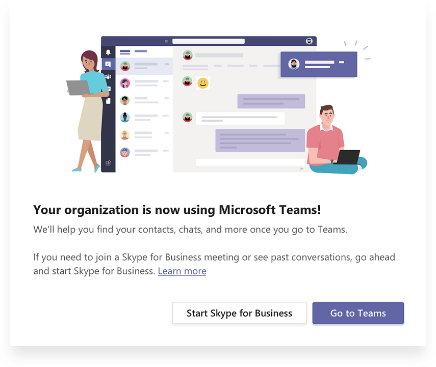

![Etapas del viaje de actualización, con énfasis en la fase de definición del proyecto] (media/upgrade-banner-project-definition.png "Etapas del viaje de actualización, con énfasis en la fase de definición del proyecto")

Este artículo forma parte de la fase de definición de proyecto de su viaje de actualización, una actividad que ha completado después de crear un Coalition de patrocinio y un equipo de proyecto y definir el ámbito, los objetivos y la visión de su proyecto.This article is part of the Project Definition stage of your upgrade journey, an activity you complete after you create a sponsorship coalition and project team and define the scope, goals, and vision for your project. Antes de continuar, confirme que ha completado las siguientes actividades:Before proceeding, confirm that you’ve completed the following activities:

- [Inventar a los participantes del proyectoEnlisted your project stakeholders](upgrade-enlist-stakeholders.md)
- [Definió el ámbito del proyectoDefined your project scope](https://aka.ms/SkypetoTeams-Scope)

# Comprender Microsoft Teams y la coexistencia e interoperabilidad de Skype empresarialUnderstand Microsoft Teams and Skype for Business coexistence and interoperability

Si su organización usa Skype empresarial hoy y usted desea comenzar a usar Teams con Skype empresarial, o desea comenzar la actualización a Teams, es importante que comprenda cómo coexisten las dos aplicaciones, Cuándo y cómo interoperan, y cómo administre la migración de los usuarios hasta su actualización eventual desde Skype empresarial a teams.If your organization uses Skype for Business today and you intend to start using Teams alongside Skype for Business—or you intend to start upgrading to Teams—it’s important to understand how the two applications coexist, when and how they interoperate, and how to manage users’ migration all the way to their eventual upgrade from Skype for Business to Teams.

> [!Tip]
> Vea la siguiente sesión para obtener información sobre la coexistencia [y](https://aka.ms/teams-upgrade-coexistence-interop) la interoperabilidadWatch the following session to learn about [Coexistence and Interoperability](https://aka.ms/teams-upgrade-coexistence-interop)

## Coexistencia de Teams y Skype empresarialCoexistence of Teams and Skype for Business

Además de las capacidades de colaboración, Teams ofrece funciones de chat, llamadas y reuniones.In addition to collaboration capabilities, Teams delivers chat, calling, and meeting capabilities. En función de cómo elija implementar Teams, estas capacidades se superpondrán con las capacidades que ofrece Skype empresarial para un usuario determinado.Depending on how you choose to deploy Teams, these capabilities will overlap with the capabilities delivered by Skype for Business for a given user. El modo predeterminado es ejecutar Teams junto con Skype empresarial; sin embargo, a un usuario se le puede asignar uno de los diversos modos de coexistencia diseñados para garantizar que estas funcionalidades no se solapen para ese usuario.The default mode is to run Teams alongside Skype for Business; however, a user can be assigned one of several coexistence modes that were designed to ensure that these capabilities don’t overlap for that user.

Le recomendamos que revise los modos de coexistencia que se describen a continuación para determinar qué ruta de acceso es adecuada para su organización.We recommend that you review the coexistence modes discussed below to help determine which path is right for your organization.

> [!Important]
> La presentación de nuevas tecnologías o la realización de cambios en el entorno existente de Skype para empresas, a la vez que ofrece excelentes beneficios comerciales nuevos, puede ser perjudicial para los usuarios.Introducing new technology or making changes to your existing, familiar Skype for Business environment, while delivering great new business benefits, can be disruptive for users. Tome el tiempo de evaluar la preparación del usuario e implementar un plan de comunicación y aprendizaje antes de implementar cualquiera de los cambios descritos en este artículo.Take time to assess user readiness and implement a communication and training plan before you implement any of the changes outlined in this article. Además, le recomendamos encarecidamente que planee su plan con un grupo de usuarios seleccionado antes de implementarlo en toda la organización.In addition, we strongly encourage you to pilot your plan with a selected group of users before implementing it across your organization.

### Modo islasIslands mode

De forma predeterminada, los usuarios pueden ejecutar equipos junto con Skype empresarial como dos soluciones independientes que ofrecen capacidades similares y superpuestas, como chat, llamadas y reuniones.By default, users can run Teams alongside Skype for Business as two separate solutions that deliver similar and overlapping capabilities such as chat, calling, and meetings. Los usuarios de Teams también pueden aprovechar las capacidades de colaboración, como los equipos y los canales, el acceso a los archivos de Office 365 y las aplicaciones.Teams users also can take advantage of collaboration capabilities such as teams and channels, access to files in Office 365, and applications.

En este modo de coexistencia, denominado **islas**, cada una de las aplicaciones cliente funciona como una isla independiente.In this coexistence mode, called **Islands**, each of the client applications operates as a separate island. Skype empresarial habla con Skype empresarial y Teams se comunica con Teams.Skype for Business talks to Skype for Business, and Teams talks to Teams. Los usuarios ejecutan ambos clientes y pueden comunicarse de forma nativa en el cliente desde el que se inició la comunicación.Users run both clients and can communicate natively in the client from which the communication was initiated. Por lo tanto, no hay necesidad de interoperabilidad en el modo **islas** .As such, there’s no need for interoperability in **Islands** mode.

> [!Tip]
> La ruta recomendada para los clientes de Skype empresarial online es empezar con el modo **islas** predeterminadas, la saturación de adopción de unidades en la organización y, a continuación, ir rápidamente al modo **solo equipos** .Skype for Business Online customers recommended path is to start with the default **Islands** mode, drive adoption saturation in the organization and then move to **Teams Only** mode rapidly. Los clientes híbridos y locales pueden beneficiarse de implementar el próximo **Skype empresarial con** el modo de colaboración de Teams como punto de partida en lugar de islas, y de pasar de allí al modo de **solo equipos** cuando la organización está lista para su adopción Podrán.On premises and hybrid customers may benefit from deploying the upcoming **Skype for Business with Teams collaboration** mode as a starting point rather than Islands, and progress from there to **Teams Only** mode when the organization is ready to adopt Teams.

### Solo para Skype empresarialSkype for Business only

En este modo de coexistencia, los usuarios permanecen en Skype para empresas, no en los equipos, para las capacidades de chat, reuniones y llamadas, y no usan Teams para equipos y canales.In this coexistence mode, users remain in Skype for Business—not Teams—for chat, meeting and calling capabilities, and they don’t use Teams for teams and channels. Este modo está disponible hoy; sin embargo, en la implementación actual las modalidades de los equipos no se desactivan automáticamente para el usuario.This mode is available today; however, in the current implementation Teams modalities are not turned off for the user automatically. Esta capacidad es la próxima.This capability is upcoming. Mientras tanto, los administradores pueden quitar la licencia de Teams de todos los usuarios que necesiten permanecer en Skype empresarial como la única aplicación de comunicaciones.In the interim, admins can remove the Teams license for any users who need to stay in Skype for Business as their only communications application.

### Solo equiposTeams Only

Un **solo** usuario de Skype puede usar el cliente de Skype empresarial para unirse a reuniones de Skype empresarial existentes o a reuniones de Skype empresarial organizadas por usuarios que no se han actualizado o por parte de terceros.A **Teams only** user can only use the Skype for Business client to join existing Skype for Business meetings, or meetings on Skype for Business that have been organized by non-upgraded users or external parties. Un usuario actualizado puede seguir comunicándose con otros usuarios de la organización que siguen usando Skype empresarial con las funciones de interoperabilidad entre Teams y Skype empresarial; sin embargo, un usuario actualizado no puede iniciar una conversación, una llamada o una reunión de Skype empresarial.An upgraded user can continue to communicate with other users in the organization who are still using Skype for Business by using the interoperability capabilities between Teams and Skype for Business; however, an upgraded user can’t initiate a Skype for Business chat, call, or meeting.

Tan pronto como su organización esté lista para que algunos o todos los usuarios usen Teams como la única herramienta de comunicación y colaboración, puede actualizar esos usuarios al modo de **solo equipos** .As soon as your organization is ready for some or all users to use Teams as their only communications and collaboration tool, you can upgrade those users to **Teams Only** mode.

Para obtener más información sobre cómo cambiar al modo solo de Teams, vea [consideraciones del modo solo](teams-only-mode-considerations.md)de Teams.For additional considerations about moving to Teams Only mode, see [Teams Only mode considerations](teams-only-mode-considerations.md).

![Cliente de Skype empresarial que se ejecuta en un modo especial después de que el usuario se actualice como un usuario de solo equipo] (media/teams-and-skypeforbusiness-coexistence-and-interop-image1.png "Cliente de Skype empresarial que se ejecuta en un modo especial después de que el usuario se actualice como un usuario de solo equipo")

### Skype empresarial con colaboración en equipo (este modo es el próximo)Skype for Business with Teams Collaboration (this mode is upcoming)

Use este modo para presentar equipos en su entorno mientras continúa aprovechando la inversión existente en Skype empresarial.Use this mode to introduce Teams in your environment while you continue to leverage your existing investment in Skype for Business. En este modo, no se cambia Skype empresarial con las funciones de chat, llamadas y reuniones, y usted agrega capacidades de colaboración de Teams: equipos y canales, acceso a los archivos de Office 365 y aplicaciones.In this mode, you leave Skype for Business unchanged with chat, calling, and meeting capabilities, and you add Teams collaboration capabilities—teams and channels, access to files in Office 365, and applications. Las organizaciones con un punto de partida de Skype empresarial Server local o híbrido deben usar este modo en lugar del modo islas.Organizations with starting point of Skype for Business server on premises or hybrid should use this mode instead of Islands mode.

### Skype empresarial con la colaboración y las reuniones de Teams (este modo es el próximo)Skype for Business with Teams Collaboration and Meetings (this mode is upcoming)

Use este modo de coexistencia para acelerar la disponibilidad de las capacidades de reunión de los equipos de su organización, además de sus capacidades de colaboración, lo que permite a los usuarios aprovechar la excelente calidad, las nuevas capacidades, como la transcripción y traducción y soporte técnico para las reuniones en exploradores.Use this coexistence mode to accelerate the availability of Teams meeting capabilities in your organization, in addition to its collaboration capabilities, enabling your users to take advantage of the great quality, new capabilities such as transcription and translation, and support for meetings in browsers.

Junto con el uso de Teams para las conversaciones basadas en equipos y canales en este modo, los usuarios empiezan a usar Teams para programar y realizar sus reuniones.Along with using Teams for teams and channels–based conversations in this mode, users start using Teams to schedule and conduct their meetings. Los chats privados, las llamadas y las videollamadas, permanecen en Skype empresarial.Private chats, and voice and video calling, remain on Skype for Business. Este modo de coexistencia es especialmente útil para los usuarios de las implementaciones locales de Skype empresarial que tienen una telefonía IP empresarial, que es probable que tarden un poco en actualizarse a Teams, pero desean beneficiarse de las reuniones superiores de los equipos.This coexistence mode is especially useful for users in Skype for Business on-premises deployments that have enterprise voice, who are likely to take some time to be upgraded to Teams, but want to benefit from the superior Teams meetings.

> [!Note]
> Cuando se implementan en modos de coexistencia específicos, los equipos y Skype empresarial pueden interoperar, lo que permite a los usuarios conversar con ellos y llamarse a ellos y garantizar que las comunicaciones permanezcan fluidas en toda la organización durante el viaje de actualización a teams.When deployed in specific coexistence modes, Teams and Skype for Business can [interoperate](#interoperability-of-teams-and-skype-for-business), enabling users to chat with and call one another, and ensuring that communications remain fluid across your organization during your upgrade journey to Teams. Los modos de coexistencia rigen la interoperabilidad.Coexistence modes govern interoperability. El modo de coexistencia del receptor determina si estará disponible la interoperabilidad.The coexistence mode of the receiver determines whether interoperability will be available. Por ejemplo, si el receptor está en un modo en el que la conversación solo está disponible en un cliente (por ejemplo, Teams), la interoperabilidad de chat estará disponible generalmente en caso de que el iniciador use el otro cliente (en este caso, Skype empresarial) para iniciar la conversación.For example, if the receiver is in a mode in which chat is only available in one client (say, Teams), chat interoperability will generally be available in case the initiator uses the other client (in this case, Skype for Business) to start the chat. Por otro lado, si el receptor está en un modo en el que la conversación está disponible en ambos clientes, la interoperabilidad no estará disponible para la conversación, y el destinatario recibirá el mensaje en el mismo cliente en el que el iniciador inició la conversación.On the other hand, if the receiver is in a mode in which chat is available in both clients, interoperability won’t be available for the chat—and the message will be received by the receiver in the same client in which the initiator started the chat.

Para obtener más información sobre los modos de coexistencia, los requisitos previos y la administración, consulte [Guía de migración e interoperabilidad para las organizaciones que usan Teams junto con Skype empresarial](https://aka.ms/SkypeToTeams-Interop) y [establecer la coexistencia y la actualización de la configuración](https://aka.ms/SkypeToTeams-SetCoexistence).For more details about coexistence modes, prerequisites, and management, see [Migration and interoperability guidance for organizations using Teams together with Skype for Business](https://aka.ms/SkypeToTeams-Interop) and [Setting your coexistence and upgrade settings](https://aka.ms/SkypeToTeams-SetCoexistence).

| | | |
|---|---|---|
||Puntos de decisiónDecision point|<ul><li>¿Qué modo o modos de coexistencia se adaptan mejor a las necesidades de los usuarios y de su organización?Which coexistence mode(s) best fit your organization’s and users’ needs?</li></ul>|
||Siguiente pasoNext step|<ul><li>Elige el mejor enfoque para tu viaje de actualización.Choose the best approach for your upgrade journey.</li></ul>|

## Interoperabilidad de Teams y Skype empresarialInteroperability of Teams and Skype for Business

La interoperabilidad es la capacidad de que los equipos y los usuarios de Skype empresarial de la misma organización se comuniquen entre equipos y Skype empresarial.Interoperability is the ability for Teams and Skype for Business users in the same organization to communicate across Teams and Skype for Business.

### Interoperabilidad nativa y escalabilidad de interoperabilidadNative interop and interop escalation

Existen dos tipos de experiencias de interoperabilidad: nativas y de interoperabilidad.There are two types of interop experiences: native and interop escalation.

- La experiencia de interoperabilidad _nativa_ se produce en el cliente que el usuario está usando actualmente.A _native interop_ experience occurs in the client that the user is currently using. Un usuario estará en el cliente de Skype empresarial, el otro en Teams.One user will be in the Skype for Business client, the other in Teams. Una experiencia de interoperabilidad nativa no las llevará a otro cliente para comunicarse, los usuarios podrán realizar su conversación en el cliente que actualmente están usando.A native interop experience won’t take them to another client to communicate, the users will be able to conduct their conversation in the client they’re currently using. Las experiencias de interoperabilidad nativas son chats uno a uno y llamadas.The native interop experiences are one-to-one chat and calling.
- Una __ experiencia de escalado de interoperabilidad significa que, como parte de ayudar a los usuarios a realizar una acción avanzada (como compartir su escritorio), el servicio puede facilitar la creación de una reunión y continuar con la experiencia de esa reunión.An _interop escalation_ experience means that as part of helping users perform an advanced action (such as sharing their desktop), the service can facilitate the creation of a meeting and continue the experience in that meeting. La reunión se crea en la plataforma del iniciador de la acción.The meeting is created on the platform of the initiator of the action. El usuario o los usuarios que no se encuentren en la plataforma recibirán coordenadas de la reunión y se unirán a la reunión (después de cambiar los clientes).The user or users who aren’t on that platform receive meeting join coordinates and join the meeting (after switching clients).

### Experiencias de interoperabilidad nativasNative interop experiences

Según los modos de coexistencia asignados a los usuarios (como se ha descrito anteriormente), están disponibles las siguientes experiencias de interoperabilidad nativas:Depending on the coexistence modes assigned to users (as described above), the following native interop experiences are available:

- Los usuarios de Skype empresarial pueden chatear uno a uno con los usuarios de Teams, y viceversa.Skype for Business users can chat one-on-one with Teams users, and vice versa. Un chat de interoperabilidad debe atravesar un Gateway de interoperabilidad que forma parte de los servicios en la nube de Teams (y, por lo tanto, solo está conectado).An interop chat needs to go through an interop gateway that’s part of Teams cloud services (and therefore only exists online). Los chats interoperativos son texto sin formato: el texto enriquecido y los emoticonos no se admiten.Interop chats are plain text: rich text and emoticons aren’t supported. Se notifica a los usuarios de teams que la conversación es una conversación de interoperabilidad; pronto se proporcionará una notificación similar para los usuarios de Skype empresarial.Users in Teams are notified that the conversation is an interop conversation; a similar notification for Skype for Business users will be provided soon.

![Experiencia de chat de interoperabilidad de Teams] (media/Interop_chat_experience_from_Teams.png "Experiencia de chat de interoperabilidad de Teams")

- Los usuarios de Skype empresarial pueden hacer llamadas y videollamadas individuales a los usuarios de Teams, y viceversa.Skype for Business users can make one-on-one voice and video calls to Teams users, and vice versa.

![Experiencia de llamadas de interoperabilidad de equipos] (media/Interop_calling_experience_from_Teams.png "Experiencia de llamadas de interoperabilidad de equipos")

> [!Important]
> Las experiencias de interoperabilidad con una implementación local de Skype empresarial requieren que el entorno local esté en modo híbrido con Office 365 Skype empresarial.Interop experiences with an on-premises deployment of Skype for Business require that the on-premises environment is in hybrid mode with Office 365 Skype for Business. Para obtener más información, consulte [Guía de migración e](https://aka.ms/SkypeToTeams-Interop)interoperabilidad.For details, see [Migration and interoperability guidance](https://aka.ms/SkypeToTeams-Interop).

Estas experiencias de interoperabilidad están disponibles para los usuarios que tienen uno de los siguientes modos de coexistencia asignado: **Skype empresarial con colaboración**de Teams, **Skype empresarial con colaboración y reuniones**de Teams, **Skype para Solo para empresas**o **Teams**.These interop experiences are available to and between users who have the one of the following coexistence modes assigned: **Skype for Business with Teams Collaboration**, **Skype for Business with Teams Collaboration and meetings**, **Skype for Business Only**, or **Teams Only**. No hay ninguna interoperabilidad para los usuarios en el modo islas.There is no interoperability to users in Islands mode.

### Limitaciones de la experiencia de interoperabilidad nativaNative interop experience limitations

Algunas características no están disponibles para la conversación interoperativa y la experiencia de interoperabilidad entre equipos y Skype empresarial:Some features aren’t available for the interop chat and interop calling experience between Teams and Skype for Business:

- No se admite el descuento, el texto enriquecido ni el conjunto de emoticonos completo de equipos o de Skype empresarial.Markdown, rich text, and the full emoticon set aren’t supported either from Teams or Skype for Business. No se admiten otras características nativas del cuadro de redacción en los chats de Teams.Other native features of the compose box in Teams chats aren’t supported.
- No se admite la pantalla compartida (uso compartido de escritorio o aplicaciones) entre equipos y Skype empresarial.Screen sharing (desktop or app sharing) between Teams and Skype for Business isn’t supported.
- Los chats grupales (conversaciones de varios participantes) en Teams solo pueden incluir participantes que usen Teams.Group chats (multiple-party conversations) in Teams can only include participants who are using Teams.
- Las conversaciones de mensajería instantánea de varios participantes (chats grupales) en Skype empresarial solo pueden incluir participantes que usen Skype empresarial.Multiple-party IM conversations (group chats) in Skype for Business can only include participants who are using Skype for Business.
- No se admite la escala de una llamada de voz o videollamada de punto a punto continuado a una llamada de varios participantes que implique a equipos y usuarios de Skype empresarial.Escalating an ongoing peer-to-peer voice or video call to a multiple-party call involving both Teams and Skype for Business users isn’t supported.
- No se admite la transferencia de archivos para chats de dos participantes o datos adjuntos en chats grupales, de equipos a Skype para empresas, y viceversa.File transfer for two-party chats, or file attachment in group chats, from Teams to Skype for Business—and vice versa—aren’t supported.
- No existe una interoperabilidad con el chat persistente de Skype empresarial.There is no interoperability with Skype for Business Persistent Chat.

Para todas estas limitaciones (excepto para conversaciones persistentes), una posible solución es que un usuario inicie una reunión e invite a otro usuario a unirse a ella.For all these limitations (except for Persistent Chat), one possible workaround is for one user to start a meeting and invite the other user to join it. Esta solución alternativa constituye la base para el escalamiento de interoperabilidad.This workaround is the basis for interop escalation.

> [!Important]
> Lo que comienza como una conversación simple (mi) puede escalarse rápidamente a una llamada o a una reunión ad-hoc.What starts as a simple chat (IM) might quickly escalate to a call or an ad-hoc meeting. Somos conscientes de que estos escenarios son esenciales para el uso y la experiencia del usuario, y estamos continuamente evolucionando experiencias de interoperabilidad entre Skype empresarial y los usuarios de Teams.We understand that these scenarios are critical to the usability and user experience, and we’re continually evolving interop experiences between Skype for Business and Teams users. Vuelva a consultar la información más actualizada.Check back for the most up-to-date information.

Después de revisar este artículo, vea [elegir la actualización del viaje, la](upgrade-and-coexistence-of-skypeforbusiness-and-teams.md) [migración y](https://aka.ms/SkypeToTeams-Interop)la interoperabilidad de la actualización, coexistencia [con Skype empresarial](coexistence-chat-calls-presence.md)y [configurar la coexistencia y la configuración de actualización para la](https://aka.ms/SkypeToTeams-SetCoexistence) implementación. sobre.After you review this article, see [Choose your upgrade journey](upgrade-and-coexistence-of-skypeforbusiness-and-teams.md), [Migration and interoperability guidance](https://aka.ms/SkypeToTeams-Interop), [Coexistence with Skype for Business](coexistence-chat-calls-presence.md), and [Setting your coexistence and upgrade settings](https://aka.ms/SkypeToTeams-SetCoexistence) for implementation details.

## Vínculos relacionadosRelated Links

[Vídeo: administrar la coexistencia y la interoperabilidad entre SfB y TeamsVideo: Manage Coexistence and Interoperability between SfB and Teams](https://www.youtube.com/watch?v=wEc9u4S3GIA&list=PLaSOUojkSiGnKuE30ckcjnDVkMNqDv0Vl&index=11)
