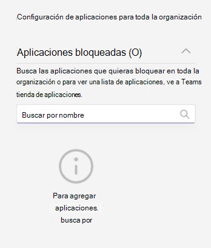

# Administrar directivas de permisos de aplicación en Microsoft Teams

Como administrador, puede usar las directivas de permisos de aplicación para controlar qué aplicaciones están disponibles para los usuarios de Microsoft Teams de su organización. Puede permitir o bloquear todas las aplicaciones publicadas por Microsoft, por terceros o por su organización. Cuando bloquee una aplicación, los usuarios que tienen la directiva no pueden instalarla desde la tienda de aplicaciones de Teams. Debe ser un administrador global o un administrador de servicio de Teams para administrar estas directivas.

Puede administrar directivas de permisos de aplicación en el Centro de administración de Microsoft Teams. Puede usar la directiva global (predeterminada para toda la organización) o crear y asignar directivas personalizadas. Los usuarios de su organización obtendrán automáticamente la directiva global, a menos que cree y asigne una directiva personalizada. Después de editar o asignar una directiva, los cambios pueden tardar unas horas en tener efecto.

> [!NOTE]
> La configuración de aplicaciones en toda la organización reemplaza a la directiva global y a las directivas personalizadas que cree y asigne a los usuarios.

Si su organización ya usa Teams, la configuración de la aplicación que estableció en **Configuración para todo el espacio empresarial** en el Centro de administración de Microsoft 365 quedará reflejada en la Configuración de aplicaciones para toda la organización en la página [Administrar aplicaciones](manage-apps.md). Si es la primera vez que usa Teams, verá que de forma predeterminada se permiten todas las aplicaciones en la directiva global. Incluye aplicaciones publicadas por Microsoft, proveedores de software de terceros y su organización.

Supongamos, por ejemplo, que desea permitir solo algunas aplicaciones específicas para el equipo de RRHH de su organización. En primer lugar, en la página [Administrar aplicaciones](https://admin.teams.microsoft.com/policies/manage-apps) , asegúrese de que las aplicaciones que desea permitir para el equipo de recursos humanos están permitidas en el nivel de organización. Después, cree una directiva personalizada, configúrala para bloquear y permitir las aplicaciones deseadas y asigne la directiva a los usuarios del equipo de recursos humanos.

> [!NOTE]
> Para obtener información sobre la configuración de aplicaciones de terceros que son exclusivas de Microsoft 365 Government Community Cloud Alto (GCCH) y del departamento de defensa (DoD), consulta [Administrar la configuración de aplicaciones de toda la organización para Microsoft 365 Administración Pública](#manage-org-wide-app-settings-for-microsoft-365-government).

## Crear una directiva de permisos de aplicación personalizada

Use una o más directivas de permisos de aplicación personalizadas si quiere controlar las aplicaciones que están disponibles para diferentes grupos de usuarios. Puede crear y asignar directivas personalizadas en función de si las aplicaciones se publican por Microsoft, terceros o su organización. Después de crear una directiva personalizada, no podrá cambiarla si las aplicaciones de terceros están deshabilitadas en la configuración de aplicaciones de toda la organización.

1. Iniciar sesión en [Teams centro de administración](https://admin.teams.microsoft.com/dashboard)
1. En el panel izquierdo, vaya a Directivas de **permisos** **de Teams aplicaciones** > .
1. Seleccione **Agregar**.

    

1. Proporcione un nombre y una descripción para la directiva.
1. En **Aplicaciones de Microsoft**, **Aplicaciones de terceros** y **Aplicaciones personalizadas**, seleccione una de las opciones siguientes:
   - **Permitir todas las aplicaciones**
   - **Permitir aplicaciones específicas y bloquear todas las demás**
   - **Bloquear aplicaciones específicas y permitir todas las demás**
   - **Bloquear todas las aplicaciones**

1. Si seleccionó **Permitir aplicaciones específicas y bloquear las demás**, agregue las aplicaciones que quiera permitir:

    1. Seleccione **Permitir aplicaciones**.
    1. Busca las aplicaciones que quieras permitir y, a continuación, selecciona **Agregar**. Los resultados de búsqueda se filtran en función de quién haya publicado la aplicación (**Aplicaciones de Microsoft**, **Aplicaciones de terceros** y **Aplicaciones personalizadas**).
    1. Cuando hayas elegido la lista de aplicaciones, selecciona **Permitir**.

1. De forma similar, si has seleccionado **Bloquear aplicaciones específicas y permitir el resto**, busca y agrega las aplicaciones que quieras bloquear y, a continuación, selecciona **Bloquear**.
1. Seleccione **Guardar**.

## Editar una directiva de permisos de aplicación

Puede usar el centro de administración de Teams para editar una directiva, incluida la directiva global y las directivas personalizadas que cree.

1. En el panel izquierdo del centro de administración de Microsoft Teams, vaya a **Directivas de permisos de Teams aplicaciones** > **.**
1. Haga clic a la izquierda del nombre de la directiva para seleccionarla y, luego, seleccione **Editar**.
1. A partir de aquí, realice los cambios que desee. Puede administrar la configuración en función de quién haya publicado las aplicaciones y agregar y quitar aplicaciones según la configuración de permiso o bloqueo.
1. Seleccione **Guardar**.

## Asignar una directiva de permisos de aplicación personalizada a los usuarios

[!INCLUDE [assign-policy](includes/assign-policy.md)]

## Administrar la configuración de la aplicación para toda la organización para Microsoft 365 Administración Pública  

En una implementación de Microsoft 365 Teams de administración pública GCC, GCCH y DoD, todas las aplicaciones de terceros están bloqueadas de forma predeterminada. En las nubes de GCCH y DOD, las aplicaciones de terceros no están disponibles. Además, en GCC, verá la nota siguiente sobre la administración de aplicaciones de terceros en la página Directivas de permisos de aplicaciones del Centro de administración de Microsoft Teams.

:::image type="content" source="media/app-permission-policies-gcc.png" alt-text="Captura de pantalla de la directiva de permisos de aplicaciones en GCCH y DoD.":::

Use la configuración de aplicaciones para toda la organización para controlar si los usuarios pueden instalar aplicaciones de terceros. La configuración de aplicaciones para toda la organización rige el comportamiento de todos los usuarios e invalida cualquier otra directiva de permisos de aplicación asignada a los usuarios. Puede usarla para controlar las aplicaciones malintencionadas o problemáticas.

<!---
1. On the **Permission policies** page, select **Org-wide app settings**. You can then configure the settings you want in the panel. --->

### Para GCC nubes

1. En la página **Administrar aplicaciones** , seleccione **Configuración de aplicaciones para toda la organización**. Después, podrá configurar las opciones que desee en el panel.

  

1. En **Aplicaciones de terceros**, desactive o active esta configuración para controlar el acceso a aplicaciones de terceros:
   - **Permitir aplicaciones de terceros**: esta opción controla si los usuarios pueden usar aplicaciones de terceros. Si desactiva esta configuración, los usuarios no podrán instalar ni usar aplicaciones de terceros. En una implementación de Microsoft 365 Teams de Administración pública: GCCH y DoD de Administración pública, esta configuración está desactivada de forma predeterminada.
   - **Permitir las nuevas aplicaciones de terceros publicadas en store de forma predeterminada**: esta opción controla si las nuevas aplicaciones de terceros publicadas en la tienda de aplicaciones de Teams estarán disponibles automáticamente en Teams. Solo puede establecer esta opción si permite aplicaciones de terceros.

1. En **Aplicaciones bloqueadas**, agregue las aplicaciones que quiera bloquear en toda la organización. En una implementación de Microsoft 365 Teams de Administración Pública- GCCH y DoD, todas las aplicaciones de terceros se agregan a esta lista de forma predeterminada. Si desea permitir cualquier aplicación de terceros en su organización, quítela de esta lista de aplicaciones bloqueadas. Al bloquear una aplicación para toda la organización, la aplicación se bloquea automáticamente para todos los usuarios, independientemente de si está permitida en las directivas de permisos de las aplicaciones.

1. Seleccione **Guardar** para que la configuración de aplicaciones de toda la organización surta efecto.

Para permitir aplicaciones de terceros, edite y use la directiva global (predeterminada para toda la organización) o cree y asigne directivas personalizadas.

### Para nubes de GCCH y DoD

1. En la página **Directivas de permiso**, seleccione **Configuración de aplicaciones para toda la organización**. Después, podrá configurar las opciones que desee en el panel.

  

1. En **Aplicaciones bloqueadas**, agregue las aplicaciones que quiera bloquear en toda la organización. En una implementación de Microsoft 365 Teams de Administración Pública- GCCH y DoD, todas las aplicaciones de terceros se agregan a esta lista de forma predeterminada. Al bloquear una aplicación para toda la organización, la aplicación se bloquea automáticamente para todos los usuarios, independientemente de si está permitida en las directivas de permisos de las aplicaciones.
1. Seleccione **Guardar** para que la configuración de aplicaciones de toda la organización surta efecto.

## Preguntas más frecuentes

### Trabajar con directivas de permisos de aplicaciones

#### ¿A qué tipo de interacciones con aplicaciones afectan las directivas de permisos?

Las directivas de permisos rigen el uso de aplicaciones mediante el control de la instalación, la detección y la interacción de los usuarios finales. Los administradores aún pueden gestionar las aplicaciones en el Centro de administración de Microsoft Teams, independientemente de las directivas de permisos que se les asignen.

#### ¿Puedo controlar las aplicaciones de línea de negocio (LOB)?

Sí, puede usar directivas de permisos de aplicación para controlar la implementación y distribución de aplicaciones personalizadas (LOB). Puede crear una directiva personalizada o editar la directiva global para permitir o bloquear aplicaciones personalizadas según las necesidades de su organización.

#### ¿Cómo se relacionan las directivas de permisos de aplicación con las aplicaciones ancladas y las directivas de configuración de aplicaciones?

Puede usar las directivas de configuración de aplicaciones junto con las directivas de permisos de aplicación. Las aplicaciones previamente ancladas se seleccionan desde el conjunto de aplicaciones habilitadas para un usuario. Además, si un usuario tiene una directiva de permisos de aplicación que bloquea una aplicación en su directiva de configuración de la aplicación, esa aplicación no aparecerá en Teams.

#### ¿Puedo usar directivas de permisos de aplicación para restringir la carga de aplicaciones personalizadas?

Sí, puede usar la configuración para toda la organización en la página **Administrar aplicaciones**. También puede usar las directivas de configuración de la aplicación para restringir la carga de aplicaciones personalizadas para su organización.  

Para impedir que determinados usuarios carguen aplicaciones personalizadas, use directivas de aplicación personalizadas. Para obtener más información, consulte [Administrar configuración y directivas de aplicación personalizadas en Teams](teams-custom-app-policies-and-settings.md).

#### ¿El bloqueo de una aplicación se aplica a los clientes móviles de Teams?

Sí, cuando bloquea una aplicación, esa aplicación se bloquea para todos los clientes de Teams.  

### Experiencia de usuario

#### ¿Qué pasa con la experiencia de usuario cuando se bloquea una aplicación?

Los usuarios no pueden interactuar con una aplicación bloqueada ni acceder a funciones como bots, pestañas y extensiones de mensajería. En un contexto compartido, como un chat de grupo o de equipo, los bots sí podrán enviar mensajes a todos los participantes de ese contexto. Teams indica al usuario cuando una aplicación está bloqueada.

Por ejemplo, cuando se bloquea una aplicación, los usuarios no pueden realizar ninguna de las siguientes tareas:

- Agregar la aplicación a nivel personal o a un chat o equipo
- Enviar mensajes al bot de la aplicación
- Realizar acciones de botones que envían información de nuevo a la aplicación, como mensajes que requieren acción  
- Ver la pestaña de la aplicación
- Configurar conectores para recibir notificaciones
- Usar la extensión de mensajería de la aplicación

El portal heredado permitía controlar las aplicaciones a nivel de la organización, lo que significa que cuando se bloquea una aplicación, se bloquea para todos los usuarios de la organización. El bloqueo de una aplicación en [Administrar aplicaciones](manage-apps.md) funciona exactamente igual.

Para las directivas de permisos de aplicación asignadas a usuarios específicos, si se permitió y, luego, bloqueó una aplicación con capacidad de bot o conector y si, después, solo se permite la aplicación para algunos usuarios en un contexto compartido, los miembros de un chat grupal o un canal que no tengan permiso para esa aplicación podrán ver el historial de mensajes y los mensajes publicados por el bot o el conector, pero no interactuar con ella.

## Vea también

- [Configurar la administración para aplicaciones en Teams](admin-settings.md)
- [Asignar directivas a los usuarios en Teams](policy-assignment-overview.md)
- [Teams comparación de disponibilidad de características](/office365/servicedescriptions/teams-service-description#feature-availability)
