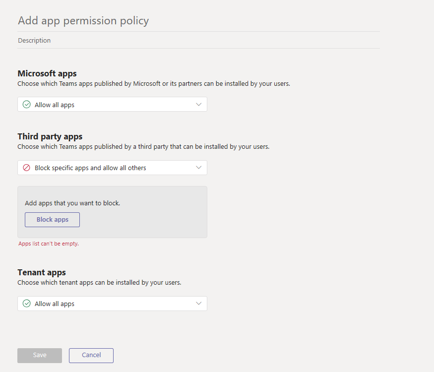
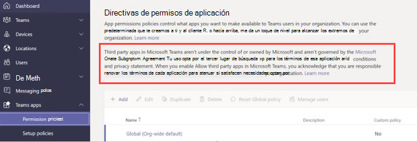

# <a name="manage-app-permission-policies-in-microsoft-teams"></a>Administrar directivas de permisos de aplicación en Microsoft Teams

Como administrador, puede usar las directivas de permisos de aplicación para controlar qué aplicaciones están disponibles para los usuarios de Microsoft Teams de su organización. Puede permitir o bloquear todas las aplicaciones o aplicaciones específicas publicadas por Microsoft, terceros y su organización. Cuando bloquee una aplicación, los usuarios que tienen la directiva no pueden instalarla desde la tienda de aplicaciones de Teams. Debe ser un administrador global o un administrador de servicio de Teams para administrar estas directivas.

Administre las directivas de permisos de aplicaciones en el centro de administración de Microsoft Teams. Puede usar la directiva global (predeterminada para toda la organización) o crear y asignar directivas personalizadas a usuarios individuales o a usuarios de un grupo.  


> [!NOTE]
> Los usuarios de su organización obtendrán automáticamente la directiva global, a menos que cree y asigne una directiva personalizada. La configuración de la aplicación en toda la organización reemplaza la directiva global y las directivas personalizadas que cree y asigne a los usuarios.

Si su organización ya está en Teams, la configuración de la aplicación que ha configurado en la **configuración de toda la empresa** en el centro de administración de Microsoft 365 se refleja en la configuración de la aplicación de toda la organización en la página [Administrar aplicaciones](manage-apps.md) . Si es nuevo en Teams y se está preparando, de forma predeterminada, todas las aplicaciones estarán permitidas en la directiva global. Esto incluye las aplicaciones publicadas por Microsoft, terceros y su organización.

Supongamos, por ejemplo, que desea bloquear todas las aplicaciones de terceros y permitir aplicaciones específicas de Microsoft para el equipo de RRHH de su organización. En primer lugar, debería ir a la página [Administrar aplicaciones](manage-apps.md) y asegurarse de que las aplicaciones que desea permitir para el equipo de RRHH estén permitidas en el nivel de organización. Después, cree una directiva personalizada denominada Directiva de permisos de aplicaciones de RRHH, configúrelo para que bloquee y permita las aplicaciones que desee, y asígnela a los usuarios del equipo de RRHH.

> [!NOTE]
> Si implementó Teams en un entorno Microsoft 365 pública-GCC, consulte [directivas de permisos de aplicaciones para GCC](#app-permission-policies-for-gcc) para obtener más información sobre la configuración de aplicaciones de terceros que son exclusivas de GCC.

## <a name="create-a-custom-app-permission-policy"></a>Crear una directiva de permisos de aplicaciones personalizada

Si desea controlar las aplicaciones que están disponibles para los distintos grupos de usuarios de su organización, cree y asigne una o varias directivas de permisos de aplicaciones personalizadas. Puede crear y asignar directivas personalizadas distintas basándose en si las aplicaciones son publicadas por Microsoft, por terceros o por su organización. Es importante saber que después de crear una directiva personalizada, no puede cambiarla si las aplicaciones de terceros se deshabilitan en la configuración de la aplicación en toda la organización.

1. En el centro de navegación izquierdo del centro de administración de Microsoft Teams, vaya a directivas de permisos de las **aplicaciones de Teams**  >  **Permission policies**.
2. Haga clic en **Agregar**. <br>
    
3. Escriba un nombre y una descripción para la directiva.
4. En aplicaciones de **Microsoft**, **aplicaciones de terceros**y **aplicaciones personalizadas**, seleccione una de las siguientes opciones:

    - **Permitir todas las aplicaciones**
    - **Permitir aplicaciones específicas y bloquear a todos los demás**
    - **Bloquear aplicaciones específicas y permitir a todos los demás**
    - **Bloquear todas las aplicaciones**

5. Si seleccionó **permitir aplicaciones específicas y bloquear a otras personas**, agregue las aplicaciones que quiera permitir:

    1. Seleccione **permitir aplicaciones**.
    1. Busque las aplicaciones que desea permitir y, a continuación, haga clic en **Agregar**. Los resultados de la búsqueda se filtran para el publicador de la aplicación (aplicaciones de**Microsoft**, **aplicaciones de terceros**o **aplicaciones personalizadas**).
    1. Cuando haya elegido la lista de aplicaciones, haga clic en **permitir**. 

6. Del mismo modo, si seleccionas **bloquear aplicaciones específicas y permitir a todos los demás**, busca y agrega las aplicaciones que deseas bloquear y luego haz clic en **bloquear**.
7. Haga clic en **Guardar **.

## <a name="edit-an-app-permission-policy"></a>Editar una directiva de permisos de aplicación

Puede usar el centro de administración de Microsoft Teams para editar una directiva, incluida la directiva global y las directivas personalizadas que cree.

1. En el centro de navegación izquierdo del centro de administración de Microsoft Teams, vaya a directivas de permisos de las **aplicaciones de Teams**  >  **Permission policies**.
2. Seleccione la Directiva haciendo clic a la izquierda del nombre de la Directiva y, a continuación, haga clic en **Editar**.
3. Desde aquí, realice los cambios que desee. Puede administrar la configuración basándose en el editor de la aplicación y agregar y quitar aplicaciones en función de la configuración permitir o bloquear.
4. Haga clic en **Guardar **.

## <a name="assign-a-custom-app-permission-policy-to-users"></a>Asignar una directiva de permisos de aplicación personalizada a los usuarios

Puede usar el centro de administración de Microsoft Teams para asignar una directiva personalizada a uno o más usuarios o el módulo de PowerShell de Skype empresarial para asignar una directiva personalizada a los usuarios de un grupo, como todos los usuarios de un grupo de seguridad o grupo de distribución.

### <a name="assign-a-custom-app-permission-policy-to-users"></a>Asignar una directiva de permisos de aplicación personalizada a los usuarios

Para asignar una directiva a un usuario:

1. En el centro de navegación izquierdo del centro de administración de Microsoft Teams, vaya a **usuarios**.
2. Para seleccionar el usuario, haga clic a la izquierda del nombre de usuario y, después, en **Editar configuración**.
3. En **Directiva de permisos de aplicaciones**, seleccione la Directiva de permisos de aplicación que desea asignar y, a continuación, haga clic en **aplicar**.

Para asignar una directiva a varios usuarios a la vez:

1. En el panel de navegación izquierdo del centro de administración de Microsoft Teams, vaya a **Usuarios**, después, busque los usuarios o filtre la vista para mostrar los usuarios que desee.
2. En la columna **&#x2713;** (marca de verificación), seleccione los usuarios. Para seleccionar todos los usuarios, haga clic en &#x2713; (marca de verificación) situado en la parte superior de la tabla.
3. Haga clic en **Editar configuración**, haga los cambios que desee y, a continuación, haga clic en **Aplicar**.  

También puede hacer lo siguiente:

1. En el centro de navegación izquierdo del centro de administración de Microsoft Teams, vaya a directivas de permisos de las **aplicaciones de Teams**  >  **Permission policies**.
2. Haga clic a la izquierda del nombre de la directiva para seleccionarla.
3. Seleccione **Administrar usuarios**.
4. En el panel **Administrar usuarios**, busque el usuario por nombre para mostrar o por nombre de usuario, seleccione el nombre y, después, haga clic en **Agregar**. Repita este paso por cada usuario que quiera agregar.
5. Cuando haya terminado de agregar usuarios, haga clic en **Guardar**.

### <a name="assign-a-custom-app-permission-policy-to-users-in-a-group"></a>Asignar una directiva de permisos de aplicación personalizada a los usuarios de un grupo

Es posible que desee asignar una directiva de permisos de aplicación personalizada a varios usuarios que ya haya identificado. Por ejemplo, es posible que desee asignar una directiva a todos los usuarios de un grupo de seguridad. Para ello, puede conectarse al módulo de Azure Active Directory PowerShell para Graph y al módulo de PowerShell de Skype empresarial. Para obtener más información sobre cómo usar PowerShell para administrar equipos, consulte [información general de Teams PowerShell](teams-powershell-overview.md).

En este ejemplo, asignamos una directiva de permisos de aplicaciones personalizada denominada Directiva de permisos de aplicaciones de RRHH a todos los usuarios del grupo de proyectos de RRHH de Contoso Pharmaceuticals.  

> [!NOTE]
> Asegúrese de conectarse primero al módulo de Azure Active Directory PowerShell para Graph y al módulo de PowerShell de Skype empresarial siguiendo los pasos de [conectar a todos los servicios de Office 365 en una sola ventana de Windows PowerShell](https://docs.microsoft.com/office365/enterprise/powershell/connect-to-all-office-365-services-in-a-single-windows-powershell-window).

Obtén la GroupObjectId del grupo en particular.
```PowerShell
$group = Get-AzureADGroup -SearchString "Contoso Pharmaceuticals HR Project"
```
Obtener los miembros del grupo especificado.
```PowerShell
$members = Get-AzureADGroupMember -ObjectId $group.ObjectId -All $true | Where-Object {$_.ObjectType -eq "User"}
```
Asignar todos los usuarios del grupo a una directiva de permisos de la aplicación determinada. En este ejemplo, es la Directiva de permisos de la aplicación de RRHH.
```PowerShell
$members | ForEach-Object { Grant-CsTeamsAppPermissionPolicy -PolicyName "HR App Permission Policy" -Identity $_.UserPrincipalName}
``` 
Según el número de miembros del grupo, este comando puede demorar varios minutos en ejecutarse.

## <a name="app-permission-policies-for-gcc"></a>Directivas de permisos de aplicaciones para GCC

En una implementación de Teams de Microsoft 365 administración pública-GCC, es importante saber lo siguiente sobre la configuración de aplicaciones de terceros, que es exclusiva de GCC.

En GCC, todas las aplicaciones de terceros se bloquean de forma predeterminada. Además, verá la siguiente nota sobre la administración de aplicaciones de terceros en la página de directivas de permisos de aplicaciones en el centro de administración de Microsoft Teams.



Para habilitar una aplicación de terceros para un usuario o un conjunto de usuarios de su organización, haga lo siguiente:

1. En el centro de navegación izquierdo del centro de administración de Microsoft Teams, vaya a **aplicaciones de Teams**  >  **Administrar aplicaciones**y luego, en la lista de aplicaciones, confirme que la aplicación de terceros que desea permitir para un conjunto de usuarios está configurada en **bloqueada** en el nivel de la organización.

2. En el centro de navegación izquierdo del centro de administración de Microsoft Teams, vaya a directivas de permisos de las **aplicaciones de Teams**  >  **Permission policies**y edite la directiva global para bloquear la aplicación de terceros. Para ello, haga lo siguiente:
    1. En la página directivas de permisos de aplicaciones, haga clic en **global (valor predeterminado de toda la organización)** y, a continuación, haga clic en **Editar**.
    2. En **aplicaciones de terceros**, seleccione **bloquear aplicaciones específicas y permitir a todos los demás**, agregar la aplicación y, a continuación, haga clic en **Guardar**.

    > [!NOTE]
    > Es importante que lo haga antes de ir al siguiente paso para permitir la aplicación en el nivel de organización. Esto se debe a que si la aplicación de terceros no está bloqueada en la Directiva de permisos de la aplicación global, todos los usuarios a los que se aplica la directiva global podrán acceder a la aplicación de terceros cuando la permita en el nivel de la organización.

3. Permitir la aplicación de terceros en el nivel de organización. Para ello, en el navegación de la izquierda, vaya a **aplicaciones de Teams**  >  **Manage apps**. En la lista de aplicaciones, haga clic a la izquierda del nombre de la aplicación para seleccionarla y, a continuación, seleccione **permitir**.
4. [Cree una directiva de permisos de aplicaciones personalizada](#create-a-custom-app-permission-policy) para permitir la aplicación y, a continuación, [asigne la Directiva](#assign-a-custom-app-permission-policy-to-users) a los usuarios que desee.

## <a name="faq"></a>Preguntas más frecuentes

### <a name="working-with-app-permission-policies"></a>Trabajar con directivas de permisos de aplicaciones

#### <a name="what-app-interactions-do-permission-policies-affect"></a>¿Qué interacciones de aplicaciones afectan las directivas de permisos?
Las directivas de permisos rigen el uso de la aplicación mediante el control de la instalación, la detección y la interacción de los usuarios finales. Los administradores pueden seguir administrando aplicaciones en el centro de administración de Microsoft Teams independientemente de las directivas de permisos que se les asignen.

#### <a name="can-i-control-line-of-business-lob-apps"></a>¿Puedo controlar las aplicaciones de línea de negocio (LOB)?
Sí, puede usar las directivas de permisos de aplicaciones para controlar el despliegue y la distribución de aplicaciones personalizadas (LOB). Puede crear una directiva personalizada o editar la directiva global para permitir o bloquear aplicaciones personalizadas en función de las necesidades de su organización.

#### <a name="how-do-app-permission-policies-relate-to-pinned-apps-and-app-setup-policies"></a>¿Cómo se relacionan las directivas de permisos de aplicaciones con las aplicaciones fijas y las directivas de configuración de aplicaciones?

Puede usar las directivas de configuración de la aplicación junto con directivas de permisos de la aplicación. Las aplicaciones previamente ancladas se seleccionan en el conjunto de aplicaciones habilitadas para un usuario. Además, si un usuario tiene una directiva de permisos de la aplicación que bloquea una aplicación en la Directiva de configuración de la aplicación, esa aplicación no aparecerá en Teams.

#### <a name="can-i-use-app-permission-policies-to-restrict-uploading-custom-apps"></a>¿Puedo usar directivas de permisos de aplicaciones para restringir la carga de aplicaciones personalizadas?

Puede usar la configuración de toda la organización en la página **Administrar aplicaciones** o las directivas de configuración de la aplicación para restringir la carga de aplicaciones personalizadas para su organización.  

Para restringir la carga de aplicaciones personalizadas a usuarios específicos, use directivas de aplicación personalizadas. Para obtener más información, vea [administrar la configuración y las directivas de la aplicación personalizadas en Teams](teams-custom-app-policies-and-settings.md).

#### <a name="does-blocking-an-app-apply-to-teams-mobile-clients"></a>¿El bloqueo de una aplicación se aplica a los clientes móviles de Teams?

Sí, cuando bloquea una aplicación, dicha aplicación se bloquea en todos los clientes de Teams.  

### <a name="user-experience"></a>Experiencia de usuario

#### <a name="what-does-a-user-experience-when-an-app-is-blocked"></a>¿Qué es una experiencia de usuario cuando se bloquea una aplicación?

Los usuarios no pueden interactuar con una aplicación bloqueada ni con sus funciones, como bots, pestañas y extensiones de mensajería. En un contexto compartido, como un chat de grupo o de equipo, los bots pueden enviar mensajes a todos los participantes de ese contexto. Teams indica al usuario Cuándo se bloquea una aplicación.

Por ejemplo, cuando una aplicación está bloqueada, los usuarios no pueden realizar ninguna de las siguientes acciones:

- Agregar la aplicación personalmente o a un chat o un equipo
- Enviar mensajes al bot de la aplicación
- Realizar acciones de botón que envían información a la aplicación, como mensajes accionables  
- Ver la pestaña de la aplicación
- Configurar conectores para recibir notificaciones
- Usar la extensión de mensajería de la aplicación

El portal heredado permitió el control de aplicaciones en el nivel de la organización, lo que significa que cuando una aplicación está bloqueada, está bloqueada para todos los usuarios de la organización. El bloqueo de una aplicación en la página de [Administración de aplicaciones](manage-apps.md) funciona exactamente de la misma manera.

Para directivas de permisos de aplicaciones asignadas a usuarios específicos, si una aplicación con capacidad de bot ó conector se permite y después se bloquea, y si la aplicación solo se permite para algunos usuarios en un contexto compartido, los miembros de un chat o canal de grupo que no tenga permiso para esa aplicación pueden ver el historial de mensajes y los mensajes que el bot o el conector publicaron. , pero no puede interactuar con él.

## <a name="related-topics"></a>Temas relacionados

- [Configurar la administración para aplicaciones en Teams](admin-settings.md)
- [Asignar directivas a los usuarios de Teams](assign-policies.md)
