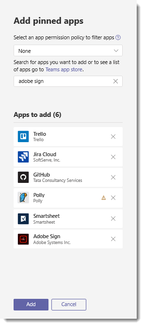

# <a name="manage-app-setup-policies-in-microsoft-teams"></a>Administrar directivas del programa de instalación de aplicaciones en Microsoft Teams

> [!INCLUDE [Preview customer token](includes/preview-feature.md)]

Como administrador, puede usar las directivas de aplicación del programa de instalación para personalizar Microsoft Teams para resaltar las aplicaciones que son más importantes para los usuarios. Elija las aplicaciones para anclar y establecer el orden en que aparecen. Las directivas de aplicación del programa de instalación le permiten showcase aplicaciones que necesitan los usuarios de su organización, las creadas por terceros o por los programadores de la organización incluidas. También puede usar las directivas de aplicación del programa de instalación para administrar las características integradas cómo aparecen.

Aplicaciones están ancladas a la barra de la aplicación. Se trata de la barra en el lado del cliente de escritorio de los equipos y en la parte inferior de los clientes móviles de equipos (iOS y Android). 

|Cliente de escritorio de los equipos  |Cliente móvil de los equipos |
|---------|---------|
|<br>  |         |

Administrar directivas del programa de instalación de aplicaciones en el centro de administración de Microsoft Teams. Puede usar la directiva global de (valor predeterminado de toda la organización) o crear directivas personalizadas y asignarlos a los usuarios. Los usuarios de su organización obtendrá automáticamente la directiva global, a menos que se cree y asigne una directiva personalizada.

Puede modificar la configuración de la directiva global para incluir las aplicaciones que desee. Si desea personalizar los equipos para distintos grupos de usuarios de la organización, cree y asigne una o varias directivas personalizadas.


> [!NOTE]
> Si un usuario se le asigna una directiva personalizada, esa directiva se aplica al usuario. Si un usuario no está asignado una directiva personalizada, se aplica la directiva global para el usuario.

## <a name="create-a-custom-app-setup-policy"></a>Crear una directiva de aplicación personalizada del programa de instalación

Puede usar el centro de administración de Microsoft Teams o Windows PowerShell para crear una directiva personalizada.

1. En la izquierda el centro de administración de Microsoft Teams, vaya a la **aplicación de los equipos** > **las directivas de aplicación del programa de instalación**.
2. Seleccione **nueva directiva**.
3. Escriba un nombre descriptivo para la directiva y, a continuación, haga clic en **Agregar aplicaciones**.
4. En el panel **Agregar anclados aplicaciones** , de búsqueda para las aplicaciones que desea agregar y, a continuación, haga clic en **Agregar**.  Para ver una lista de todas las aplicaciones, seleccione la **aplicación de los equipos de almacén**. Cuando haya elegido su lista de aplicaciones, haga clic en **Agregar**.

     

5. Organizar las aplicaciones en el orden que desea que aparezcan en los equipos y, a continuación, haga clic en **Guardar**.

    

## <a name="edit-an-app-setup-policy"></a>Editar una directiva de aplicación del programa de instalación

Puede usar el centro de administración de Microsoft Teams o Windows PowerShell para modificar una directiva, incluida la directiva global de (valor predeterminado de toda la organización) y las directivas personalizadas que se crean. 

1. En la izquierda el centro de administración de Microsoft Teams, vaya a la **aplicación de los equipos** > **las directivas de aplicación del programa de instalación**.
2. Seleccione la directiva que desee editar. 
3. Desde aquí, realice los cambios que desee. Puede agregar, quitar y cambiar el orden de las aplicaciones.
4. Haga clic en **Guardar**. 

## <a name="assign-a-custom-app-setup-policy-to-users"></a>Asignar una directiva de aplicación personalizada del programa de instalación a los usuarios

Puede usar el centro de administración de Microsoft Teams para asignar una directiva personalizada a los usuarios individuales o Windows PowerShell para asignar una directiva personalizada para el grupo de distribución o grupos de usuarios, como un grupo de seguridad.

### <a name="assign-a-custom-app-setup-policy-to-individual-users"></a>Asignar una directiva de aplicación personalizada del programa de instalación a usuarios individuales

1. En la izquierda el centro de administración de Microsoft Teams, vaya a **los usuarios**y, a continuación, haga clic en el usuario.
2. Junto a **las directivas asignadas**, elija **Editar**.
3. En **el programa de instalación de los equipos de aplicación de directiva**, seleccione la directiva del programa de instalación de la aplicación que desea asignar y, a continuación, elija **Guardar**.

    

### <a name="assign-a-custom-app-setup-policy-to-users-in-a-group"></a>Asignar una directiva de aplicación personalizada del programa de instalación para los usuarios de un grupo

Es posible que desee asignar una directiva de aplicación personalizada del programa de instalación para varios usuarios que ya ha identificado. Por ejemplo, es posible que desee asignar una directiva a todos los usuarios de un grupo de seguridad. Puede hacer esto conectándose a Azure Active Directory PowerShell para el módulo de gráfico y la Skype para el módulo de PowerShell de negocio. Para obtener más información acerca del uso de PowerShell para administrar los equipos, vea [Información general de los equipos de PowerShell](teams-powershell-overview.md).

En este ejemplo, se asigne una directiva del programa de instalación de la aplicación personalizada denominada directiva del programa de instalación de aplicación de recursos humanos a todos los usuarios en el grupo de proyecto de recursos humanos de Contoso farmacéutico.  

> [!NOTE]
> Asegúrese de que primero se conecta a Azure Active Directory PowerShell para el módulo de gráfico y Skype para el módulo de PowerShell de negocio siguiendo los pasos descritos en [Conectar a todos los servicios de Office 365 en una sola ventana de Windows PowerShell](https://docs.microsoft.com/office365/enterprise/powershell/connect-to-all-office-365-services-in-a-single-windows-powershell-window).

Obtener la GroupObjectId de un grupo en particular.
```
$group = Get-AzureADGroup -SearchString "Contoso Pharmaceuticals HR Project"
```
Obtener a los miembros del grupo especificado.
```
$members = Get-AzureADGroupMember -ObjectId $group.ObjectId -All $true | Where-Object {$_.ObjectType -eq "User"}
```
Asignar a todos los usuarios en el grupo a una directiva de aplicación determinada del programa de instalación. En este ejemplo, es la directiva de recursos humanos App del programa de instalación.
```
$members | ForEach-Object { Grant-CsTeamsAppSetupPolicy -PolicyName "HR App Setup Policy" -Identity $_.EmailAddress}
``` 
Según la cantidad de los miembros del grupo, este comando puede tardar varios minutos en ejecutarse.

## <a name="faq"></a>Preguntas más frecuentes

### <a name="working-with-app-setup-policies"></a>Trabajar con directivas del programa de instalación de aplicaciones

#### <a name="what-built-in-app-setup-policies-are-included-in-the-microsoft-teams-admin-center"></a>¿Qué directivas de configuración de aplicación integrada se incluyen en el centro de administración de Microsoft Teams?

- **Global (valor predeterminado de toda la organización)**: esta directiva predeterminada se aplica a todos los usuarios de la organización a menos que asigne a otra directiva. Editar la directiva global para aplicaciones de pin que son más importantes para los usuarios. 
- **FirstLineWorker**: esta directiva es firstline a los trabajadores. Puede asignar a los trabajadores de firstline en su organización. Es importante saber que las directivas personalizadas que cree, tiene que asignar la directiva a los usuarios para la configuración debe estar activo. Para obtener más información, vaya a la sección [asignación de una directiva de aplicación personalizada del programa de instalación a los usuarios](#assign-a-custom-app-setup-policy-to-users) de este artículo.

#### <a name="why-cant-i-find-an-app-in-the-add-pinned-apps-pane"></a>¿Por qué no puedo encontrar una aplicación en el panel de aplicaciones anclados agregar?

No todas las aplicaciones se pueden anclar a los equipos a través de una directiva de aplicación del programa de instalación. Es podrán que algunas aplicaciones no admitan esta funcionalidad. Para buscar las aplicaciones que se pueden anclar, busque la aplicación en el panel **Agregar anclados aplicaciones** . Las fichas que tienen un ámbito personal (fichas estáticas) y bots pueden fijarse en el cliente de escritorio de los equipos y estas aplicaciones están disponibles en el panel **Agregar anclados aplicaciones** .

Tenga en cuenta que la tienda de aplicaciones de los equipos enumera todas las aplicaciones de los equipos mientras que el panel de **aplicaciones agregar anclado** incluye únicamente las aplicaciones que pueden fijarse en los equipos a través de una directiva. 

#### <a name="im-a-teams-for-education-admin-what-do-i-need-to-know-about-app-setup-policies-in-teams-for-education"></a>Estoy equipos de un administrador de educación. ¿Qué necesito saber acerca de las directivas del programa de instalación de aplicación en los equipos para el ámbito educativo?

La aplicación de llamada no está disponible en los equipos para el ámbito educativo. Cuando se crea una nueva directiva de aplicación personalizada del programa de instalación, la aplicación de llamada se muestra en la lista de aplicaciones. Sin embargo, la aplicación no está anclada a los clientes de los equipos y los equipos de los usuarios de educación no verán la aplicación de las llamadas en los equipos. 

#### <a name="how-many-apps-can-be-added-to-a-policy"></a>¿Cuántas aplicaciones pueden agregarse a una directiva?

Un mínimo de dos aplicaciones se debe anclar a los clientes móviles de equipos (iOS y Android). Si una directiva tiene menos de dos aplicaciones, los clientes móviles no reflejarán la configuración de directiva y en su lugar seguirán usando la configuración existente.

#### <a name="how-long-does-it-take-for-policy-changes-to-take-effect"></a>¿Cuánto tiempo tarda para que surtan efecto los cambios de directiva?

Después de editar la directiva global o asignar una directiva, puede tardar hasta 24 horas para que los cambios surtan efecto.

### <a name="user-experience"></a>Experiencia de usuario

#### <a name="how-can-users-see-all-their-pinned-apps-in-teams"></a>¿Cómo pueden los usuarios ver todas sus aplicaciones ancladas en los equipos?

Para ver todas las aplicaciones que están ancladas para un usuario, los usuarios pueden tener que hacer lo siguiente según el número de aplicaciones instaladas y el tamaño de su ventana de los equipos cliente.

|Cliente de escritorio de los equipos |Cliente móvil de los equipos |
|---------|---------|
|En la barra de la aplicación en el lateral de los equipos, haga clic en **... Más aplicaciones**.| En la barra de la aplicación cerca de la parte inferior de los equipos, deslice hacia arriba.|
|<br>   |  

#### <a name="what-do-i-need-to-know-about-the-teams-mobile-experience"></a>¿Qué necesito saber acerca de la experiencia móvil de los equipos?

Los clientes móviles de equipos (iOS y Android) actualmente no admiten aplicaciones personal. Dependiendo de las aplicaciones en la directiva, aplicaciones ancladas para el cliente de escritorio de los equipos no es posible que aparezca en los clientes móviles de los equipos. Bots personal seguirá apareciendo en Chat en clientes móviles. 

Con los clientes móviles de los equipos, los usuarios verán las aplicaciones de los equipos de núcleo como actividad, Chat y los equipos y puede anclar algunas aplicaciones inicial de terceros de Microsoft, como turnos y organizador.

#### <a name="can-users-change-the-order-of-apps-pinned-through-a-policy"></a>¿Pueden los usuarios cambiar el orden de aplicaciones anclados a través de una directiva?

Actualmente, los usuarios pueden cambiar el orden de sus aplicaciones anclados en los clientes móviles de los equipos, pero no en los clientes de los equipos de escritorio o web. 

### <a name="custom-teams-apps"></a>Aplicaciones personalizadas de los equipos

#### <a name="my-organization-built-a-custom-teams-app-and-published-it-through-appsource-but-the-app-icon-isnt-displayed-as-expected-when-the-app-is-pinned-to-the-app-bar-in-teams-how-do-i-fix-it"></a>Mi organización había creado una aplicación personalizada de los equipos y había publicado a través de AppSource, pero no se muestra el icono de la aplicación según lo esperado cuando la aplicación está anclada a la barra de la aplicación en los equipos. ¿Cómo se puede solucionar? 

Asegúrese de seguir las instrucciones del logotipo antes de enviar la aplicación. Para obtener más información, vea [lista de comprobación para el envío de panel de vendedores](https://docs.microsoft.com/microsoftteams/platform/publishing/office-store-checklist). 

 ## <a name="related-topics"></a>Temas relacionados
- [Publicar una aplicación en el catálogo de aplicaciones de inquilino desde el cliente de los equipos](tenant-apps-catalog-teams.md)
