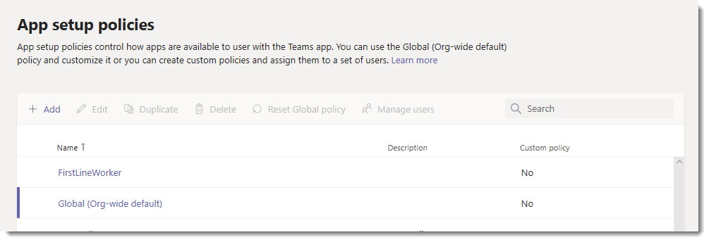

# <a name="manage-app-setup-policies-in-microsoft-teams"></a>Administrar directivas de configuración de aplicación en Microsoft Teams

> [!NOTE]
> Si ha habilitado la configuración de la aplicación en toda la organización, **permitir la interacción con aplicaciones personalizadas**, es posible que no vea las directivas de configuración de la aplicación aún en el centro de administración de Microsoft Teams. Se está implementando en este momento y estará disponible muy pronto en la organización.

Como administrador, puede usar las directivas de configuración de la aplicación para hacer lo siguiente:

- Personalice Teams para destacar las aplicaciones más importantes para sus usuarios. Elija las aplicaciones que quiere anclar y establezca el orden en que aparecen. Anclar aplicaciones le permite mostrar las aplicaciones que necesitan los usuarios de su organización, incluyendo aquellas creadas por terceros o por desarrolladores de su organización.
- Controle si los usuarios pueden anclar aplicaciones a Teams.
- Instalar aplicaciones en nombre de los usuarios **(en la versión preliminar)**. Usted elige qué aplicaciones se instalan de forma predeterminada para los usuarios cuando inician Teams. Tenga en cuenta que los usuarios pueden instalar aplicaciones ellos mismos si la [Directiva de permisos](teams-app-permission-policies.md) de la aplicación que se les asigna le permite hacerlo.

Las aplicaciones se anclan en la barra de aplicaciones. Esta es la barra situada en el lateral del cliente de escritorio de Teams y en la parte inferior de los clientes móviles de Teams (iOS y Android).

|Cliente de escritorio de Teams  |Cliente móvil de Teams |
|---------|---------|
|<br>  |         |

Para ver sus aplicaciones preinstaladas, en la barra de la aplicación, los usuarios hacen clic en **... Más aplicaciones** en el escritorio de Teams y clientes Web y pase el dedo hacia arriba en los clientes móviles.

Las directivas de configuración de aplicaciones se administran en el centro de administración de Microsoft Teams. Puede usar la directiva global (predeterminada para toda la organización) o crear directivas personalizadas y asignarlas a los usuarios. Los usuarios de su organización obtendrán automáticamente la directiva global, a menos que cree y asigne una directiva personalizada. Debe ser un administrador global o un administrador de servicio de Teams para administrar estas directivas.

Puede editar la configuración de la directiva global para incluir las aplicaciones que desee. Si desea personalizar Teams para diferentes grupos de usuarios de su organización, cree y asigne una o más directivas personalizadas. Si un usuario tiene asignada una directiva personalizada, esa Directiva se aplica al usuario. Si un usuario no tiene asignada una directiva personalizada, la política global se aplica al usuario.



> [!NOTE]
> Si tiene equipos para el ámbito educativo, es importante que sepa que la aplicación asignaciones está anclada de forma predeterminada en la directiva global aunque, en este momento, no la verá en la directiva global. Será la cuarta aplicación de la lista de aplicaciones ancladas en los clientes de Teams.

## <a name="create-a-custom-app-setup-policy"></a>Crear una directiva de configuración de aplicación personalizada

Puede usar el centro de administración de Microsoft Teams para crear una directiva personalizada.

1. En el centro de navegación izquierdo del centro de administración de Microsoft Teams, vaya a > **directivas de configuración**de las **aplicaciones de Teams**.
2. Haga clic en **Agregar**.
    
3. Escriba un nombre y una descripción para la directiva.
4. Activar o desactivar el **envío de aplicaciones personalizadas**, en función de si desea permitir que los usuarios carguen aplicaciones personalizadas en Teams. No podrá cambiar esta configuración si desea que las **aplicaciones de terceros** estén desactivadas en la [configuración](manage-apps.md#manage-org-wide-app-settings)de la aplicación en toda la organización.
5. Active o desactive la **opción permitir el anclaje de usuarios**, en función de si desea permitir a los usuarios personalizar la barra de aplicaciones al anclar aplicaciones en él.
6. Para instalar aplicaciones para usuarios **(en la versión preliminar)**, haga lo siguiente:

    1. En **aplicaciones instaladas**, haga clic en **agregar aplicaciones**.
    2. En el panel **agregar aplicaciones instaladas** , busque las aplicaciones que quiera instalar automáticamente para los usuarios cuando inicien Teams. También puede filtrar aplicaciones por directiva de permisos de aplicación. Cuando haya elegido la lista de aplicaciones, haga clic en **Agregar**.

        

7. Para anclar aplicaciones, haga lo siguiente:

    1. En **aplicaciones ancladas**, haga clic en **agregar aplicaciones**.
    2. En el panel **agregar aplicaciones ancladas** , busque las aplicaciones que desea agregar y, a continuación, haga clic en **Agregar**. También puede filtrar aplicaciones por directiva de permisos de aplicación. Cuando haya elegido la lista de aplicaciones para anclar, haga clic en **Agregar**.

         

    3. Organice las aplicaciones en el orden en que desea que aparezcan en Teams y, a continuación, haga clic en **Guardar**.

        

## <a name="edit-an-app-setup-policy"></a>Editar una directiva de configuración de la aplicación

Puede usar el centro de administración de Microsoft Teams para editar una directiva, incluyendo la directiva global (opción predeterminada de toda la organización) y las directivas personalizadas que cree.

1. En el centro de navegación izquierdo del centro de administración de Microsoft Teams, vaya a > **directivas de configuración**de las **aplicaciones de Teams**.
2. Seleccione la Directiva haciendo clic a la izquierda del nombre de la Directiva y, a continuación, haga clic en **Editar**.
3. Desde aquí, realice los cambios que desee.
4. Haga clic en **Guardar **.

## <a name="assign-a-custom-app-setup-policy-to-users"></a>Asignar una directiva de configuración de aplicación personalizada a los usuarios

Puede usar el centro de administración de Microsoft Teams para asignar una directiva personalizada a usuarios individuales o el módulo de PowerShell de Skype empresarial para asignar una directiva personalizada a grupos de usuarios, como un grupo de seguridad o un grupo de distribución.

### <a name="assign-a-custom-app-setup-policy-to-users"></a>Asignar una directiva de configuración de aplicación personalizada a los usuarios

1. En el centro de navegación izquierdo del centro de administración de Microsoft Teams, vaya a **usuarios**y, a continuación, haga clic en el usuario.
2. Para seleccionar el usuario, haga clic a la izquierda del nombre de usuario y, después, en **Editar configuración**.
3. En **Directiva de configuración**de la aplicación, seleccione la Directiva de configuración de la aplicación que desea asignar y, a continuación, haga clic en **aplicar**.

Para asignar una directiva a varios usuarios a la vez, vea [Modificar la configuración de usuario de Teams en masa](edit-user-settings-in-bulk.md).

También puede hacer lo siguiente:

1. En el centro de navegación izquierdo del centro de administración de Microsoft Teams, vaya a > **directivas de configuración**de las **aplicaciones de Teams**.
2. Haga clic a la izquierda del nombre de la directiva para seleccionarla.
3. Seleccione **Administrar usuarios**.
4. En el panel **Administrar usuarios**, busque el usuario por su nombre para mostrar o por su nombre de usuario, seleccione el nombre y, después, haga clic en **Agregar**. Repita este paso por cada usuario que quiera agregar.
5. Cuando termine de agregar usuarios, seleccione **Guardar**.

### <a name="assign-a-custom-app-setup-policy-to-users-in-a-group"></a>Asignar una directiva de configuración de aplicación personalizada a los usuarios de un grupo

Es posible que desee asignar una directiva de configuración de aplicación personalizada a varios usuarios que ya haya identificado. Por ejemplo, es posible que desee asignar una directiva a todos los usuarios de un grupo de seguridad. Para ello, puede conectarse al módulo de Azure Active Directory PowerShell para Graph y al módulo de PowerShell de Skype empresarial. Para obtener más información sobre cómo usar PowerShell para administrar equipos, consulte [información general de Teams PowerShell](teams-powershell-overview.md).

En este ejemplo, asignamos una directiva de configuración de aplicación personalizada denominada Directiva de configuración de la aplicación de RRHH a todos los usuarios del grupo de proyecto de RRHH de Contoso Pharmaceuticals.  

> [!NOTE]
> Asegúrese de conectarse primero al módulo de Azure Active Directory PowerShell para Graph y al módulo de PowerShell de Skype empresarial siguiendo los pasos de [conectar a todos los servicios de Office 365 en una sola ventana de Windows PowerShell](https://docs.microsoft.com/office365/enterprise/powershell/connect-to-all-office-365-services-in-a-single-windows-powershell-window).

Obtén la GroupObjectId del grupo en particular.
```PowerShell
$group = Get-AzureADGroup -SearchString "Contoso Pharmaceuticals HR Project"
```
Obtener los miembros del grupo especificado.
```PowerShell
$members = Get-AzureADGroupMember -ObjectId $group.ObjectId -All $true | Where-Object {$_.ObjectType -eq "User"}
```
Asignar todos los usuarios del grupo a una directiva de configuración de aplicación determinada. En este ejemplo, es la Directiva de configuración de la aplicación de RRHH.
```PowerShell
$members | ForEach-Object { Grant-CsTeamsAppSetupPolicy -PolicyName "HR App Setup Policy" -Identity $_.UserPrincipalName}
``` 
Según el número de miembros del grupo, este comando puede demorar varios minutos en ejecutarse.

## <a name="faq"></a>Preguntas más frecuentes

### <a name="working-with-app-setup-policies"></a>Trabajar con directivas de configuración de aplicaciones

#### <a name="what-built-in-app-setup-policies-are-included-in-the-microsoft-teams-admin-center"></a>¿Qué directivas de configuración de aplicaciones integradas se incluyen en el centro de administración de Microsoft Teams?

- **Global (valor predeterminado para toda**la organización): esta directiva predeterminada se aplica a todos los usuarios de su organización a menos que asigne otra directiva. Edite la directiva global para anclar aplicaciones que sean más importantes para los usuarios.
- **FirstLineWorker**: esta directiva es para los trabajadores de los Firstline. Puede asignarla a los trabajadores de los Firstline de su organización. Es importante saber que, al igual que las directivas personalizadas que cree, tendrá que asignar la Directiva a los usuarios para que la configuración esté activa. Para obtener más información, vaya a la sección [asignar una directiva de configuración de aplicación personalizada a los usuarios](#assign-a-custom-app-setup-policy-to-users) de este artículo.

#### <a name="why-cant-i-find-an-app-in-the-add-pinned-apps-pane"></a>¿Por qué no encuentro una aplicación en el panel agregar aplicaciones ancladas?

No todas las aplicaciones se pueden anclar a teams a través de una directiva de configuración de aplicación. Es posible que algunas aplicaciones no admitan esta funcionalidad. Para buscar las aplicaciones que se pueden anclar, busque la aplicación en el panel **agregar aplicaciones ancladas** . Las pestañas que tienen un ámbito personal (pestañas estáticas) y bots se pueden anclar al cliente de escritorio de Teams y estas aplicaciones están disponibles en el panel **agregar aplicaciones ancladas** .

Tenga en cuenta que el App Store de Teams muestra todas las aplicaciones de Teams, mientras que el panel **agregar aplicaciones ancladas** solo incluye las aplicaciones que se pueden anclar a teams a través de una directiva. 

#### <a name="im-a-teams-for-education-admin-what-do-i-need-to-know-about-app-setup-policies-in-teams-for-education"></a>Soy un equipo de administración de educación. ¿Qué necesito saber sobre las directivas de configuración de aplicaciones en Teams para el ámbito educativo?

La aplicación que llama no está disponible en Teams para el ámbito educativo. Al crear una nueva Directiva de configuración de aplicación personalizada, la aplicación de llamada se muestra en la lista de aplicaciones. Sin embargo, la aplicación no está anclada a los clientes de Teams y los equipos de los usuarios educativos no verán la aplicación llamadas en Teams.

#### <a name="how-many-pinned-apps-can-be-added-to-a-policy"></a>¿Cuántas aplicaciones ancladas se pueden agregar a una directiva?

Se deben anclar un mínimo de dos aplicaciones a los clientes móviles de Teams (iOS y Android). Si una directiva tiene menos de dos aplicaciones, los clientes móviles no reflejarán la configuración de la Directiva y, en su lugar, continuarán usando la configuración existente.

No hay límite en el número de aplicaciones ancladas que puede Agregar a una directiva.

#### <a name="how-long-does-it-take-for-policy-changes-to-take-effect"></a>¿Cuánto tiempo se tarda en aplicar los cambios de Directiva?

Después de modificar la directiva global o asignar una directiva, los cambios pueden tardar hasta 24 horas en surtir efecto.

### <a name="user-experience"></a>Experiencia de usuario

#### <a name="how-can-users-see-all-their-pinned-apps-in-teams"></a>¿Cómo pueden los usuarios ver todas las aplicaciones ancladas en Teams?

Para ver todas las aplicaciones que están ancladas a un usuario, es posible que los usuarios tengan que hacer lo siguiente según el número de aplicaciones instaladas y el tamaño de la ventana del cliente de sus equipos.

|Cliente de escritorio de Teams |Cliente móvil de Teams |
|---------|---------|
|En la barra de la aplicación situada en el lateral de Teams, haga clic en **... Más aplicaciones**.| En la barra de la aplicación cerca de la parte inferior de Teams, deslice el dedo hacia arriba.|
|<br>   |  

#### <a name="what-do-i-need-to-know-about-the-teams-mobile-experience"></a>¿Qué debo saber sobre la experiencia móvil de Teams?

Los clientes móviles de los equipos (iOS y Android) actualmente no admiten aplicaciones personales con pestañas estáticas. Según las aplicaciones que se hayan establecido en la Directiva, es posible que las aplicaciones ancladas al cliente de escritorio de Teams no aparezcan en los clientes móviles de Teams. Los bots personales seguirán apareciendo en la conversación en clientes móviles.

Con los clientes móviles de Teams, los usuarios verán las principales aplicaciones de Teams, como la actividad, la mensajería instantánea y los equipos, y puede anclar algunas aplicaciones de terceros de Microsoft, como los turnos.

#### <a name="can-users-change-the-order-of-apps-pinned-through-a-policy"></a>¿Los usuarios pueden cambiar el orden de las aplicaciones ancladas a través de una directiva?

Los usuarios pueden cambiar el orden de las aplicaciones ancladas en Teams para clientes móviles y de escritorio si está activada la opción **permitir el anclaje de usuarios** . Los usuarios no pueden cambiar el orden de las aplicaciones ancladas en los clientes Web de Teams.

### <a name="custom-teams-apps"></a>Aplicaciones personalizadas de Teams

#### <a name="my-organization-built-a-custom-teams-app-and-published-it-either-to-appsource-or-the-tenant-app-catalog-but-the-app-icon-isnt-displayed-as-expected-when-the-app-is-pinned-to-the-app-bar-in-teams-how-do-i-fix-it"></a>Mi organización ha creado una aplicación de Teams personalizada y la ha publicado, ya sea para AppSource o el catálogo de aplicaciones de inquilino, pero el icono de la aplicación no se muestra de la forma esperada cuando la aplicación está anclada a la barra de aplicaciones de Teams. ¿Cómo puedo solucionarlo?

Asegúrese de seguir las pautas del logotipo antes de enviar la aplicación. Para obtener más información, vea [lista de comprobación para el envío de panel de vendedores](/microsoftteams/platform/concepts/deploy-and-publish/appsource/prepare/overview). 

 ## <a name="related-topics"></a>Temas relacionados

- [Configurar la administración para aplicaciones en Teams](admin-settings.md)
