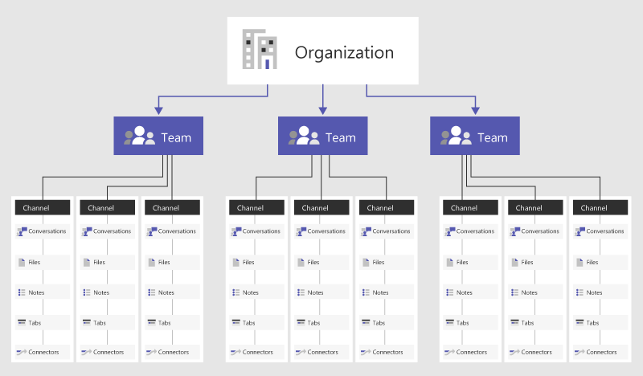

> [!NOTE]
> Revise la siguiente información para entender la charla, los equipos, los canales, & aplicaciones en los equipos. A continuación, vaya a [implementar chat, los equipos, los canales, & aplicaciones en los equipos](deploy-chat-teams-channels-microsoft-teams-landing-page.md) para recorrer una lista de decisiones importantes a la implantación de los equipos.

Información general de los equipos y canales en Microsoft Teams
=================================================

Para empezar, veamos cómo Microsoft Teams permite que los equipos individuales puedan organizarse a sí mismos y puedan colaborar en distintos escenarios empresariales:

-   **Los equipos** son una colección de personas, contenido y herramientas que lo rodea proyectos diferentes y resultados dentro de una organización.

    -   Los equipos se pueden crear privados solo para los usuarios invitados.

    -   Los equipos también se pueden crear públicos y abiertos, de modo que todos los integrantes de la organización se pueden unir (hasta 2500 miembros).
    
    Los equipos están diseñados para reunir grupos de personas que trabajan juntos para intentar lograr sus objetivos. Los equipos pueden ser dinámicos para el trabajo basado en proyectos (por ejemplo, iniciar un producto o crear un centro de operaciones digital) o continuos para reflejar la estructura interna de su organización (por ejemplo, departamentos y ubicaciones de oficinas). Los miembros del equipo serán los únicos que podrán ver las conversaciones, los archivos y las notas de los canales del equipo.

-   Los **canales** son secciones dedicadas dentro de un equipo para mantener las conversaciones organizadas por temas, disciplinas o proyectos específicos, es decir, lo que le sea más conveniente al equipo.

    -   Los canales de equipo son lugares en los que todos los miembros del equipo pueden tener conversaciones abiertamente. Los chats privados solo son visibles para los participantes del chat.

    -   Los canales son más valiosos cuando extendido con aplicaciones que incluyen pestañas, conectores y bots que aumente su valor a los miembros del equipo.

Vea este vídeo corto para obtener más información sobre los procedimientos recomendados para la creación de equipos y canales.

   > [!VIDEO https://www.youtube.com/embed/hjJWtoaRJeE]

Configuración, roles y pertenencia
------------------------------

**Pertenencia a equipos**: Cuando Microsoft Teams se activa para toda la organización, los propietarios de equipo designados tienen la capacidad de invitar a cualquier empleado con el que trabajen para que se una al equipo. Con Microsoft Teams, los propietarios de equipo pueden agregar con facilidad personas de la organización por su nombre. En función de cuál sea la configuración de su organización, podrá agregar a sus equipos los invitados que sean miembros del equipo, pero que no pertenezcan a la organización. Vea [Acceso de invitado a Microsoft Teams](guest-access.md) para obtener más información. 

Los propietarios de equipo también pueden crear un equipo basado en un grupo de Office 365 existente. Los cambios que se realicen en el grupo se sincronizarán con Microsoft Teams automáticamente. Al crear un equipo basado en un grupo existente de Office 365, no solo se simplifica el proceso para invitar y administrar miembros, sino que también se sincronizan los archivos de grupo dentro de Microsoft Teams.

**Roles de equipo**: Hay dos roles principales en Microsoft Teams: un propietario de equipo, que es la persona que crea el equipo, y los miembros del equipo, que son las personas a las que se invita a unirse al equipo. Los propietarios de equipo pueden convertir en copropietario a cualquier miembro del equipo cuando le inviten o en cualquier otro momento después de haberse unido al equipo. Al tener varios propietarios de equipo, puede compartir las responsabilidades en la administración de las configuraciones y la pertenencia al equipo, incluidas las invitaciones.

**Configuración del equipo**: Los propietarios de equipo pueden administrar la configuración de todo el equipo directamente en Microsoft Teams. En la configuración se incluye la capacidad de agregar una imagen del equipo, establecer permisos en todos los miembros del equipo para crear canales, agregar fichas y conectores, @mencionar a todo el equipo o el canal, y usar archivos GIF, adhesivos y memes. 

Tardar tres minutos para desproteger este ir a la guía vídeo para los propietarios de equipo: 

   > [!VIDEO https://www.youtube.com/embed/7XcDSuw6NR4]

Si es un administrador de Microsoft Teams en Office 365, tener acceso a la configuración de todo el sistema en el centro de administración de Microsoft Teams. Esta configuración puede influir en las opciones y la configuración predeterminada que los propietarios ven en la configuración del equipo. Por ejemplo, puede habilitar un canal predeterminado, "General", para los anuncios, los debates y los recursos de todo el equipo, que aparecerá en todos los equipos.

De manera predeterminada, todos los usuarios tienen permisos para crear un equipo en Microsoft Teams (para modificarlo, consulte [Asignar roles y permisos en Microsoft Teams](assign-roles-permissions.md)). Los usuarios de un grupo de Office 365 existente también pueden mejorarlos con las funciones de Teams.

Una actividad clave de planificación inicial para animar a los usuarios a utilizar Microsoft Teams consiste en ayudarles a pensar y comprender el modo en que Teams puede mejorar la colaboración en sus actividades diarias. Hablar con las personas y que puedan seleccionar los escenarios empresariales que actualmente están colaborando en formas fragmentados.  Diríjales a un canal con las fichas relevantes que les ayuden a realizar el trabajo que necesitan. Uno de los casos de uso más influyente de Teams es cualquier proceso organizativo. 

Equipos de ejemplo 
--------------

A continuación puede ver algunos ejemplos de cómo los distintos tipos de usuarios pueden enfocar la configuración de sus equipos, canales y aplicaciones (fichas/conectores/bots). Esto puede ser útil para iniciar una conversación sobre Microsoft Teams con su comunidad de usuarios. A medida que planifica la implementación de Microsoft Teams en su organización, recuerde que puede proporcionar instrucciones sobre cómo estructurar los equipos. Sin embargo, los usuarios son los que tienen el control de su propia organización. Estos solo son ejemplos para que los equipos comiencen a pensar en las posibilidades.

Microsoft Teams es perfecta para eliminar la idea de los silos de la organización y promocionar equipos para varias funciones. Por lo tanto, deberá animar a los usuarios para que piensen en términos de equipos funcionales en vez de silos de la organización.

|Tipos de equipos  |Canales potenciales  |Aplicaciones (fichas) /Conectores /Bots )  |
|---------|---------|---------|
|Ventas     |Reunión anual de ventas   Revisión empresarial trimestral   Revisión del proceso de ventas mensual   Guía de tácticas de ventas |Power BI  Trello  CRM  Bot de resúmenes         |
|Relaciones públicas     |Notas de prensa  Noticias y actualizaciones  Verificación de datos         |Fuente RSS  Twitter         |
|Planificación de eventos     |Marketing  Logística y planificación  Lugar de celebración  Presupuesto         |Twitter  Facebook  Planner  PDF         |
|Marketing/Comercialización   |Estudio de mercado  Pilares de mensajes  Plan de comunicaciones  Lista de materiales de marketing        |YouTube  Microsoft Stream  Twitter  MailChimp         |
|Operaciones técnicas    |Administración de incidentes  Planificación de Sprint  Elementos de trabajo  Infraestructura y operaciones         |Servicios de equipos  Jira  AzureBot         |
|Equipo de producto      |Estrategia  Marketing  Ventas  Operaciones  Información  Servicios y soporte técnico         |Power BI  Servicios de equipos         |
|Servicios financieros    |Fiscal actual  Planificación del año fiscal  Previsión  Cuentas por cobrar  Cuentas por pagar         |Power BI  Google Analytics         |
|Logística     |Operaciones de almacenes  Mantenimiento de vehículos  Listas de conductores         |Servicio meteorológico  Cortes en carreteras y viajes  Planner  Tubot  UPS Bot         |
|Recursos humanos     |Administración de talento  Contratación  Planificación de revisión del rendimiento  Moral         |Herramientas de recursos humanos  Sitios de publicación de trabajos externos  Growbot         |
|Organizativo   Equipo virtual |Estrategia  Desarrollo de la mano de obra  Competencia e investigación         |Power BI  Microsoft Stream         |

Es posible crear que Teams se alinee con la estructura de la organización.  Esto es especialmente útil para responsables que quieren levantar la moral, realizar revisiones de equipo específicas, aclarar procesos de incorporación de empleados, discutir planes de recursos y aumentar la visibilidad en una cantidad de recursos diversos.  

## Equipos de toda la organización

Si su organización tiene no más de 1.000 usuarios, puede crear un equipo de toda la organización. Los equipos de toda la organización proporcionan una forma automática para todos los usuarios de una organización a formar parte de un único equipo para la colaboración. Para obtener más información, incluidas las prácticas recomendadas para crear y administrar un equipo de toda la organización, vea [crear un equipo de toda la organización en los equipos de Microsoft](create-an-org-wide-team.md).
