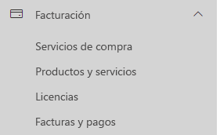
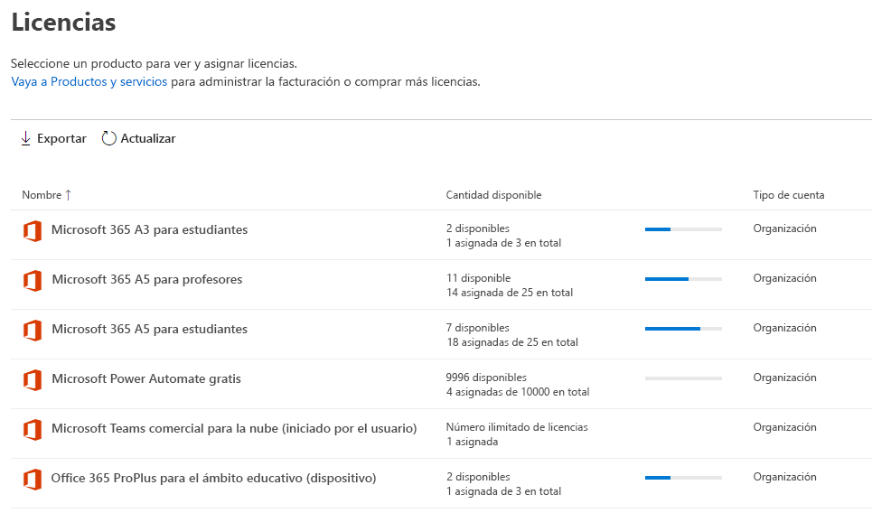
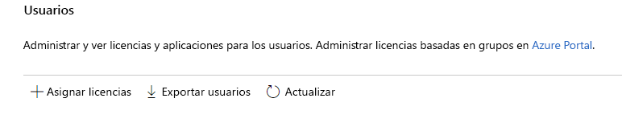
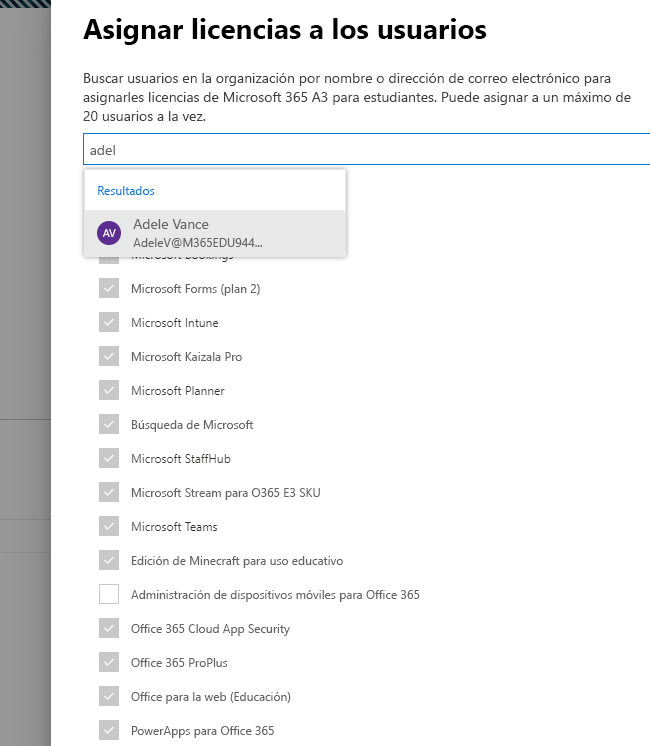
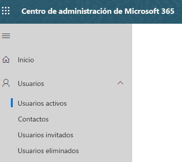
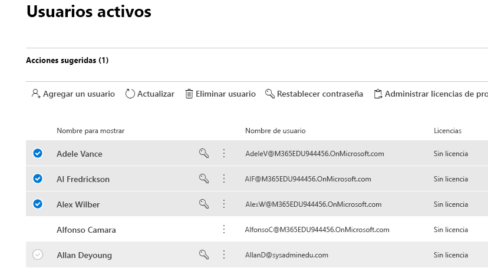
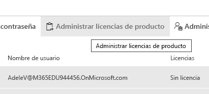
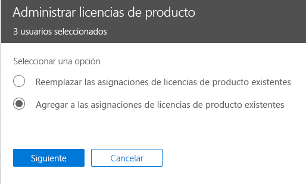
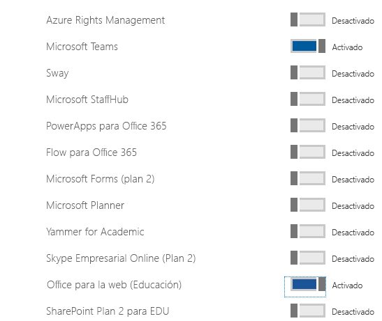

# Asignar licencias de Microsoft Teams para EDU

Microsoft Teams es un centro digital que reúne conversaciones, contenido y aplicaciones en un solo lugar. Dado que se basa en Office 365, las escuelas se benefician de la integración con aplicaciones y los servicios de Office universalmente conocidos. Su institución puede usar Microsoft Teams para crear clases colaborativas, ponerse en contacto los unos con los otros en comunidades de aprendizaje profesional y comunicarse con el personal del centro educativo. Y todo ello a través de una sola experiencia de Office 365 para el ámbito educativo.

Para empezar, los administradores de TI tienen que usar el Centro de administración de Microsoft 365 para [habilitar Microsoft Teams en su escuela](/microsoft-365/education/intune-edu-trial/enable-microsoft-teams).
Cuando termine, debe asignar las licencias a las cuentas de usuario para que el profesor, el personal y los alumnos puedan acceder a los servicios de Office 365, como Microsoft Teams.

Puede asignar licencias a las cuentas de usuario, ya sea de forma individual o automáticamente mediante la pertenencia a grupos. Este artículo le guiará por los pasos para asignar licencias de Office 365 a una persona o a un conjunto reducido de cuentas de usuario en el Centro de administración de Microsoft 365. Para asignar licencias automáticamente mediante la pertenencia a grupos, consulte uno de nuestros artículos de soporte técnico:

- [PowerShell de Office 365](/office365/enterprise/powershell/assign-licenses-to-user-accounts-with-office-365-powershell)
- [Concesión de licencias basada en grupo en Active Directory](/azure/active-directory/users-groups-roles/licensing-groups-assign)

Puede asignar licencias a los usuarios en la página **Licencias** o en la página **Usuarios activos**. El método que use dependerá de si desea asignar licencias de producto a usuarios específicos o si quiere asignar licencias de usuarios a productos específicos.

> [!NOTE]
> Si no usa el nuevo Centro de administración de Microsoft 365, puede activarlo seleccionando **Probar el nuevo centro de administración** ubicado en la parte superior de la página de inicio.

## Asignar licencias a los usuarios en la página licencias

> [!NOTE]
> Debe ser un administrador global, administrador de facturación, administrador de licencias o administrador de administración de usuarios. Para obtener más información, consulte [Información sobre los roles de administrador de Office 365](/microsoft-365/admin/add-users/about-admin-roles).

Al usar la página de **Licencias** para asignar licencias, asigna licencias para un producto específico a un máximo de 20 usuarios. En la página **Licencias**, verá una lista de todos los productos para los que tiene suscripciones, junto con el número total de licencias de cada producto, cuántas licencias están asignadas y cuántas están disponibles.

1. En el Centro de administración, vaya a la página **Facturación** > [Licencias](https://go.microsoft.com/fwlink/p/?linkid=842264).

   
2. Seleccione un producto para el que quiera asignar licencias. Microsoft Teams forma parte del SKU para estudiantes gratuito de Office 365 A1.

   
3. Seleccione **Asignar licencias**.

   
4. En el panel **Asignar licencias a los usuarios**, empiece a escribir un nombre, lo que generará una lista de nombres. Elija en los resultados el nombre que busca para agregarlo a la lista. Puede agregar hasta 20 usuarios a la vez.

   
5. Seleccione **Activar o desactivar aplicaciones y servicios** para asignar o quitar el acceso a elementos específicos, como Microsoft Teams. Asegúrese de que **Microsoft Teams** y **Office para la web (Educación)** estén seleccionados.
6. Cuando termine, seleccione **Asignar** y haga clic en **Cerrar**.

Para cambiar las aplicaciones y los servicios a los que tiene acceso un usuario:

1. Seleccione la fila que contiene el usuario.
1. En el panel derecho, active o desactive las aplicaciones y servicios a los que quiere dar o quitar acceso.
1. Cuando haya terminado, seleccione **Guardar** y haga clic en **Cerrar**.

## Asignar licencias a un usuario individual o a varios usuarios en la página Usuarios activos

1. En el Centro de administración, vaya a la página **Usuarios**  >  [Usuarios activos](https://go.microsoft.com/fwlink/p/?linkid=834822).

   
2. Seleccione los círculos junto al (a los) nombre(s) del (de los) usuario(s) al (a los) que quiere asignar licencias.

   
3. En la parte superior, seleccione **Administrar licencias de producto**.

   
4. En el panel **Administrar licencias de producto**, seleccione **Agregar a las asignaciones de licencias de producto existentes**  >  **Siguiente**.

   
5. En el panel **Agregar a los productos existentes**, cambie el botón de alternancia a la posición de **Activado** para la licencia que quiere que tengan los usuarios seleccionados. Asegúrese de que **Microsoft Teams** y **Office para la web (Educación)** estén seleccionados.

   

   De forma predeterminada, todos los servicios asociados con esas licencias se asignan automáticamente al usuario o los usuarios. Puede limitar los servicios que están disponibles para los usuarios. Cambie el botón de alternancia a la posición de **Desactivado** para los servicios que no quiere que tengan los usuarios.
6. En la parte inferior del panel, seleccione Agregar > Cerrar.