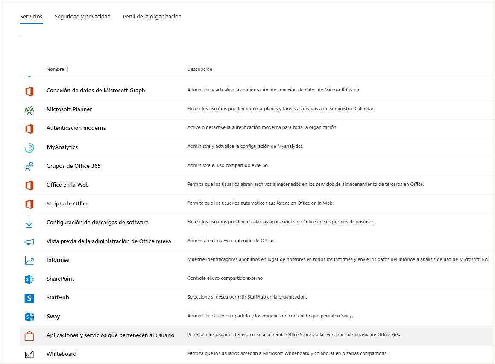

# Administrar la licencia de Microsoft Teams ExploratoryManage the Microsoft Teams Exploratory license

La experiencia de Microsoft Teams Exploratory permite a los usuarios de su organización que tienen Azure Active Directory (Azure AD) y no tengan licencia para los Teams iniciar una experiencia exploratoria de los Teams.The Microsoft Teams Exploratory experience lets users in your organization who have Azure Active Directory (Azure AD) and aren't licensed for Teams initiate an exploratory experience of Teams. Los administradores pueden activar o desactivar esta característica para los usuarios de su organización.Admins can switch this feature on or off for users in their organization. La anterior [Prueba comercial en la nube de Microsoft]() se ha reemplazado por la experiencia de Teams Exploratory.The earlier [Microsoft Commercial Cloud Trial]() is now replaced by the Teams Exploratory experience.

> [!NOTE]
> Hay un límite de 100 licencias de Microsoft Teams Exploratory por espacio empresarial.There is a limit of 100 Microsoft Teams Exploratory licenses per tenant.

## ¿Qué incluye la experiencia de Teams Exploratory?What's in the Teams Exploratory experience

Los planes de servicio que verá un administrador como parte de la experiencia de Teams Exploratory son:The service plans that an admin will see as part of the Teams Exploratory experience are:

- Exchange Online (plan 1)Exchange Online (Plan 1)
- Flow para Microsoft 365 u Office 365Flow for Microsoft 365 or Office 365
- Información de MyAnalyticsInsights by MyAnalytics
- Microsoft Forms (plan E1)Microsoft Forms (Plan E1)
- Microsoft PlannerMicrosoft Planner
- Búsqueda de MicrosoftMicrosoft Search
- Microsoft StaffHubMicrosoft StaffHub
- SKU de Microsoft Stream para Microsoft 365 y Office 365 E1 1</1>Microsoft Stream for Microsoft 365 and Office 365 E1 SKUs 1</1>
- Microsoft TeamsMicrosoft Teams
- Administración de dispositivos móviles para Microsoft 365 u Office 365Mobile Device Management for Microsoft 365 or Office 365
- Aplicaciones móviles de Office para Office 365Office Mobile Apps for Office 365
- Office OnlineOffice Online
- PowerApps para Microsoft 365 u Office 365PowerApps for Microsoft 365 or Office 365
- SharePoint Online (plan 1)SharePoint Online (Plan 1)
- SwaySway
- To-Do (plan 1)To-Do (Plan 1)
- Whiteboard (plan 1)Whiteboard (Plan 1)
- Yammer EnterpriseYammer Enterprise

  1 El cambio de uso desde Microsoft Stream a [OneDrive para la Empresa y SharePoint para grabar reuniones](tmr-meeting-recording-change.md) estará basado en fases.1 The change from using Microsoft Stream to [OneDrive for Business and SharePoint for meeting recordings](tmr-meeting-recording-change.md) will be a phased approach. Durante el lanzamiento, podrá participar en esta experiencia.At launch, you'll be able to opt in to this experience. En noviembre, tendrá que decidir si quiere seguir usando la secuencia.In November, you'll have to opt out if you want to continue using Stream. En un momento, a principios de 2021, requerimos que todos los clientes usen OneDrive para la Empresa y SharePoint para las nuevas grabaciones de la reunión.Sometime in early 2021, we'll require all customers to use OneDrive for Business and SharePoint for new meeting recordings.

## Quién reúne los requisitosWho's eligible

Los usuarios se ajustan a los requerimientos para una experiencia de Teams Exploratory si:Users fit the criteria for a Teams Exploratory experience if they:

- Tienen una dirección de correo electrónico de dominio de Azure AD administrada.Have a managed Azure AD domain email address.
- Pertenecen a un espacio empresarial con una suscripción pagada.Belong to a tenant with a paid subscription.
- No tienen una licencia activa de Teams.Do not have an active Teams license.
- No están en un espacio empresarial donde se creó una directiva de asignación de licencias.Are not in a tenant where a license assignment policy was created.

Se debe habilitar a los usuarios para registrarse en aplicaciones y pruebas (en el Centro de administración de Microsoft 365). Para obtener más información, consulte [Administrar la experiencia de Teams Exploratory](#manage-the-teams-exploratory-experience), más adelante en este artículo.Users must be enabled to sign up for apps and trials (in the Microsoft 365 admin center). For more information, see [Manage the Teams Exploratory experience](#manage-the-teams-exploratory-experience), later in this article.

## ¿Quiénes no reúnen los requisitos?Who isn't eligible

Los usuarios no reúnen los requerimientos si:Users don't fit the criteria if they:

- Ahora o anteriormente, tuvieron Teams mediante una licencia pagada, no pagada, o de prueba.Currently or previously had Teams from a paid, unpaid, or trial license
- Se encuentran en un espacio empresarial que ha recibido, al menos, una oferta especial COVID.Are in a tenant that used/received at least one special COVID offer.

Su organización no es apta para esta oferta si usted es cliente de Syndication Partner o cliente de GCC, GCC High, DoD o EDU.Your organization isn't eligible for this offer if you're a Syndication Partner Customer or a GCC, GCC High, DoD, or EDU customer.

## ¿Cómo los usuarios se pueden inscribir en la experiencia de Teams Exploratory?How users sign up for the Teams Exploratory experience

Los usuarios que son aptos pueden inscribirse en la experiencia de Teams Exploratory iniciando sesión en Teams desde el equipo o la Web ([teams.microsoft.com](https://teams.microsoft.com)).Eligible users can sign up for the Teams Exploratory experience by signing in to Teams from the desktop or web ([teams.microsoft.com](https://teams.microsoft.com)). Por ahora, no está disponible la habilitación de Exploratory mediante dispositivos móviles.At this time, enabling Exploratory through mobile is not supported. Al registrarse, se les asignará esta licencia de manera automática, y el administrador del espacio empresarial recibirá una notificación por correo electrónico la primera vez que un usuario de su organización active la experiencia de Teams Exploratory.When they sign up, they'll be assigned this license automatically and the tenant admin will receive an email notification the first time someone in your org starts the Teams Exploratory experience.

## Administrar la experiencia de Teams ExploratoryManage the Teams Exploratory experience

La experiencia de Teams Exploratory está pensada para ser activada por usuarios finales individuales, y usted no puede activar esta oferta en nombre de los empleados que sean usuarios finales.The Teams Exploratory experience is meant to be initiated by individual end users, and you can't initiate this offer on behalf of end-user employees.

La experiencia Teams Exploratory viene con una licencia de Exchange Online, pero no se asignará al usuario hasta que el administrador la asigne. Si el usuario no tiene una licencia de Exchange y el administrador aún no ha asignado la licencia de Exchange Online, el usuario no podrá programar reuniones en Teams y es posible que no disponga de otras características.The Teams Exploratory experience comes with an Exchange Online license, but it won't be assigned to the user until the admin assigns it. If the user doesn't have an Exchange license already, and the admin has yet to assign the Exchange Online license, the user won't be able to schedule meetings in Teams and might be missing other Teams functionality.

Los administradores pueden desactivar la opción de que los usuarios finales ejecuten la experiencia de Teams Exploratory dentro de su organización mediante el uso del conmutador de **aplicaciones y servicios de prueba**.Admins can disable the ability for end users to run the Teams Exploratory experience within their organization by using the **Trial apps and services** switch.

### Evitar que los usuarios instalen aplicaciones y servicios de pruebaPrevent users from installing trial apps and services

Puede desactivar la capacidad de un usuario para instalar aplicaciones y servicios de prueba, lo que impediría al usuario ejecutar la experiencia de Teams Exploratory.You can turn off a user's ability to install trial apps and services, which would prevent the user from running the Teams Exploratory experience.

1. Desde el Centro de administración de Microsoft 365, vaya a **Configuración** > **Configuración de la organización**, seleccione **Servicios**, y luego seleccione **Aplicaciones y servicios que son propiedad del usuario**.From the Microsoft 365 admin center, go to **Settings** > **Org settings**, select **Services**, and then select **User owned apps and services**.

    

2. Quite la marca de verificación de **Permitir que los usuarios instalen aplicaciones y servicios de prueba**.Clear the check mark from **Let users install trial apps and services**.

    

    > [!NOTE]
    > Si su organización no es apta para la experiencia de Teams Exploratory, no verá la opción **Dejar que los usuarios instalen aplicaciones y servicios de prueba**. If your organization is ineligible for the Teams Exploratory experience, you won't see the **Let users install trial apps and services** option.

### Administrar la disponibilidad de un usuario con una licencia que incluye TeamsManage availability for a user with a license that includes Teams

Un usuario al que se ha asignado una licencia que incluye Teams no es apto para la experiencia Teams Exploratory. Cuando el plan de servicio de Teams esté activado, el usuario puede iniciar sesión y usar Teams. Si el plan de servicio está deshabilitado, el usuario no podrá iniciar sesión y la experiencia Teams Exploratory no estará disponible. Debe tener privilegios de administrador.A user who is assigned a license that includes Teams isn't eligible for the Teams Exploratory experience. When the Teams service plan is turned on, the user can sign in and use Teams. If the service plan is disabled, the user can't sign in and the Teams Exploratory experience isn't available. You must have admin privileges.

Para desactivar el acceso a Teams:To turn off access to Teams:

1. En el Centro de administración de Microsoft 365, seleccione **Usuarios** > **Usuarios activos**.In the Microsoft 365 admin center, select **Users** > **Active users**.

2. Seleccione la casilla junto al nombre del usuario.Select the box next to the name of the user.

3. En la parte derecha, en la fila **Licencias de producto**, elija **Editar**.In the **Product licenses** row, choose **Edit**.

4. En el panel **Licencias de producto**, cambie el botón de alternancia a **Desactivado**.In the **Product licenses** pane, switch the toggle to **Off**.

    

### Administrar la disponibilidad de Teams para los usuarios que ya estén utilizando la experiencia Teams Exploratory.Manage Teams availability for users who are already using the Teams Exploratory experience

Si un usuario está usando la experiencia Teams Exploratory, puede desactivarla eliminando la licencia o el plan de servicio. Debe tener privilegios de administrador.If a user is running the Teams Exploratory experience, you can turn it off by removing the license or service plan. You must have admin privileges.

Desactivar la licencia de la experiencia Teams Exploratory:To turn off the Teams Exploratory experience license:

1. En el Centro de administración de Microsoft 365, seleccione **Usuarios** > **Usuarios activos**.In the Microsoft 365 admin center, select **Users** > **Active users**.

2. Seleccione la casilla junto al nombre del usuario.Select the box next to the name of the user.

3. En la parte derecha, en la fila **Licencias de producto**, elija **Editar**.In the **Product licenses** row, choose **Edit**.

4. En el panel de **licencias de producto**, cambie el botón de alternancia para la licencia exploratoria a **Desactivado**.In the **Product licenses** pane, switch the toggle for this exploratory license to **Off**.

    > [!NOTE]
    > El botón de alternancia de Teams Exploratory aparecerá después de que el primer usuario de la organización inicie la experiencia de Teams Exploratory.The Teams Exploratory toggle switch will appear after the first user in the organization launches the Teams Exploratory experience.

### Administrar Teams para los usuarios que dispongan de la licencia de Teams ExploratoryManage Teams for users who have the Teams Exploratory license

Puede administrar a los usuarios que dispongan de la licencia de Teams Exploratory al igual que a los usuarios que dispongan de una licencia pagada estándar. Para más información, consulte [Administrar la configuración de Teams para su organización](enable-features-office-365.md).You can manage users who have the Teams Exploratory license just like you manage users who have a regular paid license. For more information, see [Manage Teams settings for your organization](enable-features-office-365.md).

### Actualizar los usuarios de la licencia de Teams ExploratoryUpgrade users from the Teams Exploratory license

Para actualizar a los usuarios de la licencia de Teams Exploratory (debe tener privilegios de administrador), haga lo siguiente:To upgrade users from the Teams Exploratory license (you must have admin privileges), do the following tasks:

1. Adquiera una suscripción que incluya Teams.Purchase a subscription that includes Teams.

2. Elimine la suscripción del usuario a Teams Exploratory.Remove the Teams Exploratory subscription from the user.

3. Asignar la licencia que acaba de adquirir.Assign the newly purchased license.

Para más información, consulte [Descripción del servicio de Microsoft Teams](/office365/servicedescriptions/teams-service-description).For more information, see [Microsoft Teams service description](/office365/servicedescriptions/teams-service-description).

> [!NOTE]
> Si la licencia de Teams Exploratory finaliza y un usuario no se actualiza inmediatamente a una suscripción que incluya Teams, tendrá 30 días de periodo de gracia y, a continuación, otros 30 días hasta que se eliminen los datos. El usuario aún existirá en Azure Active Directory. Cuando se asigne una nueva licencia al usuario para volver a habilitar la funcionalidad de Teams, todo el contenido seguirá existiendo si el usuario se agrega durante el período de tiempo del periodo de gracia.If the Teams Exploratory license ends and a user isn't immediately upgraded to a subscription that includes Teams, they have 30 days of grace period and then another 30 days after which time the data is going to be deleted. The user still exists in Azure Active Directory. Once a new license is assigned to the user to enable Teams functionality again, all content will still exist if the user is added within the grace period time frame.

## ¿Qué sucede con las licencias heredadas de la versión de prueba de Microsoft Teams Commercial Cloud?What happens to legacy Microsoft Teams Commercial Cloud Trial licenses

A partir del 2020 de febrero, los usuarios elegibles pueden empezar a usar la última experiencia de Microsoft Teams Exploratory. Se convertirán automáticamente a la nueva oferta todas las licencias de prueba de la nube comercial de Teams antiguas antes de que expire la versión de prueba.As of February 2020, eligible users can begin using the latest Microsoft Teams Exploratory experience. All legacy Teams Commercial Cloud Trial licenses will be automatically converted to the new offer before their trial expires.

Cuando los usuarios inician sesión por primera vez en su versión vencida de la prueba comercial en la nube de Teams, asignaremos automáticamente una licencia de experiencia exploratoria de Teams a esos usuarios. No se convertirá a los usuarios hasta que inicien sesión.When users sign in to their expired Teams Commercial Cloud Trial for the first time, we automatically assign a Teams Exploratory experience license to those users. Users aren't converted until they sign in.

### Eliminar una licencia de Teams ExploratoryRemove a Teams Exploratory license

- Si usted desea eliminar la licencia usando PowerShell, consulte: [Eliminar las licencias de las cuentas de usuario con Office 365 PowerShell](/office365/enterprise/powershell/remove-licenses-from-user-accounts-with-office-365-powershell)If you would like to remove this license by using PowerShell, see: [Remove licenses from user accounts with Office 365 PowerShell](/office365/enterprise/powershell/remove-licenses-from-user-accounts-with-office-365-powershell)

- Si quiere eliminar esta licencia a través del Portal de administración, consulte: [Quitar a un usuario de su organización](/microsoft-365/admin/add-users/delete-a-user)If you would like to remove this license through the admin portal, see: [Delete a user from your organization](/microsoft-365/admin/add-users/delete-a-user)

## Qué es la directiva de retención de datosWhat is the data retention policy

Consulte [Información de la suscripción a Microsoft 365](/microsoft-365/commerce/subscriptions/what-if-my-subscription-expires?view=o365-worldwide).See [Microsoft 365 subscription information](/microsoft-365/commerce/subscriptions/what-if-my-subscription-expires?view=o365-worldwide).

## ¿Cuánto tiempo dura la experiencia de Teams Exploratory?How long does the Teams Exploratory experience last

Desde principios de 2021, Teams Exploratory está disponible como una suscripción de 12 meses (desde el registro inicial del usuario) para todos los clientes nuevos.As of early 2021, Teams Exploratory is available as a 12 month subscription (from initial user sign-up) for all new customers. La nueva suscripción de Teams Exploratory comienza cuando el primer usuario de una organización se registra en Teams Exploratory y expirará después de 12 meses.The new Teams Exploratory subscription starts when the first user in an organization signs-up for Teams Exploratory and it will expire after 12 months. La fecha de expiración se aplicará a todos los usuarios del mismo espacio empresarial que el período de 12 meses que comienza en la fecha de registro del primer usuario.The expiry date will apply to all users in the same tenant as the 12-month term begins on the first user's sign-up date.

> [!NOTE]
> La fecha de finalización de la experiencia se configura en un nivel de organización, lo que significa que se aplicará a todos los usuarios de la misma organización.The end date for the experience is configured at an organization level, meaning it will apply to all users in the same organization. Por ejemplo, el usuario 1 se registra en la suscripción el 1 de enero de 2021.For example, User 1 signs up for the subscription on January 1, 2021. Esto inicia una fecha de finalización de la suscripción del 31 de diciembre de 2021.This initiates a subscription end-date of December 31, 2021. Otro usuario, el usuario 2, se registra en la suscripción el 1 de octubre de 2021.Another user, User 2, signs up for the subscription on October 1, 2021. El usuario 2 puede usar Teams Exploratory durante dos meses, ya que su fecha de finalización será el 31 de diciembre de 2021, porque está en la misma suscripción de organización que el usuario 1.User 2 can use Teams Exploratory for two months, as their end-date will be December 31, 2021 because they're under the same organization's subscription as User 1.

### Qué deberían hacer los administradores al final de la experiencia explorativa de 12 meses de Teams ExploratoryWhat should administrators do at the end of the 12 month Teams Exploratory experience

Al final de la suscripción de 12 meses, los administradores deberían cambiar a todos los usuarios de Teams Exploratory a una licencia de pago que incluya Teams.At the end of the 12 month subscription, administrators should convert all Teams Exploratory users to a paid license that includes Teams. Es fundamental asegurarse de que se completa antes de que expire la suscripción de Teams Exploratory para evitar interrupciones en la experiencia del usuario.It is vital to ensure this is completed before the Teams Exploratory subscription expires to avoid any disruption to user's experience.

> [!NOTE]
> Se deshabilitará a los clientes y se les impedirá que inicien nuevas licencias de prueba de Exploratory durante 3 meses pasado la fecha de expiración de la licencia de prueba de Exploratory anterior.Customers will be disabled and blocked from starting a new Exploratory trial licenses for 3 months past the expiration of their previous Exploratory trial license.

Para más información, consulte [Actualizar usuarios desde la licencia de Teams Exploratory](#upgrade-users-from-the-teams-exploratory-license)), más arriba en este artículo.For more information, see [Upgrade users from the Teams Exploratory license](#upgrade-users-from-the-teams-exploratory-license)), above in this article.