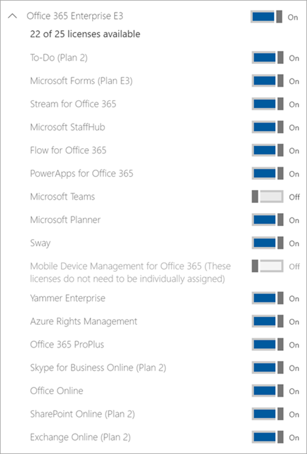

Administrar la licencia de Microsoft Teams ExploratoryManage the Microsoft Teams Exploratory license
=======================================================

La experiencia de Microsoft Teams Exploratory permite a los usuarios de su organización que tienen Azure Active Directory (AAD) y a los que no tienen licencia para Teams activar una experiencia de Teams ExploratoryThe Microsoft Teams Exploratory experience lets users in your organization who have Azure Active Directory (AAD) and are not licensed for Teams initiate an exploratory experience of Teams. Los administradores pueden activar o desactivar esta característica para los usuarios de su organización.Admins can switch this feature on or off for users in their organization. La anterior [oferta de prueba comercial en la nube de Microsoft](iw-trial-teams.md) se ha reemplazado por la experiencia de Teams Exploratory.The earlier [Microsoft Commercial Cloud Trial](iw-trial-teams.md) is now replaced by The Teams Exploratory experience.

## ¿Qué es la experiencia de Teams Exploratory?What's in the Teams Exploratory experience?

Los planes de servicio que verá un administrador como parte de la experiencia de Teams Exploratory son:The service plans that an admin will see as part of the Teams Exploratory experience are:
 - Exchange Online (plan 1)Exchange Online (Plan 1)
 - Flow para Microsoft 365 u Office 365Flow for Microsoft 365 or Office 365
 - Información de MyAnalyticsInsights by MyAnalytics
 - Microsoft Forms (plan E1)Microsoft Forms (Plan E1)
 - Microsoft PlannerMicrosoft Planner
 - Búsqueda de MicrosoftMicrosoft Search
 - Microsoft StaffHubMicrosoft StaffHub
 - Microsoft Stream para Microsoft 365 y Office 365 E1 SKUMicrosoft Stream for Microsoft 365 and Office 365 E1 SKUs
 - Microsoft TeamsMicrosoft Teams
 - Administración de dispositivos móviles para Microsoft 365 u Office 365Mobile Device Management for Microsoft 365 or Office 365
 - Aplicaciones móviles de Office para Office 365Office Mobile Apps for Office 365 
 - Office OnlineOffice Online
 - PowerApps para Microsoft 365 u Office 365PowerApps for Microsoft 365 or Office 365
 - SharePoint Online (plan 1)SharePoint Online (Plan 1)
 - SwaySway
 - To-Do (plan 1)To-Do (Plan 1)
 - Whiteboard (plan 1)Whiteboard (Plan 1)
 - Yammer EnterpriseYammer Enterprise

## ¿Quiénes reúnen los requisitos?Who's eligible?

Mientras el usuario tenga una dirección de correo electrónico de dominio administrado de AAD y no se le haya asignado ninguna licencia de Teams, podrá participar en esta experiencia.As long as the user has a managed AAD domain email address and currently does not have/haven't been assigned a Teams license, they are eligible for this experience. Por ejemplo, si un usuario tiene Aplicaciones de Microsoft 365 para negocios (que no incluye Teams), puede optar por la experiencia de Teams Exploratory.For example, if a user has Microsoft 365 Apps for business (which doesn't include Teams), they're eligible for the Teams Exploratory experience.

Los usuarios deben estar habilitados para registrarse en aplicaciones y versiones de prueba (en el Centro de administración de Microsoft 365).Users must be enabled to sign up for apps and trials (in the Microsoft 365 admin center). Para más información, vea [Administrar la experiencia Teams Exploratory](#manage-the-teams-exploratory-experience), más adelante en este artículo.For more information, see [Manage the Teams Exploratory experience](#manage-the-teams-exploratory-experience), later in this article. 

## ¿Quiénes no reúnen los requisitos?Who isn't eligible

Su organización no es apta para esta oferta si usted es cliente de Syndication Partner o cliente de GCC, GCC High, DoD o EDU.Your organization isn't eligible for this offer if you're a Syndication Partner Customer or a GCC, GCC High, DoD, or EDU customer.

## ¿Cómo los usuarios se pueden inscribir en la experiencia de Teams Exploratory?How users sign up for the Teams Exploratory experience

Los usuarios que son aptos pueden registrarse para la oferta de la experiencia de Teams Exploratory iniciando sesión en Teams ([teams.microsoft.com](https://teams.microsoft.com)).Eligible users can sign up for the Teams Exploratory experience by signing in to Teams ([teams.microsoft.com](https://teams.microsoft.com)). Se les asignará esta licencia automáticamente y el administrador del inquilino recibirá una notificación por correo electrónico la primera vez que un usuario de su organización active la experiencia de Teams Exploratory.They will be assigned this license automatically and the tenant admin will receive an email notification the first time someone in your org starts the Teams Exploratory experience.

## Administrar la experiencia de Teams ExploratoryManage the Teams Exploratory experience

La experiencia de Teams Exploratory está pensada para ser activada por usuarios finales individuales, y usted no puede activar esta oferta en nombre de los empleados que sean usuarios finales.The Teams Exploratory experience is meant to be initiated by individual end users, and you may not initiate this offer on behalf of end-user employees.

La experiencia de Teams Exploratory viene con una licencia de Exchange Online pero no será asignada al usuario hasta que el administrador la asigne.The Teams Exploratory experience comes with an Exchange Online license but it won't be assigned to the user until the admin assigns it. Si el usuario no tiene una licencia de Exchange y el administrador aún no ha asignado la licencia de Exchange Online, el usuario no podrá programar reuniones en Teams y es posible que no disponga de otras características.If the user doesn't have an Exchange license already and the admin has yet to assign the Exchange Online license, the user won't be able to schedule meetings in Teams and may be missing other Teams functionality.

Los administradores pueden desactivar la opción de que los usuarios finales ejecuten la experiencia de Teams Exploratory dentro de su organización mediante el uso del conmutador de **aplicaciones y servicios de prueba**.Admins can disable the ability for end users to run the Teams Exploratory experience within their organization by using the **Trial apps and services** switch.

### Evitar que los usuarios instalen aplicaciones y servicios de pruebaPrevent users from installing trial apps and services

Puede desactivar la capacidad de un usuario para instalar aplicaciones y servicios de prueba, lo que impediría al usuario ejecutar la experiencia de Teams Exploratory.You can turn off a user's ability to install trial apps and services, would prevent the user from running the Teams Exploratory experience. 

1. Desde el Centro de administración de Microsoft 365, vaya a **Configuración** > **Configuración**, seleccione **Servicios** y **Aplicaciones y servicios en propiedad del usuario**.From the Microsoft 365 admin center, go to **Settings** > **Settings**, select **Services**, and then select **User owned apps and services**.

    

2. Desactive la casilla **Permitir que los usuarios instalen aplicaciones y servicios de prueba**.Clear the **Let users install trial apps and services** check box.

    

    > [!NOTE]
    > Si su organización no es apta para la experiencia de Teams Exploratory, no verá la opción **Dejar que los usuarios instalen aplicaciones y servicios de prueba**. If your organization is ineligible for the Teams Exploratory experience, you won't see the **Let users install trial apps and services** option.

### Administrar la disponibilidad de un usuario con una licencia que incluye TeamsManage availability for a user with a license that includes Teams

Un usuario al que se le asigne una licencia que incluya Teams no es apto para la experiencia de Teams Exploratory.A user who is assigned a license that includes Teams isn't eligible for the Teams Exploratory experience. Cuando el plan de servicio de Teams está activado, el usuario puede iniciar sesión y utilizarlo.When the Teams service plan is turned on, the user can sign in and use Teams. Si el plan de servicio está desactivado, el usuario no puede iniciar sesión y la experiencia de Teams Exploratory no estará disponible.If the service plan is disabled, the user can't sign in and the Teams Exploratory experience isn't available. Debe tener privilegios de administrador.You must have admin privileges. 

Para desactivar el acceso a Teams:To turn off access to Teams:

1. En el Centro de administración de Microsoft 365, seleccione **Usuarios** > **Usuarios activos**.In the Microsoft 365 admin center, select **Users** > **Active users**.

2. Seleccione la casilla junto al nombre del usuario.Select the box next to the name of the user.

3. En la parte derecha, en la fila **Licencias de producto**, elija **Editar**.On the right, in the **Product licenses** row, choose **Edit**.

4. En el panel **Licencias de producto**, cambie el botón de alternancia a **Desactivado**.In the **Product licenses** pane, switch the toggle to **Off**.

    

### Administrar la disponibilidad de Teams para los usuarios que ya estén utilizando la experiencia Teams Exploratory.Manage Teams availability for users who are already using the Teams Exploratory experience

Si un usuario está usando la experiencia Teams Exploratory, puede desactivarla eliminando la licencia o el plan de servicio.If a user is running the Teams Exploratory experience, you can turn it off by removing the license or service plan. Debe tener privilegios de administrador.You must have admin privileges. 

Desactivar la licencia de la experiencia Teams Exploratory:To turn off the the Teams Exploratory experience license:

1. En el Centro de administración de Microsoft 365, seleccione **Usuarios** > **Usuarios activos**.In the Microsoft 365 admin center, select **Users** > **Active users**.

2. Seleccione la casilla junto al nombre del usuario.Select the box next to the name of the user.

3. En la parte derecha, en la fila **Licencias de producto**, elija **Editar**.On the right, in the **Product licenses** row, choose **Edit**.

4. En el panel de **licencias de producto**, cambie el botón de alternancia para la licencia exploratoria a\*\* Desactivado\*\*.In the **Product licenses** pane, switch the toggle for this exploratory license to **Off**.
   
    >[!Note]
    >El botón de alternancia de Teams Exploratory aparecerá después de que el primer usuario de la organización inicie la experiencia de Teams Exploratory.The Teams Exploratory toggle switch will appear after the first user in the organization launches the Teams Exploratory experience.

### Administrar Teams para los usuarios que dispongan de la licencia de Teams ExploratoryManage Teams for users who have the Teams Exploratory license

Puede administrar a los usuarios que dispongan de la licencia de Teams Exploratory al igual que a los usuarios que dispongan de una licencia pagada estándar.You can manage users who have the Teams Exploratory license just like you manage users who have a regular paid license. Para más información, vea [Administrar la configuración de Teams para su organización](enable-features-office-365.md).For more information, see [Manage Teams settings for your organization](enable-features-office-365.md).

### Actualizar los usuarios de la licencia de Teams ExploratoryUpgrade users from the Teams Exploratory license

Para actualizar a los usuarios de la licencia de Teams Exploratory (debe tener privilegios de administrador), haga lo siguiente:To upgrade users from the Teams Exploratory license (you must have admin privileges), do the following:

1. Adquiera una suscripción que incluya Teams.Purchase a subscription that includes Teams.

2. Elimine la suscripción del usuario a Teams Exploratory.Remove the Teams Exploratory subscription from the user.

3. Asignar la licencia que acaba de adquirir.Assign the newly purchased license.

Para más información, consulte [Descripción del servicio de Microsoft Teams](https://docs.microsoft.com/office365/servicedescriptions/teams-service-description).For more information, see [Microsoft Teams service description](https://docs.microsoft.com/office365/servicedescriptions/teams-service-description).

> [!NOTE]
> Si la licencia de Teams Exploratory expira y el usuario no la actualiza de forma inmediata a un suscripción que incluya Teams, los datos del usuario no se eliminarán.If the Teams Exploratory license ends and a user isn't immediately upgraded to a subscription that includes Teams, the user data is not removed. El usuario seguirá existiendo en Azure Active Directory y todos los datos dentro de Teams se conservarán.The user still exists in Azure Active Directory and all data within Teams still remains. Cuando una nueva licencia se asigne al usuario para volver a habilitar las funciones de Teams, todo el contenido seguirá existiendo.Once a new license is assigned to the user to enable Teams functionality again, all content will still exist. 

## ¿Qué sucede con las licencias heredadas de evaluación en la Commercial Cloud de Microsoft Teams?What happens to legacy Microsoft Teams Commercial Cloud Trial licenses?

A partir de febrero de 2020, los usuarios aptos podrán utilizar la versión más reciente de la experiencia de Microsoft Teams Exploratory.As of February, 2020, eligible users can begin using the latest Microsoft Teams Exploratory experience. Todas las licencias heredadas de la versión de evaluación de Commercial Cloud de Teams se convertirán automáticamente a un nuevo producto antes de que expire la versión de evaluación.All legacy Teams Commercial Cloud Trial licenses will be automatically converted to the new offer before their trial expires.

Cuando un usuario inicia sesión en su versión de prueba de la nube comercial expirada por primera vez, asignamos automáticamente una licencia de la experiencia de administración de Teams a ese usuario.When a user signs in to their expired Teams Commercial Cloud Trial for the first time, we automatically assign a Teams Exploratory experience license to that user. Los usuarios no se convierten hasta que inician sesión.Users aren't converted until they sign in.

### Eliminar la licencia de Teams ExploratoryRemove a Teams Exploratory license

- Si usted desea eliminar la licencia usando PowerShell, vea: [Eliminar las licencias de las cuentas de usuario con Office 365 PowerShell](https://docs.microsoft.com/office365/enterprise/powershell/remove-licenses-from-user-accounts-with-office-365-powershell)If you would like to remove this license by using PowerShell, see: [Remove licenses from user accounts with Office 365 PowerShell](https://docs.microsoft.com/office365/enterprise/powershell/remove-licenses-from-user-accounts-with-office-365-powershell)

- Si quiere eliminar esta licencia a través del Portal de administración, consulte: [Quitar a un usuario de su organización](https://docs.microsoft.com/microsoft-365/admin/add-users/delete-a-user)If you would like to remove this license through the admin portal, see: [Delete a user from your organization](https://docs.microsoft.com/microsoft-365/admin/add-users/delete-a-user)

## ¿Cuánto tiempo dura la experiencia de Teams Exploratory?How long does the Teams Exploratory experience last?

La experiencia de Microsoft Teams Exploratory está disponible sin costo adicional hasta la próxima fecha de **aniversario** o **renovación del contrato** empresarial, en enero de 2021 o después.The Microsoft Teams Exploratory experience is available at no additional cost until your next **agreement anniversary** or **renewal** on or after January 2021. En ese momento, los usuarios finales de una licencia de la experiencia de Microsoft Exploratory tendrán que cambiarse a una licencia de pago que incluya Teams.At that time, end users on a Microsoft Exploratory experience license will need to move to a paid license that includes Teams. Aquellas licencias de experiencia de Microsoft Exploratory que se inicien después de esa fecha permanecerán disponibles sin costo adicional hasta su próximo **aniversario** o ciclo de **renovación**.Any Microsoft Exploratory experience licenses initiated after that will remain available at no additional cost until your next **anniversary** or **renewal** cycle. 

### ¿Qué ocurre si un usuario final inicia la experiencia de Microsoft Teams Exploratory justo antes del aniversario o fecha de renovación?What happens if an end user initiates the Microsoft Teams Exploratory experience just before my anniversary or renewal date?

Las licencias de la experiencia de Microsoft Teams Exploratory iniciadas en un plazo de 90 días antes de la fecha de **aniversario** o **renovación del contrato** de su empresa no deberán cambiarse a una licencia de pago hasta el siguiente aniversario o ciclo de renovación.Microsoft Teams Exploratory experience licenses initiated within 90 days of your **agreement anniversary** or **renewal** will not be required to move to a paid license until the subsequent anniversary or renewal cycle. 

### ¿Qué ocurre si mi acuerdo no tiene una fecha de aniversario o una renovación anual (por ejemplo, acuerdos mensuales)?What if my agreement doesn’t have an anniversary or yearly renewal date (for example, month-to-month agreements)?

En el caso de contratos sin una fecha de aniversario o una renovación anual, el año siguiente después de que el primer usuario final active las licencias de Microsoft Teams Exploratory se considerará como el aniversario o la fecha de renovación.For agreements without an anniversary or yearly renewal date, the subsequent year after the first end user activates the Microsoft Teams Exploratory experience licenses will be treated as the anniversary or renewal date. Los usuarios de Microsoft Teams Exploratory deben pasar a una licencia de pago en esa fecha cada año, según las directivas anteriormente indicadas.Users on the Microsoft Teams Exploratory license must be converted to a paid license by that date each year, according to the policies outlined above.

Por ejemplo, si el primer usuario final activa Microsoft Teams Exploratory el 19 de junio de 2020, este usuario y todos los demás elegibles en el espacio empresarial del cliente deben pasar a una licencia de pago con Teams el 19 de junio de 2021.For example, if the first end user activates Microsoft Teams Exploratory on June 19, 2020, then they and all other eligible users in the customer tenant must convert to a paid license with Teams by June 19, 2021. 

