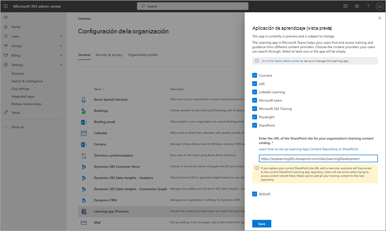
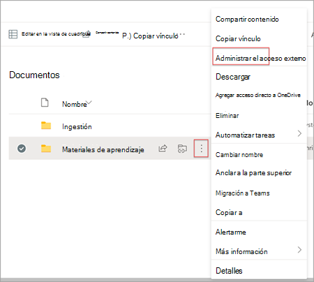
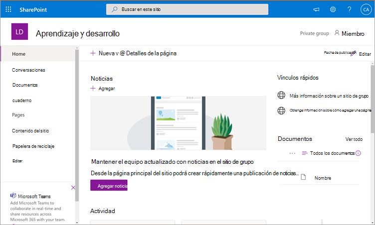
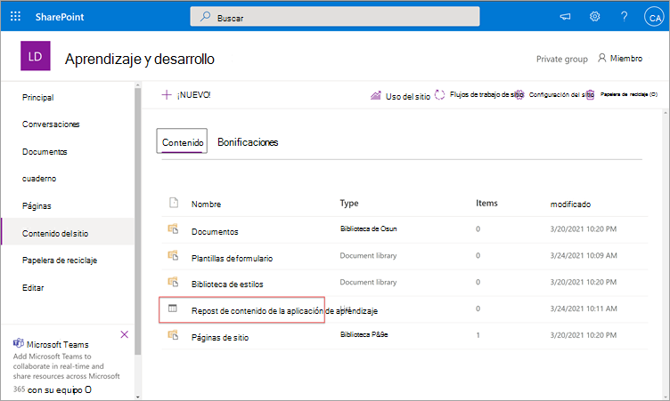
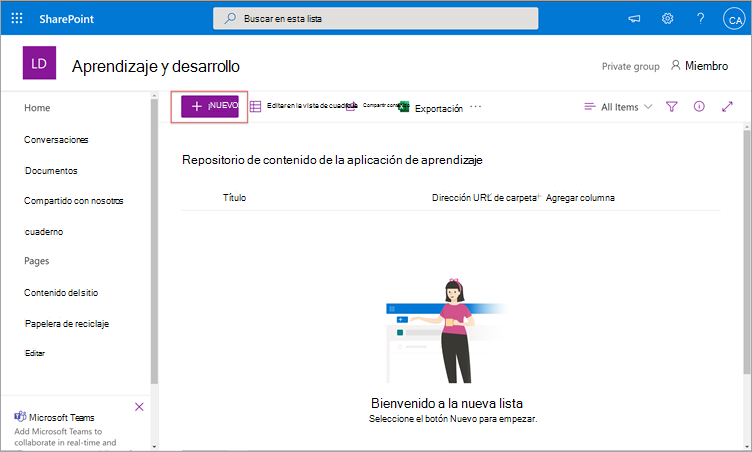
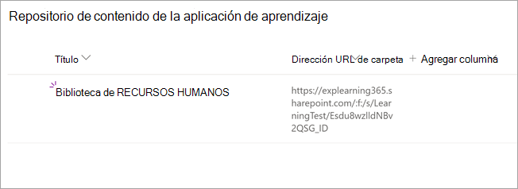
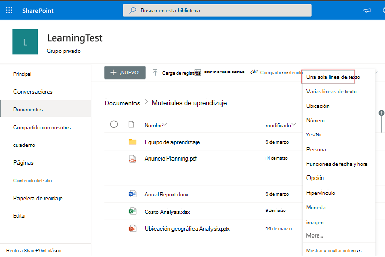
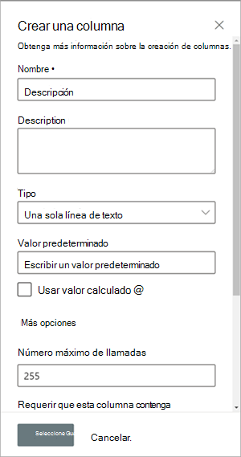
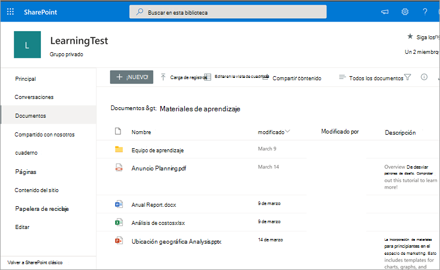

# Instalar, administrar y asignar permisos para Microsoft Viva Learning (versión preliminar privada)

*Este artículo contiene contenido preliminar para Microsoft Viva Learning, que está en versión preliminar privada.*

Microsoft Viva Learning (versión preliminar privada) permite a los equipos e individuos de su organización hacer que el aprendizaje sea una parte natural de su día. La aplicación crea un concentrador central en Teams donde los empleados pueden compartir, asignar y aprender de bibliotecas de contenido de toda la organización.

Los administradores establecen permisos y permiten orígenes de contenido de aprendizaje para Viva Learning (versión preliminar privada). El contenido de aprendizaje puede incluir LinkedIn Learning, Microsoft Learn, aprendizaje de Microsoft 365, contenido propio de su organización almacenado en SharePoint Online y proveedores de terceros compatibles con Viva Learning (versión preliminar privada).

## Roles de administrador

Para configurar Viva Learning (versión preliminar privada), necesitará permisos como:

- Administrador de Microsoft Teams
- Administrador global de Microsoft 365 o administrador de SharePoint
- Administrador de conocimientos: este es un nuevo rol en el Centro de administración de Microsoft 365 que se puede asignar a cualquier persona de la organización. Este rol administra los orígenes de contenido de aprendizaje de la organización a través del Centro de administración de Microsoft 365. 

> [!TIP]
> El administrador de conocimientos debe ser moderadamente técnico y tener credenciales de administrador de SharePoint existentes, preferiblemente alguien que tenga una buena experiencia en el sector educativo, de aprendizaje, de aprendizaje o de experiencia de empleados de la organización.
 
## Administrar Viva Learning (versión preliminar privada) en el Centro de administración de Teams

El administrador de Teams instala Viva Learning (versión preliminar privada) desde la tienda de aplicaciones y, a continuación, aplica directivas de configuración, administración y permisos a través del Centro de administración de Teams.

### Administrar la configuración de Viva Learning (versión preliminar privada)

Debe ser administrador en el Centro de administración de Teams para realizar estas tareas.

Para administrar la configuración de Viva Learning, siga estos pasos:

1. En el panel de navegación izquierdo del Centro de administración de Teams, vaya a **Aplicaciones de Teams Administrar**  >  **aplicaciones.**

   

2. En la **página Administrar aplicaciones,** en el cuadro de búsqueda, escriba *Aprendizaje* para buscar la aplicación Teams Learning (vista previa privada).

   

3. En la **página Aprendizaje:**
   1. En **Estado,** seleccione **Permitido** para activar la aplicación.
   2. En la **pestaña Configuración,** en la sección **Configuración de** la aplicación, vaya al Centro de administración de Microsoft 365 para configurar orígenes de contenido de aprendizaje.

   

4. Después **de** administrar la configuración de la aplicación, vaya a Permisos y directivas de configuración para conceder permisos a los **empleados** que deben tener acceso a la aplicación como parte de la participación de su organización en la vista previa privada.

> [!NOTE]
>  Si su organización está en Anillo 4.0 como parte del programa TAP100 de Teams, es posible que deba hacer lo siguiente para permitir que los usuarios aprobados en Anillo 3.0 accedan a Viva Learning (versión preliminar privada).

Como parte de la vista previa privada, Viva Learning (versión preliminar privada) se publica en Anillo 3.0. Si su organización está en Anillo 4.0, no verá la aplicación en la tienda de aplicaciones. Para probar la aplicación, debe crear una directiva de permisos de aplicaciones personalizadas, establecerla en Permitir todas las aplicaciones y asignarla a usuarios aprobados en Ring 3.0.

   

## Configurar orígenes de contenido de aprendizaje en el Centro de administración de Microsoft 365

Los administradores del Centro de administración de Microsoft 365, ya sea por su cuenta o asignando el rol de administrador de conocimientos a individuos seleccionados de su organización, pueden administrar la configuración relacionada con Viva Learning (versión preliminar privada) y pueden configurar los orígenes de contenido de aprendizaje.

El administrador selecciona qué orígenes de contenido de aprendizaje adicionales (por ejemplo, SharePoint o orígenes de proveedores de contenido de terceros compatibles) estarán disponibles para los usuarios de Viva Learning (versión preliminar privada). A continuación, el administrador configura esos orígenes para asegurarse de que el contenido está disponible para la búsqueda y detección y puede ser explorado por los empleados que usan Viva Learning (versión preliminar privada).

> [!NOTE]
>  Los usuarios inician sesión en aprendizajes que no son de Microsoft y LinkedIn Learning Pro en un explorador o visor incrustado. Este aprendizaje configurado está sujeto a los términos de licencia, privacidad y servicio independientes entre su organización y los terceros, y no a los términos de Viva Learning (versión preliminar privada). Antes de seleccionar este tipo de aprendizaje, compruebe que tiene un acuerdo para su organización y los usuarios.

### Asignar el rol de administrador de conocimientos [Opcional]

Debe ser administrador global de Microsoft 365 para realizar estas tareas.

Para asignar un administrador de conocimientos para Viva Learning, siga estos pasos:

1.  En el panel de navegación izquierdo del Centro de administración de Microsoft 365, vaya a **Roles**.

2.  En la **página Roles,** en la pestaña **Azure AD,** seleccione **Administrador de conocimientos.**
 
3.  En la **página Administrador de** conocimientos, en la sección Administradores **asignados,** seleccione Agregar **y,** a continuación, agregue la persona que elija para el rol.

### Configurar la configuración de los orígenes de contenido de aprendizaje para Viva Learning (versión preliminar privada)

Debe ser administrador global de Microsoft 365 o administrador de conocimientos para realizar estas tareas.

Para configurar la configuración de orígenes de contenido de aprendizaje en Viva Learning, siga estos pasos:

1.  En el panel de navegación izquierdo del Centro de administración de Microsoft 365, vaya a **Configuración**  >  **de la organización.**

2.  En la **página Configuración de la** organización, en la pestaña **Servicios,** seleccione **Aplicación de aprendizaje (vista previa).**

     

3.  En el panel De aprendizaje de la aplicación **(vista** previa), seleccione los orígenes de contenido de aprendizaje que desea configurar para la organización y, a continuación, **seleccione Guardar.**

     

Entre todos los orígenes de aprendizaje que existen, algunos estarán habilitados de forma predeterminada. Estas afectan a los siguientes aspectos, entre otros:

- LinkedIn Learning (contenido gratuito)
- Microsoft Learn
- Aprendizaje de Microsoft 365

> [!NOTE]
> Si su organización tiene una suscripción a LinkedIn Learning Standard o Pro, el repositorio de contenido se desbloqueará para los empleados de su organización. Solo aquellos empleados que tengan permiso podrán usar todo el repositorio de contenido.  Es posible que otros orígenes deba habilitarse o configurarse manualmente. Los orígenes de aprendizaje que no son de Microsoft tienen licencia por separado entre su organización y el tercero. Tendrá que comprobar que se ha registrado para su aprendizaje para usted y sus usuarios.

Para habilitar o deshabilitar un origen de contenido de aprendizaje, active la casilla situada junto al origen. Si un origen está habilitado, se mostrará una marca de verificación.

## Configurar SharePoint como un origen de contenido de aprendizaje

Puede configurar SharePoint como un origen de contenido de aprendizaje para que el propio contenido de su organización esté disponible en Viva Learning (versión preliminar privada).

### Información general

El administrador de conocimientos (o administrador global) proporciona una dirección URL del sitio a la que el servicio de aprendizaje puede crear una ubicación centralizada vacía(el repositorio de contenido de la aplicación de aprendizaje) en forma de lista estructurada de SharePoint. Su organización puede usar esta lista para hospedar vínculos a carpetas de SharePoint entre empresas que contienen contenido de aprendizaje. Los administradores son responsables de recopilar y curar una lista de direcciones URL de carpetas. Estas carpetas solo deben incluir contenido que pueda estar disponible en Viva Learning (versión preliminar privada).

Viva Learning (versión preliminar privada) admite los siguientes tipos de documentos:

- Word, PowerPoint, Excel, PDF
- Audio (.m4a)
- Vídeo (.mov, .mp4, .avi)

Para obtener más información, vea la [documentación de SharePoint Online.](https://docs.microsoft.com/sharepoint/introductionlink) 

### Permisos

Las direcciones URL de carpetas de biblioteca de documentos se pueden recopilar desde cualquier sitio de SharePoint de la organización. Viva Learning (versión preliminar privada) sigue todos los permisos de contenido existentes. Por lo tanto, solo el contenido para el que un usuario tiene permiso de acceso es visible y se puede buscar en Viva Learning (versión preliminar privada). Se podrá buscar cualquier contenido dentro de estas carpetas, pero solo se podrá usar el contenido al que el empleado individual tenga permisos.

La eliminación de contenido del repositorio de su organización no es compatible actualmente.

Para quitar contenido de superficie involuntarla, siga estos pasos:

1.  Para restringir el acceso en la biblioteca de documentos, seleccione la **opción Mostrar acciones** y, a continuación, seleccione Administrar **acceso.**
     
     

2.  Elimine el documento original dentro de la biblioteca de documentos.

Para obtener más información, vea [Uso compartido y permisos en la experiencia moderna de SharePoint.](https://docs.microsoft.com/sharepoint/modern-experience-sharing-permissions) 

### Servicio de aprendizaje

El servicio de aprendizaje usa las direcciones URL de carpeta proporcionadas para obtener metadatos de todo el contenido almacenado en esas carpetas. En un plazo de 24 horas después de proporcionar la dirección URL de carpeta en el repositorio centralizado, los empleados pueden buscar y usar el contenido de su organización en Viva Learning (versión preliminar privada). Todos los cambios en el contenido, incluidos los metadatos y permisos actualizados, también se aplicarán en el servicio de aprendizaje en un plazo de 24 horas.

### Configurar SharePoint como origen

Debe ser administrador global de Microsoft 365, administrador de SharePoint o administrador de conocimientos para realizar estas tareas.

Para configurar SharePoint como orígenes de contenido de aprendizaje para Viva Learning (versión preliminar privada), siga estos pasos:

1.  En el panel de navegación izquierdo del Centro de administración de Microsoft 365, vaya a **Configuración**  >  **de la organización.**
 
2.  En la **página Configuración de la** organización, en la pestaña **Servicios,** seleccione **Aplicación de aprendizaje (vista previa).**

     

3.  En el panel De aprendizaje de la aplicación **(versión preliminar),** en **SharePoint,** proporcione la dirección URL del sitio al sitio de SharePoint donde quiera que Viva Learning cree un repositorio centralizado.

     

4.  Una lista de SharePoint se crea automáticamente en el sitio de SharePoint proporcionado.

     

     En el panel de navegación izquierdo del sitio de SharePoint, seleccione Contenido **del** sitio Repositorio de contenido de  >  **la aplicación de aprendizaje.** 

      

5. En la página Repositorio de contenido de la aplicación **de aprendizaje,** rellene la lista de SharePoint con direcciones URL en las carpetas de contenido de aprendizaje.

   1. Seleccione **Nuevo** para ver el **panel Nuevo** elemento. 

       
 
   2. En el **panel Nuevo elemento,** en el **campo Título,** agregue un nombre de directorio de su elección. En el **campo Dirección URL de** carpeta, agregue la dirección URL a la carpeta de contenido de aprendizaje. Seleccione **Guardar**.

       

   3. La página Repositorio de **contenido de la aplicación de** aprendizaje se actualiza con el nuevo contenido de aprendizaje.

       

> [!NOTE]
> Para permitir un acceso más amplio al repositorio de contenido de la aplicación de aprendizaje, pronto estará disponible un vínculo a la lista en la interfaz de Viva Learning (versión preliminar privada), donde los usuarios pueden solicitar acceso y, en última instancia, ayudar a rellenar la lista. Los propietarios del sitio y los administradores globales deberán conceder acceso a la lista. Access es específico de la lista solo y no se aplica al sitio donde se almacena la lista.

### Curación de la biblioteca de documentos url de carpeta

Los metadatos predeterminados (como la fecha de modificación, creados por, el nombre del documento, el tipo de contenido y el nombre de la organización) se extraen automáticamente en Viva Learning (versión preliminar privada) mediante la API de Microsoft Graph.
 
Para mejorar la relevancia de búsqueda y detección general del contenido, se recomienda agregar una **columna** Descripción.

Para agregar una columna **Descripción** a la página de la biblioteca de documentos, siga estos pasos:

1.  En la **página Documentos,** seleccione **Agregar columna.**

2. Seleccione la **opción Mostrar acciones** y, a continuación, seleccione Una sola línea de **texto.**

     

3. En el **panel Crear una columna,** en el **campo Nombre,** agregue un nombre descriptivo para la columna. Seleccione **Guardar**.

     
 
4. En la **página Documentos,** en la **columna** Descripción, agregue descripciones personalizadas para cada elemento. Si no se proporciona ninguna descripción, Viva Learning (versión preliminar privada) proporcionará un mensaje predeterminado que resalta el contenido como de su propia biblioteca de SharePoint. 

     
 
