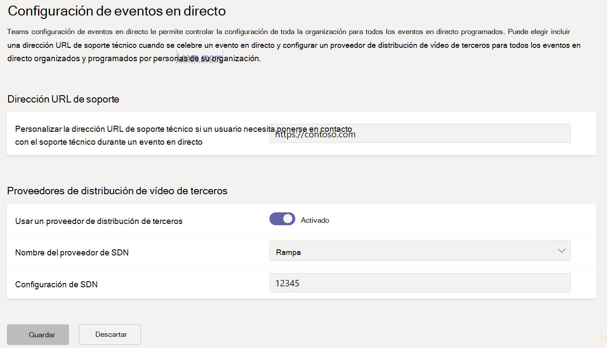
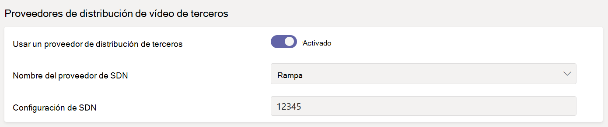

# <a name="configure-live-event-settings-in-microsoft-teams"></a>Configurar eventos en directo en Microsoft Teams

Use la configuración de eventos en directo de Teams para establecer la configuración de los eventos en directo de su organización. Puede configurar una dirección URL de soporte técnico y configurar un proveedor de distribución de vídeo de terceros. Esta configuración se aplica a todos los eventos en directo creados en la organización.

Puede administrar fácilmente estas opciones de configuración en el centro de administración de Microsoft Teams. En el panel de navegación izquierdo, vaya a **Reuniones** > **Configuración eventos en directo**.



## <a name="set-up-event-support-url"></a>Configurar la URL de soporte de eventos

Esta dirección URL se muestra a los asistentes del evento en directo. Agregue la dirección URL de soporte de la organización para ofrecer a los asistentes una manera de ponerse en contacto con el soporte técnico durante un evento en directo.

### <a name="using-the-microsoft-teams-admin-center"></a>Usar el Centro de administración de Microsoft Teams

1. En la navegación izquierda, vaya a **Reuniones** > **Configuración de eventos en directo**.
2. En **dirección URL de soporte**, escriba la dirección URL de soporte técnico de su organización.

    

### <a name="using-windows-powershell"></a>Usar Windows PowerShell

Ejecute lo siguiente:

```PowerShell
Set-CsTeamsMeetingBroadcastConfiguration -SupportURL “{your URL}”
```
Para obtener más información, vea [Set-CsTeamsMeetingBroadcastConfiguration](/powershell/module/skype/set-csteamsmeetingbroadcastconfiguration?view=skype-ps&preserve-view=true).
## <a name="configure-a-third-party-video-distribution-provider"></a>Configurar un proveedor de distribución de vídeo de terceros 

Si compró y configuró una solución de red definida por software (SDN) o una solución de red de entrega de contenido para empresas (eCDN) a través de un partner de entrega de vídeo de Microsoft, configure el proveedor para eventos en directo en Teams. 

### <a name="using-the-microsoft-teams-admin-center"></a>Usar el Centro de administración de Microsoft Teams

1. En la navegación izquierda, vaya a **Reuniones** > **Configuración de eventos en directo**.
2. En **Proveedores de distribución de vídeo de terceros**, siga este procedimiento: 

    

    - **Proveedor de distribución de terceros** Active esta opción para habilitar el proveedor de distribución de vídeo de terceros.
    - **Nombre del proveedor de SDN** elija el proveedor que está usando.
    - **Configuración de SDN** Escriba detalles de configuración de SDN.
        
### <a name="using-windows-powershell"></a>Usar Windows PowerShell
Obtenga el ID. de licencia, el token de API y la plantilla de API del proveedor y, después, ejecute uno de los siguientes procedimientos, en función del proveedor que use:

**Microsoft eCDN**
```PowerShell
Set-CsTeamsMeetingBroadcastConfiguration -AllowSdnProviderForBroadcastMeeting $True -SdnProviderName microsoft
```
**Hive** 
```PowerShell
Set-CsTeamsMeetingBroadcastConfiguration -AllowSdnProviderForBroadcastMeeting $True -SdnProviderName hive -SdnLicenseId {license ID GUID provided by Hive} -SdnApiTemplateUrl “{API template URL provided by Hive}”
```
**Kollective** 
```PowerShell
Set-CsTeamsMeetingBroadcastConfiguration -AllowSdnProviderForBroadcastMeeting $True -SdnProviderName kollective -SdnApiTemplateUrl "{API template URL provided by Kollective}" -SdnApiToken {API token GUID provided by Kollective}
```
**Riverbed** 
```PowerShell
Set-CsTeamsMeetingBroadcastConfiguration -AllowSdnProviderForBroadcastMeeting $True -SdnProviderName riverbed -SdnApiTemplateUrl "{API template URL provided by Riverbed}" -SdnApiToken {API token GUID provided by Riverbed}
```
**Ramp** 
```PowerShell
Set-CsTeamsMeetingBroadcastConfiguration -AllowSdnProviderForBroadcastMeeting $True -SdnProviderName ramp -SdnRuntimeConfiguration "{Configuration provided by RAMP}"
```

Para obtener más información, vea [Set-CsTeamsMeetingBroadcastConfiguration](/powershell/module/skype/set-csteamsmeetingbroadcastconfiguration?view=skype-ps&preserve-view=true).

> [!NOTE]
> Si tiene previsto crear eventos en directo con una aplicación o dispositivo externo, también tendrá que [configurar el proveedor de eCDN con Microsoft Stream](/stream/network-caching). 

>[!Note]
> The change from using Microsoft Stream to [OneDrive for Business and SharePoint for meeting recordings](../tmr-meeting-recording-change.md) will be a phased approach. At launch you'll be able to opt-in to this experience, in November you'll have to opt-out if you want to continue using Stream, and some time in early 2021 we'll require all customers to use OneDrive for Business and SharePoint for new meeting recordings.

>[!Note]
> La solución de eCDN elegida está sujeta a los términos de servicio y a la directiva de privacidad del proveedor de terceros seleccionados, que regirán el uso de la solución del proveedor de eCDN. El uso de la solución del proveedor de eCDN no estará sujeto a los términos de licencias por volumen de Microsoft ni a los Términos de servicios en línea. Si no acepta los términos del proveedor de terceros, no habilite la solución eCDN en Microsoft Teams.

### <a name="related-topics"></a>Temas relacionados
- [¿Qué son los eventos en directo en Teams?](what-are-teams-live-events.md)
- [Planear eventos en directo en Teams](plan-for-teams-live-events.md)
- [Configuración de eventos en directo en Teams](set-up-for-teams-live-events.md)
