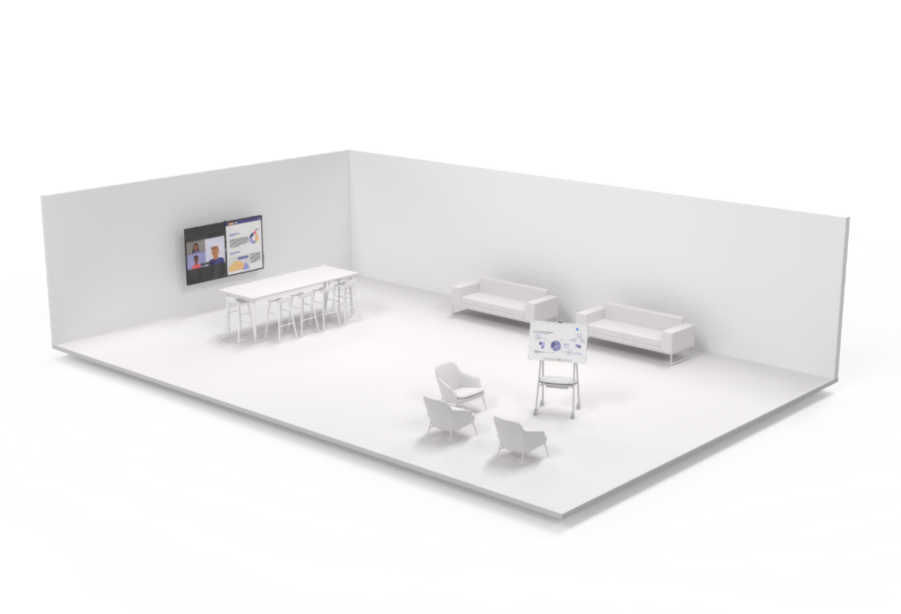

# Guía de la sala de reuniones para Teams

Este artículo está destinado a guiar a los usuarios sobre cómo optimizar los espacios de reunión con Salas de Microsoft Teams y dispositivos. Incluye información sobre Salas de Teams dispositivos y soluciones, diseños y especificaciones.

La [sección](#example-spaces) Espacios de ejemplo de este artículo incluye especificaciones y diseños de salón representados y es una forma excelente de visualizar y planear un dispositivo Teams o una implementación Salas de Teams solución.

## Usos y diseños de salas de reuniones

Salas de Microsoft Teams soluciones ofrecen flexibilidad de propósito e incluso flexibilidad de movimiento en un espacio que las salas de reuniones tradicionales no. Por ejemplo, con Salas de Teams dispositivos, los usuarios pueden mejorar su colaboración con una pizarra digital y las cámaras inteligentes de seguimiento de personas se asegura de que todos los participantes locales puedan verse independientemente de dónde se encuentran en la sala. Cualquier tipo de espacio y cualquier tipo de reunión se pueden optimizar con Salas de Teams dispositivos o Salas de Teams soluciones.

### Reuniones centradas en la presentación 

Reunirse y presentar reuniones es el primer cubo y, por lo general, esta reunión es más formal. El audio visual es una prioridad y hay un foco en presentar contenido. El dispositivo suele estar corregido, lo que permite a los usuarios permanecer sentados mientras interactúan con el dispositivo desde una consola del centro de la tabla.

Los espacios reunir y presentar priorizan la presentación y la discusión, lo que significa que el diseño y la tecnología deben optimizarse para el uso compartido de contenido y la co-creación remota. Todos deben estar implicados en la discusión y deben poder ver e interactuar con el contenido compartido.

**Presentar y reunir diseños** **de espacio:** Las tablas deben estar fijas y estar en las pantallas frontales de la sala. En salas más pequeñas, las tablas pueden estar conectadas a la pared, pero en espacios más grandes, deben estar separadas para adaptarse a las consideraciones de la cámara.

### Reuniones centradas en la co-creación

Las reuniones de reunión y co-creación suelen ser menos formales con una prioridad en la co-creación, la entrada en la entrada de entrada y la pizarra. El acceso a archivos personales también es un foco para este cubo. El dispositivo puede ser móvil, lo que anima a los usuarios a ponerse de pie, reunirse e interactuar con el dispositivo.

El espacio adecuado une a los usuarios y la tecnología sin problemas y elimina la fricción incluso para los usuarios más principiantes. Teams dispositivos están diseñados para que sean lo suficientemente fáciles de usar para que los alumnos jóvenes o los nuevos usuarios puedan navegar adeptos, y para que los formadores o administradores puedan controlar y personalizar desde el primer uso.

**Reúna y co-cree diseños de espacio:** Las tablas y los equipos de co-creación pueden tener posiciones flexibles y deben dar cabida a grupos de personas que trabajan en las tablas o en el equipo.

### Reuniones centradas en la presentación y la co-creación

Recuerde que ambos tipos de salas pueden administrar ambos tipos de experiencias cuando sea necesario. Las salas también se pueden diseñar para dar cabida a ambos fácilmente con tecnología para cada uso. Lo importante es recordar que, independientemente del espacio que esté equipando, desde una oficina privada hasta un salón de conferencias, debe estar Teams habilitado.

**Presentaciones combinadas y diseños de espacio de co-creación:** Se puede combinar una combinación de casos de uso de otros escenarios de reunión para formar salas de varios propósitos en las que las reuniones centradas en la presentación, así como el trabajo de co-creación, se pueden lograr con la misma eficiencia, a menudo de forma simultánea.

## Optimizar la experiencia de reunión
Una gran experiencia de reunión es el resultado de usar la mejor tecnología posible para un espacio de reunión de formas que facilitan el intercambio de ideas sin ser intrusivo.

### Experiencias Salas de Teams nativas frente a otros dispositivos

Salas de Teams más allá de lo que se puede hacer con Teams en dispositivos personales proporcionando funcionalidades únicas en la sala, como la combinación de un solo toque, cámaras de contenido para compartir pizarras físicas en la reunión de forma inteligente y características de proximidad como transferir sin problemas una reunión Teams desde su dispositivo personal a la sala.

Los sistemas no nativos y autoconsejos que se basan en servicios externos o en una conexión de su propio dispositivo nunca coincidirán realmente con la facilidad de uso o la calidad inmersiva de un salón Teams nativo.

Se entiende que, a lo largo de una implementación, es posible que tenga que haber pasos intermedios (como la implementación rápida de salas de reuniones bring-your-own-device) implementados en su ruta de acceso a una experiencia de Teams completamente nativa en los espacios de reunión.

### Usar Teams para crear la mejor experiencia de reunión posible

Al tener ambos Teams en todos sus dispositivos personales e implementados correctamente Salas de Microsoft Teams en todos sus espacios, podrá facilitar la mejor experiencia de reunión posible para cada uno de los usuarios. A medida que planee lograr la mejor experiencia posible, tendrá que abordar todos sus espacios en términos de implementación tecnológica y orientación y aprendizaje para el usuario final.

Es normal al planear una implementación a gran escala de toda la empresa para que se haga por fases, ya que algunas salas ven tecnología agregada en momentos diferentes, o incluso determinados componentes que se instalan antes que otros (como la implementación de paneles Teams programación en cada sala de un edificio en particular mientras se instalan soluciones Salas de Teams una planta o incluso una sala a la vez).

Prepare a los usuarios para que lo hagan por fases para maximizar Teams experiencia de reunión en cada punto del camino.

#### Buena experiencia: dispositivos personales solos en un espacio de reunión

Para empezar con este plan, puede dirigirse a todos los espacios de reunión que no están equipados con AV o que no están equipados con colaboración. Aún puede aprovechar las ventajas de Teams en las salas de reuniones, incluso si esas salas de reuniones aún no tienen Teams dispositivos instalados.

*Audio:* Un puente excelente para una sala de Teams completa es planear la tecnología de reuniones proporcionando Teams los usuarios individuales dispositivos de audio certificados para salas y grupos más pequeños, o implementándolos en salas antes de una solución Salas de Teams completa para espacios más grandes destinados a grupos más grandes donde un pequeño dispositivo no lo corta.

*Vídeo:* Cuando se usan estas salas, los usuarios individuales pueden traer sus propios dispositivos para compartir en el contenido de la reunión Teams y capturar sus expresiones con sus cámaras individuales. A continuación, los usuarios pueden designar a alguien para que sea la única fuente de audio del grupo local, conectando ese dispositivo personal al dispositivo de audio certificado, de modo que todos los usuarios (tanto locales como remotos) puedan disfrutar de una experiencia positiva con el audio de la reunión.

*Compromiso:* Habilitar las salas de reuniones para una mejor experiencia de reunión de Teams, incluso cuando requiera el uso de dispositivos personales y periféricos, seguirá permitiendo a los usuarios expandirse en lo que pueden hacer con Teams. Cuando los usuarios se encuentran en oficinas privadas y en estaciones de trabajo individuales, Teams las discusiones en persona, además de interactuar con participantes remotos.

#### Mejor experiencia: Salas de Teams soluciones y sin dispositivos personales

Si instala soluciones Salas de Teams o si ya tiene salas que ya se han implementado con dispositivos Salas de Teams adecuados para sus respectivos espacios, entonces ya está en camino de tener excelentes experiencias de reunión.

*Audio:* El audio de estos espacios de reunión se controlará mediante la solución Salas de Teams y sus dispositivos de audio certificados por Microsoft.

*Vídeo:* El vídeo en estos espacios será manipulado por la solución Salas de Teams y sus cámaras certificadas por Microsoft.

*Compromiso:* Los usuarios finales podrán aprovechar la experiencia completa de Salas de Teams para sus reuniones, asegurándose de que todos los usuarios puedan unirse a reuniones fácilmente y tengan un excelente audio y vídeo.

#### Mejor experiencia: Salas de Teams soluciones usadas conjuntamente con dispositivos personales

La formación de los usuarios para usar la tecnología en coordinación conduce al resultado más eficiente y simplificado. El mejor escenario posible es una combinación de tecnología instalada y dispositivos personales.

*Audio:* La mayor parte de la conectividad de la sala de reuniones y el trabajo de audio y vídeo se controlarán con la solución de Salas de Teams, mientras que los usuarios individuales pueden unirse a la misma reunión con cámaras y audio desactivado para una experiencia completamente inmersiva.

*Vídeo:* Los usuarios remotos podrán ver a todos los usuarios que participan en la reunión más allá de hablar y compartir contenido. Un usuario remoto puede activar el vídeo personal para obtener una vista desde cualquier lugar de la sala con la capacidad de centrarse en cualquier participante.

*Compromiso:* El chat puede seguir siendo dinámico con todos los participantes, locales y remotos, implicados y comprometidos. El uso compartido de vídeo Salas de Teams a través de cámaras individuales permite que los participantes remotos se sientan comprometidos con todos.

Usar Teams en todos los dispositivos garantiza que los usuarios de salas locales y los usuarios remotos se sientan igualmente implicados en las reuniones.

## Consideraciones tecnológicas

Las opciones de tecnología de audio y vídeo adecuadas ayudarán a los usuarios a sacar el máximo partido de sus Microsoft Teams reuniones.

### Audio

Las consideraciones de audio son fundamentales para garantizar que tanto los participantes remotos como los participantes en la sala puedan ser escuchados y comprendidos claramente. La cobertura del micrófono y del altavoz debe incluir todos los puestos de la sala sin dejar espacios.

*Los dispositivos de audio adecuados para cada espacio*

Se requiere una única fuente de audio para un espacio para asegurarse de que no hay ningún problema de audio en una sala de reuniones.

Emparejar el micrófono y los altavoces adecuados para cada espacio dará los mejores resultados posibles para que se escuche claramente sin distracciones.

-   En los espacios compartidos, las opciones se expanden, pero se mantienen los mismos principios: los participantes de la reunión deben ser escuchados y escuchar a otros con claridad.

    -   Los dispositivos de audio todo en uno son opciones  fáciles de implementar y de alta calidad para espacios más pequeños con un número limitado de participantes sentados relativamente cerca del dispositivo de audio.

    -   En **espacios más grandes,** los micrófonos y los altavoces se separan para garantizar la máxima cobertura en todos los participantes del espacio. Muchas soluciones para salas de tamaño mediano o grande están disponibles como parte de un kit que no requiere ninguna configuración, solo la instalación física de micrófonos y altavoces.

    -   En los espacios más grandes y complejos, hay disponibles soluciones que permiten usar una variedad de tipos de micrófono y altavoces juntos, como capturar la voz de un profesor y el público de una sala grande al mismo tiempo que se lleva la llamada a todos los usuarios. Estas soluciones se logran mejor cuando se implementan con un partner de Microsoft que tiene experiencia en el diseño y la implementación de soluciones más involucradas desde el punto de vista técnico.

### Vídeo

El vídeo es igual de importante que el audio. Capturar comunicaciones físicas y no verbales, como expresiones faciales o gestos, es tan importante como el contenido de clase o reunión para garantizar la máxima participación y comprensión. Las salas deben estar equipadas con el tamaño de pantalla adecuado para que todos puedan disfrutar de la reunión correctamente, ya sea en la sala o en el control remoto. Por este motivo, los salas también necesitan tener la cobertura de cámara y el campo de visión (FOV) adecuados para capturar de forma eficaz a todos los participantes de la reunión en la sala para los que se unen de forma remota.

*Las cámaras correctas para cada espacio*

Tan importante como un buen audio, el vídeo de alta calidad es una necesidad para la colaboración Teams moderna. La tecnología para cámaras ha avanzado significativamente con cámaras de alta calidad ahora disponibles para todos los espacios.

-   Las cámaras incluidas en dispositivos como portátiles y tabletas deben usarse en todas las reuniones para garantizar que todos los usuarios sean vistos y escuchados. Para los usuarios que buscan aportar una experiencia de vídeo más completa **a** un espacio **personal,** las cámaras externas representan un paso adelante desde dispositivos incrustados y se pueden usar en un mayor número de escenarios y configuraciones, lo que garantiza que los participantes de llamadas compartan la mejor vista de calidad de sí mismos. Estos dispositivos se instalan fácilmente con una conexión USB sencilla que se encuentra en todos los equipos.

-   En espacios compartidos, las opciones y características se expanden. **Las salas más** pequeñas pueden estar cubiertas por cámaras incluidas en dispositivos de audio todo en uno, como barras de sonido. Estas cámaras suelen incluir un amplio campo de visión, lo que garantiza que capturen a todos los participantes en el espacio en una sola toma. Muchas de estas cámaras también incluyen elementos como el encuadre inteligente de la imagen, de modo que la cámara solo muestra a las personas en la reunión y no sillas vacías, o personas contando, para realizar un seguimiento y comprender el uso del espacio.

-   En **salas más grandes,** las cámaras cuentan con la tecnología necesaria para capturar participantes en una variedad de ubicaciones a distintas distancias. Estas cámaras pueden capturar grupos o centrarse en individuos específicos a la vez que mantienen una gran claridad visual. Los dispositivos que pueden realizar un seguimiento y que solo cuentan con altavoces activos se usan periódicamente en espacios más grandes para que muchos participantes se presenten individualmente durante una reunión a medida que contribuyen a sus ideas.

## Espacios de ejemplo

En esta sección se exploran algunos ejemplos de cómo abordar los distintos espacios que se encuentran en la mayoría de las organizaciones. Hay muchas maneras de lograr una gran experiencia de reunión y estos espacios de ejemplo pueden actuar como guías excelentes al crear para su propia organización.

## Espacios de reunión más pequeños

### Oficina privada con espacio de reunión

| Uso | Diseño | Audio | Vídeo |
|------------------|----------------------------------------------------|------------------------------------------------------------|------------------------------------------------------------------|
| Reunirse y presentar | Capacidad típica: 3-4 personas                       | Audio recomendado: Dispositivo único frente a la sala o mesa | Cámara recomendada: Distancia corta con un campo de visión ultra ancho |
|                  | Dimensiones típicas: 10 pies x 10 pies                  |                                                            | Tamaño mínimo de visualización: 46 pulgadas                                       |
|                  | Se recomienda una o dos pantallas principales: Simple |                                                            |                                                                  |

Las oficinas privadas a menudo se diseñan con espacios de reunión independientes del área de trabajo para que se puedan celebrar pequeñas reuniones con una combinación de participantes locales y remotos.

 

*La solución que se muestra es:*

Un área de la sala de concentración o un acurrucado dentro de un espacio de trabajo privado más grande.

*¿Por qué este diseño y el tipo de dispositivo?*

El diseño del espacio está diseñado para facilitar las reuniones con participantes locales y remotos.

La tabla de reunión está físicamente separada del espacio de trabajo privado y la tecnología de la sala de reuniones para facilitar ambas reuniones con participantes locales y remotos.

La sala tiene un tamaño de pantalla único para que todos los participantes puedan ver claramente todo el contenido presentado y los participantes de vídeo remotos. También incluye una solución room basada en barra de sonido con una cámara inteligente integrada. Esta solución es fácil de instalar y operar y ofrece una excelente cobertura de audio y vídeo para reuniones en este tipo de espacio.

*Imagen aquí:*

-   Pantalla única

-   Solución basada en barra de sonido todo en uno Salas de Teams sonido

### Abrir espacios

| Uso | Diseño | Audio | Vídeo |
|--------------------|------------------------------------------|-----------------------------------------|--------------------------------------------|
| Reunirse y co-crear | Capacidad típica: 3-13 personas            | Audio recomendado: Depende del espacio | Cámara recomendada: Depende del espacio   |
|                    | Dimensiones típicas: Depende del espacio |                                         | Tamaño mínimo de visualización: depende del espacio |
|                    |                                          |                                         |                                            |

Los espacios abiertos, como salones y áreas comunes, a menudo cuentan con tecnología de colaboración para reuniones no tradicionales.

 

*La solución que se muestra es:*

Dos áreas con Surface Hub móviles posicionados para opciones interactivas de colaboración y creación en un espacio grande y abierto.

*¿Por qué este diseño y el tipo de dispositivo?*

La tabla de contra alto se coloca con un dispositivo Surface Hub grande para usar una pantalla de creación de contenido, así como una solución Salas de Teams para reuniones pequeñas. Otro Surface Hub está configurado en un carro para moverlo a áreas de estar informales para la creación de contenido. El mobiliario está diseñado para ser de uso mixto tanto para conversaciones informales de oficina como para trabajar en colaboración improvisada, lo que ofrece opciones para todos los tipos de espacio.

*Imagen aquí:*

-   Grandes paredes Surface Hub

-   Cart-mounted mobile Surface Hub

### Focus/huddle room

| Uso | Diseño | Audio | Vídeo |
|------------------|----------------------------------------------------|------------------------------------------------------------|------------------------------------------------------------------|
| Reunirse y presentar | Capacidad típica: 3-5 personas                       | Audio recomendado: Dispositivo único frente a la sala o mesa | Cámara recomendada: Distancia corta con un campo de visión ultra ancho |
|                  | Dimensiones típicas: 10 pies x 10 pies                  |                                                            | Tamaño mínimo de visualización: 46 pulgadas                                       |
|                  | Se recomienda una o dos pantallas principales: Simple |                                                            |                                                                  |

Estos espacios son ideales para la colaboración y discusión en grupos pequeños.

 

*La solución que se muestra es:*

Una sala de concentración o de reunión con la solución Salas de Microsoft Teams para la colaboración en grupos pequeños.

*¿Por qué este diseño y el tipo de dispositivo?*

La tabla se adjunta a la pared, lo que maximiza la flexibilidad del espacio para varios diseños. Se asegura de que Salas de Teams solución sea el foco del espacio. Una pantalla montada del tamaño de la sala garantiza que todos los asistentes puedan ver participantes de reuniones remotos o un documento de colaboración. Una cámara de la sala captura la sala para participantes remotos. Dado que la sala es un espacio de reunión dedicado, un dispositivo de audio en la parte superior de la mesa se asegura de que se escuche a todas las partes.

*Imagen aquí:*

-   Una Salas de Teams para salas pequeñas, fácilmente instalada

-   Pantalla frontal única para que los participantes remotos y el contenido se compartan

### Pequeñas salas de reuniones tradicionales

| Uso | Diseño | Audio | Vídeo |
|------------------|----------------------------------------------------|------------------------------------------------------------|------------------------------------------------------------------|
| Reunirse y presentar | Capacidad típica: 5-7 personas                       | Audio recomendado: Dispositivo único frente a la sala o mesa | Cámara recomendada: Distancia corta con un campo de visión ultra ancho |
|                  | Dimensiones típicas: 10 pies x 15 pies                  |                                                            | Tamaño mínimo de visualización: 50 pulgadas                                       |
|                  | Se recomienda una o dos pantallas principales: Simple |                                                            |                                                                  |

Estos espacios son ideales para la colaboración y discusión en grupos pequeños.

 

*La solución que se muestra es:*

Una pequeña sala de reuniones tradicional con la Salas de Microsoft Teams solución.

*¿Por qué este diseño y el tipo de dispositivo?*

Un diseño de salón de reunión más tradicional se puede diseñar tanto para reuniones puramente en persona como para reuniones con participantes remotos y contenido. La tabla está separada de la pared de visualización y Salas de Teams solución. Una pantalla montada del tamaño de la sala garantiza que todos los asistentes puedan ver participantes de reuniones remotos o un documento de colaboración. Una cámara de la sala captura la sala para participantes remotos. Dado que la sala es un espacio de reunión dedicado, un dispositivo de audio en la parte superior de la mesa se asegura de que se escuche a todas las partes.

*Imagen aquí:*

-   Una Salas de Teams para salas pequeñas, fácilmente instalada

-   Pantalla frontal única para que los participantes remotos y el contenido se compartan

## Espacios de reunión más grandes

### Salas de reuniones tradicionales medianas

| Uso | Diseño | Audio | Vídeo |
|------------------------------|------------------------------------------------------------|-------------------------------------------------------------------------------------------------------------------------------|-----------------------------------------------------------------------------------------------------------------------------|
| Reunirse y presentar + co-crear | Capacidad típica: 10-12 personas                             | Audio recomendado: Audio instalado con micrófonos de mesa o de techo discretos y altavoces montados en la pared o en el techo | Cámara recomendada: Cámara de media distancia con función Zoom de inclinación panorámica o funciones inteligentes de seguimiento de personas |
|                              | Dimensiones típicas: 15 pies x 20 pies                          |                                                                                                                               | Tamaño mínimo de visualización: 55 pulgadas para doble, más grande para una sola                                                                      |
|                              | Se recomienda una o dos pantallas principales: simple o doble |                                                                                                                               |                                                                                                                             |

Esta sala mediana es ideal para conferencias y colaboración de grupo, especialmente en espacios existentes que ya cuentan con un diseño clásico de sala de reuniones.

 

*La solución que se muestra es:*

Una sala de reuniones de tamaño mediano con pantallas frontales dobles para varios diseños de personas y contenido con anotación y colaboración para el Surface Hub 2.

*¿Por qué este diseño y el tipo de dispositivo?*

Un diseño de salón de reunión más tradicional se puede diseñar tanto para reuniones puramente en persona como para reuniones con participantes remotos y contenido. La tabla está separada de la pared de visualización y Salas de Teams solución. Varias pantallas garantizan que los participantes remotos tengan un espacio destacado en la sala física y que los documentos de colaboración sean visibles. Los altavoces montados dan a los asistentes remotos una voz "en la sala". Una cámara montada garantiza la captura de todos los participantes físicos de la reunión.

*Imagen aquí:*

-   Salas de Microsoft Teams solución con pantallas frontales dobles para una alta visibilidad de los participantes remotos y el contenido compartido

-   Una opción Surface Hub 2 para anotación y pizarra

-   Una solución de audio y cámara más grande y separada instalada para la máxima cobertura de los participantes en el espacio más grande. Los micrófonos de tabla y los altavoces montados en la pared garantizan que todos los usuarios se escuchan en Teams llamadas

### Grandes salas de reuniones tradicionales

| Uso | Diseño | Audio | Vídeo |
|------------------------------|------------------------------------------------------------|-------------------------------------------------------------------------------------------------------------------------------|-----------------------------------------------------------------------------------------------------------------------------|
| Reunirse y presentar + co-crear | Capacidad típica: 12-20 personas                             | Audio recomendado: Audio instalado con micrófonos de mesa o de techo discretos y altavoces montados en la pared o en el techo | Cámara recomendada: Cámara de media distancia con función Zoom de inclinación panorámica o funciones inteligentes de seguimiento de personas |
|                              | Dimensiones típicas: 15 pies x 30 pies                          |                                                                                                                               | Tamaño mínimo de visualización: 65 pulgadas para doble, más grande para una sola                                                                      |
|                              | Se recomienda una o dos pantallas principales: simple o doble |                                                                                                                               |                                                                                                                             |

Una sala de gran tamaño es ideal para conferencias y colaboración grupal, especialmente en espacios existentes que ya cuentan con un diseño clásico de sala de reuniones.

 

*La solución que se muestra es:*

Una sala de reuniones de gran tamaño con pantallas frontales dobles para varios diseños de personas y contenido con anotación y colaboración para el Surface Hub 2.

*¿Por qué este diseño y el tipo de dispositivo?*

Un diseño de salón de reunión más tradicional se puede diseñar tanto para reuniones puramente en persona como para reuniones con participantes remotos y contenido. La tabla está separada de la pared de visualización y Salas de Teams solución. Varias pantallas garantizan que los participantes remotos tengan un espacio destacado en la sala física y que los documentos de colaboración sean visibles. Los altavoces montados dan a los asistentes remotos una voz "en la sala". Una cámara montada garantiza la captura de todos los participantes físicos de la reunión.

*Imagen aquí:*

-   Salas de Microsoft Teams solución con pantallas frontales dobles para una alta visibilidad de los participantes remotos y el contenido compartido

-   Opción Surface Hub 2 para anotación y pizarra

-   Una solución de audio y cámara más grande y separada instalada para obtener la máxima cobertura de los participantes en el espacio más grande. Los micrófonos de tabla y los altavoces montados en la pared garantizan que todos los usuarios se escuchan en Teams llamadas

### Salas de reuniones tradicionales o salas de reuniones tradicionales extra grandes

| Uso | Diseño | Audio | Vídeo |
|------------------------------|------------------------------------------------------------|--------------------------------------------------------------------------------------------------------------|----------------------------------------------------------------------------------------------------------------------|
| Reunirse y presentar + co-crear | Capacidad típica: 25-40 personas                             | Audio recomendado: Micrófonos y altavoces de techo o de tabla instalados con un procesador de señales digitales (DSP) | Cámara recomendada: Cámara de larga distancia con función Zoom de inclinación panorámica o funciones inteligentes de seguimiento de personas |
|                              | Dimensiones típicas: 28 pies x 33 pies                          |                                                                                                              | Tamaño mínimo de visualización: 75 pulgadas para doble, más grande para una sola                                                               |
|                              | Se recomienda una o dos pantallas principales: simple o doble |                                                                                                              |                                                                                                                      |

Este tipo de espacio normalmente incluye un diseño de tamaño extra grande que incluye una tabla de sala de reuniones, así como una zona de estar para el público con dos pantallas frontales de la sala.

 

*La solución que se muestra es:*

Una sala de reuniones de tamaño extra grande con pantallas frontales dobles para varios diseños de personas y contenido con anotación y colaboración para el Surface Hub 2.

*¿Por qué este diseño y el tipo de dispositivo?*

Este espacio cuenta con una tabla principal de sala de reuniones para muchos participantes de la reunión, así como un área de estar de audiencia para una capacidad adicional para los asistentes a la reunión local. Una doble pantalla grande proporciona a los participantes remotos una presencia física dentro de la sala. El audio instalado en el techo significa cobertura de audio para todos los participantes de todas las partes de la sala, incluso aquellos sentados lejos de la tabla principal de la reunión. Una pantalla de pizarra blanca colaborativa está dedicada al contenido para que tanto los participantes en la sala como los remotos forme parte de cualquier ideación creativa.

*Imagen aquí:*

-   Salas de Microsoft Teams con pantallas dobles separadas

-   Opción Surface Hub 2 para anotación y pizarra

-   Componentes de audio visual instalados con dispositivos de audio montados en el techo y una solución de cámara instalada para obtener la máxima cobertura de los participantes en todo el espacio

### Salas de reuniones panorámicas

| Uso | Diseño | Audio | Vídeo |
|------------------------------|--------------------------------------------------------------------------------------------------------|-----------------------------------------------------------------------------------------------------------|--------------------------------------------------------------------------------------------------------|
| Reunirse y presentar + co-crear | Capacidad típica: 6-12 personas                                                                          | Audio recomendado: Micrófonos y altavoces de techo o de tabla instalados que admiten audio direccional | Cámara recomendada: Cámara de larga distancia con campo de visión ultra ancho y seguimiento inteligente de personas |
|                              | Dimensiones típicas: Depende del espacio                                                               |                                                                                                           | Tamaño mínimo de visualización: depende del espacio                                                             |
|                              | Se recomienda una o dos pantallas principales: pantallas tradicionales duales o proyectores combinados de doble borde |                                                                                                           |                                                                                                        |

Este espacio está dedicado a la experiencia de reunión Teams inmersiva.
 

*La solución que se muestra es:*

Una sala de reuniones, orientada con la tabla frente a un panorama de pantallas mezcladas, asegurándose de que todos los usuarios obtengan la mejor vista posible de los participantes y el contenido de la reunión.

*¿Por qué este diseño y el tipo de dispositivo?*

Un diseño de tabla panorámica está diseñado para la máxima visibilidad y la interacción con los participantes remotos y el contenido. Las pantallas grandes y mezcladas permiten una sensación inmersiva, con todas las sillas frente a las pantallas y capaces de seguirla. El audio espacial significa que parece que los participantes remotos están en la sala con participantes locales en función de su posición en la pantalla frontal de la sala.

*Imagen aquí:*

-   Salas de Microsoft Teams solución con dos pantallas proyectadas mezcladas con bordes, lo que crea una experiencia inmersiva frente a la sala diseñada específicamente para Teams reuniones

-   Surface Hub 2 para anotación y pizarra

-   Componentes de audio visual instalados con dispositivos de audio de techo y frontales de la sala para la máxima cobertura de los participantes en todo el espacio con consideración para el audio espacial

-   Una cámara frontal de la sala inteligente y de ángulo ultranacional para capturar a todos los participantes en el espacio

## Espacios de reunión no tradicionales

### Espacios multiusos

| Uso | Diseño | Audio | Vídeo |
|------------------------------|----------------------------------------------------|-----------------------------------------------------------------------------------------------------------|--------------------------------------------------------------------------------------------------------|
| Reunirse y presentar + co-crear | Capacidad típica: Personalizada                           | Audio recomendado: Micrófonos y altavoces de techo o de tabla instalados que admiten audio direccional | Cámara recomendada: Cámara de larga distancia con campo de visión ultra ancho y seguimiento inteligente de personas |
|                              | Dimensiones típicas: Personalizadas                         |                                                                                                           | Tamaño mínimo de visualización: Personalizado                                                                           |
|                              | Se recomienda una o dos pantallas principales: Personalizada |                                                                                                           |                                                                                                        |

Teams puede implementarse en casi cualquier espacio educativo o multiuso que pueda pensar. Las bibliotecas, los espacios de presentación y colaboración de uso mixto, los espacios de café y los espacios al aire libre pueden estar equipados con una solución Teams o Teams dispositivos.

 

*Un ejemplo de espacio multiuso es:*

Una Salas de Teams con una gran pantalla frontal de la sala basada en proyector, varias consolas táctiles para su funcionamiento y varios dispositivos Surface Hub 2 para una amplia gama de usos.

*Los dispositivos incluyen:*

-   Salas de Microsoft Teams que incluye varias consolas táctiles, con un solo proyector y una pantalla grande frente a la sala para una alta visibilidad de los participantes remotos y el contenido compartido

-   Opción Surface Hub 2 para anotación y pizarra

-   Componentes de audio visual instalados con dispositivos de audio montados en el techo y una solución de cámara instalada para la máxima cobertura de los participantes en todo el espacio

### Aulas

| Uso | Diseño | Audio | Vídeo |
|------------------------------|----------------------------------------------------|-------------------------------------------------------------------------------------------------------------------------------|-----------------------------------------------------------------------------------------------------------------------------|
| Reunirse y presentar + co-crear | Capacidad típica: Personalizada                           | Audio recomendado: Audio instalado con micrófonos de mesa o de techo discretos y altavoces montados en la pared o en el techo | Cámara recomendada: Cámara de media distancia con función Zoom de inclinación panorámica o funciones inteligentes de seguimiento de personas |
|                              | Dimensiones típicas: Personalizadas                         |                                                                                                                               | Tamaño mínimo de visualización: Personalizado                                                                                                |
|                              | Se recomienda una o dos pantallas principales: Personalizada |                                                                                                                               |                                                                                                                             |

Las aulas, incluidas las aulas tradicionales y las aulas inversas, requieren la participación activa de todos los presentes. La instrucción, la discusión y la colaboración efectivas entre muchas partes son fundamentales.

 

*La solución que se muestra es:*

Un aula diseñada tanto para participantes en persona como para estudiantes remotos con un diseño que se adapta a un único educador que se dirigirá a ambos grupos simultáneamente.

*¿Por qué este diseño y el tipo de dispositivo?*

Una gran pantalla proporciona a los participantes remotos una presencia física dentro de la sala, junto con los altavoces frontales de la sala que permiten que todos puedan oír sus voces, incluso por los que están en los escritorios más alejados de la fuente. Los micrófonos están situados en la parte frontal de la sala y en todo el espacio, por lo que los profesores y los alumnos pueden moverse por la sala y seguir siendo escuchados. Una pantalla de presentación está dedicada al contenido tanto para participantes en la sala como para los participantes remotos.

*Imagen aquí:*

-   Salas de Microsoft Teams con pantallas dobles separadas, un único carro o una pantalla basada en stand que muestra a los participantes remotos para que el educador lo vea claramente y una pantalla de presentación independiente para el contenido educativo compartido para que los alumnos locales y remotos observen

-   Kit con altavoces y cámara en la parte frontal de la sala, así como micrófonos en la parte frontal y distribuidos por todo el aula

### Salones de conferencias y auditorios

| Uso | Diseño | Audio | Vídeo |
|------------------------------|----------------------------------------------------|-------------------------------------------------------------------------------------------------------------------------------|--------------------------------------------------------------------------------------------------------------------------|
| Reunirse y presentar + co-crear | Capacidad típica: Personalizada                           | Audio recomendado: Audio instalado con micrófonos de mesa o de techo discretos y altavoces montados en la pared o en el techo | Cámara recomendada: Cámara de distancia media-larga con función Zoom de inclinación panorámica o capacidades inteligentes de seguimiento de personas |
|                              | Dimensiones típicas: Personalizadas                         |                                                                                                                               | Tamaño mínimo de visualización: Personalizado                                                                                             |
|                              | Se recomienda una o dos pantallas principales: Personalizada |                                                                                                                               |                                                                                                                          |

Al igual que en las aulas, los salones de conferencias contienen numerosos alumnos que deben centrarse en un educador y en cualquier información que presenten. Sin embargo, los salones de conferencias generalmente no requieren la misma cantidad de interacción entre los alumnos. El foco está en la información, no en la colaboración.

 

*La solución que se muestra es:*

Un salón de conferencias diseñado tanto para participantes en persona como para estudiantes remotos con un diseño que permite a un único educador dirigirse a ambos grupos simultáneamente, así como crear y anotar contenido desde una superficie táctil.

*¿Por qué este diseño y el tipo de dispositivo?*

Los participantes remotos pueden ver el mismo campo de vista que los participantes en persona a través de la cámara montada. El profesor puede ver a los alumnos remotos a través de sus cámaras en una pantalla. Una pantalla de presentación dedicada y una pantalla táctil para pizarras muestran el material educativo del profesor para todos. Un micrófono con mosaicos de techo y un altavoz potente se asegura de que el profesor y las preguntas de los alumnos se escuchan claramente.

*Imagen aquí:*

-   Salas de Microsoft Teams una solución con pantallas dobles separadas, una única pantalla basada en carros o de pie que muestra a los participantes remotos para que el educador lo vea claramente y una pantalla de presentación independiente para el contenido educativo compartido en la llamada para que los alumnos locales y remotos observen

-   Opción Surface Hub 2 para anotación y pizarra

-   Componentes de audio visual instalados con dispositivos de audio montados en el techo y una solución de cámara instalada para la máxima cobertura de los participantes en todo el espacio
