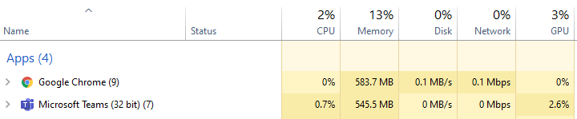

# Cómo usa Microsoft Teams la memoria

Algunos usuarios de Microsoft Teams tienen preguntas sobre cómo usa la memoria los equipos. En este artículo se describe cómo se usa la memoria por parte de Teams y por qué la aplicación de escritorio de Teams (aplicación) y la aplicación Web de Teams no evitan que otras aplicaciones y cargas de trabajo del mismo equipo tengan suficiente memoria para funcionar de manera óptima. Teams está diseñado para usar la tecnología moderna de Internet. Para lograr esto, el cliente de escritorio de Teams se desarrolló en electrones, que usa cromo para la representación. Este es el mismo motor de representación tras muchos de los exploradores más populares de hoy, incluidos Edge y Chrome.

## Cómo funciona Teams

Los equipos diseñados en electrones permiten un desarrollo más rápido y también mantienen la paridad entre las versiones de Teams en diferentes sistemas operativos (Windows, Mac y Linux). Esta paridad es posible porque los electrones y el cromo mantienen una base de código similar en todas las versiones. Otra ventaja de esta arquitectura es que hay un perfil de uso de memoria similar entre Team Web App y la versión de escritorio. Tanto la aplicación web como las versiones de escritorio usan la memoria de forma similar a como las usaría un explorador. Puede obtener más información acerca de electrones en [su sitio web](https://electronjs.org/).

Para obtener más información, consulta [uso de memoria de cromo](https://www.chromium.org/developers/memory-usage-backgrounder) y [conceptos clave en la memoria de Chrome](https://chromium.googlesource.com/chromium/src.git/+/master/docs/memory/key_concepts.md) .

La imagen siguiente muestra usos de memoria en paralelo de la aplicación de escritorio de Teams para Windows y Teams Web App (en este ejemplo, ejecutar Google Chrome).

## Uso de memoria en Teams

Es importante comprender el comportamiento *esperado* de los equipos cuando se trata de la memoria del sistema y conocer los síntomas de problemas de memoria del sistema verdaderamente problemáticos.

### Uso de memoria previsto por los equipos

Si está ejecutando la aplicación de escritorio de Teams o la aplicación Web de Teams, el cromo detecta la cantidad de memoria disponible en el sistema y usa la suficiente memoria para optimizar la experiencia de representación. Cuando otras aplicaciones o servicios requieren memoria del sistema, cromo da memoria a esos procesos. Cromo ajusta el uso de memoria de Teams de manera continua para optimizar el rendimiento de los equipos sin afectar a nada que se esté ejecutando en ese momento.

De esta manera, las cargas de trabajo de cromo similares pueden usar cantidades variables de memoria, según la cantidad de memoria del sistema que esté disponible.

En el siguiente gráfico se muestra el uso de memoria por parte de Teams en cuatro sistemas diferentes, cada uno con diferentes cantidades de memoria disponibles. Cada uno de los sistemas está procesando cargas de trabajo similares (las mismas aplicaciones se abren y se ejecutan).

Cuando los equipos tengan más memoria, Teams usará esa memoria. En sistemas en los que la memoria es escasa, Teams usará menos.

### Síntomas de problemas de memoria del sistema

Si ve uno o varios de los síntomas siguientes en el equipo, puede tener un problema de memoria del sistema grave:

- Uso de memoria alta cuando se ejecutan varias aplicaciones grandes de forma simultánea.
- El rendimiento del sistema o las aplicaciones están bloqueados.
- Uso sostenido general de la memoria del sistema de 90% o superior en todas las aplicaciones. Con esta cantidad de memoria, los equipos deberían devolver memoria a otras aplicaciones y cargas de trabajo. El uso sostenido de la memoria de 90% podría significar que los equipos no devuelven memoria al sistema, lo que indica un problema.

Las siguientes imágenes muestran ejemplos de vistas en el administrador de tareas cuando el uso de memoria del sistema es anormalmente alto.

