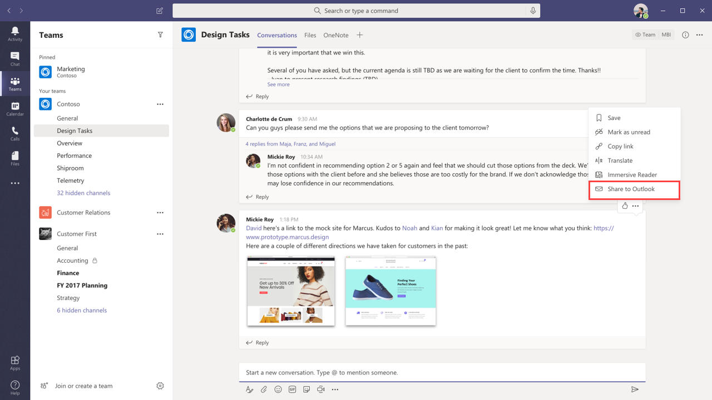

# Teams y Outlook de correo electrónico

Microsoft Teams incluye características que permiten a los usuarios de su organización compartir información entre correo electrónico en Outlook y chatear o canalizar conversaciones en Teams y mantenerse al tanto de las conversaciones perdidas. En este artículo se ofrece información general sobre estas características y los controles de administración que se aplican.

## Compartir en Outlook

**Compartir a Outlook** permite a los usuarios compartir una copia de una conversación Teams a un correo electrónico en Outlook, sin tener que Teams. Esta característica es útil si los usuarios necesitan compartir conversaciones o actualizaciones de estado con usuarios fuera de su equipo inmediato o incluso de su organización. Vaya a la parte superior de la conversación en Teams, seleccione **Outlook**  Para obtener más información, vea [Compartir Outlook desde Teams](https://support.office.com/article/share-to-outlook-from-teams-f9dabbe9-9e9b-4e35-99dd-2eeeb67c4f6d).

Para usar esta característica, Outlook en la web debe estar activada para el usuario. Si Outlook en la web está desactivado, la opción Compartir a **Outlook** no se muestra en Teams para el usuario. Para ver los pasos sobre cómo activar y desactivar Outlook en la Web, vea Habilitar o deshabilitar Outlook en la [web para un buzón.](/exchange/recipients-in-exchange-online/manage-user-mailboxes/enable-or-disable-outlook-web-app)

## Correos electrónicos de actividad que se pueden actuar

Los usuarios obtienen automáticamente correos electrónicos de actividad perdida que les ayudan a ponerse al día de las conversaciones perdidas en Teams. Los correos electrónicos de actividad perdida muestran las respuestas más recientes de una  conversación, incluidos los mensajes que se enviaron después del mensaje perdido, y los usuarios pueden hacer clic en Responder para responder directamente desde Outlook. Para obtener más información, vea Responder a correos electrónicos de actividad perdida [de Outlook](https://support.office.com/article/reply-to-missed-activity-emails-from-outlook-bc0cf587-db26-4946-aac7-8eebd84f1381). 

> [!NOTE]
> Esta característica no es compatible con Outlook para Mac versiones anteriores de Outlook para Windows. Para obtener más información, vea [Mensajes que se pueden](/outlook/actionable-messages/)Outlook y Office 365 grupos .

Puede usar el cmdlet [Set-OrganizationConfig](/powershell/module/exchange/organization/set-organizationconfig) junto con el parámetro **SmtpActionableMessagesEnabled** para desactivar los correos electrónicos que se pueden usar. De forma predeterminada, el **parámetro SmtpActionableMessagesEnabled** se establece en **true**. Al establecer el parámetro en **false,** se desactivan los mensajes de correo electrónico que se pueden usar en Office 365. Para Teams usuarios, esto significa  que la opción Responder para responder directamente en Outlook no está disponible en los correos electrónicos de actividad perdidos. En su lugar, los correos electrónicos de actividad perdidos incluyen una opción **Responder en Teams** para que los usuarios respondan en Teams.

Vea también Mensajes que se pueden usar [en Outlook y Office 365 grupos](https://docs.microsoft.com/outlook/actionable-messages/).
