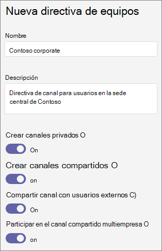

# <a name="manage-teams-policies-in-microsoft-teams"></a>Administrar directivas de Teams en Microsoft Teams

Como administrador, puede usar las directivas de Teams en Microsoft Teams para controlar lo que los usuarios de su organización pueden hacer en Teams y en los canales. Por ejemplo, puede establecer si los usuarios podrán detectar equipos privados en los resultados de búsqueda y en la galería de equipos y si los usuarios pueden crear canales privados.

Para administrar las directivas de Teams, vaya a **Teams** > **Policies** en el centro de administración de Microsoft Teams. Puede usar la directiva global (opción predeterminada para toda la organización) o crear directivas personalizadas y asignarlas a los usuarios. Los usuarios de la organización obtendrán automáticamente la directiva global a menos que cree y asigne una directiva personalizada.

Puede editar la directiva global o crear y asignar una directiva personalizada. Si un usuario tiene asignada una directiva personalizada, esa Directiva se aplica al usuario. Si un usuario no tiene asignada una directiva personalizada, la política global se aplica al usuario. Después de modificar la directiva global o asignar una directiva, los cambios pueden tardar hasta 24 horas en surtir efecto.

## <a name="create-a-custom-teams-policy"></a>Crear una directiva de Teams personalizada

1. En el centro de navegación izquierdo del centro de administración de Microsoft Teams, **vaya a** > **directivas de Teams**Teams.
2. Haga clic en **Agregar**.
3. Escriba un nombre y una descripción para la Directiva.

    
4. Elija la configuración que desee:

- **Descubrir equipos privados**:<a name="discoverteams"> </a> Active esta opción para permitir que los usuarios detecten equipos privados en los resultados de búsqueda y en la galería de equipos.
- **Crear canales privados**: <a name="createchannels"> </a>Active esta opción para permitir a los usuarios crear canales privados.

5. Haga clic en **Guardar **.

## <a name="edit-a-teams-policy"></a>Editar una directiva de Teams

Puede editar la directiva global o cualquier directiva personalizada que cree.

1. En el centro de navegación izquierdo del centro de administración de Microsoft Teams, **vaya a** > **directivas de Teams**Teams.
2. Seleccione la Directiva haciendo clic a la izquierda del nombre de la Directiva y, a continuación, haga clic en **Editar**.
3. Active o desactive la configuración que desee y, a continuación, haga clic en **Guardar**.

## <a name="assign-a-custom-teams-policy-to-users"></a>Asignar una directiva de Teams personalizada a los usuarios

Puede usar el centro de administración de Microsoft Teams para asignar una directiva personalizada a uno o más usuarios o el módulo de PowerShell de Skype empresarial para asignar una directiva personalizada a grupos de usuarios, como un grupo de seguridad o un grupo de distribución.

### <a name="assign-a-custom-teams-policy-to-a-user"></a>Asignar una directiva de Teams personalizada a un usuario

1. En el centro de navegación izquierdo del centro de administración de Microsoft Teams, vaya a **usuarios**y, a continuación, haga clic en el usuario.
2. Haga clic en **directivas**y, junto a **directivas asignadas**, haga clic en **Editar**.
3. En **directivas de Teams**, seleccione la Directiva que desea asignar y, a continuación, haga clic en **Guardar**.

Para asignar una directiva de Teams personalizada a varios usuarios a la vez, vea [editar la configuración de usuario de Teams en masa](edit-user-settings-in-bulk.md).

También puede hacer lo siguiente:

1. En el centro de navegación izquierdo del centro de administración de Microsoft Teams, **vaya a** > **directivas de Teams**Teams.
2. Seleccione la Directiva haciendo clic a la izquierda del nombre de la Directiva.
3. Seleccione **administrar usuarios**.
4. En el panel **administrar usuarios** , busque el usuario por nombre para mostrar o por nombre de usuario, seleccione el nombre y, después, haga clic en **Agregar**. Repita este paso para cada usuario que desee agregar.
5. Cuando haya terminado de agregar usuarios, haga clic en **Guardar**.

### <a name="assign-a-custom-teams-policy-to-users-in-a-group"></a>Asignar una directiva de Teams personalizada a los usuarios de un grupo

Es posible que desee asignar una directiva personalizada de Teams a varios usuarios que ya haya identificado. Por ejemplo, es posible que desee asignar una directiva a todos los usuarios de un grupo de seguridad. Para ello, puede conectarse al módulo de Azure Active Directory PowerShell para Graph y al módulo de PowerShell de Skype empresarial. Para obtener más información sobre cómo usar PowerShell para administrar equipos, consulte [información general de Teams PowerShell](teams-powershell-overview.md).

En este ejemplo, asignamos una directiva de Teams denominada Directiva de marketing Teams a todos los usuarios del grupo mercadotecnia de contoso.  

> [!NOTE]
> Asegúrese de conectarse primero al módulo de Azure Active Directory PowerShell para Graph y al módulo de PowerShell de Skype empresarial siguiendo los pasos de [conectar a todos los servicios de Office 365 en una sola ventana de Windows PowerShell](https://docs.microsoft.com/office365/enterprise/powershell/connect-to-all-office-365-services-in-a-single-windows-powershell-window).

Obtén la GroupObjectId del grupo en particular.
```
$group = Get-AzureADGroup -SearchString "Contoso Marketing"
```
Obtener los miembros del grupo especificado.
```
$members = Get-AzureADGroupMember -ObjectId $group.ObjectId -All $true | Where-Object {$_.ObjectType -eq "User"}
```
Asignar todos los usuarios del grupo a una directiva de equipos en particular. En este ejemplo, se trata de una política de Teams.
```
$members | ForEach-Object { Grant-CsTeamsChannelsPolicy -PolicyName "Marketing Teams Policy" -Identity $_.EmailAddress}
``` 
Según el número de miembros del grupo, este comando puede demorar varios minutos en ejecutarse.

## <a name="related-topics"></a>Temas relacionados

- [Administrar la detección de equipos privados en Teams](manage-discovery-of-private-teams.md)
- [Canales privados en Teams](private-channels.md)
