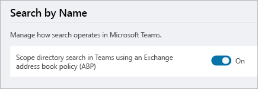

# Usar la búsqueda de directorios enfocada de Microsoft TeamsUse Microsoft Teams scoped directory search

El ámbito de la búsqueda de directorios de Microsoft Teams permite a las organizaciones crear límites virtuales que controlan cómo los usuarios pueden buscar y comunicarse con otros usuarios de su organización.Microsoft Teams scoped directory search allows organizations to create virtual boundaries that control how users can find and communicate with other users in their organization. 

Microsoft Teams permite a las organizaciones proporcionar vistas personalizadas del directorio a sus usuarios.Microsoft Teams lets organizations provide custom views of the directory to their users. Microsoft Teams usa [directivas de barrera de información](https://docs.microsoft.com/microsoft-365/compliance/information-barriers) para admitir estas vistas personalizadas.Microsoft Teams uses [Information Barrier policies](https://docs.microsoft.com/microsoft-365/compliance/information-barriers) to support these custom views. Una vez que se habilitan las directivas, los resultados devueltos por las búsquedas de otros usuarios (por ejemplo, para iniciar una conversación o agregar miembros a un equipo) se regirán según las directivas configuradas.Once the policies are enabled, the results returned by searches for other users (for example, to initiate a chat or to add members to a team) will be scoped according to the configured policies. Los usuarios no podrán buscar ni descubrir equipos cuando la búsqueda de ámbito está activa.Users will not be able to search or discover teams when scoped search is in effect. 

> [!NOTE]
> En entornos híbridos de Exchange, esta característica solo funciona con los buzones de Exchange Online y no con los buzones locales.In Exchange hybrid environments, this feature only works with Exchange Online mailboxes, and not with on-premises mailboxes.

## ¿Cuándo debería usar búsquedas de directorio de ámbito?When should you use scoped directory searches?

Los escenarios que se benefician de las búsquedas de directorio de ámbito son similares a los escenarios de directiva de libreta de direcciones.Scenarios that benefit from scoped directory searches are similar to address book policy scenarios. Por ejemplo, es posible que desee usar la búsqueda de directorios con ámbito en las siguientes situaciones:For example, you may want to use scoped directory search in the following situations:

- La organización tiene varias compañías en su inquilino, pero prefiere mantenerlas por separado.Your organization has multiple companies within its tenant that you want to keep separate. 
- Su centro educativo quiere limitar los chats entre el personal académico y los estudiantes.Your school wants to limit chats between faculty and students. 
 
Para obtener información sobre cómo usar las directivas de la libreta de direcciones, lea [directivas de la barrera de información en Exchange Online](https://docs.microsoft.com/microsoft-365/compliance/information-barriers).To learn how to use address book policies, read [Information Barrier policies in Exchange Online](https://docs.microsoft.com/microsoft-365/compliance/information-barriers).

> [!IMPORTANT]
> Las directivas de la libreta de direcciones proporcionan solo una separación virtual de los usuarios de la perspectiva del directorio.Address book policies provide only a virtual separation of users from directory perspective. Los usuarios pueden seguir iniciando comunicaciones con otras personas proporcionando direcciones de correo electrónico completas.Users can still initiate communications with others by providing complete email addresses. También es importante tener en cuenta que todos los datos de usuario que ya se habían almacenado en la memoria caché antes de la aplicación de directivas de libreta de direcciones nuevas o actualizadas seguirán estando disponibles para los usuarios durante un máximo de 30 días.It is also important to note that any user data that had already been cached, prior to the enforcement of new or updated address book policies, will remain available to users for up to 30 days.

## Activar la búsqueda de directorio en el ámbitoTurn on scoped directory search

1. Use directivas de barrera de información para configurar su organización en subgrupos virtuales.Use Information Barrier policies to configure your organization into virtual subgroups. Para obtener más información, consulte [definir directivas de barrera](https://docs.microsoft.com/microsoft-365/compliance/information-barriers-policies)de la información.For more information, see [Define Information Barrier policies](https://docs.microsoft.com/microsoft-365/compliance/information-barriers-policies).

2. En el centro de administración de Microsoft Teams, seleccione Configuración de**Teams**de la **organización** > .In the Microsoft Teams admin center, select **Org-wide settings** > **Teams settings**.

3. En **Buscar**, junto a la **búsqueda en el directorio de ámbito en Teams mediante una directiva de la libreta de direcciones de Exchange (APB)**, active la opción **de**alternancia.Under **Search**, next to **Scope directory search in Teams using an Exchange address book policy (APB)**, turn the toggle **On**.

    

> [!IMPORTANT]
> Este cambio puede demorar hasta 24 horas en replicarse.This change can take up to 24 hours to replicate.
