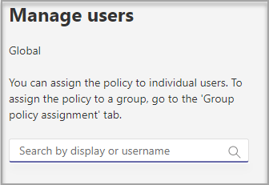
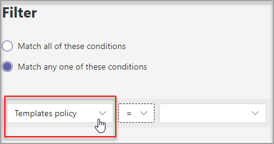

# Crear y administrar plantillas de Teams en el centro de administraciónCreate and manage Teams templates in the admin center

[!INCLUDE [preview-feature](includes/preview-feature.md)]

Administre las plantillas de Teams que se muestran a los usuarios finales creando directivas de plantillas en el centro de administración.Manage the Teams templates that are shown to your end users by creating templates policies in the admin center. Dentro de cada directiva de plantillas, puede designar qué plantillas se muestran u ocultan.Within each template policy, you can designate which templates are shown or hidden.
Asigne diferentes usuarios a distintas directivas de plantillas para que los usuarios solo puedan ver el subconjunto de plantillas de Teams especificadas.Assign different users to different template policies so that your users only view the subset of Teams templates specified.

## Crear directivas de plantillas y asignar plantillas disponiblesCreate template policies and assign available templates

1. Inicie sesión en el Centro de administración de Teams.Sign in to the Teams admin center.

2. Expanda las **directivas de plantillas**  >  **de** Teams.Expand **Teams** > **Templates policies**.

3. Seleccione **Agregar**.Select **Add**.

    

1. En la **sección Configuración de directivas de** plantillas, complete los siguientes campos:In the **Templates Policies Settings** section, complete the following fields:

    - Nombre de la directiva de plantillasTemplates Policy name

    - Descripción breve de la directiva de plantillasTemplates Policy short description

2. En la **tabla Plantillas visualizables,** seleccione las plantillas que desea ocultar y seleccione **Ocultar.**In the **Viewable Templates** table, select the templates you want to hide and select **Hide**.

    

    Puede ver las plantillas que ha seleccionado para ocultar en la **tabla Plantillas ocultas.**You can see the templates you've selected to hide in the **Hidden Templates** table.

1. Para mostrar determinadas plantillas, desplácese hasta la **tabla Plantillas ocultas.**To unhide certain templates, scroll to the **Hidden templates** table.

1. Seleccione las plantillas que desea mostrar y, a continuación, seleccione **Mostrar.**Select the templates to unhide, and then select **Show**.

   

   Las plantillas seleccionadas aparecerán en la **tabla de plantillas visualizables.**The selected templates will appear in your **Viewable templates** table.
3. Seleccione **Guardar**.Select **Save**.

   La nueva directiva de plantilla se muestra en la **lista Directivas de** plantillas.Your new template policy is displayed in the **Templates Policies** list.

## Asignar usuarios a las directivas de plantillaAssign users to the template policies

Los usuarios asignados a una directiva solo podrán ver las plantillas que se pueden ver dentro de esa directiva.Users assigned to a policy will only be able to view the viewable templates within that policy.

1. En **Directivas de plantillas,** seleccione una directiva y, a continuación, **seleccione Administrar usuarios.**From **Templates Policies**, select a policy, and then select **Manage users**.

2. Escriba los usuarios que desea asignar a esta directiva.Type the users to assign to this policy.

   

3. Seleccione **Aplicar.**Select **Apply**.

> [!Note]
> La nueva directiva puede tardar hasta 24 horas en tener efecto para los usuarios finales.It might take up to 24 hours for your new policy to take effect for end users.

## Límites de tamaño para las directivas de plantillaSize limits for Template policies

Puede ocultar un máximo de 100 plantillas por directiva.You can hide a max of 100 templates per policy. El **botón** Ocultar está deshabilitado si la directiva determinada ya tiene ocultas 100 plantillas.The **Hide** button is disabled if the given policy already has 100 templates hidden.

## Preguntas frecuentesFrequently asked questions

**P: ¿Puedo asignar usuarios por lotes a directivas de plantillas de equipo?****Q: Can I batch assign users to team templates policies?**
  
A: Sí, se admite la asignación por lotes para la directiva de plantillas en PowerShell.A: Yes, we support batch assignment for template policy in PowerShell. El tipo de directiva para esta acción es TeamsTemplatePermissionPolicy.The policy type for this action is TeamsTemplatePermissionPolicy. [Aprende másLearn more](https://docs.microsoft.com/powershell/module/teams/new-csbatchpolicyassignmentoperation?view=teams-ps)

**P: ¿Se pueden asignar grupos a directivas de plantillas de equipo?****Q: Can Groups be assigned to team templates policies?**

A: Actualmente no.A: Currently no. Esta funcionalidad estará disponible en el futuro.This functionality will be available in the future.

**P: Si se crea una plantilla, ¿la plantilla se incluirá en mis directivas?****Q: If a new template is created, will the template be included in my policies?**

A: Las nuevas plantillas estarán visibles de forma predeterminada.A: Any new templates will be visible by default. Puede elegir ocultar la plantilla en el centro de administración en la sección Directivas de plantillas.You can choose to hide the template in the admin center in the Templates Policies section.

**P: ¿Qué ocurre si se elimina una plantilla?****Q: What happens if a template is deleted?**

A: Las plantillas eliminadas ya no estarán presentes en ninguna política de plantillas.A: Any deleted templates will no longer be present in any templates policies.

**P: ¿Puedo asignar varios usuarios a una directiva de plantilla en el Centro de administración de Teams?****Q: Can I assign multiple users to a template policy in the Teams Admin Center?**

A: Sí.A: Yes.

1. En el Centro de administración, vaya a **Usuarios.**In the Admin center, go to **Users**.
1. En la tabla Lista de usuarios, seleccione los usuarios que desea asignar a una directiva de plantillas determinada.In the Users list table, select the users you want to assign to a certain templates policy.
1. Seleccione Editar configuración y cambie el campo Directivas de plantillas.Select Edit settings, and change the Templates policies field.
1. Seleccione Aplicar.Select apply.
   Más información [sobre cómo asignar directivas a los usuarios en Microsoft Teams: Microsoft Teams \| Microsoft Docs.](https://docs.microsoft.com/microsoftteams/assign-policies#assign-a-policy-to-a-batch-of-users)Learn more [Assign policies to your users in Microsoft Teams - Microsoft Teams \| Microsoft Docs](https://docs.microsoft.com/microsoftteams/assign-policies#assign-a-policy-to-a-batch-of-users).

**P: ¿Cómo puedo ver todos los usuarios asignados a una directiva específica?****Q: How do I view all users assigned to a specific policy?**

A: En el Centro de administración:A: In the Admin center:

1. Vaya a la **sección** Usuarios.Go to the **Users** section.
2. Seleccione el filtro en la tabla Lista de usuarios y filtre para la directiva de plantilla de Teams.Select the filter in the Users list table and filter for the teams template policy.
3. Seleccione **Aplicar.**Select **Apply**.

**P: ¿Puedo administrar directivas de plantillas a través de PowerShell?****Q: Can I manage templates policies via PowerShell?**

A: No, esto no es compatible.A: No, this isn't supported.

**P: ¿Las directivas de plantillas se aplican a EDU?****Q: Are templates policies applicable to EDU?**

A: No, esto no es compatible.A: No, this isn't supported.

## Temas relacionadosRelated topics

- [Introducción a las plantillas de equipo en el Centro de administraciónGet started with team templates in the admin center](https://docs.microsoft.com/MicrosoftTeams/get-started-with-teams-templates-in-the-admin-console)

- [Crear una plantilla de equipo personalizadaCreate a custom team template](https://docs.microsoft.com/MicrosoftTeams/create-a-team-template)

- [Crear una plantilla de un equipo existenteCreate a template from an existing team](https://docs.microsoft.com/MicrosoftTeams/create-template-from-existing-team)

- [Crear una plantilla de equipo a partir de una plantilla de equipo existenteCreate a team template from an existing team template](https://docs.microsoft.com/MicrosoftTeams/create-template-from-existing-template)

- [Asignar directivas a los usuarios en Microsoft Teams: Microsoft Teams \| Microsoft DocsAssign policies to your users in Microsoft Teams - Microsoft Teams \| Microsoft Docs](https://docs.microsoft.com/microsoftteams/assign-policies)

- [Asignar usuarios a una directiva por lotesBatch assign users to a policy](https://docs.microsoft.com/powershell/module/teams/new-csbatchpolicyassignmentoperation?view=teams-ps)
