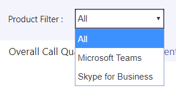

# Activar y usar el panel de calidad de llamadas para Microsoft Teams y Skype empresarial online

Aprenda a configurar su organización de Office 365 para usar el panel de calidad de llamadas y supervisar la calidad de las llamadas.
  
El panel de calidad de llamadas (CQD) proporciona una perspectiva de la calidad de las llamadas hechas con Microsoft Teams y los servicios de Skype empresarial online. En este tema se describen los pasos para empezar a recopilar datos que puede usar para solucionar problemas de calidad de la llamada.

Actualmente, el CQD y el CQD de avanzada están disponibles para su uso. El CQD avanzado está disponible https://cqd.teams.microsoft.comen. Nueva dirección URL, pero el mismo inicio de sesión con las credenciales de administrador.

## Usar Power BI para analizar los datos del CQD

Novedades de enero de 2020: [Descargue las plantillas de consulta de Power BI para el CQD](https://github.com/MicrosoftDocs/OfficeDocs-SkypeForBusiness/blob/live/Teams/downloads/CQD-Power-BI-query-templates.zip?raw=true). Plantillas de Power BI personalizables que puede usar para analizar y notificar los datos de CQD.

Leer [use Power BI para analizar los datos del CQD](CQD-Power-BI-query-templates.md) y obtener más información.

## Últimos cambios y actualizaciones

El CQD actualizado (a principios de noviembre de 2019) ofrece un panel de CQD que casi en tiempo real. Los datos del CQD ahora están disponibles en un promedio de 30 minutos (en comparación con el CQD anterior, que es el promedio de 24 horas).  El CQD actualizado usa información de identificación del usuario final (EUII), lo que permite a los administradores explorar en profundidad y acercar el nivel de usuario. También hay interactividad para admitir escenarios nuevos como:

- Calidad de la llamada por región:
  - fecha y por región
  - agregado a la hora por región
  - ubicaciones específicas
  - subred específica
  - usuario o usuarios afectados

- Confiabilidad de la llamada/error por región:
  - fecha y por región
  - agregado a la hora por región
  - ubicaciones específicas
  - subred específica
  - usuario o usuarios afectados

- Clasificar mi llamada (RMC) por región: de mes a región, agregada a ubicaciones específicas para los usuarios que proporcionan clasificaciones con un bajo nivel de RMC. El CQD v3 también incluye comentarios literales.
- Servicio de asistencia: disponible para un usuario específico en llamadas o reuniones P2P, o para todos los participantes y detalles de llamadas. Ayuda a identificar posibles problemas del sistema basados en la ubicación de red, los dispositivos o el firmware.  
- Versiones de cliente: ver los recuentos de usuarios y sesiones para cada versión de cliente o explorar en profundidad los nombres de usuario para cada versión de cliente. Los filtros predefinidos para el tipo de producto y cliente ayudan a centrar las versiones en clientes específicos.
- Puntos de conexión: muestra los puntos de conexión de equipo asignados a la marca o el modelo de PC o Mac. Muestra la calidad agregada mediante una marca o un modelo. Los datos de la asignación se cargan de forma similar a la creación de datos.

El CQD avanzado (V3) también proporciona soporte RBAC, en caso de que el acceso EUII no esté disponible.  

Un administrador puede administrar Skype empresarial Server 2019 (no solo Skype empresarial online y Microsoft Teams) a través de la versión 3 del CQD. Esto requiere una implementación híbrida y el uso del conector de datos de llamada. Para obtener más información, consulte [plan Call Data Connector](/SkypeForBusiness/hybrid/plan-call-data-connector) .

Se agregó la versión 2 del CQD:

- Datos de Microsoft Teams y Skype empresarial online
- Los informes de Resumen incluyen un filtro de producto para seleccionar todos los datos, los datos de Microsoft Teams o los datos de Skype empresarial online.
- Vídeo actualizado y la lógica de clasificación de calidad de transmisión de flujo. Consulta la [clasificación de secuencias en el panel de calidad de llamadas](stream-classification-in-call-quality-dashboard.md) para las definiciones de clasificador.

Consulte este artículo para obtener una lista de [las dimensiones y medidas disponibles en el panel de calidad de llamadas](dimensions-and-measures-available-in-call-quality-dashboard.md).
  
> [!NOTE]
> Para ver información sobre actualizaciones y cambios en el panel, haga clic en el vínculo de las **buenas noticias.** pancarta cuando se muestra en el panel.

La versión 1 del CQD proporcionaba a los administradores de Skype empresarial Server 2015 las siguientes características:

- Acceso a datos de informes almacenados en caché para agilizar el acceso
- Vínculos profundos a páginas de informes para compartir y publicar información
- Edición y creación de informes simplificada, y metadatos editables para descripciones de informes
- API Web que proporcionan acceso mediante programación a los datos del cubo para usarlos en paneles personalizados

## Datos casi en tiempo real (NRT) del CQD

El CQD avanzado (V3, lanzado en noviembre de 2019) usa una fuente de datos casi en tiempo real. Los registros de llamadas están disponibles en el portal de CQD en un plazo de 30 minutos a partir de la finalización de la llamada. Los registros de llamadas de la canalización de NRT solo están disponibles durante unos meses antes de que se eliminen del conjunto de datos. El proceso de CQD V3 combina los datos de la canalización V2 actual con los datos de NRT de la canalización V3. Las consultas de los portales V2 y v3 para los datos del período de archivado producen los mismos resultados. Las consultas de datos de V2 y v3 para los datos de NRT y NRT períodos de datos + PII serán diferentes.

### Datos PII/EUII

Los datos PII o EUII proceden de la canalización V3. Por razones de cumplimiento, los datos PII/EUII solo se guardan durante 30 días. A medida que los datos NRT cruzan la marca de 30 días, los campos PII/EUII se borran, lo que genera datos de NRT gratuitos. Los campos PII/EUII son:

- Dirección IP completa
- Dirección de control de acceso de medios (MAC)
- Identificador de conjunto de servicios (BSSID) básico
- URI del Protocolo de inicio de sesión (SIP) (solo para Skype empresarial)
- Nombre principal de usuario (UPN)
- Nombre del punto final del equipo
- Comentarios literales de usuario
- IDENTIFICADOR de objeto (el identificador de objeto de Active Directory del usuario del punto de conexión)

### Controles de fecha

El CQD V3 agrega los siguientes nuevos tipos de tendencia gradual:

- 5 días
- 7 días
- 30 días
- 60 día
- 90 día

Ahora, el parámetro de fecha de dirección URL puede aceptar un campo de día. Los informes de día rodante usan fechas especificadas en el formato AAAA-MM-DD como el último día de la tendencia.  El parámetro de fecha de dirección URL "00" indica "hoy".

|Dirección URL| Fecha de finalización del día de rodadura|
|:---|:---|
|https://<cqdv3>/SPD/#/Dashboard/<reportid>/2019-02/   |Día actual del Feb 2019|
|https://<cqdv3>/SPD/#/Dashboard/<reportid>/2019-02-15/|15 de febrero de 2019|
|https://<cqdv3>/SPD/#/Dashboard/<reportid>/00/        |Día actual|
|||

De forma predeterminada, el día actual del mes se usa como el último día de la tendencia del día acumulado.

### Funcionalidad de obtención de detalles

El CQD V3 admite el uso de campos de obtención de detalles o de obtención de detalles en informes SPD. Si se seleccionan estos campos de dimensión, el informe abre automáticamente una ficha de informe diferente y filtra en el valor seleccionado. Los campos con un filtro de obtención de detalles asignado se distinguen por un icono de cursor diferente (el puntero) cuando se pasa el puntero sobre ellos.

Cuando se selecciona un campo de obtención de detalles, el panel se desplaza automáticamente a la nueva pestaña especificada y aplica un filtro con el valor seleccionado. Si la pestaña tiene campos de obtención de detalles propios y está seleccionado uno, los filtros de obtención de detalles anteriores y el nuevo se propagan hacia adelante. Esto le permite crear un informe que restrinja de manera gradual el conjunto de datos resultante.

Por ejemplo, en un informe detallado de la calidad de las llamadas, un usuario puede hacer clic en la fecha en la que deseaba ' profundizar ', lo que conduce a la pestaña de ubicación.

Puede agregar varias fechas desde la pestaña ubicación, como agregar 2019-09-22 a la fecha: 2019-09-24: 

> [!NOTE]
> No ir directamente a la última pestaña. Sin filtros seleccionados de una obtención de detalles anterior, los resultados serían demasiado grandes para mostrarlos en una tabla.

## Activar los informes de resumen del panel de calidad de llamadas de Microsoft (CQD)

Para poder empezar a usar el CQD, actívelo para su organización de Office 365 de la siguiente manera:

 de Microsoft Teams **con el centro de administración de Microsoft Teams**

1. Inicie sesión en su organización de Office 365 con la cuenta de administrador del servicio Microsoft Teams y, a continuación, seleccione el icono **Administrador** para abrir el centro de administración.
2. En el panel izquierdo, en **centros de administración**, seleccione **Microsoft Teams** para abrir el centro de administración de Microsoft Teams.
3. En el centro de administración de Microsoft Teams, seleccione **Panel de calidad de llamadas** en el panel de la izquierda.
4. En la página que abre \(https://CQD.Teams.Microsoft.com\), haga clic en **iniciar sesión** y escriba la información de la cuenta de administrador del servicio Microsoft Teams o la cuenta de administrador global.

    
  
Después de iniciar sesión, una vez que se haya activado, el CQD comenzará la recopilación y el procesamiento de datos.  
> [!NOTE]
> Puede demorar una o más horas en procesar los datos suficientes para mostrar resultados significativos en los informes.

 de Skype empresarial **con el portal heredado de Skype empresarial**

1. Inicie sesión en su organización de Office 365 con una cuenta de administrador y, a continuación, seleccione el icono **Administrador** para abrir el centro de administración.
2. En el panel izquierdo, en **centros de administración**, seleccione **Microsoft Teams** para abrir el centro de administración de Microsoft Teams.
3. En el centro de administración de Microsoft Teams, seleccione **portal heredado** en el panel izquierdo, seleccione **herramientas**y, a continuación, seleccione **Panel de calidad de llamadas de Skype empresarial online**.

     

4. En la página que se abre, inicie sesión con su cuenta de administrador global y, a continuación, proporcione las credenciales de la cuenta cuando se le solicite.

Después de iniciar sesión, una vez que se haya activado, el panel de calidad de llamadas empezará a recopilar y procesar datos.

## Características del panel de calidad de llamadas para Microsoft Teams y Skype empresarial online

Los informes de resumen del CQD proporcionan un subconjunto de las características planeadas para los informes detallados. Las diferencias entre las ediciones se resumen aquí:
  
|Característica|Informes de Resumen|Informes detallados|
|:--- |:--- |:--- |
|Métrica de uso compartido de aplicaciones | No | Sí |
|Soporte de información de creación de clientes | Sí | Sí  |
|Asistencia para la información del extremo del cliente | Solo en CQD.Teams.Microsoft.com | Solo en CQD.Teams.Microsoft.com |
|Compatibilidad con análisis detallado   | No   | Sí   |
|Métricas de confiabilidad de multimedia   | No   | Sí   |
|Informes listos para su servicio   | Sí   | Sí    |
|Informes de información general   | Sí   | Sí    |
|Conjunto de informes por usuario   | No   | Sí   |
|Personalización del conjunto de informes (agregar, eliminar, modificar informes)   | No   | Sí   |
|Métricas de pantalla compartida basada en vídeo   | No   | Sí   |
|Métricas de video   | No   | Sí   |
|Cantidad de datos disponibles   | Últimos 12 meses   | Últimos 12 meses   |
|Datos de Microsoft Teams   | Sí   | Sí    |
| | | |

### Informes listos para su servicio

Todas las ediciones de CQD proporcionan una experiencia que le ofrece una métrica de calidad de llamadas sin necesidad de crear nuevos informes. Una vez que los datos se hayan procesado en el back-end, verá datos sobre la calidad de las llamadas en los informes.

Novedades de enero de 2020: [Descargue las plantillas de consulta de Power BI para el CQD](https://github.com/MicrosoftDocs/OfficeDocs-SkypeForBusiness/blob/live/Teams/downloads/CQD-Power-BI-query-templates.zip?raw=true). Plantillas de Power BI personalizables que puede usar para analizar y notificar los datos de CQD.
  
### Informes de información general

Todas las ediciones del CQD proporcionan un punto de entrada de alto nivel para la información general sobre la calidad de las llamadas, pero la manera en que la información se presenta en los informes de resumen es diferente de los informes detallados.  
  
Los informes de Resumen proporcionan una vista simplificada del informe de página de fichas para que pueda examinar y comprender rápidamente el estado y las tendencias generales de la calidad de las llamadas.

Las cuatro pestañas incluyen:
  
- **Calidad general** de las llamadas: proporciona información acerca de todas las transmisiones, que es una agregación que muestra tendencias mensuales y diarias para:
  - Secuencias de cliente-servidor
  - Secuencias cliente-cliente
  - Flujos de cliente de servidor y cliente-independientes
- **Servidor — cliente** — proporciona detalles para las transmisiones entre los puntos de conexión de servidor y cliente.
- **Cliente: cliente** : proporciona detalles sobre las transmisiones entre dos puntos de conexión cliente.
- **SLA de calidad de voz** : proporciona información sobre las llamadas que se incluyen en el SLA de calidad de voz de Skype empresarial online.

> [!NOTE]
> La versión 3 del CQD funciona con Microsoft Teams, Skype empresarial online y Skype empresarial Server. Para usar el CQD con Skype empresarial Server 2019, tendrá que configurar el [conector de datos de llamada](https://docs.microsoft.com/skypeforbusiness/hybrid/configure-call-data-connector). Consulte [planificar llamada a un conector de datos](https://docs.microsoft.com/skypeforbusiness/hybrid/plan-call-data-connector) antes de empezar.

- Calidad de la llamada por región:

  - fecha y por región
  - agregado a la hora por región
  - ubicaciones específicas
  - subred específica
  - usuario o usuarios afectados

- Confiabilidad de la llamada/error por región:
  - fecha y por región
  - agregado a la hora por región
  - ubicaciones específicas
  - subred específica
  - usuario o usuarios afectados

- Clasificar mi llamada (RMC) por región: de mes a región, agregada a ubicaciones específicas para los usuarios que proporcionan clasificaciones con un bajo nivel de RMC. El CQD v3 también incluye comentarios literales.
- Servicio de asistencia: disponible para un usuario específico en llamadas o reuniones P2P, o para todos los participantes y detalles de llamadas. Ayuda a identificar posibles problemas del sistema basados en la ubicación de red, los dispositivos o el firmware.  
- Versiones de cliente: ver los recuentos de usuarios y sesiones para cada versión de cliente o explorar en profundidad los nombres de usuario para cada versión de cliente. Los filtros predefinidos para el tipo de producto y cliente ayudan a centrar las versiones en clientes específicos.
- Puntos de conexión: muestra los puntos de conexión de equipo asignados a la marca o el modelo de PC o Mac. Muestra la calidad agregada mediante una marca o un modelo. Los datos de la asignación se cargan de forma similar a la creación de datos.

### Ficha calidad general de las llamadas

Use los datos de esta pestaña para evaluar el estado de la calidad de la llamada y las tendencias en función de los recuentos de flujo y los porcentajes deficientes. La leyenda de la esquina superior derecha muestra el color y los elementos visuales que representan estas métricas.
  

  
Las transmisiones se clasifican en tres grupos: buenos, deficientes y no clasificados. También se calculan valores *deficientes de%* que le dan la proporción de las transmisiones clasificadas como *malas* para el número total de streams clasificados. Debido a la mala transferencia de *% = secuencias defectuosas/(secuencias deficientes, secuencias muy buenas) * 100*, el *mal porcentaje* no se ve afectado por la presencia de varias secuencias sin *clasificar* . Para ver qué clasifica una secuencia como mala o buena, consulte [clasificación de secuencias en el panel de calidad de llamadas](stream-classification-in-call-quality-dashboard.md).
  
Use la escala de la izquierda para medir los valores de recuento de transmisiones.
  

  
Use la escala de la derecha para medir los valores de% deficiente.
  

  
También puede obtener los valores numéricos reales colocando el cursor sobre una barra.
  
> [!NOTE]
> El ejemplo siguiente es de un conjunto de datos de ejemplo muy pequeño, y los valores no son realistas para una implementación real.
  

  
El volumen de transmisión general permite determinar la relevancia de los porcentajes bajos calculados. Cuanto menor sea el volumen de las transmisiones generales, menos confiable serán los valores de porcentajes deficientes.
  
### Pestaña servidor-cliente y cliente-cliente

Estas dos pestañas proporcionan detalles para las transmisiones que se realizaron en los escenarios de extremo a punto de conexión. La pestaña servidor-cliente tiene cuatro secciones contraíbles que representan cuatro escenarios en los que fluyen las transmisiones multimedia.
  
- Cableado interno
- Cableado fuera
- WiFi Inside
- WiFi fuera

De forma similar, la ficha cliente-cliente tiene cinco secciones contraíbles:

- Cableado interno: cableado interno
- Cableado interno: cableado externo
- Cableado externo: cableado fuera
- Conectado: WiFi Inside
- Cableado interno: WiFi fuera

#### Prueba interna

Durante el procesamiento, el back-end del CQD clasifica una secuencia como *dentro* o *fuera* mediante la información de compilación, si existe. Los puntos de conexión de cada secuencia están asociados con una dirección de subred. Si la subred está en la lista de subredes marcada como InsideCorp en la información de la compilación cargada, se considera *dentro*. Si aún no se ha cargado la generación de información, la prueba dentro de siempre clasifica las transmisiones como *externas*.  

> [!NOTE]
> La prueba de dentro para un escenario de cliente de servidor solo tiene en cuenta el punto de conexión de cliente. Como los servidores siempre están fuera del punto de vista del usuario, esto no se tiene en cuenta en la prueba.
  
#### Cableado frente a WiFi

Como indican los nombres, los criterios de clasificación se basan en el tipo de conexiones de cliente. De nuevo, el servidor siempre se conecta por cable y no se incluye en el cálculo.
  
> [!NOTE]
> Dada una transmisión por secuencias, si uno de los dos puntos de conexión está conectado a una red WiFi, se clasifica como WiFi en el CQD.
  
## Selección de datos de producto para ver en los informes

En los informes de Resumen y ubicación mejorados, puede usar el menú desplegable **filtro de producto** para mostrar todos los datos de productos, solo los datos de Microsoft Teams o solo los datos de Skype empresarial online.
  

  
En los informes detallados, puede usar la dimensión **es equipos** para filtrar los datos a Microsoft Teams o a los datos de Skype empresarial online.
  
## Cargar información de datos de inquilino

El panel informes de resumen del CQD incluye una página de **carga de datos de inquilino** , a la que se accede seleccionando carga de datos de **inquilino** en el menú configuración en la esquina superior derecha. Esta página se usa para que los administradores carguen su propia información, por ejemplo:

- Mapa de dirección IP e información geográfica
- Un mapa de cada punto de conexión inalámbrico y su dirección MAC
- Un mapa de punto final para la marca, modelo o tipo de extremo, etc.
  
> [!NOTE]
> Las etiquetas de informes que se cargan en el CQD se tratarán como *datos de soporte técnico* de acuerdo con el contrato de Office 365, incluida cualquier información que de otro modo se considere datos de los *clientes* o *datos personales*. No incluya datos que no desee proporcionar a Microsoft como *datos de soporte técnico*; esta información será visible para los ingenieros de Microsoft a efectos de soporte técnico.

  
1. En la página **carga de datos de inquilino** , use el menú desplegable para elegir un tipo de archivo de datos para cargar. El tipo de datos archivo denota el contenido del archivo (por ejemplo, "edificio" se refiere a la asignación de la dirección IP y de otra información geográfica, "extremo" hace referencia a la asignación del nombre del extremo a la información de marca/modelo/tipo de EndPoint). Actualmente el CQD admite los tipos de datos "edificio" y "extremo" para cqd.teams.microsoft.com (en la fase de versión preliminar y no disponible oficialmente), cqd.lync.com solo admite el tipo de datos "edificio".

2. Después de seleccionar el tipo de datos de archivo, haga clic en **examinar** para elegir un archivo de datos.

   - Un archivo de datos debe ser un archivo. TSV (valores separados por tabulaciones) o un archivo. csv (valores separados por comas). Con un archivo. csv, cualquier campo que contenga una coma debe estar rodeado de comillas o tener la coma eliminada. Por ejemplo, si el nombre del edificio es NY, NY, escriba "NY, NY" en el archivo. csv.
   - El archivo de datos no debe superar los 50 MB.
   - Los archivos cargados en cqd.teams.microsoft.com tienen un límite de fila expandido de 1 millón para mantener el rendimiento de las consultas rápidamente. Este límite también se aplica al CQD V2 enCQD.Lync. com.
   - Para cada archivo de datos, cada columna del archivo debe coincidir con un tipo de datos predefinido, que se trata más adelante en este tema.
3. A continuación, especifique una **fecha de inicio** y, opcionalmente, **especifique una fecha de finalización**.
4. Por último, seleccione **cargar** para cargar el archivo en el servidor CQD.
    Antes de que se cargue el archivo, primero se valida. Una vez que se haya validado, se almacena en un BLOB de Azure. Si se produce un error de validación o el archivo no se almacena en un BLOB de Azure, un mensaje de error solicita una corrección para el archivo. La imagen siguiente muestra un error de ejemplo con un número incorrecto de columnas en el archivo de datos.

     
  
5. Si no se producen errores durante la validación, la carga del archivo se realiza correctamente. Puede ver el archivo de datos cargado en la tabla **mis cargas** . En la parte inferior de la página también se muestra una lista completa de todos los archivos cargados para el inquilino actual.
    Cada registro muestra un archivo de datos de inquilino cargado, con tipo de archivo, hora de última actualización, período de tiempo, descripción, un icono de quitar y un icono de descarga. Para quitar un archivo, seleccione el icono de papelera de la tabla. Para descargar un archivo, seleccione el icono de descarga en la columna **Descargar** de la tabla.

     

6. Si elige usar varios archivos de datos de compilación o varios archivos de datos de extremo, algunos informes se generan más lentamente.

### Formato y estructura del archivo de datos de inquilinos

### Generando archivo de datos

El CQD usa un archivo de datos de construcción, lo que ayuda a proporcionar detalles útiles de la llamada. La columna subred se deriva expandiendo la columna red + rango, luego se une la columna subred a la primera subred de la llamada o la segunda subred para mostrar la información de la región o el edificio, la ciudad, el país o la región. El formato del archivo de datos que cargue debe cumplir los siguientes criterios para pasar la comprobación de validación antes de la carga:

Puede descargar una plantilla de ejemplo [aquí](https://github.com/MicrosoftDocs/OfficeDocs-SkypeForBusiness/blob/live/Teams/downloads/locations-template.zip?raw=true)
  
- El archivo debe ser un archivo. TSV (las columnas están separadas por una TABULAción) o un archivo. csv (las columnas se separan con una coma).
- El archivo de datos no incluye una fila de encabezado de tabla. Se espera que la primera línea del archivo de datos sea datos reales, no etiquetas de encabezado como "Network".
- Los tipos de datos en el archivo solo pueden ser de cadena, entero o booleano. Para el tipo de datos Integer, el valor debe ser un valor numérico. Los valores booleanos deben ser 0 o 1.
- Si una columna usa el tipo de datos String, un campo de datos puede estar vacío, pero aún debe estar separado por una tabulación o una coma. Un campo de datos vacío simplemente asigna un valor de cadena vacía.
- Debe haber 14 columnas por cada fila (o 15 si desea agregar la columna opcional), cada columna debe tener el tipo de datos adecuado y las columnas deben estar en el orden que se indica en la tabla siguiente:

||||||||||||||||
|:--- |:--- |:--- |:--- |:--- |:--- |:--- |:--- |:--- |:--- |:--- |:--- |:--- |:---  |:--- |:---|
|**Nombre de campo de columna**|NetworkIP  |Red              |NetworkRange|BuildingName  |Propiedad| Edificio  |BuildingOfficeType|Ciudad   |ZipCode|Tercer|Estado |Region|InsideCorp&dagger;|ExpressRoute&Dagger;|VPN (opcional)|
|**Tipo de datos**        | String    | String                  |Número      | String       | String      | String        |String            |String |String |String |String|String|Boolean   |Boolean     |Boolean|
|**Valor de ejemplo**    |192.168.1.0|Estados Unidos/Seattle/SEATTLE-mar-1| 26         | SEATTLE-MAR-1| Dpto     | Finalización de ti|Integración       |Seattle|98001  |DÉJEN     |WA    |MSUS  | 1        |,0           | ,0|
|||||||||||||||||

&dagger;Esta configuración se puede usar para reflejar si la subred está dentro de la red corporativa. Puede personalizar el uso de otros propósitos si así lo decide.

&Dagger;Esta configuración se puede usar para reflejar si la red usa Azure ExpressRoute. Puede personalizar el uso de otros propósitos si así lo decide.  

**Fila de ejemplo:**

`192.168.1.0,USA/Seattle/SEATTLE-SEA-1,26,SEATTLE-SEA-1,Contoso,IT Termination,Engineering,Seattle,98001,US,WA,MSUS,1,0,0`

> [!IMPORTANT]
> El intervalo de red se puede usar para representar una superred (combinación de varias subredes con un único prefijo de enrutamiento). Todas las nuevas cargas de creación se marcarán para todos los intervalos superpuestos. Si ha cargado previamente un archivo de compilación, debe descargar el archivo actual y volver a cargarlo para identificar cualquier solapamiento y corregir el problema antes de volver a cargar. Cualquier solapamiento de los archivos cargados previamente puede dar lugar a asignaciones erróneas de subredes a edificios de los informes. Ciertas implementaciones de VPN no informan con precisión de la información de subred. Se recomienda que al agregar una subred VPN al archivo de creación, en lugar de una entrada para la subred, se agreguen entradas independientes para cada dirección de la subred VPN como una red de 32 bits independiente. Cada fila puede tener los mismos metadatos de compilación. Por ejemplo, en lugar de una fila para 172.16.18.0/24, debe tener 256 filas, con una fila por cada dirección entre 172.16.18.0/32 y 172.16.18.255/32, ambos incluidos.
>
> La columna VPN es opcional y se establecerá de forma predeterminada en 0.  Si el valor de la columna VPN se establece en 1, la subred representada por esa fila se expandirá completamente para coincidir con todas las direcciones IP de la subred.  Use esto con moderación y solo para las subredes VPN, ya que la expansión de estas subredes tendrá un impacto negativo en los tiempos de las consultas para las consultas que impliquen datos de compilación.

### Archivo de datos de extremo

El CQD usa un archivo de datos de extremo. Los valores de columna se usan en el primer nombre de punto de conexión de cliente del registro de llamada o el segundo nombre de punto de conexión de cliente para mostrar la información de tipo, modelo o fabricante de puntos de conexión. El formato del archivo de datos que cargue debe cumplir los siguientes criterios para pasar la comprobación de validación antes de la carga:

- El archivo debe ser un archivo. TSV (las columnas están separadas por una TABULAción) o un archivo. csv (las columnas se separan con una coma).
- El contenido del archivo de datos no incluye encabezados de tabla. Se espera que la primera línea del archivo de datos sea datos reales, no una etiqueta de encabezado como "EndpointName".
- Las siete columnas solo usan el tipo de datos String. La longitud máxima permitida es de 64 caracteres.
- Un campo de datos puede estar vacío, pero aún debe estar separado por una tabulación o una coma. Un campo de datos vacío simplemente asigna un valor de cadena vacía.
- EndpointName debe ser único; de lo contrario, se producirá un error en la carga. Si hay una fila duplicada o dos filas que usan la misma EndpointName, el conflicto provocará una combinación incorrecta.
- EndpointLabel1, EndpointLabel2 y EndpointLabel3 son etiquetas personalizables. Pueden ser cadenas vacías o valores como "equipo de ti designado 2018 portátil" o "etiqueta de activo 5678".
- Debe haber siete columnas por cada fila y las columnas deben estar en el siguiente orden:

  **Orden de los campos:**

EndpointName, EndpointMake, EndpointModel, EndpointType, EndpointLabel1, EndpointLabel2, EndpointLabel3

  **Fila de ejemplo:**

' 1409W3534, fabricante de 123, Fabrikam modelo 123, portátil, TI designado 2018 portátil, etiqueta de activos 5678, compra 2018

## Migrar informes de una versión anterior del CQD

Si ha creado informes o ha cargado los archivos de datos de inquilino (asignación) en el CQD para Skypehttps://cqd.lync.com) empresarial (y quiere migrarlos al CQD para Teamshttps://cqd.teams.microsoft.com)() de la siguiente manera:

1.  Vaya al [https://cqd.lync.com/cqd/](https://cqd.lync.com/cqd/) conjunto de informes que desee exportar y búsquelo. 
2.  Mantenga el mouse sobre el informe y, en la "..." menú, elija **exportar árbol de informes**. Guarde el archivo de exportación.
3.  Vaya a [https://cqd.teams.microsoft.com/cqd/](https://cqd.teams.microsoft.com/cqd/) la ubicación donde desea importar los informes y búsquelo.
4.  Desde los vínculos de la izquierda, haga clic en **importar** y seleccione el archivo exportado. 
5.  Después de importar los informes, verá este mensaje: "la importación del informe se realizó correctamente. El nuevo informe se ha agregado al final del conjunto de informes. 

## Crear informes detallados personalizados

Si encuentra que desea crear un informe específico que se Centre en una dimensión de los datos de un modo que los informes detallados proporcionados no, cree un informe personalizado.

En la lista desplegable de informes en la parte superior de la pantalla que se muestra \(al inicio de sesión\) la pantalla **informes de Resumen** , seleccione **informes detallados** **y, a** continuación, haga clic en "Editar" en el menú de acciones de un informe para ver el editor de consultas. Cada informe está respaldado por una consulta dentro del cubo. Un informe es una visualización de los datos devueltos por su consulta. El editor de consultas le ayuda a editar estas consultas y las opciones de presentación del informe. Al abrir el editor de consultas para un informe nuevo, verá algo parecido a esta captura de pantalla:

1. Las dimensiones, las medidas y los filtros se eligen en el panel de la izquierda. Haga clic en el botón "más" situado junto a un título para abrir el cuadro de diálogo en el que puede Agregar una dimensión, medida o filtro y activar el cuadro correspondiente. Si modifica un informe existente, puede desactivar los valores existentes para quitarlos. Para obtener más información, consulte [dimensiones y medidas disponibles en el panel de calidad de llamadas](dimensions-and-measures-available-in-call-quality-dashboard.md).
2. Las opciones para personalizar los gráficos se visualizan en la parte superior.
3. En el editor de consultas encontrará una vista previa del informe.
4. Se puede crear un nombre de informe detallado y una descripción con el cuadro de edición en la parte inferior.

## Preguntas más frecuentes

### ¿Por qué el CQD marca una llamada como "buena" si uno o más participantes de la reunión tuvieran una experiencia deficiente?

Consulta las reglas que usa el CQD para la [clasificación de secuencias](stream-classification-in-call-quality-dashboard.md).
 
En el caso de las transmisiones de audio, cualquiera de los cinco clasificadores, que se calculan para el promedio en función de la duración de la llamada, pueden estar dentro de los parámetros "buenos". No significa que los usuarios no tengan algo que haya contribuido a un problema de salida de audio, como estático o en un problema. 

Para determinar si ha habido un problema de red, mire la diferencia entre los valores promedio de la sesión y los valores máximos. Los valores máximos son los máximos detectados y notificados durante la sesión.
 
Este es un ejemplo de cómo solucionar esta situación. Supongamos que realiza un seguimiento de la red durante una llamada y los primeros 20 minutos no se pierden paquetes, pero después tiene un intervalo de 1,5 segundos de paquetes y, después, bueno durante el resto de la llamada. El promedio se va a <pérdida de paquetes del 10% (0,1) incluso en un análisis RTP de seguimiento de Wireshark. ¿Cuál fue la pérdida máxima de paquetes? 1,5 segundos en un período de 5 segundos sería el 30% (0,3). ¿Eso se produjo dentro del período de muestreo de cinco segundos (tal vez o podría dividirse durante el período de muestreo)?
 
Si la métrica de red se ve bien en los valores máximos y promedio, busque otros datos de telemetría: 
- Compruebe la proporción insuficiente de eventos de CPU para ver si los recursos de la CPU detectados no eran suficientes y producían una mala calidad. 
- Era el dispositivo de audio en modo dúplex medio para evitar recibir comentarios causados por micrófonos que se encuentran cerca de los altavoces. 
- Compruebe la proporción de eventos de AEC dúplex medio de un dispositivo. Fue el problema del dispositivo o el problema de micrófono introdujo ruido o estático debido a las desprotecciones de audio USB al estar conectado a un concentrador o una estación de acoplamiento:  
- Verifique las relaciones de los problemas del dispositivo y los problemas del micrófono. ¿El dispositivo funcionaba correctamente?  
- Compruebe que las relaciones de eventos de la captura y el dispositivo de representación no funcionan.

Para obtener más información sobre las dimensiones y medidas disponibles en la telemetría del CQD, lea [dimensiones y medidas disponibles en el panel de calidad de llamadas](dimensions-and-measures-available-in-call-quality-dashboard.md).

En ruido de fondo, Compruebe la proporción de eventos de silencio para ver la cantidad de tiempo que los participantes estaban silenciados.
 
Cree informes detallados en el CQD y filtre por el identificador de la reunión para ver todos los usuarios y las secuencias de una reunión y agregue los campos que le interesen. Es posible que un usuario que informa del problema no sea el que tenía el problema. Se reportan únicamente a la experiencia.
 
La telemetría no reconocerá el problema, pero puede ayudarlo a comprender mejor dónde mirar e informar de las decisiones. ¿Hay actualizaciones, uso o usuario de la red, el dispositivo, el controlador o el firmware?

### ¿Por qué la apariencia de los datos del informe de CQD V2 es diferente de la de los datos del informe del CQD V3? 

Si ve diferencias de datos entre el CQD versión 2 y el V3, asegúrese de que la comparación o validación de datos se realiza en un nivel de "Apple to-manzanas" y en un nivel estrecho, no en un nivel agregado. Por ejemplo, si filtra los informes de MSIT ' crear 30 ' datos de cliente de escritorio de WiFi Teams, el porcentaje de mala calidad debe ser el mismo entre V2 y V3.

El CQD V2 y el CQD V3 tienen diferentes recuentos totales desde el CQD V3 existen escenarios nuevos que no están presentes en el CQD V2. Se espera que los números totales resumidos o totales agregados sin filtros sean diferentes.  

Si el escenario de uso incluye llamadas de Skype empresarial Server 2019, los datos del CQD V3 incluyen llamadas de Skype Bot (operador automático, CVI, interfaz de escritorio virtual), eventos en vivo y llamadas RTC. El CQD V2 no usa estos datos. (El CQD V3 requiere Skype empresarial Server 2019 con el conector de datos en la nube configurado).

Por ejemplo, si ve transmisiones de audio de 200.000 con errores de 5000 en un informe Resumen de CQD V2, no sería inusual ver las transmisiones de audio 300.000 con errores de 5500 (la diferencia puede deberse a las llamadas de Skype empresarial Server 2019, las llamadas de CVI, las llamadas RTC , etc.) en un informe Resumen de CQD V3.

Para desambigüedadr las diferencias inesperadas, mire más de un desglose de los datos generales. Filtre los datos por uno o varios de los siguientes parámetros:

- Pareja de categoría de agente de usuario
- Primer producto
- Segundo producto

### Otras diferencias previstas entre el CQD y el CQD V3

Hay varias mejoras de calidad y confiabilidad en Teams, pero no en Skype empresarial online:

- Reconexión automática
- Itinerancia rápida
- Administración de BW mejorada

Al comparar los datos de estos dos servicios:

- Elija un escenario con un enfoque estrecho, como conexiones corporativas por cable, equipos de escritorio de Windows o una sola región o edificio.
- Compruebe los intervalos de IP de los equipos MR, TR o MP. Los intervalos de equipos son más recientes que los de Skype empresarial online y pueden provocar problemas de conectividad relacionados con los firewalls.
- No compare los números de resumen o de nivel superior. Estas comparaciones le llevarán a comparar una gran cantidad de llamadas de Skype empresarial online en una conexión de cable corporativa con un pequeño volumen de llamadas de equipo en una red de LTE o privada.
- Tenga cuidado con el sesgo de la ubicación y las diferencias de población: existen muchas comparaciones que son demasiado diferentes para ser útiles:
  - NOAM: APAC
  - NY: Goa
  - Con cable: WiFi
  - Red corporativa: red doméstica
  
### ¿Por qué no puedo ver EUII en el CQD?

Estos roles de administrador pueden acceder al CQD, pero no pueden ver la información de identificación de EUII (información identificable por el usuario final):
- Lector de informes de Office 365
- Especialista de soporte técnico de comunicaciones de Teams

Para obtener más información sobre los roles que pueden obtener acceso al CQD, incluyendo EUII-Read, [asigne roles para acceder al CQD](quality-of-experience-review-guide.md#assign-roles-for-accessing-cqd).

### ¿Por qué veo la información de Skype para empresas en el CQD cuando he filtrado solo para equipos?

Al filtrar por equipos solo en informes de CQD (isTeams = 1), está filtrando todas las llamadas en las que el *primer punto de conexión* sea equipos. Si el *segundo punto de conexión* es Skype empresarial, esa información se mostrará en el informe de CQD.

## Temas relacionados

[Dimensiones y medidas disponibles en el Panel de calidad de llamadas](dimensions-and-measures-available-in-call-quality-dashboard.md)

[Clasificación de la secuencia en el Panel de calidad de llamadas](stream-classification-in-call-quality-dashboard.md)

[Configurar el análisis de llamadas de Skype Empresarial](set-up-call-analytics.md)

[Usar el Análisis de llamadas para solucionar problemas de mala calidad en las llamadas](use-call-analytics-to-troubleshoot-poor-call-quality.md)

[Análisis de llamadas y Panel de calidad de llamadas](difference-between-call-analytics-and-call-quality-dashboard.md)
 