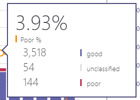

# Activar y usar el panel de calidad de llamadas para Microsoft Teams y Skype empresarial online

Aprenda a configurar su organización de Office 365 para usar el panel de calidad de llamadas y supervisar la calidad de las llamadas.
  
El panel de calidad de llamadas (CQD) para Microsoft Teams y Skype empresarial online le permite obtener información sobre la calidad de las llamadas hechas con Microsoft Teams y los servicios de Skype empresarial. En este tema, se describen los pasos que debe completar para iniciar la recopilación de datos.
  
  
## Últimos cambios y actualizaciones

Los cambios más recientes en el CQD son los siguientes:
  
- Incluye datos de Microsoft Teams además de datos de Skype empresarial online.
    
- Los informes de Resumen incluyen un filtro de producto para seleccionar todos los datos, los datos de Microsoft Teams o los datos de Skype empresarial online.

- Se ha actualizado la lógica de clasificación de calidad de las secuencias de vídeo y VBSS. Consulte [clasificación de secuencias en el panel de calidad de llamadas](stream-classification-in-call-quality-dashboard.md) para conocer las definiciones más recientes del clasificador.

Consulte este artículo para obtener una lista de [las dimensiones y medidas disponibles en el panel de calidad de llamadas](dimensions-and-measures-available-in-call-quality-dashboard.md).
  
> [!NOTE]
> Puede encontrar información sobre actualizaciones y cambios en el panel haciendo clic en el vínculo de las **buenas noticias.** pancarta cuando se muestra en el panel.
  
## Activar los informes de resumen del panel de calidad de llamadas de Microsoft (CQD)

Antes de empezar a usar el CQD, tendrá que activarlo para su organización de Office 365.

 de Microsoft Teams **con el centro de administración de Microsoft Teams**
 
1. Inicie sesión en su organización de Office 365 con la cuenta de administrador del servicio Microsoft Teams y, a continuación, seleccione el icono **Administrador** para abrir el centro de administración.
    
2. En el panel izquierdo, en **centros de administración**, seleccione **Microsoft Teams** para abrir el centro de administración de Microsoft Teams.
    
3. En el centro de administración de Microsoft Teams, seleccione **Panel de calidad de llamadas** en el panel de la izquierda.
    
  
4. En la página que se abre, inicie sesión con su cuenta de administrador global o la cuenta de administrador del servicio Microsoft Teams y, a continuación, proporcione las credenciales de la cuenta cuando se le soliciten.
    
     
  
Después de iniciar sesión, una vez que se haya activado, el CQD comenzará la recopilación y el procesamiento de datos.  
> [!NOTE]
> Puede demorar un par de horas en procesar los datos suficientes para mostrar resultados significativos en los informes. 

 de Skype empresarial **con el centro de administración de Skype empresarial**
 
1. Inicie sesión en su organización de Office 365 con una cuenta de administrador y, a continuación, seleccione el icono **Administrador** para abrir el centro de administración.
    
2. En el panel de la izquierda, en **centros de administración**, seleccione **Skype empresarial** para abrir el centro de administración de Skype empresarial.
    
3. En el centro de administración de Skype empresarial, seleccione **herramientas** en el panel izquierdo y, a continuación, seleccione **Panel de calidad de llamadas de Skype empresarial online**.
    
     
  
4. En la página que se abre, inicie sesión con su cuenta de administrador global y, a continuación, proporcione las credenciales de la cuenta cuando se le solicite.
    
     
  
Después de iniciar sesión, una vez que se haya activado, el CQD comenzará la recopilación y el procesamiento de datos.

  
## Características del panel de calidad de llamadas para Microsoft Teams y Skype empresarial online 

Los informes de resumen del CQD proporcionan un subconjunto de las características planeadas para los informes detallados. Las diferencias entre las dos ediciones se resumen aquí:
  
|**Característica**|**Informes de Resumen**|**Informes detallados**|
|:-----|:-----|:-----|
|Métrica de uso compartido de aplicaciones    |No    |Sí    |
|Soporte de información de creación de clientes    |Sí    |Sí    |
|Asistencia para la información del extremo del cliente    |Solo en cqd.teams.microsoft.com    |Solo en cqd.teams.microsoft.com    |
|Soporte de análisis detallado    |No    |Sí    |
|Métricas de confiabilidad de multimedia    |No    |Sí    |
|Informes listos para su servicio    |Sí    |Sí    |
|Informes de información general    |Sí    |Sí    |
|Conjunto de informes por usuario    |No    |Sí    |
|Personalización del conjunto de informes (agregar, eliminar, modificar informes)    |No    |Sí    |
|Métricas de pantalla compartida basada en vídeo    |No    |Sí    |
|Métricas de video    |No    |Sí    |
|Cantidad de datos disponibles    |Últimos 6 meses    |Últimos 6 meses    |
|Datos de Microsoft Teams    |Sí    |Sí    |
   
### Informes listos para su servicio

Las dos ediciones de CQD proporcionan una experiencia rápida, ofreciéndoles una métrica de calidad de llamadas sin necesidad de crear nuevos informes. Una vez que los datos se hayan procesado en el back-end, puede empezar a ver los datos de calidad de las llamadas en los informes.
  
### Informes de información general

Ambas ediciones del CQD proporcionan un punto de entrada de alto nivel para la información general sobre la calidad de las llamadas, pero la manera en que la información se presenta en los informes de resumen es diferente de la de los informes detallados.
  
Los informes de Resumen proporcionan una vista simplificada de informe de página con pestañas que permite a los usuarios examinar y comprender rápidamente el estado y las tendencias generales de calidad de las llamadas.
  
Las cuatro pestañas incluyen:
  
- **Calidad general** de las llamadas: proporciona información sobre todas las transmisiones, que es una agregación de secuencias de cliente y de cliente de servidor, así como las transmisiones de cliente de servidor y cliente independientes, en forma de tendencias mensuales y diarias.
    
- **Servidor-cliente** : proporciona detalles adicionales para las transmisiones entre los puntos de conexión de servidor y de cliente.
    
- **Cliente-cliente** : proporciona detalles adicionales para las transmisiones entre dos puntos de conexión cliente.
    
- **SLA de calidad de voz** : proporciona información sobre las llamadas que se incluyen en el SLA de calidad de voz de Skype empresarial online.
    
### Ficha calidad general de las llamadas

Use los datos de esta pestaña para evaluar el estado y las tendencias de la calidad de las llamadas consultando los recuentos de las transmisiones y los porcentajes deficientes. La leyenda de la esquina superior derecha muestra el color y los elementos visuales que representan estas métricas.
  

  
Las transmisiones se clasifican en tres grupos: buenos, deficientes y no clasificados. También se calculan valores deficientes de *%* que le dan la proporción de las transmisiones clasificadas como *malas* para el número total de streams clasificados. Debido a que las secuencias deficientes son de *% = deficientes/(secuencias deficientes, secuencias muy buenas) * 100* , esto hace que el *% deficiente* no se vea afectado por la presencia con varias secuencias sin *clasificar* . Para obtener información sobre lo que se usa para clasificar una secuencia como mala o buena, consulte [clasificación de secuencias en el panel de calidad de llamadas](stream-classification-in-call-quality-dashboard.md).
  
Use la escala de la izquierda para medir los valores de recuento de transmisiones.
  

  
Use la escala de la derecha para medir los valores de% deficiente.
  

  
También puede obtener los valores numéricos reales colocando el cursor sobre una barra.
  
> [!NOTE]
> El ejemplo siguiente es de un conjunto de datos de ejemplo muy pequeño, y los valores no son realistas para una implementación real. 
  

  
El volumen general de la transmisión es un factor importante para determinar la importancia de los porcentajes deficientes calculados. Cuanto menor sea el volumen de las transmisiones generales, menos confiable serán los valores de porcentajes deficientes.
  
### Pestaña servidor-cliente y cliente-cliente

Estas dos pestañas proporcionan detalles adicionales para las transmisiones que se llevaron a cabo en sus escenarios de extremo a punto de conexión. La pestaña servidor-cliente tiene cuatro secciones contraíbles, que representan cuatro escenarios en los que fluyen las transmisiones multimedia.
  
- Cableado interno
    
- Cableado fuera
    
- WiFi Inside
    
- WiFi fuera

De forma similar, la ficha cliente-cliente tiene cinco secciones contraíbles:

- Cableado interno de cable interno

- Cable interno de cable externo

- Cable fuera de cable externo

- Redes inalámbricas integradas en WiFi

- Redes inalámbricas cableadas internas externas
    
    
#### Prueba interna

Durante el procesamiento, el back-end del CQD clasifica una secuencia como *dentro* o *fuera* mediante la información de compilación, si existe. Los puntos de conexión de cada secuencia están asociados con una dirección de subred. Si la subred está en la lista de subredes marcada como InsideCorp en la información de la compilación cargada, se considera *dentro*. Si aún no se ha cargado la información de compilación, la prueba dentro de la prueba siempre clasificará las transmisiones como *externas*. Tenga en cuenta que la prueba dentro del escenario de cliente de servidor solo tiene en cuenta el punto de conexión de cliente. Como los servidores siempre están fuera del punto de vista del usuario, esto no se tiene en cuenta en la prueba.
  
#### Cableado frente a WiFi

Como indican los nombres, se trata de un criterio de clasificación basado en el tipo de conexiones de cliente. De nuevo, el servidor siempre se conecta por cable y no se incluye en el cálculo.
  
> [!NOTE]
> Dada una transmisión por secuencias, si uno de los dos puntos de conexión está conectado a una red WiFi, se clasifica como WiFi en el CQD. 
  
## Selección de datos de producto para ver en los informes

En los informes de Resumen y ubicación mejorados, puede usar el menú desplegable **filtro de producto** para mostrar todos los datos de productos, solo los datos de Microsoft Teams o solo los datos de Skype empresarial online.
  

  
En los informes detallados, puede usar la dimensión **es equipos** para filtrar los datos a Microsoft Teams o Skype empresarial online como parte de la definición del informe.
  
## Cargar información de datos de inquilino

El panel informes de resumen del CQD incluye una página de **carga de datos de inquilino** , a la que se accede seleccionando carga de datos de **inquilino** en el menú configuración en la esquina superior derecha. Esta página se usa para que los administradores carguen su propia información, como la asignación de la dirección IP y la información geográfica, la asignación de cada punto de conexión inalámbrico y su dirección MAC, la asignación de un extremo a la marca/modelo/tipo de extremo, etc.
  

  
1. En la página **carga de datos de inquilino** , use el menú desplegable para elegir un tipo de archivo de datos para cargarlo. El tipo de datos archivo indica el contenido del archivo (por ejemplo, "edificio" se refiere a la asignación de dirección IP y construcción, así como otra información geográfica, "punto final" hace referencia a la asignación del nombre del extremo a la marca, modelo o tipo de punto de conexión... información). Por el momento, admitimos la carga de tipos de datos "edificio" y "extremo" para cqd.teams.microsoft.com (en la etapa de versión preliminar y no disponible oficialmente), cqd.lync.com solo admite el tipo de datos "edificio" de carga. Se agregarán unos cuantos más tipos de datos a las versiones posteriores.
    
2. Después de seleccionar el tipo de datos de archivo, haga clic en **examinar** para elegir un archivo de datos.
    
   - El archivo de datos debe ser un archivo. TSV (valores separados por tabulaciones) o un archivo. csv (valores separados por comas). Si usa un archivo. csv, cualquier campo que contenga una coma debe estar rodeado de comillas o tener la coma eliminada. Por ejemplo, si el nombre del edificio es NY, NY, en el archivo. csv, debe escribirse como "NY, NY".
    
   - El archivo de datos no debe tener un tamaño superior a 50 MB.

   - Los archivos cargados en cqd.teams.microsoft.com tienen un límite de fila expandido de 1 millón para mantener el rendimiento de las consultas rápidamente. Podemos imponer ese límite también en cqd.lync.com.
    
   - Para cada archivo de datos, cada columna del archivo debe coincidir con un tipo de datos predefinido, que se trata más adelante en este tema.
    
3. Después de seleccionar un archivo de datos, especifique **fecha de inicio** y, opcionalmente, **especifique una fecha**de finalización.
    
4. Después de seleccionar **fecha de inicio**, seleccione **cargar** para cargar el archivo en el servidor CQD.
    
    Antes de que se cargue el archivo, primero se valida. Una vez que se haya validado, se almacena en un BLOB de Azure. Si se produce un error de validación o el archivo no se almacena en un BLOB de Azure, se muestra un mensaje de error que solicita una corrección para el archivo. La imagen siguiente muestra un error que se produce cuando el número de columnas del archivo de datos es incorrecto.
    
     
  
5. Si no se producen errores durante la validación, la carga del archivo se realizará correctamente. Puede ver el archivo de datos cargado en la tabla **mis cargas** , que muestra la lista completa de todos los archivos cargados para el inquilino actual en la parte inferior de la página.
    
    Cada registro muestra un archivo de datos de inquilino cargado, con tipo de archivo, hora de última actualización, período de tiempo, descripción, un icono de quitar y un icono de descarga. Para quitar un archivo, seleccione el icono de papelera de la tabla. Para descargar un archivo, seleccione el icono de descarga en la columna **Descargar** de la tabla.
    
     

6. Tenga en cuenta que si elige usar varios archivos de datos de compilación o varios archivos de datos de extremo, la velocidad de operación de algunos informes será más lenta.

### Formato y estructura del archivo de datos de inquilinos

### Generando archivo de datos
El CQD usa la creación de un archivo de datos al derivar la columna subred de expandir la columna Network + rango y, después, se une la columna subnet a la primera subred de la llamada en la columna subred para mostrar edificio/ciudad/país o región... informaciones. El formato del archivo de datos que cargue debe cumplir los siguientes requisitos para pasar la comprobación de validación antes de cargarlo.
  
- El archivo debe ser un archivo. TSV, lo que significa que, en cada fila, las columnas están separadas por una TABULAción o un archivo. csv con cada columna separada por una coma.
    
- El contenido del archivo de datos no incluye encabezados de tabla. Eso significa que la primera línea del archivo de datos debe ser datos reales, no encabezados como "red", etc.
    
- Para cada columna, el tipo de datos solo puede ser String, Number o bool. Si es un número, el valor debe ser un valor numérico; Si es bool, el valor debe ser 0 o 1.
    
- Para cada columna, si el tipo de datos es una cadena, los datos pueden estar vacíos (pero deben estar separados por un delimitador adecuado (es decir, una tabulación o una coma). Esto simplemente asigna a ese campo un valor de cadena vacía.
    
- Debe haber 14 columnas por cada fila, cada columna debe tener el siguiente tipo de datos y las columnas deben estar en el orden que se indica en la tabla siguiente:
    
|**Nombre de columna**|**Tipo de datos**|**Ejemplo**|
|:-----|:-----|:-----|
|Red    |String    |192.168.1.0    |
|Red    |String    |Estados Unidos/Seattle/SEATTLE-mar-1    |
|NetworkRange    |Número    |26    |
|BuildingName    |String    |SEATTLE-MAR-1    |
|Propiedad    |String    |Dpto    |
|Edificio    |String    |Finalización de ti    |
|BuildingOfficeType    |String    |Integración    |
|Ciudad    |String    |Seattle    |
|ZipCode    |String    |98001    |
|Tercer    |String    |DÉJEN    |
|Estado    |String    |WA    |
|Region    |String    |MSUS    |
|InsideCorp    |Booleano    |1    |
|ExpressRoute    |Booleano    |,0    |
   
> [!IMPORTANT]
> El intervalo de red se puede usar para representar una superred (combinación de varias subredes con un único prefijo de enrutamiento). Todas las nuevas cargas de creación se marcarán para todos los intervalos superpuestos. Si ha cargado previamente un archivo de compilación, debe descargar el archivo actual y volver a cargarlo para identificar cualquier solapamiento y corregir el problema antes de volver a cargar. Cualquier solapamiento de los archivos cargados previamente puede dar lugar a asignaciones erróneas de subredes a edificios de los informes. Ciertas implementaciones de VPN no informan con precisión de la información de subred. Se recomienda que al agregar una subred VPN al archivo de creación, en lugar de una entrada para la subred, se agreguen entradas independientes para cada dirección de la subred VPN como una red de 32 bits independiente. Cada fila puede tener los mismos metadatos de compilación. Por ejemplo, en lugar de una fila para 172.16.18.0/24, debe tener 256 filas, con una fila por cada dirección entre 172.16.18.0/32 y 172.16.18.255/32, ambos incluidos. 

### Archivo de datos de extremo
El CQD usa el archivo de datos de extremo al unir su columna EndpointName a la primera columna de nombre de punto de conexión de cliente del registro de llamada/segundo para mostrar la información de creación/modelo de puntos de conexión. El formato del archivo de datos que cargue debe cumplir los siguientes requisitos para pasar la comprobación de validación antes de cargarlo.

- El archivo debe ser un archivo. TSV, lo que significa que, en cada fila, las columnas están separadas por una TABULAción o un archivo. csv con cada columna separada por una coma.

- El contenido del archivo de datos no incluye encabezados de tabla. Eso significa que la primera línea del archivo de datos debe ser datos reales, no encabezados como "EndpointName", etc.

- Para cada columna, el tipo de datos solo puede ser una cadena y no debe tener más de 64 caracteres, que es la longitud máxima permitida.

- Para cada columna, los datos pueden estar vacíos (pero deben estar separados por un delimitador adecuado (es decir, una tabulación o una coma). Esto simplemente asigna a ese campo un valor de cadena vacía.

- Debe haber 7 columnas por cada fila y las columnas deben estar en el orden que se indica en la tabla siguiente.

- EndpointName debe ser único; de lo contrario, se producirá un error de carga debido a una fila duplicada porque provocará una Unión incorrecta.

-  EndpointLabel1, EndpointLabel2, EndpointLable3 son etiquetas personalizables del usuario, pueden ser cadenas vacías o un valor que los usuarios prefieren, como "Departamento de ti designado 2018 portátil", "etiqueta de inventario 5678"... etc.

|**Nombre de columna**|**Tipo de datos**|**Ejemplo**|
|:-----|:-----|:-----|
|EndpointName    |String    |1409W3534    |
|EndpointMake    |String    |Fabrikam Inc.    |
|EndpointModel    |String    |Fabrikam modelo 123    |
|EndpointType     |String    |Portatil    |
|EndpointLabel1    |String    |Equipo portátil designado de 2018    |
|EndpointLabel2    |String    |Etiqueta de activo 5678    |
|EndpointLabel3    |String    |Comprar 2018     |

## Selección de tipos de medios en informes detallados

Los informes detallados son compatibles con la calidad y la fiabilidad de los medios para audio, vídeo, uso compartido de aplicaciones y tipos de medios de uso compartido de pantalla basado en vídeo. Las dimensiones, las medidas y los filtros que son específicos de un único tipo de medio tienen "audio", "vídeo", "uso compartido" o "VBSS" como prefijo.
  

  
Si desea ver las dimensiones y medidas de un solo tipo de medio, es posible que se necesite la nueva dimensión y el filtro. Por ejemplo, para tener un informe que muestre el número total de sesiones en diferentes tipos de medios, incluya la dimensión MediaType.
  

## Temas relacionados
[Configurar el análisis de llamadas de Skype Empresarial](set-up-call-analytics.md)

[Usar análisis de llamadas para solucionar problemas de baja calidad de las llamadas](use-call-analytics-to-troubleshoot-poor-call-quality.md)

[Análisis de llamadas y Panel de calidad de llamadas](difference-between-call-analytics-and-call-quality-dashboard.md)

  
 
