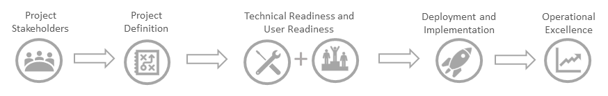

# Acerca del marco de actualizaciónAbout the upgrade framework

Para ayudar a las conjeturas su viaje por la actualización, nos hemos empleado un marco de trabajo probada para implementar el cambio.To help take the guesswork out of your upgrade journey, we’ve employed a proven framework for implementing change. Tal y como se muestra a continuación, cada paso en el marco de trabajo se basa en el anterior paso y, para obtener resultados óptimos, se recomienda seguir los pasos en orden.As illustrated below, each step in the framework builds on the step prior and, for optimal results, we recommend following the steps in order.  

Comience por reunir a las partes interesadas derecha y definir el plan de actualización (ej.)Begin by bringing together the right stakeholders and defining your upgrade plan (eg. ámbito, objetivos y escala de tiempo).scope, goals and timeline). Con un plan en su lugar, confirme que están listos para los equipos de su entorno técnico y los usuarios finales.With a plan in place, confirm your technical environment and your end-users are ready for Teams. A continuación, implementar la actualización en fases, pasar de un proyecto piloto a una actualización de toda la organización cuando esté listo.Then, implement your upgrade in stages, moving from a pilot to an organization-wide upgrade when ready. Una vez que la organización esté en los equipos, establecer un plan operativo que supervisa para la calidad y acelera la adopción de usuario.Once your organization is on Teams, establish an operational plan that monitors for quality and accelerates user adoption.

![Asegúrese de que el proyecto está configurado para el éxito con el equipo del proyecto derecho. Definir el ámbito del proyecto, las metas y escala de tiempo. Confirmar la preparación de técnico y de usuario. Ejecutar el plan de implantación. Mantener momentum para maximizar los resultados.] (media/upgrade-banner-main.png "Comenzar su viaje por la actualización")

Busque este gráfico framework en páginas relacionadas para identificar dónde se encuentra en el proceso de actualización.Look for this framework graphic on related pages to identify where you are in the upgrade process.

## Escala de tiempo de actualización de ejemploSample upgrade timeline

Su viaje actualización comienza cuando se inicia la planificación de los cambios.Your upgrade journey begins when you start planning for the change. Aprovechar el marco de éxito como una directriz, a continuación es una escala de tiempo de ejemplo que se toman de la fase previa a la actualización donde va a planear y preparar la actualización, a través de la actualización y en la fase de explotación posteriores a la actualización, diseñada para mantener y ampliar la los resultados empresariales.Leveraging the success framework as a guideline, below is a sample timeline that take you from the pre-upgrade phase where you will plan and prepare for your upgrade, through the upgrade and into the post-upgrade operational phase, designed to sustain and amplify your outcomes. 

> [!NOTE]
> Se entiende que su viaje a los equipos podría incluir aprovechamiento de varios [modos de](https://aka.ms/skypetoteams-coexist) y actualización de grupos de usuarios en momentos diferentes, que le permiten controlar la experiencia de actualización de usuario que se mantiene momentum con los equipos.We understand that your journey to Teams might involve leveraging multiple [modes](https://aka.ms/skypetoteams-coexist) and upgrading groups of users at different times, which will enable you to control the user upgrade experience while maintaining momentum with Teams.  

Para ayudar a demostrar cómo es posible que se desdoblan su viaje por la actualización, hemos proporcionado un ejemplo de plan de debajo que define un viaje va de Skype para profesionales en línea a modo de islas a los equipos sólo.To help demonstrate how your upgrade journey might unfold, we’ve provided a sample plan below that defines a journey going from Skype for Business Online to Islands mode to Teams only. Además, el plan de ejemplo describe una organización que ha dividido sus usuarios en cuatro grupos de actualización o las cohortes.In addition, the sample plan outlines an organization that has divided their users into four upgrade groups, or cohorts. Uso de esto como una plantilla, personalizar el plan para abarcar su viaje específico para los equipos, la incorporación de los distintos [modos de](https://aka.ms/skypetoteams-coexist) que va a utilizar y el número de actualización grupos se podrá segmentar los usuarios en.Using this as a template, customize the plan to encompass your specific journey to Teams, incorporating the various [modes](https://aka.ms/skypetoteams-coexist) you’ll use and the number of upgrade groups you’ll segment your users into. 

## Previos a la actualizaciónPre-upgrade

**Prepare la organización para los equipos**.**Prepare your organization for Teams**. Para ayudar a garantizar una correcta actualización a los equipos, es importante asignar tiempo suficiente para la preparación del.To help ensure a successful upgrade to Teams, it’s important to allocate adequate time for preparation. No sólo a su organización puedan iniciar rápidamente darse cuenta el valor de los equipos, podrá acelerar la actualización de Skype para la empresa tan pronto como está listo para los equipos.Not only will your organization be able to quickly start realizing the value of Teams, you’ll be able to accelerate your upgrade from Skype for Business as soon as Teams is ready for you. Si ya ha habilitado los equipos junto con Skype para la empresa, use estas actividades previa a la actualización como un punto de comprobación para validar la preparación de su organización antes de actualizar a los usuarios a los equipos.If you’ve already enabled Teams alongside Skype for Business, use these pre-upgrade activities as a checkpoint to validate your organization’s readiness before you upgrade users to Teams. 

> [!TIP]
> Descargue el [Kit de actualización de éxito](https://aka.ms/UpgradeSuccessKit) para materiales de preparación de usuario de plantilla, como las comunicaciones y encuestas de usuario, además de un ejemplo de plan de actualización del proyecto piloto de pruebas y plan.Download the [Upgrade Success Kit](https://aka.ms/UpgradeSuccessKit) for template user readiness materials, such as communications and user surveys, in addition to a sample upgrade project plan and pilot test plan. Los elementos que están disponibles en el kit se marcan con un asterisco (\*) en las listas de abajo.Items that are available in the kit are marked with an asterisk (\*) in the lists below.

### Plan: Crear un plan de actualización para ayudar a garantizar que su organización está configurada para el éxito a largo plazoPlan: Create your upgrade plan to help ensure your organization is set up for long-term success

| PasoStep |  | ResumenSummary | RecursoResource |
|------|--|---------|----------|
| **1****1** | **Definir las partes interesadas****Define your stakeholders** | Asignar a los miembros del equipo responsables de dirigir actualización con éxito.Assign project team members accountable for driving upgrade success. | [Dar de alta las partes interesadasEnlist your stakeholders](upgrade-enlist-stakeholders.md) |
| **2****2** | **Definir el ámbito y la visión del proyecto****Define your project vision and scope** | Diseñe su visión de "Panorama general" y el ámbito del proyecto actual para crear un blueprint para su viaje por la actualización.Design your “big picture” vision and current project scope to create a blueprint for your upgrade journey. | [Visión del proyectoProject vision](upgrade-define-project-scope.md#project-vision)    [Ámbito del proyectoProject scope](upgrade-define-project-scope.md#project-scope) |
| **3****3** | **Definir los objetivos del proyecto****Define your project goals** | Establecer los objetivos de destinados que permiten medir el progreso, así como el éxito del proyecto.Set targeted goals that enable you to measure progress as well as project success. | [Objetivos del proyectoProject goals](upgrade-define-project-scope.md#project-goals) |
| **4****4** | **Identificar los riesgos y los planes de mitigación****Identify risks and mitigation plans** | Establecer un plan de mitigación para asegurarse de que puede obtener rápidamente su proyecto en el camino si surgen problemas.Establish a mitigation plan to ensure you can quickly get your project back on track should issues arise. | [Los riesgos y mitigaciónRisks and mitigation](upgrade-define-project-scope.md#risks-and-mitigation) |
| **5****5** | **Definir la escala de tiempo****Define your timeline** | Establecer una escala de tiempo y los hitos clave para ayudar a su proyecto a permanecer en el tiempo y dentro del presupuesto.Set a timeline and key milestones to help your project stay on time and on budget. | [Escala de tiempoTimeline](upgrade-define-project-scope.md#timeline)    [Kit de actualización correctaUpgrade Success Kit](https://aka.ms/UpgradeSuccessKit) |
| **6****6** | **Definir el Skype adecuado para la estrategia de actualización y coexistencia empresariales y de los equipos****Define the appropriate Skype for Business and Teams upgrade and coexistence strategy** | Asignar su viaje para garantizar la mejor ruta de Skype para la empresa a los equipos para su organización.Map your journey to ensure the best path from Skype for Business to Teams for your organization. | [Descripción de Microsoft Teams y Skype para la interoperabilidad y coexistencia de negocioUnderstand Microsoft Teams and Skype for Business coexistence and interoperability](teams-and-skypeforbusiness-coexistence-and-interoperability.md)    [Elija su viaje por la actualizaciónChoose your upgrade journey](upgrade-and-coexistence-of-skypeforbusiness-and-teams.md) |

### Prepare: Evaluación de la preparación de su organización para los equiposPrepare: Evaluate your organization’s readiness for Teams

| PasoStep |  | ResumenSummary | RecursoResource |
|------|--|---------|----------|
| **1****1** | **Evaluar el entorno y completar la incorporación técnico de los equipos****Assess your environment and complete Teams technical onboarding** | Asegúrese de que su entorno está preparado para los equipos ayudar a optimizar la experiencia del usuario y facilitar la actualización a través del tiempo.Ensure your environment is ready for Teams to help optimize the user experience and facilitate your upgrade over time. | [Evaluar el entorno antes de actualizar a los equipos](upgrade-plan-journey-evaluate-environment.md).[Evaluate your environment before upgrading to Teams](upgrade-plan-journey-evaluate-environment.md).   [Preparar su servicio para la actualización a los equiposPrepare your service for upgrading to Teams](upgrade-prepare-environment-prepare-service.md) |
| **2****2** | **Optimizar el rendimiento de red de los equipos, especialmente para escenarios multimedia en tiempo real****Optimize network for Teams, particularly for real-time media scenarios** | Si va a implementar las reuniones, audio o vídeo, lleve a cabo estos pasos adicionales para optimizar la red para que la funcionalidad.If you’re deploying audio, video, or meetings, take these additional steps to optimize your network for that functionality. | [Preparar la red para la actualización a los equiposPrepare your network for upgrading to Teams](upgrade-prepare-environment-prepare-network.md) |
| **3****3** | **Evalúe la preparación de los cambios en la organización y definir escenarios de trabajo en equipo****Assess organizational change readiness and define teamwork scenarios** | Comprender el usuario base para preparar el valor correcto de mensajería así como el nivel de educación para facilitar y acelerar la adopción de usuario.Understand your user base to prepare the right value messaging and level of education to facilitate and accelerate user adoption. | [Preparación de cambios en la organizaciónOrganizational change readiness](upgrade-org-change-readiness.md#organizational-change-readiness) |
| **4****4** | **Preparar un plan de preparación del usuario para definir cómo va a comunicarse, aprendizaje y admitir usuarios****Prepare a user readiness plan to define how you will communicate, train, and support users** | Personalice su plan de comunicaciones, aprendizaje y soporte técnico para garantizar receptiveness óptima para la nueva tecnología.Personalize your communications, training and support plan to ensure optimal receptiveness to the new technology. | [Preparar un plan de preparación del usuarioPrepare a user readiness plan](upgrade-user-readiness.md)  [Kit de actualización correctaUpgrade Success Kit](https://aka.ms/UpgradeSuccessKit) |
| **5****5** | **Anunciar el lanzamiento de Microsoft Teams pendiente****Announce the pending launch of Microsoft Teams** | Comunicarse pronto para ayudar a los usuarios sientan, reducir la confusión y generar diversión.Communicate early to help users feel included, reduce confusion and generate excitement. | [Kit de actualización correctaUpgrade Success Kit](https://aka.ms/UpgradeSuccessKit) |
| **6****6** | **Preparar su personal de TI para los equipos****Prepare your IT staff for Teams** | Confirme su técnica y personal de soporte técnico tiene todo lo necesario para preparado y compatible con el entorno técnico para los equipos.Confirm your technical and support staff has everything they need to ready and support your technical environment for Teams. | [Preparar su personal de TI para Microsoft TeamsPrepare your IT staff for Microsoft Teams](upgrade-prepare-it-pros.md)    [Kit de actualización correctaUpgrade Success Kit](https://aka.ms/UpgradeSuccessKit) |

### Prueba piloto: Ejecutar una prueba piloto para confirmar que la organización está preparada y a informar a su viaje óptima para los equiposPilot: Run a pilot to confirm that your organization is ready and inform your optimal journey to Teams

| PasoStep |  | ResumenSummary | RecursoResource |
|------|--|---------|----------|
| **1****1** | **Logística piloto de esquema****Outline pilot logistics** | Definir la logística piloto formal para ayudar a validar la preparación de su organización para actualizarlas o coexistir.Define formal pilot logistics to help validate your organization’s readiness to upgrade or coexist. | [Logística piloto de esquemaOutline pilot logistics](pilot-essentials.md#1-outline-pilot-logistics) |
| **2****2** | **Seleccionar a los participantes pilotos y escenarios de prueba****Select your pilot participants and test scenarios** | Identificar los usuarios que pueden ayudar a validar escenarios de trabajo en equipo y comprobar la preparación de los equipos.Identify users who can help validate teamwork scenarios and verify Teams readiness. | [Seleccionar a los participantes pilotos y escenarios de pruebaSelect your pilot participants and test scenarios](pilot-essentials.md#2-select-your-pilot-participants-and-test-scenarios) |
| **3****3** | **Diseño de la encuesta de comentarios y plan de prueba****Design your test plan and feedback survey** | Identificar claramente definidas tareas para los participantes para llevar a cabo y una manera para que puedan compartir sus comentarios.Identify clearly defined tasks for participants to complete and a way for them to share their feedback. | [Diseño de la encuesta de comentarios y plan de pruebaDesign your test plan and feedback survey](pilot-essentials.md#3-design-your-test-plan-and-feedback-survey) |
| **4****4** | **Crear un plan de comunicaciones piloto****Create your pilot communications plan** | Instruya a los participantes pilotos en lo que sucede, cuándo y por qué, y lo que se espera de ellos.Educate pilot participants on what’s happening, when, and why, and what’s expected of them. | [Crear un plan de comunicacionesCreate your communications plan](pilot-essentials.md#4-create-your-communications-plan)  [Kit de actualización correctaUpgrade Success Kit](https://aka.ms/UpgradeSuccessKit) |
| **5****5** | **Llevar a cabo la prueba piloto****Conduct your pilot** | Iniciar al piloto, realizar un seguimiento del progreso y realice una iteración según sea necesario para optimizar los resultados de la prueba piloto.Start your pilot, track progress and iterate as needed to optimize your pilot results. | [Llevar a cabo la prueba pilotoConduct your pilot](pilot-essentials.md#5-conduct-your-pilot) |
| **6****6** | **Evaluar los conocimientos y evaluar el plan de ir directa****Assess learnings and evaluate your go-forward plan** | Recopilar comentarios del usuario, estadísticas de la red y admitir vales para análisis frente a los objetivos y determinar el plan de ir directa.Gather  user feedback, network stats, and support tickets for analysis against your goals and determine your go-forward plan. | [Evaluar los conocimientos y evaluar el plan de ir directaAssess learnings and evaluate your go-forward plan](pilot-essentials.md#6-assess-learnings-and-evaluate-your-go-forward-plan)

### Implementar: Ejecutar equipos en coexistencia con Skype para la empresaDeploy: Run Teams in coexistence with Skype for Business

| PasoStep |  | ResumenSummary | RecursoResource |
|------|--|---------|----------|
| **1****1** | **Anunciar el lanzamiento oficial de los equipos****Announce the official launch of Teams** | Generar diversión y momentum mediante el envío de un anuncio del lanzamiento oficial cuando los equipos está listo.Generate excitement and momentum by sending an official launch announcement when Teams is ready. | [Kit de actualización correctaUpgrade Success Kit](https://aka.ms/UpgradeSuccessKit) |
| **2****2** | **Habilitar el modo de coexistencia adecuados para los usuarios****Enable the appropriate coexistence mode for your users** | Siga los pasos para establecer los modos de coexistencia adecuada para su organización.Follow steps to set the right coexistence mode(s) for your organization. | [Configurar su coexistencia y la configuración de actualizaciónSetting your coexistence and upgrade settings](setting-your-coexistence-and-upgrade-settings.md) |
| **3****3** | **Mantenerse informado acerca de la guía básica de los equipos****Stay informed about the Teams roadmap** | Supervisar la guía básica de los equipos para identificar el momento adecuado para su organización mover a los equipos.Monitor the Teams roadmap to identify the right time for your organization to move to Teams. | [Guía básica de los equiposTeams roadmap](https://aka.ms/teamsroadmap) |
| **4****4** | **Enviar comunicaciones adicionales e integrarse a campeones de los equipos a la diversión de unidad y la adopción de los equipos****Send additional communications and engage Teams champions to drive excitement and adoption of Teams** | Fomentar la adopción de usuario y mantener diversión para los equipos con communications continuada y Campeones.Encourage user adoption and maintain excitement for Teams with ongoing communications and champions. | [Programa de campeones de Microsoft 365Microsoft 365 Champions Program](https://aka.ms/O365Champions) |

## UpgradeUpgrade 

**Realizar el movimiento oficial a los equipos**.**Make the official move to Teams**. Al actualizar a los usuarios, moverlas al modo de sólo los equipos.When you upgrade your users, you move them into Teams only  mode. Los equipos se convierte en sus principales de la aplicación de chat, las reuniones, llamadas y colaboración y el acceso a la Skype para la aplicación empresarial está deshabilitado.Teams becomes their primary app for chat, meetings, calling, and collaboration, and access to the Skype for Business app is disabled. Aunque los aspectos técnicos de esta fase son bastante sencillos, tenga en cuenta el efecto que podría tener sobre la experiencia de usuario en el cambio y se permita que los usuarios realizar la transición oficialmente sus actividades de Skype para la empresa a los equipos.Although the technical aspects of this phase are quite simple, consider the effect the change might have on user experience and allow time for users to officially transition their activities from Skype for Business to Teams. Para reducir los usuarios tener distintas experiencias con distintos clientes, pruebe a limitar la ventana de actualización de end-to-end para 45 días o lo.To reduce users’ having different experiences with different clients, try to limit the end-to-end upgrade window to 45 days or so.

### Actualización: Implementar la actualización de Skype para la empresa a los equiposUpgrade: Implement your upgrade from Skype for Business to Teams

| PasoStep |  | ResumenSummary | RecursoResource |
|------|--|---------|----------|
| **1****1** | **Confirme que ha completado las actividades previa a la actualización que se ha descrito anteriormente****Confirm that you’ve completed the pre-upgrade activities described above** | Ayudar a garantizar el éxito de actualización mediante la confirmación de finalización de todas las actividades de planeación y preparación.Help ensure upgrade success by confirming completion of all planning and preparation activities. | Todas las anterioresAll the above |
| **2****2** | **Iniciar comunicaciones a los usuarios en el primer grupo de actualización****Initiate communications to users in your first upgrade group** | Notificar a los usuarios que va a iniciar las actualizaciones y mantenerlos informados durante todo el proceso.Notify users that upgrades are starting, and keep them informed throughout the process. | [Preparar un plan de preparación del usuarioPrepare a user readiness plan](upgrade-user-readiness.md)    [Kit de actualización correctaUpgrade Success Kit](https://aka.ms/UpgradeSuccessKit) |
| **3****3** | **Habilitar el modo de coexistencia para equipos sólo para los usuarios de su primer grupo de actualización****Enable the coexistence mode to Teams Only for users in your first upgrade group** | Siga los pasos correspondientes a su Skype para el entorno empresarial para llevar a cabo la migración de usuario técnica.Follow steps appropriate to your Skype for Business environment to perform the technical user migration. | [Actualización de Skype para la empresa en línea a los equiposUpgrade from Skype for Business Online to Teams](upgrade-to-Teams-execute-SkypeforBusinessOnline.md)   [Actualizar de Skype para híbrido de negocio o local a los equiposUpgrade from Skype for Business hybrid or on-premises to Teams](upgrade-to-Teams-execute-SkypeforBusinessHybridOnprem.md)
| **4****4** | **Repita las actividades de actualización anteriores para los grupos restantes de actualización en un ciclo sucesivo****Repeat the preceding upgrade activities for the remaining upgrade groups on a rolling cycle** | Seguir el plan de comunicaciones continuada de unidad y grupos de usuarios en función del plan de actualización.Continue to drive your ongoing communications plan and upgrade user groups based on your plan. | |
| **5****5** | **Enviar comentarios posteriores a la actualización encuestas a todos los usuarios****Send post-upgrade feedback surveys to all users** | Usar una encuesta de comentarios para capturar los comentarios y los conocimientos de los usuarios.Use a feedback survey to capture feedback and insights from users. | [Kit de actualización correctaUpgrade Success Kit](https://aka.ms/UpgradeSuccessKit) |

## Después de la actualizaciónPost-upgrade

**Maximizar el valor de negocio con los equipos**.**Maximize business value with Teams**. Después de la organización se actualice totalmente a los equipos, llevar tiempo para evaluar su grado de éxito de los objetivos e implementar un plan para continuar momentum hacia delante.After your organization is fully upgraded to Teams, take time to evaluate your success against your goals and implement a plan to continue forward momentum. 

### Operar: Medir el éxito de la actualizaciónOperate: Measure the success of your upgrade

| PasoStep |  | ResumenSummary | RecursoResource |
|------|--|---------|----------|
| **1****1** | **Evaluar el éxito de la actualización inicial****Assess your initial upgrade success** | Evaluar el progreso en relación con los objetivos establecidos en la fase previa a la actualización.Evaluate progress against the goals you established in the pre-upgrade phase. | [Objetivos del proyectoProject goals](upgrade-define-project-scope.md#project-goals) |
| **2****2** | **Implementar un plan de mitigación para los objetivos que no están en el camino****Implement a mitigation plan for any goals that aren’t on track** | Definir mitigación o las estrategias de corrección de curso para que no se cumplan los objetivos.Define mitigation or course-correction strategies for goals that are not being met. | [Objetivos del proyectoProject goals](upgrade-define-project-scope.md#project-goals) |
| **3****3** | **Monitor de estado de la red y calidad****Monitor for network health and quality** | Implementar una comprobación de la calidad y plan de supervisión para ayudar a garantizar un usuario positivo experiencia, así como reducir las llamadas de soporte técnico de su.Implement a quality check and monitoring plan to help ensure a positive user experience as well as reduce calls to your support desk. | [Monitor de estado de la red y calidadMonitor for network health and quality](continue-journey.md#monitor-for-network-health-and-quality) |
| **4****4** | **Unidad de usuario momentum y adopción****Drive user momentum and adoption** | Fomentar la adopción de usuario y mantener diversión para los equipos con un plan de adopción continuada.Encourage user adoption and maintain excitement for Teams with an ongoing adoption plan. | [Unidad de usuario momentum y adopciónDrive user momentum and adoption](continue-journey.md#drive-user-momentum-and-adoption) |
| **5****5** | **Preparación para la nueva funcionalidad****Prepare for new functionality** | Obtener el máximo valor mediante el establecimiento de un ciclo de cambio para nuevas innovaciones y mejoras del producto.Realize maximum value by establishing a change cycle for new innovations and product improvements. | [Preparación para la nueva funcionalidadPrepare for new functionality](continue-journey.md#prepare-for-new-functionality)

> [!Note]
> Nuestro contenido de actualización está en constante evolución.Our Upgrade content is continually evolving. No olvide Eche un vistazo a las instrucciones más reciente y leer el [blog de los equipos](https://techcommunity.microsoft.com/t5/Microsoft-Teams-Blog/bg-p/MicrosoftTeamsBlog).Be sure to check back for the latest guidance, and read the [Teams blog](https://techcommunity.microsoft.com/t5/Microsoft-Teams-Blog/bg-p/MicrosoftTeamsBlog). 

> [!Important]
> Si es administrador en el inquilino de Office 365, es posible que inicie vean las opciones de actualización en su cmdlet de PowerShell o equipos & Skype para el centro de administración de negocio.If you’re an admin on your Office 365 tenant, you might start seeing upgrade options in your PowerShell cmdlet or Teams & Skype for Business Admin Center. Tener la opción de actualización no significa necesariamente que su organización está preparada para que este cambio.Having the option to upgrade doesn’t necessarily mean your organization is ready for this change. Para una experiencia de usuario óptima, confirme que los equipos cumple los requisitos de colaboración y comunicación, validar que está lista para equipos de soporte técnico e implementar el plan de preparación del usuario antes de actualizar a los usuarios a los equipos de la red.For an optimal user experience, confirm that Teams meets your collaboration and communication requirements, validate that your network is ready to support Teams, and implement your user readiness plan before upgrading users to Teams.
 
