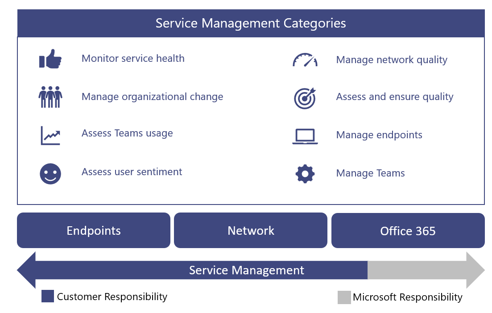

# Ejecutar los servicios

Este artículo forma parte de la fase excelencia operativa del viaje de actualización, que comienza tan pronto como haya completado la actualización de Skype Empresarial a Teams.

En este artículo se proporciona información general sobre los requisitos para Teams para su organización después de actualizar. Al operar correctamente sus Teams, puede asegurarse de que proporciona una experiencia confiable y de alta calidad para su organización.

## Introducción a la guía de operaciones

La Guía de operaciones proporciona información general sobre todas las tareas y actividades necesarias como parte de la función de administración de servicios para Microsoft Teams.

La administración de servicios es un tema muy amplio que cubre las operaciones del día a día del servicio de Microsoft Teams una vez que se ha implementado y habilitado para los usuarios. El Teams incluye Microsoft 365 o Office 365 y los componentes de infraestructura que se implementan localmente (por ejemplo, redes).

Seguramente, el concepto de "administración de servicios" no es nuevo para la mayoría de organizaciones. Es posible que ya haya implementado procesos y tareas asociados con los servicios existentes. Dicho esto, es probable que pueda aumentar los procesos actuales cuando planee la administración de servicios hoy para admitir Teams en el futuro.

La administración de servicios abarca todas las actividades y procesos implicados en la administración de Teams de un extremo a otro. Como se ha indicado anteriormente, algunos componentes de la administración de servicios (la infraestructura que comprende el servicio Microsoft 365 o Office 365 en sí) son responsabilidad de Microsoft, mientras que usted, el cliente, es responsable de que los usuarios administren los distintos aspectos de Teams, la red y los puntos de conexión que proporcione.

Las tareas y actividades de esta guía se agrupan en ocho categorías como se muestra en el siguiente diagrama. Cada una de estas categorías se expandirá en las secciones siguientes.

<table>
<tr><td>  Puntos de decisión</td><td><ul><li>Decida cómo se implementarán las operaciones para Teams.</li></ul></td></tr>

<tr><td> Pasos siguientes</td><td><ul><li>Revise la Guía de operaciones en su totalidad.</li><li>Implemente una estrategia de operaciones que se alinee con los objetivos de su organización para ofrecer la calidad y la confiabilidad de Teams cargas de trabajo.</li><li>Revise la Guía de revisión de calidad de la experiencia.</li><li> Implemente una estrategia de operaciones para realizar periódicamente revisiones de calidad de la experiencia para asegurarse de que Teams implementación está funcionando en sus capacidades máximas.</li></ul></td></tr>

</table>

### Asignación de roles operativos

La planificación que ha hecho para las operaciones durante la fase de envisión es crítica, ya que las actividades de operaciones comienzan cuando se habilitan los primeros usuarios piloto. En esta guía se enumeran las actividades y tareas que deben realizarse diariamente, semanalmente, mensualmente o según sea necesario para mantener una implementación de Teams alta calidad. En esta guía se proporcionan conocimientos y instrucciones sobre cómo realizar estas actividades y tareas críticas.

Un componente crucial de una implementación correcta es asegurarse de que la planificación que realice al principio de la fase de envisión incluye determinar quién será el responsable de realizar actividades específicas. Una vez que haya descubierto qué tareas y actividades se aplican a la implementación, deben comprenderlas y seguirlas los grupos o personas que les asigne.

Cada equipo que identifique debe revisar y acordar las tareas y responsabilidades identificadas e iniciar la preparación. Esto puede incluir formación y preparación, proporcionar actualizaciones del plan de personal o garantizar que los proveedores externos estén listos para entregar.

Las actividades y roles definidos en esta guía deben ser válidos en la mayoría de los escenarios, pero cada Teams implementación es única; por lo tanto, puede usar esta guía como punto de partida para personalizar las actividades y los roles predeterminados para satisfacer sus necesidades.

Asegúrese de que cada equipo responsable tenga una buena comprensión de las actividades necesarias para ejecutar el servicio. Es fundamental que cada equipo acepte y firme su responsabilidad en su organización antes de que comience el primer piloto.

Una vez que se ha alcanzado un acuerdo, los equipos correspondientes deberían empezar a poner en funcionamiento sus roles.

<table>
<tr><td> Pasos siguientes</td>
<td><ul><li>Use este documento para facilitar el ejercicio de asignación de roles operativos.</li><li>Reúnase con los respectivos equipos de soporte técnico para asignar nombres a cada elemento de la lista de actividades necesarias.</li><li>Obtenga aceptación o cerrar sesión en los roles asignados.</li><li>Asegúrese de que los equipos correspondientes tengan el aprendizaje, la preparación y los recursos adecuados para completar las actividades requeridas.</li></ul></td></table>

### Teams de servicio

Microsoft Teams reúne tecnologías en Microsoft 365 y Office 365 para proporcionar un centro para el trabajo en equipo. Algunos ejemplos son:

- Azure Active Directory (Azure AD) proporciona servicios de autenticación y autorización para Teams.

- Exchange Online ofrece características avanzadas como retención legal y detección electrónica.

- SharePoint En línea permite compartir archivos en canales y OneDrive para la Empresa un mecanismo para compartir archivos en un chat privado.

Las organizaciones también pueden aprovechar las inversiones existentes en infraestructura local. Por ejemplo, las cuentas locales de Active Directory existentes se pueden usar para la autenticación aprovechando Azure AD Conectar. Algunas versiones de Exchange Server pueden usarse en lugar de Exchange Online.

Estas tecnologías se unen para proporcionar un conjunto de comunicaciones enriquecido, colaborativo e inteligente para los usuarios. Esta estrecha integración es una ventaja clave de Teams, pero también impulsa un requisito para la administración de servicios en estas tecnologías.

En esta guía se tratan las áreas clave de enfoque para administrar el Teams servicio. Lo más probable es que tenga planes de administración de servicios para las tecnologías de soporte técnico de las que Teams depende. Si no es así, deberá establecer planes de administración de servicios adecuados para esos componentes tecnológicos (tanto locales como en línea). Esto ayudará a garantizar que los usuarios disfruten de una experiencia confiable y de alta calidad con Teams.

#### Referencias

[Información general sobre Microsoft Teams](teams-overview.md)

[Interacción entre Exchange y Microsoft Teams](exchange-teams-interact.md)

[Interacción de SharePoint Online y OneDrive para la Empresa con Microsoft Teams](sharepoint-onedrive-interact.md)

[Microsoft Teams y Skype Empresarial e interoperabilidad](teams-and-skypeforbusiness-coexistence-and-interoperability.md)

<!--ENDOFSECTION-->

## Actividades de la Guía de operaciones

En las secciones siguientes se proporciona información general sobre las actividades necesarias para operar correctamente el Microsoft Teams servicio. Incluyen referencias a herramientas, información contextual y contenido adicional para ayudarle a comprender la actividad y ayudar a las iniciativas de preparación.

<!--ENDOFSECTION-->

## Supervisar el estado del servicio

Es importante que comprenda el estado general del servicio Microsoft Teams para que pueda alertar proactivamente a otros usuarios de su organización de cualquier evento que afecte al servicio. Como se describe anteriormente, Teams depende de otros servicios de Microsoft 365 y Office 365 como Azure Active Directory, Exchange Online, SharePoint Online y OneDrive para la Empresa. Debido a esto, es igualmente importante que supervise el estado de los servicios dependientes.

Incorpore esta actividad a su proceso de administración de incidentes para informar proactivamente a los usuarios, al departamento de soporte técnico y a sus equipos de operaciones para que se preparen para controlar las escalas de usuarios.

En las secciones siguientes se describen las  herramientas que puede usar para supervisar incidentes de servicio que afectan al Teams servicio. En la tabla siguiente se incluye un resumen de las ventajas de cada herramienta y cuándo debe usar cada una.

| Herramienta de supervisión | Ventajas | Cuándo usar |
|---|---|---|
| Microsoft 365 de administración | Disponible desde cualquier dispositivo con un explorador compatible. | Úsese cuando no necesite notificaciones en tiempo real. |
| Microsoft 365 Aplicación de administración | Proporciona notificaciones push a su dispositivo móvil. | Úselo cuando necesite recibir una notificación de incidentes de servicio mientras se encuentra desoyéndolo. |
| Microsoft System Center | Integración con Microsoft System Center. | Úse cuando necesite funciones avanzadas de supervisión y soporte de notificaciones. |
| Microsoft 365 API de comunicaciones de servicio | Acceso mediante programación a Microsoft 365 o Office 365 del servicio. | Úsese cuando necesite integración con una herramienta de supervisión de terceros o quiera crear su propia solución. |

> [!NOTE]
> Solo las personas a las  que se les asigna el **rol de administrador global** o administrador del servicio pueden ver el estado del servicio.

### Supervisión con el centro Microsoft 365 administración

El [Microsoft 365 de](https://portal.office.com/) administración proporciona  un panel de estado del servicio donde puede ver el estado actual del servicio Teams, además de los servicios dependientes.

### Supervisión con la aplicación móvil

La Microsoft 365 de administración está disponible en Apple iOS, Android y Windows (PC y móvil). La aplicación proporciona a los administradores información sobre el estado del servicio y los próximos cambios. La aplicación admite notificaciones push que pueden avisarte casi inmediatamente después de que se haya publicado un aviso. Esto le ayuda a mantenerse al día sobre el estado, el estado y los próximos cambios en el servicio. El soporte de notificaciones lo convierte en la herramienta de supervisión recomendada para los administradores. Para obtener más información, vea:

[Microsoft 365 Aplicación móvil de administración](https://support.office.com/article/Office-365-Admin-Mobile-App-e16f6421-2a1a-4142-bf9d-9846600a060a)

[Descargar la aplicación móvil Microsoft 365 administrador](https://products.office.com/business/manage-office-365-admin-app)

### Supervisión con Microsoft System Center

Microsoft System Center es una plataforma de administración integrada que le ayuda a administrar centros de datos, dispositivos cliente y entornos de TI en la nube híbridos. Microsoft 365 o Office 365 administradores que usan System Center ahora tienen la opción de importar el módulo de administración, lo que les permite ver todas las comunicaciones de servicio dentro de Operations Manager en System Center. Con esta herramienta, tiene acceso al estado de los servicios suscritos, a los incidentes de servicio activos y resueltos y a las comunicaciones del Centro de mensajes (próximos cambios). Para obtener más información, consulte la siguiente entrada [de blog](https://www.microsoft.com/en-us/microsoft-365/blog/2014/07/29/new-office-365-admin-tools/).

Si usa System Center Teams para supervisar el estado del servicio (y los servicios dependientes), puede personalizar aún más el módulo de administración para alertar o notificar a grupos o individuos específicos que se han identificado para que reaccionen a incidentes.
Estos grupos pueden incluir propietarios de servicios, departamento de soporte técnico, grupos de soporte técnico de segundo y tercer nivel y administradores de incidentes de su organización.

### Supervisión de escenarios avanzados

Puede supervisar el estado del servicio y los próximos cambios aprovechando la API de comunicaciones de servicio para obtener acceso al estado del servicio y a los cambios mediante programación. Use esta API para crear su propia herramienta de supervisión o conectar las herramientas de supervisión existentes Microsoft 365 comunicaciones de servicio Office 365 o Office 365, lo que podría simplificar la forma en que supervisa su entorno. Para obtener más información, [vea Microsoft 365 o Office 365 para Enterprise desarrolladores.](/office/developer-program/microsoft-365-developer-program-faq)

### Tareas diarias/semanales/mensuales/según sea necesario

| Actividad | Descripción | Cadencia | Equipo asignado |
|---|---|---|---|
| Supervisar el estado del servicio | Supervise de forma Microsoft Teams el estado del servicio (y los servicios dependientes) mediante las herramientas disponibles. Los servicios dependientes incluyen: Exchange Online, SharePoint Online, OneDrive para la Empresa, Azure Active Directory. | En tiempo real | |
| Notificación de incidentes | Notifique a las partes interesadas internas de los eventos que afectan Teams servicio. Las partes interesadas internas pueden incluir usuarios, soporte técnico y administradores de incidentes. | Según sea necesario | |

### Referencias

[Cómo comprobar el Microsoft 365 o Office 365 del servicio](https://support.office.com/article/How-to-check-Office-365-service-health-932AD3AD-533C-418A-B938-6E44E8BC33B0)

[Comprobar el estado del servicio para Microsoft Teams](service-health.md)

[Mantenimiento y continuidad del servicio](/office365/servicedescriptions/office-365-platform-service-description/service-health-and-continuity)

<!--ENDOFSECTION-->

## Administrar el cambio organizativo

Microsoft Teams es un servicio basado en la nube. Con esto se incluye la capacidad de proporcionar nuevas características y funcionalidades a un ritmo rápido. La innovación continua proporciona un beneficio evidente para las organizaciones, pero estos cambios deben administrarse correctamente dentro de su organización para evitar resistencias o escalaciones de usuarios a su departamento de soporte técnico.

Las actualizaciones Teams se instalan automáticamente para los usuarios. Los usuarios siempre tendrán el cliente y las características más recientes disponibles en el servicio Teams usuario. No es posible administrar la implementación de actualizaciones de Teams para los usuarios, por lo que es muy importante administrar los cambios a través de programas eficaces de comunicación, aprendizaje y adopción. Si los usuarios son conscientes del cambio, están informados sobre las ventajas y están facultados para aprovechar las nuevas capacidades, podrán adaptarse más rápidamente y dar la bienvenida &mdash; al cambio.

### Supervisión de cambios

El primer paso en la administración de cambios es supervisar los cambios que están planeados para Teams. La mejor fuente para supervisar estos cambios es el mapa de ruta de [Microsoft 365,](https://www.microsoft.com/microsoft-365/roadmap)que enumera las características que están actualmente en desarrollo, que se están lanzando a los clientes o que se han iniciado completamente. Puede buscar características Teams específicas mediante el filtro proporcionado o puede descargar el mapa de ruta en un archivo Excel para realizar análisis adicionales. Para cada característica, el mapa de ruta proporciona una breve descripción, junto con la fecha de lanzamiento anticipada.

En el [Microsoft Teams,](https://techcommunity.microsoft.com/t5/Microsoft-Teams-Blog/bg-p/MicrosoftTeamsBlog)puede obtener información sobre los procedimientos recomendados, las tendencias y las noticias sobre Teams actualizaciones de productos. Espere encontrar las principales actualizaciones de características Teams que se anunciarán aquí. También puede suscribirse al blog a través de una fuente RSS. A continuación, puede agregar [la fuente RSS](https://techcommunity.microsoft.com/gxcuf89792/rss/board?board.id=MicrosoftTeamsBlog) directamente a un canal Teams, de modo que todas las noticias importantes se entreguen directamente dentro de Teams.

Todas las características que se han publicado se documentan en las [Notas de la versión para Microsoft Teams](https://support.office.com/article/Release-notes-for-Microsoft-Teams-d7092a6d-c896-424c-b362-a472d5f105de).
Aquí encontrará una lista de características que se publicaron para equipos de escritorio, web y dispositivos móviles. El mismo conjunto de notas de la versión también está disponible en la **pestaña** Novedades de [la Ayuda.](get-help-in-microsoft-teams.md)

Familiarícese con los recursos disponibles y asegúrese de asignar propietarios aplicables para supervisar el cambio.

### Planeación del cambio

Ahora que conoce los próximos cambios en el servicio de Teams, el siguiente paso es prepararlo y planearlo en consecuencia. Evalúe cada cambio para determinar qué cambios requieren comunicación a los usuarios, campañas de concienciación, formación para equipos de soporte técnico o usuarios, o campañas de evaluación y adopción de características. Este es el rol principal de un equipo de administración de cambios en su organización. A continuación se muestra una colección de tablas de ejemplo que pueden ayudarle a planear cambios.

#### Característica: Grabación en la nube (fecha de lanzamiento: enero de 2018)

**Pista general**

| Cambiar la preparación | Estado | Notas/pasos siguientes | Propietario |
|---|---|---|---|
| Revisión legal | Completado | Esta característica es un requisito previo para incorporar el equipo de aprendizaje. | Project equipo |

**Administración de cambios técnicos**

| Cambiar la preparación | Estado | Notas/pasos siguientes | Propietario |
|---|---|---|---|
| Cambios de IT necesarios | Sí | El administrador debe habilitar la grabación solo para usuarios identificados. | Equipo de soporte técnico |
| Preparación técnica completa | Sí | | Equipo de soporte técnico |
| | | | |

**Administración de cambios de usuario**

| Cambiar la preparación | Estado | Notas/pasos siguientes | Propietario |
|---|---|---|---|
| Impacto del usuario | Bajo | | |
| Se requiere preparación para el usuario | Sí | | |
| Comunicaciones listas | No | Se ha redactado el correo electrónico de comunicación, pendiente de revisión. | Equipo de comunicaciones |
| Aprendizaje listo | Sí | El aprendizaje aprovechará el vídeo de Microsoft existente. | Equipo de aprendizaje |

**Seguimiento de estado**

| Cambiar la preparación | Estado | Notas/pasos siguientes | Propietario |
|---|---|---|---|
| Estado de la versión | en curso | Pendiente de revisión por parte del patrocinador ejecutivo. | Equipo de administración de cambios |
| Inicio de sesión de la versión | | | |
| Fecha de lanzamiento | | | |

Para obtener más información sobre la planificación de la administración de cambios con Teams, vea Crear una estrategia de administración de cambios [para Microsoft Teams](change-management-strategy.md).

### Tareas diarias/semanales/mensuales/según sea necesario

| Actividad| Descripción| Cadencia| Equipo asignado |
|---|---|---|---|
| Supervisar el cambio| Supervise los próximos cambios en Microsoft Teams servicio.| Cada día||
| Planeación del cambio| Evalúe y planee nuevas características y capacidades, incluidos planes de comunicación, campañas de concienciación y aprendizaje.| Según sea necesario ||
| Preparación del usuario| Realice campañas de comunicación, concienciación o aprendizaje dirigidas para asegurarse de que los usuarios estén preparados para el próximo cambio.| Según sea necesario ||
| Preparación del equipo de soporte técnico | Realice campañas de comunicación, concienciación o aprendizaje dirigidas para asegurarse de que el equipo de soporte técnico esté listo. Los equipos de soporte técnico pueden incluir el equipo de "guantes blancos", los servicios de soporte técnico, el soporte técnico de nivel 2 o nivel 3, los partners externos, y así sucesivamente. | Según sea necesario ||

<!--ENDOFSECTION-->

## Evaluar Teams uso

Una vez que comience el piloto inicial, es fundamental establecer una cadencia regular para medir el uso Teams uso. Esto permite a su organización obtener información sobre cómo el uso real se alinea con el uso que pronosticó durante la fase de envisión. Aunque esta sección se centra en Teams, esto debe ser parte de un esfuerzo más amplio para medir y evaluar Microsoft 365 o Office 365 uso general.

Revisar el uso con frecuencia al principio de la implementación le ofrece la oportunidad de:

- Valide si los usuarios usan Teams.

- Identifique los posibles retos de adopción antes de crear problemas críticos en toda la organización.

- Comprender si hay discrepancias entre los requisitos de fase de Envision y el uso real.

Si el uso no es lo que espera, esto podría deberse a un problema de implementación, o el plan de adopción no se está ejecutó correctamente o a algún otro problema. Según el motivo real detrás del bajo uso, el administrador debe colaborar con los equipos relacionados para ayudar a eliminar las barreras de uso.

### Medir el uso con el centro Microsoft 365 administración

Los datos de uso Teams están disponibles en el panel Informes. Teams datos de uso se pueden encontrar en tres informes diferentes. El primer informe proporciona una vista entre productos de cómo los usuarios se comunican y colaboran mediante los distintos servicios de Microsoft 365 o Office 365. Este informe se puede encontrar aquí: Microsoft 365 en el Centro de [administración : Usuarios activos](https://support.office.com/article/Office-365-Reports-in-the-Admin-Center-Active-Users-FC1CF1D0-CD84-43FD-ADB7-A4C4DFA8112D)

Los otros dos informes son Teams específicos y proporcionan más detalles sobre el uso Teams desde una perspectiva de usuario y dispositivo. Ambos informes se pueden encontrar aquí:

[Informe de uso de dispositivos de Microsoft Teams](https://support.office.com/article/Office-365-Reports-in-the-Admin-Center-Microsoft-Teams-device-usage-917b3e1d-203e-4439-8539-634e80196687)

[Informe de actividad de usuario de Microsoft Teams](https://support.office.com/article/Office-365-Reports-in-the-Admin-Center-Microsoft-Teams-user-activity-07f67fc4-c0a4-4d3f-ad20-f40c7f6db524)

#### Permisos necesarios

Las personas a las que se les ha asignado  un rol de administrador global pueden obtener acceso a los informes de uso del centro de administración o a un rol de administrador específico del producto **(Exchange administrador,** **Skype Empresarial** administrador , **SharePoint administrador).**

Además, el **rol** de lector Informes está disponible para los usuarios que requieren acceso a los informes, pero no realizan ninguna tarea que requiera permisos de nivel de administrador. Asigne este rol para proporcionar informes de uso a cualquier persona que sea parte interesada, para supervisar e impulsar la adopción. Para obtener más información sobre los diferentes roles disponibles, vea Acerca [de Microsoft 365 de administrador](https://support.office.com/article/About-Office-365-admin-roles-da585eea-f576-4f55-a1e0-87090b6aaa9d).

### Evaluar el uso

Después de usar el panel Informes para medir el uso, es importante comparar el uso medido con los indicadores clave de éxito (KSIs) que definió durante la fase de visión del proyecto. Puede definir un KSI que se pueda definir como uso activo o uno que esté vinculado indirectamente al uso activo.

Es importante identificar cualquier varianza entre el uso real y planeado antes de reanudar la implementación a otros sitios o usuarios. Es probable que identifique aprendizajes organizativos como parte de esta actividad que puede aprovechar para asegurarse de que el siguiente lote de sitios o usuarios no se encuentren con los mismos problemas.

En primer lugar, identifique si se trata de un problema técnico o de adopción. Empiece investigando los siguientes elementos para determinar dónde se encuentra el problema.

1. Valide la calidad realizando una [revisión de calidad de la experiencia.](upgrade-monitor-quality.md)

2. Trabaje con el equipo de soporte técnico para comprobar que no hay problemas técnicos de tendencia que impidan que los usuarios accedan o utilicen el servicio. Si existen tendencias de  problemas, use la sección de solución de problemas del punto de conexión más adelante en este artículo para intentar solucionar el problema antes de obtener soporte técnico.

3. Trabaje con el equipo de aprendizaje y adopción para recopilar comentarios directos de los usuarios (vea Evaluar el sentimiento de los usuarios más adelante en este artículo) y para comprobar la eficacia de las actividades de concienciación y adopción. 

### Tareas diarias/semanales/mensuales/según sea necesario

| Actividad | Descripción | Cadencia | Equipo asignado |
|---|---|---|---|
| Medir el uso (fase de habilitación) | Mida y evalúe Teams de uso como sitios se siguen incorporando durante la fase de habilitación. Solucionar problemas de uso según sea necesario. | Cada semana | |
| Medir el uso | Mida y evalúe Teams uso en la fase Valor de unidad (después de completar la implementación). Solucionar problemas de uso según sea necesario. | Quincenal | |
| (fase de valor de unidad) | | | |
| Actualizar el plan de adopción | Actualice su plan de adopción en función de cómo se compara el uso medido con los objetivos de planificación. | Según sea necesario | |

### Referencias

[Acerca de la Microsoft 365 de administración](https://support.office.com/article/About-the-Office-365-admin-center-758befc4-0888-4009-9f14-0d147402fd23)

[Informes de actividad en el centro Microsoft 365 administración](https://support.office.com/article/Activity-Reports-in-the-Office-365-admin-center-0d6dfb17-8582-4172-a9a9-aed798150263)

<!--ENDOFSECTION-->

## Evaluar la opinión de los usuarios

Comprender el sentimiento de los usuarios puede actuar como un indicador clave para medir el éxito de su Teams implementación. Los comentarios de los usuarios pueden impulsar cambios en su organización; esto puede incluir cambios en sus planes de comunicación, programas de aprendizaje o la forma en que ofrece soporte técnico a los usuarios.

Es importante recibir comentarios antes y continuar evaluando el sentimiento de los usuarios durante todo el ciclo de vida del proyecto y más allá. Use las siguientes instrucciones para determinar el intervalo en el que su organización buscará comentarios:

- **Principio del proyecto:** al evaluar el sentimiento de los usuarios al principio del proyecto, puede obtener una vista anticipada de cómo se sienten los usuarios acerca de su Teams experiencia.

- **Después de hitos importantes:** al recopilar comentarios durante todo el ciclo de vida del proyecto, puede evaluar la opinión de los usuarios de forma continua y realizar cambios según sea necesario. Esto es especialmente útil después de hitos importantes.

- **Project** conclusión: evaluar el sentimiento de los usuarios al final de un proyecto le dirá lo bien que ha hecho y dónde aún debe realizarse el trabajo, y le permitirá comparar resultados con la encuesta anterior.

- **En** curso: siga midiendo el sentimiento del usuario indefinidamente. Los cambios en el sentimiento de los usuarios pueden deberse a cambios en el entorno de su organización o a cambios en el Teams usuario. Al medir la opinión de los usuarios a intervalos regulares, puede comprender el rendimiento de los equipos de administración de servicios y cómo su organización responde a los cambios en el servicio Teams servicio.

El sentimiento del usuario se puede evaluar a través de muchos métodos diferentes. Estos pueden incluir encuestas de correo electrónico, entrevistas en persona o de estilo telefónico, o simplemente crear un canal de comentarios en Teams o Yammer. Para obtener más información, vea [Procedimientos recomendados para los métodos de comentarios de los](best-practices-feedback.md)usuarios en Microsoft Teams .

También puede usar un enfoque para todo el sector para evaluar el sentimiento del usuario denominado puntuación neta de promotor (NPS), que se describe en la sección siguiente.

### NPS

Net promoter score (NPS) is an industry-wide customer loyalty metric and a good approach to use to assess user sentiment. NPS se puede calcular haciendo dos preguntas: "¿Qué probabilidad hay de que recomiendes Teams a un compañero?", seguida de la pregunta de forma libre"¿ Por qué?"

NPS es un índice que va de -100 a 100 que mide la disposición de un cliente a recomendar el producto o servicio de una empresa. NPS se basa en una encuesta anónima que se entrega a los usuarios a través del correo electrónico u otros medios electrónicos. NPS mide la fidelidad entre un proveedor y un consumidor. Se compone de una sola pregunta, que pide a los usuarios que mida su experiencia de 1 a 10, con la opción de proporcionar comentarios adicionales. A continuación, los usuarios se clasifican en función de las siguientes clasificaciones:

- 9 o 10 son promotores: entusiastas leales que promoverán su servicio y alimentarán a otros.

- 7 u 8 son pasivos: Satisfechos pero no entusiastas, vulnerables a otro servicio u oferta.

- De 1 a 6 son detractores: clientes infelices que pueden dañar su servicio e impedir el crecimiento.

Aunque el número NPS base es útil, podrá obtener el máximo valor al analizar los comentarios de los usuarios. Le ayudarán a comprender por qué el usuario le recomendaría (o no) Teams a otros usuarios. Estos comentarios pueden proporcionar comentarios valiosos para ayudar a los equipos de administración de proyectos o servicios a comprender los ajustes necesarios para proporcionar un servicio de calidad.

Para proporcionar encuestas NPS a su organización, puede aprovechar su herramienta de encuesta en línea favorita.

### Tareas diarias/semanales/mensuales/según sea necesario

| Actividad | Descripción | Cadencia | Equipo asignado |
|---|---|---|---|
| Evaluar la opinión de los usuarios | Capture y evalúe el sentimiento de los usuarios mediante encuestas o entrevistas, o a través de un canal de comentarios en Teams o Yammer. | Según sea necesario | |
| Actualizar planes de adopción | Impulsar el cambio en la organización en función de los comentarios de los usuarios; esto puede incluir cambios en sus planes de comunicación, programas de aprendizaje o la forma en que ofrece soporte técnico a los usuarios. | Según sea necesario | |

### Referencias

[Net Promoter Score](https://en.wikipedia.org/wiki/Net_Promoter)

[Usar Yammer para recopilar comentarios](https://techcommunity.microsoft.com/t5/Yammer-Blog/The-Microsoft-Teams-team-uses-Yammer/ba-p/55210)

[Procedimientos recomendados para los comentarios de los usuarios](best-practices-feedback.md)

<!--ENDOFSECTION-->

## Administrar la calidad de la red

Muchos elementos principales de planeación se agregó a optimizar, dimensionar correctamente y corregir su infraestructura de red para garantizar una ruta de acceso eficiente y de alta calidad al servicio Microsoft Teams red. Las tareas y requisitos de planeación se tratan en nuestras instrucciones [de preparación de](prepare-network.md) red. Las redes a menudo evolucionan a lo largo del tiempo debido a actualizaciones, expansión u otros requisitos empresariales. Es importante que se den cuenta de los requisitos para Teams en las actividades de planificación de red.

Aunque la planificación de red es un aspecto crítico de una implementación Teams, es igualmente importante asegurarse de que la red permanezca en buen estado y mantenerse actualizada, en función de los requisitos técnicos o empresariales cambiantes.

Para garantizar el estado de la red, es necesario realizar varias actividades de operaciones a intervalos regulares.

### Tareas diarias/semanales/mensuales/según sea necesario

| Actividad | Descripción | Cadencia | Equipo asignado |
|---|---|---|---|
| Supervisar Microsoft 365 o Office 365 DIRECCIONES IP y URL | Supervise los cambios realizados en Office 365 url e [intervalos](/microsoft-365/enterprise/urls-and-ip-address-ranges) de direcciones IP mediante la fuente [RSS](https://go.microsoft.com/fwlink/p/?linkid=236301) proporcionada e inicie una solicitud de cambio a los grupos de redes aplicables. | Cada día | |
| Actualizar la red en función de los cambios Microsoft 365 o Office 365 DIRECCIONES IP y URL | Realice actualizaciones de los componentes de red aplicables (firewalls, servidores proxy, VPN, firewalls del cliente, entre otros) para reflejar los cambios en las direcciones URL de Office 365 y los intervalos de direcciones [IP.](/microsoft-365/enterprise/urls-and-ip-address-ranges) | Según sea necesario | |
| Proporcionar datos de creación | Proporcione información actualizada de subred al campeón de calidad (o a las partes interesadas relevantes) para asegurarse de que las definiciones de creación en [CQD](/SkypeForBusiness/using-call-quality-in-your-organization/turning-on-and-using-call-quality-dashboard#upload-building-information) se mantienen actualizadas. | Según sea necesario | |
| Implementar el cambio | Implemente cambios en la red para admitir el cambio Teams requisitos técnicos y empresariales. Los elementos de red pueden incluir:<ul><li>Firewalls</li><li>VPN</li><li>Redes cableadas y Wi-Fi cableadas</li><li>Conectividad a Internet y ExpressRoute</li><li>DNS</li></ul> | Según sea necesario | |
| Supervisión e informes de red | Supervise el fin de la red para ver las tendencias de disponibilidad, utilización y capacidad mediante las herramientas de administración de red de terceros existentes y las capacidades de informes disponibles de sus proveedores de red. Use datos de tendencia para la planificación de capacidad de red. | Diario, semanal, mensual | |
| Planificación de la capacidad | Colabore con los Teams de servicios para comprender los cambios en los requisitos técnicos y empresariales que podrían impulsar cambios de capacidad adicionales.  | Según sea necesario | |
| Solución de problemas y corrección de red | Ayude a los Teams de soporte técnico, propietarios de servicios y partes interesadas clave a solucionar problemas relacionados con Teams conectividad, confiabilidad o calidad. Los elementos de red pueden incluir:<ul><li>Firewalls</li><li>VPN</li><li>Redes cableadas y Wi-Fi cableadas</li><li>Conectividad a Internet y ExpressRoute</li><li>DNS</li></ul> | Según sea necesario | |
| Recuperación ante desastres y pruebas de alta disponibilidad | Realice pruebas periódicas de alta disponibilidad y recuperación ante desastres en la infraestructura de red para asegurarse de que cumple los objetivos de nivel de servicio (SLOs) o los contratos de nivel de servicio (SLA) establecidos para el servicio Teams servicio. | Cada mes | |

### Referencias

[Direcciones URL e intervalos de direcciones IP de Office 365](/microsoft-365/enterprise/urls-and-ip-address-ranges)

[Crear esquema de datos](/SkypeForBusiness/using-call-quality-in-your-organization/turning-on-and-using-call-quality-dashboard#tenant-data-file-format-and-building-data-file-structure)

<!--ENDOFSECTION-->

## Evaluar y garantizar la calidad

Todas las organizaciones necesitan un grupo o una persona para ser responsables de la calidad. Es, sin duda, el rol más importante en la administración de servicios. El rol de Campeón de calidad se asigna a una persona o grupo apasionado por la experiencia de sus usuarios.
y requiere las habilidades adecuadas para identificar tendencias del entorno y el respaldo necesario para poder trabajar con otros equipos y dirigir las correcciones que corresponda. El mejor candidato para ser experto en calidad es normalmente el propietario del servicio al cliente. Según el tamaño y la complejidad de la organización, podría ser cualquier persona o grupo con la pasión por garantizar una experiencia de usuario de alta calidad.

El campeón de calidad aprovecha las herramientas y procesos documentados existentes, como panel de calidad de llamadas (CQD) y Mejorar y supervisar la calidad de las llamadas para [Teams,](monitor-call-quality-qos.md)para supervisar la experiencia del usuario, identificar tendencias de calidad e impulsar la corrección cuando sea necesario.
El campeón de calidad debe trabajar con los equipos respectivos para impulsar acciones de corrección e informar a un comité de dirección sobre el progreso y los problemas abiertos.

[Mejorar y supervisar la calidad](monitor-call-quality-qos.md) de las llamadas Teams incluye actividades que evalúan y proporcionan instrucciones de corrección en áreas clave que tienen el mayor impacto en la mejora de la experiencia del usuario. Las instrucciones proporcionadas en la Guía de revisión de la experiencia de calidad se centran en usar CQD Online como la herramienta principal para informar e investigar cada área, con un foco en el audio para maximizar la adopción y el impacto. Las optimizaciones que se realicen en la red para mejorar la experiencia de audio se traducirán directamente en mejoras de las de vídeo y escritorio compartido.

Le recomendamos encarecidamente que nomine al campeón de calidad al principio. Después de ser designados, deben empezar a familiarizarse con el contenido en Mejorar y supervisar la calidad de las llamadas [Teams](monitor-call-quality-qos.md) materiales de aprendizaje asociados.

### Tareas diarias/semanales/mensuales/según sea necesario

| Actividad | Descripción | Cadencia | Equipo asignado |
|---|---|---|---|
| Designar y entrenar a los campeones de calidad | Nominar y entrenar a un campeón de calidad. | Según sea necesario | |
| Realizar revisiones de calidad de la experiencia (QER) | Realice un QER para identificar tendencias en calidad y confiabilidad, revisar los objetivos definidos e informar a las partes interesadas clave de la organización. | Mensualmente (semanalmente durante las implementaciones) | |
| Corrección de unidades | Coordine los esfuerzos de corrección en toda la organización en función de las evaluaciones y conclusiones de QER. | Según sea necesario | |
| Actualizar datos de creación en CQD | Actualice o agregue nuevas definiciones de edificio en CQD cuando se realicen cambios en la red (vea Upload [información de compilación).](/SkypeForBusiness/using-call-quality-in-your-organization/turning-on-and-using-call-quality-dashboard#upload-building-information) | Según sea necesario | |
| Rellenar el rol de Campeón de calidad | Responsabilidad de extremo a extremo de la calidad en la organización. Esto incluye:<ul><li>Asegúrese de que el QER se está llevando a cabo periódicamente.</li><li>Informe a las partes interesadas clave sobre el estado de calidad.</li><li>Asegúrese de que las definiciones de datos de creación estén actualizadas.</li><li>Coordine los esfuerzos de corrección en toda la organización para garantizar que los usuarios tengan una experiencia de alta calidad con Teams.</li></ul> | Cada día | |

### Referencias

[Upload Información de creación](/SkypeForBusiness/using-call-quality-in-your-organization/turning-on-and-using-call-quality-dashboard#upload-building-information)

[Mejorar y supervisar la calidad de las llamadas Teams](monitor-call-quality-qos.md)

<!--ENDOFSECTION-->

## Administrar puntos de conexión

Microsoft Teams puntos de conexión se pueden definir como cualquier pc, Mac, tableta o dispositivo móvil (o cualquier otro) que ejecute el Teams cliente. El  punto de conexión de término no solo abarca el dispositivo en sí, sino cómo un usuario se conecta al dispositivo, por ejemplo, con el micrófono o altavoz integrados del dispositivo, auriculares o auriculares optimizados. Una vez implementados, los puntos de conexión no deben olvidarse. Los Teams de conexión requieren cuidados y mantenimiento continuos. En las secciones siguientes se describen áreas específicas en las que centrarse.

### Requisitos del punto de conexión

Una de las ventajas clave de Teams es que el cliente se mantiene actualizado automáticamente. Los clientes de PC y Mac se actualizan mediante un proceso en segundo plano que comprueba si hay nuevas compilaciones y descarga el cliente nuevo cuando la aplicación está inactiva. Las Teams móviles se mantienen actualizadas a través de sus respectivas tiendas de aplicaciones.

El Teams cliente tiene requisitos mínimos en términos de la plataforma de software subyacente. Estos requisitos pueden cambiar con el tiempo y, por lo tanto, es importante que los supervise para ver si hay cambios. Por ejemplo, el Teams cuenta con una versión mínima de iOS. Si el cliente usa un explorador de Internet, el explorador también debe mantenerse al día. Puede encontrar una lista de plataformas compatibles en [Obtener clientes para Microsoft Teams](get-clients.md).

### Firewalls para los puntos de conexión

Los firewalls del cliente pueden repercutir de forma significativa en la experiencia de usuario.
Los firewalls del cliente pueden afectar a la calidad de las llamadas e incluso evitar que se establezca una llamada. Una vez configuradas las exclusiones adecuadas en el firewall de cliente, deben mantenerse actualizadas en función de la información de Office 365 direcciones URL e intervalos de direcciones [IP.](/microsoft-365/enterprise/urls-and-ip-address-ranges) El proveedor de terceros tendrá instrucciones específicas sobre cómo actualizar las exclusiones.

### Controladores Wi-Fi

Wi-Fi controladores pueden ser problemáticos. Como ejemplo, un controlador puede tener comportamientos de itinerancia muy agresivos entre puntos de acceso que pueden inducir el cambio innecesario de punto de acceso, lo que provoca una mala calidad de la llamada. Es posible que un controlador de Wi-Fi que tenga un rendimiento deficiente se descubra a través de una revisión de calidad de la experiencia (consulte Mejorar y supervisar la calidad de las llamadas [Teams](monitor-call-quality-qos.md) para obtener más información). Es esencial implementar un proceso basado en la calidad que supervisa los nuevos controladores de Wi-Fi y garantiza que se prueban antes de implementarse en la población general de usuarios.

### Administración de puntos de conexión

Un catálogo de puntos de conexión y dispositivos de interfaz compatibles (como auriculares) debe estar disponible y mantenerse. Este catálogo incluirá una lista de dispositivos aprobados que se seleccionaron y validaron como parte de las fases Envision e Onboard. Normalmente, se seleccionan dispositivos específicos para cada tipo de persona de su organización para satisfacer las necesidades de los atributos de esa persona. Todos los puntos de conexión tienen un ciclo de vida y debe administrar los contratos de proveedor, garantía, reemplazo, distribución y directivas de reparación asociadas a estos dispositivos.

### Solución de problemas del punto de conexión

Incluso si ha seguido las instrucciones anteriores, es posible que los usuarios de su organización sigan teniendo problemas con Teams. Aunque es posible que el problema no esté en el punto de conexión en sí, los síntomas del problema normalmente aparecen a través del cliente para el usuario. Las siguientes instrucciones están destinadas a proporcionar pasos generales que puede seguir para resolver el problema; no está pensado para ser una guía de solución de problemas completa. Los pasos se proporcionan en un orden específico, pero no tienen que seguirse explícitamente y es posible que no sean aplicables, dependiendo de la naturaleza del problema.

1. **Validar el estado del servicio:** El problema que puede experimentar un usuario puede estar relacionado con un evento que afecta negativamente al Teams o a sus servicios dependientes. Como primer paso, le recomendamos que confirme que no hay ningún problema de servicio activo. Consulte [Cómo comprobar Microsoft 365 estado del servicio](/office365/enterprise/view-service-health). Recuerde comprobar el estado de los servicios dependientes (por ejemplo, Exchange, SharePoint, OneDrive para la Empresa). La supervisión del estado del servicio se describe con más detalle en la sección anterior, [Supervisar el estado del servicio.](#monitor-service-health)

2. **Validar la conectividad del cliente:** Los problemas de conectividad provocan problemas de funcionalidad o inicio de sesión en Teams. Se recomienda (especialmente para sitios o ubicaciones nuevos) que valide la conectividad con el servicio. Asegúrese de que se Office 365 direcciones URL e [intervalos de](/microsoft-365/enterprise/urls-and-ip-address-ranges) direcciones IP para cada sitio. Puede usar la Herramienta de evaluación de red de [Microsoft](https://www.microsoft.com/download/details.aspx?id=53885) para realizar una prueba de conectividad para validar que los puertos multimedia se han abierto correctamente para Teams capacidades. Los pasos detallados sobre cómo ejecutar las pruebas de conectividad se proporcionan en las instrucciones [de preparación de la](prepare-network.md) red.

3. **Compruebe la lista de problemas conocidos:** Consulte [Teams solución de](/MicrosoftTeams/troubleshoot/teams) problemas para determinar si el usuario se ha visto afectado negativamente por uno de estos problemas. Siga la solución alternativa proporcionada (si hay una) para resolver el problema.

4. **Visita la Microsoft Teams comunidad:** La [Microsoft Teams ofrece](https://techcommunity.microsoft.com/t5/Microsoft-Teams/ct-p/MicrosoftTeams) espacios dedicados para Teams. La Teams ofrece una lista de discusión, publicaciones de blog y anuncios centrados en Teams. Puede publicar una pregunta o buscar en discusiones anteriores soluciones a su problema.

5. **Póngase en contacto con el soporte técnico de Microsoft:** Puede ponerse en contacto con el soporte técnico de Microsoft para obtener Teams en línea o por teléfono. Para obtener más información, vea [Ponerse en contacto con el soporte técnico para productos empresariales: Ayuda para administradores.](/microsoft-365/admin/contact-support-for-business-products) Para los clientes Premier, las solicitudes de soporte técnico se pueden iniciar siguiendo las instrucciones de Ponerse en contacto con el soporte técnico [para Microsoft Teams (clientes Premier).](https://support.microsoft.com/premier/contacts)

### Tareas diarias/semanales/mensuales/según sea necesario

| Actividad | Descripción | Cadencia | Equipo asignado |
|---|---|---|---|
| Requisitos del punto de conexión | Asegúrese de que el Teams de conexión sigue cumple todos los requisitos de software para Teams en Obtener clientes [para Microsoft Teams](get-clients.md). | Cada mes | |
| Firewalls para los puntos de conexión | Mantenga las exclusiones adecuadas en el firewall del punto de conexión en función de la información Office 365 direcciones URL e [intervalos de direcciones IP.](/microsoft-365/enterprise/urls-and-ip-address-ranges) El proveedor de terceros tendrá instrucciones específicas sobre cómo mantener las exclusiones. Suscríbase a [la fuente RSS](https://support.office.com/o365ip/rss) para recibir una notificación automática de los cambios. | Según sea necesario | |
| Controladores Wi-Fi | Pruebe y actualice Wi-Fi controladores en el equipo. Valide los resultados con CQD ([Mejorar y supervisar](monitor-call-quality-qos.md)la calidad de las llamadas Teams ). | Según sea necesario | |
| Administración de puntos de conexión | Mantener el catálogo de puntos de conexión y dispositivos de interfaz compatibles (como auriculares). Administrar contratos de proveedores, garantía, distribución, reemplazo y directivas de reparación. | Cada mes | |
| Solución de problemas del punto de conexión | Las tareas de solución de problemas pueden incluir comprobar la conectividad, consultar la lista de problemas conocidos, la recopilación de registros, el análisis y la escalación a Soporte técnico de Microsoft o proveedores de terceros. | Según sea necesario | |

### Referencias

[Direcciones URL e intervalos de direcciones IP de Office 365](/microsoft-365/enterprise/urls-and-ip-address-ranges)

[Obtener clientes para Microsoft Teams](get-clients.md)

[Microsoft Teams comunidad](https://techcommunity.microsoft.com/t5/Microsoft-Teams/ct-p/MicrosoftTeams)

[Solución de problemas de Teams](/MicrosoftTeams/troubleshoot/teams)

[Comprobar el estado del servicio para Microsoft Teams](service-health.md)

[Contactar con el soporte técnico para productos empresariales: ayuda para administradores](https://support.office.com/article/Contact-support-for-business-products-Admin-Help-32a17ca7-6fa0-4870-8a8d-e25ba4ccfd4b)

[Ponerse en contacto con el soporte técnico premier](https://support.microsoft.com/premier/contacts)

[Solución de problemas Teams vídeo](https://www.youtube.com/watch?v=4O4d_7uZTQY)

<!--ENDOFSECTION-->

## Administrar Teams

Una vez Microsoft Teams el servicio, tendrá que realizar varias actividades relacionadas con su administración. Las actividades van desde la administración del servicio y usuarios individuales hasta la planificación de capacidad y el aprovisionamiento de licencias y números de teléfono. En las secciones siguientes se descubren algunas de estas tareas de administración comunes.

### Administración de servicios

El Teams cuenta con varias opciones de configuración que se pueden configurar en todo el espacio empresarial.
Los cambios realizados en la configuración del inquilino afectan a todos los usuarios que se han habilitado para Teams. Para obtener una lista detallada de estas opciones de configuración, [vea Administrar Microsoft Teams configuración de su organización.](enable-features-office-365.md)

### Administración de usuarios

Para admitir usuarios, una organización puede requerir cualquier número de tareas relacionadas: las tareas específicas varían de una organización a la siguiente. En última instancia, estas tareas deben ser administradas por un equipo de soporte técnico al que se le han asignado estas tareas operativas. Las siguientes tareas son habitualmente necesarias para admitir usuarios en Teams.

#### Tareas generales

[Administrar el acceso de los usuarios a Microsoft Teams](user-access.md)

### Creación de equipos (opcional)

De forma predeterminada, todos los usuarios con un buzón en Exchange Online tienen permisos para crear Microsoft 365 grupos y, por lo tanto, un equipo de Microsoft Teams. Si desea tener un control  más estricto y restringir la creación de nuevos equipos (y, por lo tanto, la creación de nuevos grupos de Microsoft 365), puede delegar los derechos de creación y administración de grupos en un conjunto de administradores. Si su organización desea continuar con esta opción, vea el proceso descrito en este artículo para permitir a los usuarios enviar solicitudes que son procesadas por un equipo asignado.

<!--ENDOFSECTION-->

### Tareas diarias/semanales/mensuales/según sea necesario

| Actividad | Descripción | Cadencia | Equipo asignado |
|---|---|---|---|
| Administración de servicios | Administración de la configuración de Teams espacio empresarial. | Según sea necesario | |
| Administración de usuarios | Administración de la configuración y licencias basadas en el usuario en Teams. | Según sea necesario | |
| Administración de licencias | Planee las necesidades actuales y futuras de las licencias basadas en  usuarios y consumo (planes de llamadas y créditos de comunicación) aprovechando el informe de uso de RTC y el informe de grupos de minutos [RTC.](/skypeforbusiness/skype-for-business-online-reporting/pstn-minute-pools-report) | Cada semana | |
| Administración de números de teléfono | Administre los números de teléfono disponibles para el crecimiento futuro y ajuste los niveles de inventario para satisfacer sus necesidades organizativas. | Cada semana | |
| Creación de equipos (opcional) | Revise y procese solicitudes para la creación de equipos. | Según sea necesario | |

<!--ENDOFSECTION-->