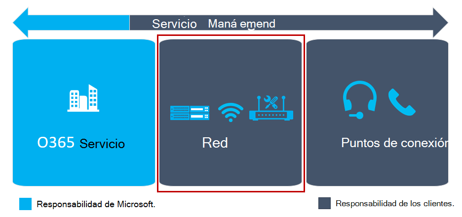

Este artículo forma parte de la etapa de preparación técnica del recorrido de actualización, una actividad que se completa en paralelo a la etapa de preparación del usuario. Antes de continuar, confirme que ha completado estas actividades de las etapas anteriores:

- [Ha incorporado a las partes interesadas del proyecto](upgrade-enlist-stakeholders.md)
- [Ha definido el ámbito del proyecto](https://aka.ms/SkypetoTeams-Scope)
- [Ha comprendido la coexistencia y la interoperabilidad de Skype Empresarial y Teams](https://aka.ms/SkypeToTeams-Coexist)
- [Ha elegido su recorrido de actualización](upgrade-and-coexistence-of-skypeforbusiness-and-teams.md)

# Preparar la red para actualizar a Teams

Si está implementando audio, vídeo o reuniones, puede realizar algunos pasos adicionales que le ayuden a optimizar su red para llevar a cabo esa funcionalidad. Teams utiliza tecnología de audio y vídeo (códecs) que se adapta a la mayoría de las condiciones de red y que, por lo tanto, logra un mejor desempeño en cualquiera de ellas. Para garantizar que se alcance un rendimiento óptimo y constante, debe preparar su red para Teams.

## ¿Por qué debe preparar su red?

Antes de fijarnos en los pasos que se deben dar, es muy importante saber qué aspectos pueden afectar al rendimiento de Teams y, por lo tanto, a la satisfacción y la felicidad de los usuarios. Las tres principales áreas que pueden afectar a cómo perciben los clientes que ha sido la calidad de la red:

- Un ancho de banda insuficiente disponible

- Bloqueadores de firewall y proxy

- Problemas en la red, como vibración y pérdida de paquetes

Los pasos que se han descrito anteriormente le ayudarán a determinar si alguno de estos factores pueden afectar a su implementación y, en ese caso, cómo se resuelven. Si la red no se prepara correctamente, es muy posible que, como consecuencia, los usuarios acaben insatisfechos y haya que recurrir a costosas reparaciones de diversa naturaleza. Por el contrario, si se prepara la red (y, por lo tanto, su organización) para Teams, aumentarán enormemente las opciones de éxito.

<!--ENDOFSECTION-->

## Planeamiento del ancho de banda

El primer paso para preparar la red consiste en garantizar que la red tenga disponible el ancho de banda suficiente para las modalidades que Teams ofrecerá a los usuarios. Planear un ancho de banda suficiente es una tarea bastante directa y un inicio sencillo con los que se garantiza que los usuarios tengan una experiencia de Teams de gran calidad.

El inicio del recorrido para planear el ancho de banda de Teams se realiza en el [sitio web de My Advisor](https://myadvisor.fasttrack.microsoft.com/) mediante el planificador de red. El planificador de red proporciona un planeamiento de ancho de banda por sitio para Teams y ofrece recomendaciones para optimizar el rendimiento de la red.

> [!IMPORTANT]
> Si el ancho de banda requerido no está disponible, los medios apilados dentro de Teams degradan la calidad de la sesión de audio o vídeo para adaptarse al ancho de banda más bajo, lo que afecta a la calidad de la llamada o la reunión. El cliente de Teams intenta priorizar la calidad del audio sobre la calidad del vídeo. Por lo tanto, es sumamente importante tener disponible la cantidad de ancho de banda esperada.

|Actividad |Descargar ancho de banda |Cargar ancho de banda |Flujo de tráfico |
|---|---|---|---|
|**Llamada de punto a punto** |0,1 Mbps |0,1 Mbps |Cliente <> Cliente |
|**Videollamada de punto a punto (pantalla completa)** |4 Mbps |4 Mbps |Cliente <> Cliente |
|**Compartir escritorio de punto a punto (resolución de 1920 x 1080)** |4 Mbps |4 Mbps |Cliente <> Cliente |
|**Reunión de dos participantes** |4 Mbps |4 Mbps |Cliente <> Office 365 |
|**Reunión de tres participantes** |8 Mbps |6,5 Mbps |Cliente <> Office 365 |
|**Reunión de cuatro participantes** |5,5 Mbps |4 Mbps |Cliente <> Office 365 |
|**Reunión de cinco o más participantes** |6 Mbps |1,5 Mbps |Cliente <> Office 365 |

### Salida local de Internet

Muchas redes se diseñaron en su momento para usar una topología tipo hub-and-spoke. En esta topología, por lo general, el tráfico de Internet atraviesa la red WAN hasta un centro de datos central antes de salir a Internet. A menudo, esto se hace para centralizar los dispositivos de seguridad de redes y reducir así el coste general.

El tráfico de transporte hacia atrás por la WAN aumenta la latencia y repercute negativamente en la calidad y la experiencia del usuario. Como Microsoft Teams se ejecuta en una gran red global de Microsoft, existe a menudo una ubicación de emparejamiento de red cerca del usuario. Es muy probable que un usuario obtenga un mejor rendimiento si sale de un punto de Internet local que se encuentra cerca de su ubicación y accede a una red optimizada para voz lo antes posible. Para algunas cargas de trabajo, las solicitudes DNS se utilizan para enviar tráfico al servidor front-end más cercano. En esos casos, es importante que, cuando se usa un punto de salida local, se empareje con una resolución DNS local.

Al optimizar la ruta de red a la red global de Microsoft, mejorará el rendimiento y, en última instancia, los usuarios disfrutarán de la mejor experiencia posible. Para obtener más detalles, vea la publicación del blog [Conseguir la mejor conectividad y el mejor rendimiento en Office 365](https://techcommunity.microsoft.com/t5/Office-365-Blog/Getting-the-best-connectivity-and-performance-in-Office-365/ba-p/124694).

Para obtener una experiencia óptima con los medios en tiempo real dentro de Microsoft Teams, se deben cumplir los requisitos de red para Office 365. Para obtener más información, consulte [Calidad de medios y rendimiento de conectividad de la red en Skype Empresarial Online](/SkypeForBusiness/optimizing-your-network/media-quality-and-network-connectivity-performance).

Los dos segmentos de red definitivos (cliente a Microsoft Edge y perímetro de cliente a Microsoft Edge) deben cumplir con los siguientes requisitos:

|**Valor** |**Cliente a Microsoft Edge** |**Perímetro de cliente a Microsoft Edge** |
|---|---|---|
|**Latencia (unidireccional)** |< 50 ms |< 30 ms |
|**Latencia (tiempo de ida y vuelta o RTT)** |< 100 ms |< 60 ms |
|**Pérdida de paquetes de ráfaga** |< 10% durante un intervalo de 200 ms |< 1% durante un intervalo de 200 ms |
|**Pérdida de paquetes** |< 1% durante un intervalo de 15 s |< 0,1% durante un intervalo de 15 s |
|**Vibración entre llegadas de paquetes** |< 30 ms durante un intervalo de 15 s |< 15 ms durante un intervalo de 15 s |
|**Reordenamiento de paquetes** |< 0,05% paquetes sin ordenar |< 0,01% paquetes sin ordenar |

Para probar los dos segmentos de red, puede usar la [herramienta de evaluación de red](https://go.microsoft.com/fwlink/?linkid=855799). Esta herramienta puede implementarse en el equipo cliente directamente y en un equipo que esté conectado al perímetro de red de cliente. La herramienta incluye documentación limitada, pero se puede ver una documentación más profunda sobre el uso de la herramienta aquí: [herramienta de evaluación de red](https://go.microsoft.com/fwlink/?linkid=855800). Al ejecutar la evaluación de preparación de la red, puede validar la preparación de la red para ejecutar aplicaciones de medios en tiempo real, como Microsoft Teams.

> [!NOTE]
> Se trata de la misma evaluación de preparación de la red que se recomienda para los clientes que quieren implementar correctamente Skype Empresarial.

### VPN

Las redes VPN ofrecen un servicio muy valioso a muchas organizaciones. Lamentablemente, por lo general no se diseñan ni se configuran para admitir medios en tiempo real. Algunas redes VPN también podrían no admitir UDP. Las VPN también introducen una capa extra de cifrado sobre el tráfico de medios que ya está cifrado. Además, la conectividad con el servicio de Teams podría no ser eficaz debido al tráfico de redirección al origen a través de un dispositivo VPN. Por otro lado, tampoco se diseñan necesariamente desde una perspectiva de la capacidad para acomodar las cargas anticipadas que Teams requerirá.

Lo que se recomienda es ofrecer una ruta alternativa que omita el VPN para el tráfico de Teams. Es lo que normalmente se conoce como *VPN de túnel dividido*. El túnel dividido indica que el tráfico para Office 365 no atravesará la red VPN, sino que irá directamente a Office 365. Este cambio repercutirá positivamente en la calidad, pero también proporciona la ventaja secundaria que supone reducir la carga de los dispositivos VPN y la red de la organización.

Para implementar un túnel dividido, consulte con su proveedor de VPN para los detalles de configuración.

### Wi-Fi

Al igual que sucede con las redes VPN, las redes Wi-Fi no se han diseñado ni configurado necesariamente para admitir los medios en tiempo real. Planificar una red Wi-Fi u optimizarla para que sea compatible con Teams es un aspecto muy relevante en una implementación de calidad.

Hay varios factores que intervienen a la hora de optimizar una red Wi-Fi:

- Implementar QoS o Wi-Fi Multimedia (WMM) para garantizar que el tráfico multimedia se priorice de forma acorde a través de redes Wi-Fi.

- Planificar y optimizar las bandas Wi-Fi y la ubicación del punto de acceso. El intervalo de 2,4 GHz puede proporcionar una experiencia adecuada en función de la ubicación del punto de acceso, pero a los puntos de acceso normalmente también les afectan otros dispositivos de consumidores que funcionan en ese intervalo. El intervalo de 5 GHz es mejor para los medios en tiempo real, debido a su rango denso, pero requiere más puntos de acceso para conseguir suficiente cobertura. Los puntos de conexión también necesitan admitir esa gama y configurarlos para poder aprovechar esas bandas de forma adecuada.

- Si se implementan redes Wi-Fi de doble banda, considere la posibilidad de implementar "band steering". _Band steering_ es una técnica que implementaron los proveedores Wi-Fi para influenciar en clientes de doble banda para que usaran el intervalo de 5 Ghz.

- Cuando los puntos de acceso del mismo canal están demasiado cerca entre sí, pueden generar superposición de señales y pueden competir sin pretenderlo, lo que daría lugar a una mala experiencia para el usuario. Asegúrese de que los puntos de acceso que están cerca uno de otro se encuentran en canales que no se superponen.

Cada proveedor inalámbrico tiene sus propias recomendaciones para implementar su solución inalámbrica. Le recomendamos que consulte con su proveedor para obtener las indicaciones concretas.

<!--ENDOFSECTION-->

## Requisitos de firewall y proxy

Microsoft Teams se conecta a Microsoft Online Services y necesita una conexión a Internet para hacerlo. Para que Teams funcione correctamente, debe abrir los puertos TCP 80 y 443 desde los clientes a Internet, y los puertos UDP de 3478 a 3481 de los clientes a Internet. Los puertos TCP se usan para conectarse a contenido basado en web, como SharePoint Online, Exchange Online y los servicios de chat de Teams. Los complementos y los conectores también se conectan a través de estos puertos TCP. Los cuatro puertos UDP se utilizan para que medios, como el audio y el vídeo, fluyan correctamente.

Abrir estos puertos es fundamental en una implementación de Teams fiable. No es posible bloquearlos y afectaría a la calidad de los medios.

Si su organización requiere que se especifiquen los dominios y los intervalos de direcciones IP exactos para los que se deben abrir estos puertos, puede restringir los dominios y los intervalos de IP de destino para estos puertos. Para ver una lista de los puertos, los protocolos y los intervalos IP exactos, consulte [Intervalos de direcciones IP y URL de Office 365](https://docs.microsoft.com/office365/enterprise/urls-and-ip-address-ranges). Si decide restringir los dominios y los intervalos de direcciones IP de destino, debe asegurarse de mantener actualizada la lista de puertos e intervalos, ya que podrían cambiar. Puede suscribirse a [esta fuente RSS](https://go.microsoft.com/fwlink/p/?linkid=236301) para que se le informe cuando se produzca un cambio. También es una buena costumbre probar si todos los puertos están abiertos. Solo hay que ejecutar la [herramienta de evaluación de red de Skype Empresarial](https://www.microsoft.com/download/details.aspx?id=53885) con cierta regularidad. Puede ver más información sobre la funcionalidad de esta herramienta en la siguiente sección.

En el caso de estar implementando un servidor proxy, recomendamos omitir el servidor proxy para todos los servicios de Teams. Si bien el proxy podría funcionar, es muy probable que la calidad se redujera debido a que se forzaría el medio para usar TCP en lugar de UDP. Si desea más información sobre los servidores proxy y su omisión, consulte [Direcciones URL e intervalos de direcciones IP de Office 365](https://docs.microsoft.com/MicrosoftTeams/office-365-urls-ip-address-ranges).

<!--ENDOFSECTION-->

## Otras consideraciones sobre la red

### Resolución de nombre externo

Asegúrese de que todos los equipos cliente que ejecutan el cliente de Teams pueden resolver las consultas DNS externas para detectar los servicios brindados por Office 365.

### Tamaño de grupo de NAT

Cuando varios dispositivos y usuarios acceden a Office 365 mediante traducción de direcciones de red (NAT) o traducción de direcciones de puertos (PAT), es necesario asegurarse de que los dispositivos ocultos detrás de cada dirección IP de enrutamiento público no superen el número admitido.

Para mitigar el riesgo, asegúrese de que se asignen direcciones IP públicas adecuadas a los grupos de NAT para evitar el agotamiento de puertos. El agotamiento de puertos ocasionará que los usuarios internos y los dispositivos tengan problemas al conectarse con los servicios de Office 365. Para obtener más información, consulte [Admisión de NAT con Office 365](https://docs.microsoft.com/office365/enterprise/nat-support-with-office-365).

### Instrucciones para detener y prevenir intrusiones

Si su entorno tiene un sistema de detección de intrusiones o uno de prevención de intrusiones implementado para brindar una capa adicional de seguridad para las conexiones salientes, asegúrese de que el tráfico que tenga direcciones URL de Office 365 como destino se agregue a una lista de permitidos.

## Probar la red

Una vez que haya completado el planeamiento y la preparación de red, incluida la actualización del ancho de banda y la apertura de los puertos del firewall, debe probar el rendimiento de la red. Con los resultados de esta prueba se podrá tener una idea más clara de la corrección o la optimización que se necesita hacer en la red para que la implementación de Teams se pueda desarrollar correctamente.

Puede descargar la [herramienta de evaluación de red de Skype Empresarial](https://www.microsoft.com/download/details.aspx?id=53885) para probar si la red está lista para usarla para Teams. La herramienta ofrece una doble funcionalidad: puede comprobar si se han abierto todos los puertos correctos y puede realizar pruebas de los problemas en la red.

Después de descargar e instalar la herramienta, puede encontrarla en C:\\Archivos de programa\\herramienta de evaluación de red de Microsoft Skype Empresarial. En este directorio se incluye una guía detallada donde se explica cómo se usa la herramienta, Usage.docx.

### Probar los puertos abiertos

Abra una ventana del símbolo del sistema y acceda al directorio de la herramienta de evaluación de red escribiendo **cd C:\\Program Files\\Microsoft Skype for Business Network Assessment Tool**. En el símbolo del sistema, inicie la prueba para los puertos abiertos. Escriba **networkassessmenttool.exe /connectivitycheck**

Una vez que realice las comprobaciones, la herramienta mostrará el mensaje “Se ha completado correctamente la verificación” o informará sobre los puertos que estaban bloqueados. También genera un archivo llamado Connectivity_results.txt, que contiene el resultado de la herramienta y lo almacena en el directorio %userprofile%\\appdata\\local\\microsoft skype for business network assessment tool\\.

Recomendamos que lleve a cabo las comprobaciones de conectividad con regularidad para asegurarse de que los puertos se hayan abierto y funcionen correctamente.

### Probar los problemas en la red

Para aumentar la satisfacción del usuario, debe limitar la cantidad de problemas que se producen en la red. Los más comunes son el retraso (latencia), la pérdida de paquetes y la vibración:

- **Latencia:** es el tiempo que se tarda en llevar un paquete IP del punto A al punto B en la red. Este retraso en la propagación de la red está fundamentalmente vinculado a la distancia entre los dos puntos y la velocidad de la luz, incluida la sobrecarga adicional que suponen los diversos enrutadores que hay en medio. La latencia se mide como un tiempo en una sola dirección o de ida y vuelta.

- **Pérdida de paquetes:** a menudo se define como un porcentaje de paquetes que se pierden en un plazo de tiempo determinado. La pérdida de paquetes afecta directamente a la calidad del audio: desde paquetes perdidos pequeños que prácticamente no influyen a pérdidas masivas opuestas que provocan que el audio se corte por completo.

- **Vibración entre llegadas de paquetes o simplemente vibración:** es el promedio de cambio que se produce en el retraso entre paquetes sucesivos. La mayoría del software VoIP moderno, incluido Skype Empresarial, puede adaptarse a distintos niveles de vibración a través del almacenamiento en búfer. Solo se detectan los efectos de la vibración cuando la vibración supera el almacenamiento en búfer.

Los valores máximos para estos deterioros se describen en [Calidad de medios y rendimiento de la conectividad de red](/SkypeForBusiness/optimizing-your-network/media-quality-and-network-connectivity-performance). Cuando se realizan las pruebas para estos problemas, se distingue entre dos segmentos distintos:

- El *segmento perimetral* es el segmento en el que reside el enrutador. Es el segmento de red lógico más cercano que se conecta a Internet en cada una de las ubicaciones. En la mayoría de los casos, se trata del punto de conexión del enrutador o posiblemente una red perimetral (también conocido como *DMZ*, *zona desmilitarizada*, y *subred filtrada*). Entre este segmento e Internet, no se suele producir ningún otro tráfico que afecte a los dispositivos aparte del enrutador.

- El *segmento del cliente* es el segmento de red lógico en el que reside el cliente.

Debe hacer pruebas en ambos segmentos con la herramienta de evaluación de red. Para probar el segmento, acceda al directorio y escriba **networkassessmenttool.exe** en el símbolo del sistema. Los resultados se escriben en un archivo llamado Results.tsv y podrá compararlos con los [requisitos](/SkypeForBusiness/optimizing-your-network/media-quality-and-network-connectivity-performance) de cada segmento.

Tenga en cuenta que los dos segmentos deben cumplir los requisitos para que sea una implementación de gran calidad. Le recomendamos que ejecute la herramienta varias veces durante una hora para conseguir un buen indicador del rendimiento de la red.

<!--ENDOFSECTION-->

## Corrección de red

Si los resultados del planeamiento del ancho de banda, las pruebas de los puertos o las pruebas de los requisitos de red muestran que hay que aplicar correcciones en la red antes de implementar Teams, puede hacerlo de varias formas:

- Cuando el ancho de banda sea insuficiente, actualice las conexiones para que el tráfico a Office 365 fluya sin obstáculos.

- Cuando los puertos estén bloqueados, cambie las reglas del firewall y vuelva a realizar las pruebas en los puertos.

- Para los problemas de red, realice siempre un análisis de causa de origen.

La calidad de servicio (QoS) se puede usar para combatir los problemas al priorizar y separar el tráfico. Algunas organizaciones eligen implementar QoS para superar los problemas de ancho de banda o restringir la cantidad de tráfico que fluye. Sin embargo, esta medida no ayudará a mejorar la calidad, sino que generará nuevos problemas. Se debe realizar siempre un análisis de causa de origen cuando las deficiencias de la red superen los requisitos. En estos casos, QoS puede ser una solución. Para obtener más información, consulte [Calidad de servicio (QoS) en Microsoft Teams](qos-in-teams.md).

>[!NOTE]
>Muchas redes van evolucionando gracias a las actualizaciones, al ampliarlas o por otros requisitos de negocio. Asegúrese de contar con procesos operativos que ayuden a mantener estas áreas como parte de su planificación de administración de servicios.

<table>
<tr><td>  Punto de decisión</td><td><ul><li>¿Quién se encargará de completar las evaluaciones de red que correspondan en todos los segmentos de red y las ubicaciones de la organización?</li></ul></td></tr>
<tr><td> Pasos siguientes</td><td><ul><li>Puede realizar una evaluación detallada de la red para comprobar si la red está lista para la implementación de Microsoft Teams. Para obtener más información, consulte <a href="https://myadvisor.fasttrack.microsoft.com/CloudVoice/Offers?pageState=NetworkReadiness" data-raw-source="[Network Readiness Assessment](https://myadvisor.fasttrack.microsoft.com/CloudVoice/Offers?pageState=NetworkReadiness)">Evaluación de preparación de la red</a>.</li><li>Realice una corrección de la red basada en los resultados de la evaluación de preparación de la red para cada segmento de red.</li></ul></td></tr>
</table>

<!--ENDOFSECTION-->

## Temas principales

Estos son los temas principales de esta guía. Debe:

- Abrir los puertos TCP 80 y 443 salientes de los clientes que usará Teams.

- Abrir los puertos UDP de 3478 a 3481 salientes de los clientes que usará Teams.

- Asegurarse de que tiene suficiente ancho de banda para implementar Teams con el [planificador de red](https://myadvisor.fasttrack.microsoft.com/CloudVoice/NetworkPlanner).

- Ejecutar la [herramienta de evaluación de red](https://www.microsoft.com/download/details.aspx?id=53885) y comprobar que cumple los requisitos que se describen en [Calidad de medios y rendimiento de la conectividad de red](/SkypeForBusiness/optimizing-your-network/media-quality-and-network-connectivity-performance) en el segmento perimetral y el segmento del cliente.
