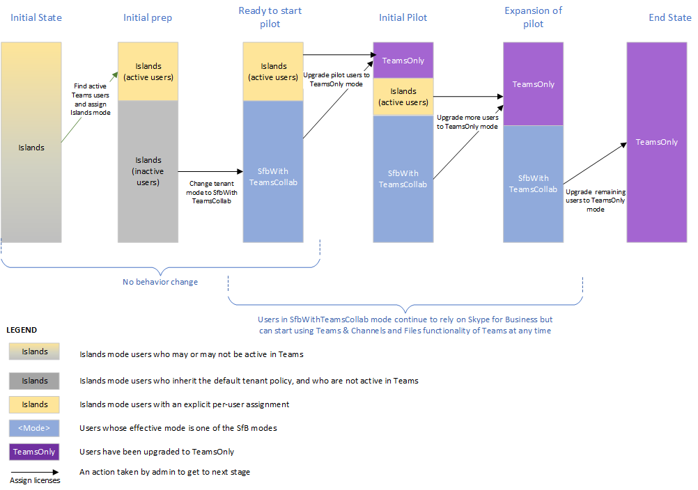

# <a name="upgrade-from-skype-for-business-to-teams-mdash-for-it-administrators"></a><span data-ttu-id="e4121-103">Actualizar de Skype empresarial a teams &mdash; para administradores de ti</span><span class="sxs-lookup"><span data-stu-id="e4121-103">Upgrade from Skype for Business to Teams &mdash; for IT administrators</span></span>

## <a name="overview"></a><span data-ttu-id="e4121-104">Información general</span><span class="sxs-lookup"><span data-stu-id="e4121-104">Overview</span></span>

<span data-ttu-id="e4121-105">Al actualizar de Skype empresarial a Teams, algunas organizaciones necesitan un lanzamiento progresivo planificado y administrado por sus departamentos de ti.</span><span class="sxs-lookup"><span data-stu-id="e4121-105">When upgrading from Skype for Business to Teams, some organizations require a progressive rollout that is planned and managed by their IT departments.</span></span> <span data-ttu-id="e4121-106">Este artículo está dirigido principalmente a administradores de TI en grandes organizaciones locales, pero también puede aplicarse a algunas organizaciones de Skype empresarial online.</span><span class="sxs-lookup"><span data-stu-id="e4121-106">This article is primarily targeted to IT administrators in large, on-premises organizations, but it might also apply to some Skype for Business Online organizations.</span></span>  <span data-ttu-id="e4121-107">Antes de leer este artículo, asegúrese de leer Introducción [a la actualización de Teams](upgrade-start-here.md) y [acerca del marco de actualización](upgrade-framework.md).</span><span class="sxs-lookup"><span data-stu-id="e4121-107">Before reading this article,  be sure to read [Getting started with your Teams Upgrade](upgrade-start-here.md) and [About the Upgrade framework](upgrade-framework.md).</span></span>

>[!NOTE]
><span data-ttu-id="e4121-108">En este artículo se usan los términos Skype empresarial online, Skype empresarial local y Skype empresarial.</span><span class="sxs-lookup"><span data-stu-id="e4121-108">This article uses the terms Skype for Business Online, Skype for Business on-premises, and Skype for Business.</span></span>  <span data-ttu-id="e4121-109">El último término se refiere a versiones locales y en línea.</span><span class="sxs-lookup"><span data-stu-id="e4121-109">The latter term refers to both online and on-premises versions.</span></span>

<span data-ttu-id="e4121-110">Un usuario que se ha migrado a teams ya no usa un cliente de Skype empresarial, excepto para unirse a una reunión hospedada en Skype empresarial.</span><span class="sxs-lookup"><span data-stu-id="e4121-110">A user that has been migrated to Teams no longer uses a Skype for Business client except to join a meeting hosted in Skype for Business.</span></span>  <span data-ttu-id="e4121-111">Todas las conversaciones entrantes y llama en tierra en el cliente de equipos del usuario, independientemente de si el remitente usa Teams o Skype empresarial.</span><span class="sxs-lookup"><span data-stu-id="e4121-111">All incoming chats and calls land in the user’s Teams client, regardless of whether the sender uses Teams or Skype for Business.</span></span> <span data-ttu-id="e4121-112">Todas las reuniones nuevas organizadas por el usuario migrado se programarán como reuniones de Teams.</span><span class="sxs-lookup"><span data-stu-id="e4121-112">Any new meetings organized by the migrated user will be scheduled as Teams meetings.</span></span> <span data-ttu-id="e4121-113">Si el usuario intenta usar el cliente de Skype empresarial, el inicio de los chats y las llamadas se bloquea<sup>1</sup>.</span><span class="sxs-lookup"><span data-stu-id="e4121-113">If the user attempts to use the Skype for Business client, initiation of chats and calls is blocked<sup>1</sup>.</span></span>  <span data-ttu-id="e4121-114">Sin embargo, el usuario puede (y debe) seguir usando el cliente de Skype empresarial para unirse a las reuniones a las que está invitado.</span><span class="sxs-lookup"><span data-stu-id="e4121-114">However, the user can (and must) still use the Skype for Business client to join meetings they are invited to.</span></span>
 
<span data-ttu-id="e4121-115">Los administradores administran su transición a teams mediante el concepto de [modo](migration-interop-guidance-for-teams-with-skype.md#coexistence-modes), que es una propiedad de [TeamsUpgradePolicy](https://docs.microsoft.com/powershell/module/skype/grant-csteamsupgradepolicy?view=skype-ps).</span><span class="sxs-lookup"><span data-stu-id="e4121-115">Administrators manage their transition to Teams using the concept of [mode](migration-interop-guidance-for-teams-with-skype.md#coexistence-modes), which is a property of [TeamsUpgradePolicy](https://docs.microsoft.com/powershell/module/skype/grant-csteamsupgradepolicy?view=skype-ps).</span></span> <span data-ttu-id="e4121-116">Un usuario que se ha migrado a Teams, como se describe anteriormente, está en modo "TeamsOnly".</span><span class="sxs-lookup"><span data-stu-id="e4121-116">A user that has been migrated to Teams as described above is in “TeamsOnly” mode.</span></span>  <span data-ttu-id="e4121-117">En el caso de una organización que está migrando a Teams, el último objetivo es mover todos los usuarios al modo TeamsOnly.</span><span class="sxs-lookup"><span data-stu-id="e4121-117">For an organization that is migrating to Teams, the ultimate goal is to move all users to TeamsOnly mode.</span></span>

<span data-ttu-id="e4121-118">Existen dos métodos para migrar una organización existente con Skype empresarial (ya sea en línea o local) a teams:</span><span class="sxs-lookup"><span data-stu-id="e4121-118">There are two methods for migrating an existing organization with Skype for Business (whether online or on-premises) to Teams:</span></span>

- <span data-ttu-id="e4121-119">**Método de lado a lado** (con el modo Islas): los usuarios de una organización existente de Skype empresarial se introducen en Teams para que puedan usar ambos clientes en paralelo durante una fase de transición.</span><span class="sxs-lookup"><span data-stu-id="e4121-119">**Side-by-side method** (using Islands mode):  Users in an existing Skype for Business organization are introduced to Teams so that they can use both clients side by side during a transitional phase.</span></span> <span data-ttu-id="e4121-120">Durante este período, la mayoría de las funciones de Teams, pero no todas, están disponibles.</span><span class="sxs-lookup"><span data-stu-id="e4121-120">During this period, most--but not all--functionality of Teams is available to them.</span></span> <span data-ttu-id="e4121-121">El modo de esta configuración se denomina islas, y este es el modo predeterminado para cualquier organización existente con Skype empresarial.</span><span class="sxs-lookup"><span data-stu-id="e4121-121">The mode for this configuration is referred to as Islands, and this is the default mode for any existing organization with Skype for Business.</span></span> <span data-ttu-id="e4121-122">Una vez que la organización está lista, el administrador pasa a los usuarios al modo TeamsOnly.</span><span class="sxs-lookup"><span data-stu-id="e4121-122">Once the organization is ready, the administrator moves the users to TeamsOnly mode.</span></span>

- <span data-ttu-id="e4121-123">**Un método administrado** (con uno o varios de los modos de Skype empresarial): el administrador administra la transición (de Skype empresarial a teams) de las funciones de chat, llamadas y programación de reuniones para los usuarios de su organización.</span><span class="sxs-lookup"><span data-stu-id="e4121-123">**A managed method** (using one or more of the Skype for Business modes): The administrator manages the transition (from Skype for Business to Teams) of chat, calling, and meeting scheduling functionality for users in their organization.</span></span>  <span data-ttu-id="e4121-124">Cada una de estas funciones está disponible en Skype empresarial o en Teams, pero no en ambas.</span><span class="sxs-lookup"><span data-stu-id="e4121-124">Each of these functions is available either in Skype for Business or Teams, but not both.</span></span> <span data-ttu-id="e4121-125">Los administradores usan TeamsUpgradePolicy para controlar cuándo se desplazan esta funcionalidad a los equipos de los usuarios.</span><span class="sxs-lookup"><span data-stu-id="e4121-125">Administrators use TeamsUpgradePolicy to control when to shift this functionality to Teams for their users.</span></span> <span data-ttu-id="e4121-126">Los usuarios que aún no están en el modo de TeamsOnly siguen usando Skype empresarial para conversaciones y llamadas, y los dos conjuntos de usuarios pueden comunicarse a través de la funcionalidad de interoperabilidad.</span><span class="sxs-lookup"><span data-stu-id="e4121-126">Users who are not yet in TeamsOnly mode continue to use Skype for Business for chat and calling, and the two sets of users can communicate via interop functionality.</span></span> <span data-ttu-id="e4121-127">Los administradores administran la transición mediante la migración progresiva de más usuarios al modo TeamsOnly.</span><span class="sxs-lookup"><span data-stu-id="e4121-127">Administrators manage the transition by progressively migrating more users into TeamsOnly mode.</span></span>  

<span data-ttu-id="e4121-128">Este artículo le ayuda a elegir el método adecuado para su organización, ya que describe ambos métodos y presenta los pros y los inconvenientes de cada uno.</span><span class="sxs-lookup"><span data-stu-id="e4121-128">This article helps you choose the right method for your organization by describing both methods and presenting the pros and cons of each.</span></span> 

<span data-ttu-id="e4121-129">**Notas:**
<sup>1</sup>los clientes más antiguos de Skype empresarial que se entregaron antes del 2017 no son compatibles con TeamsUpgradePolicy.</span><span class="sxs-lookup"><span data-stu-id="e4121-129">**Notes:**
<sup>1</sup>Older Skype for Business clients that shipped before 2017 do not honor TeamsUpgradePolicy.</span></span> <span data-ttu-id="e4121-130">Asegúrese de estar usando el último cliente de Skype empresarial.</span><span class="sxs-lookup"><span data-stu-id="e4121-130">Make sure you are using the latest Skype for Business client.</span></span>


## <a name="side-by-side-method-using-islands-mode"></a><span data-ttu-id="e4121-131">Método de lado a lado (con el modo Islas)</span><span class="sxs-lookup"><span data-stu-id="e4121-131">Side-by-side method (using Islands mode)</span></span>

<span data-ttu-id="e4121-132">Con el método en paralelo, los usuarios pueden usar tanto equipos como clientes de Skype empresarial para conversaciones de chat, llamadas de VoIP y reuniones.</span><span class="sxs-lookup"><span data-stu-id="e4121-132">With the side-by-side method, users can use both Teams and Skype for Business clients for chat, VoIP calling, and meetings.</span></span> <span data-ttu-id="e4121-133">Este estado se denomina "islas" porque el tráfico de comunicaciones de Skype empresarial y Teams sigue siendo independiente (incluso para el mismo usuario) y los dos clientes diferentes nunca se comunican entre sí (para los usuarios de la misma organización).</span><span class="sxs-lookup"><span data-stu-id="e4121-133">This state is referred to as “Islands” mode because the communication traffic for Skype for Business and Teams remains separate (even for the same user) and the two different clients never communicate with each other (for users within the same organization).</span></span> <span data-ttu-id="e4121-134">Por ejemplo, supongamos que el usuario del destinatario A está en modo islas:</span><span class="sxs-lookup"><span data-stu-id="e4121-134">For example, assume recipient User A is in Islands mode:</span></span>

- <span data-ttu-id="e4121-135">La comunicación iniciada desde el cliente de Skype empresarial de otro usuario siempre se ubicará en el cliente de Skype empresarial del usuario A.</span><span class="sxs-lookup"><span data-stu-id="e4121-135">Communication initiated from another user’s Skype for Business client will always land in User A’s Skype for Business client.</span></span>
- <span data-ttu-id="e4121-136">La comunicación iniciada desde el cliente de Teams de otro usuario siempre se pondrá al cliente de equipos del usuario A, *si el otro usuario se encuentra en la misma organización*.</span><span class="sxs-lookup"><span data-stu-id="e4121-136">Communication initiated from another user’s Teams client will always land in User A’s Teams client, *if the other user is in the same organization*.</span></span> 
- <span data-ttu-id="e4121-137">La comunicación iniciada desde el cliente de Teams de otro usuario siempre estará en el cliente de Skype empresarial del usuario A, *si el otro usuario se encuentra en una organización federada*.</span><span class="sxs-lookup"><span data-stu-id="e4121-137">Communication initiated from another user’s Teams client will always land in User A’s Skype for Business client, *if the other user is in a federated organization*.</span></span>

<span data-ttu-id="e4121-138">El modo islas es el modo predeterminado de TeamsUpgradePolicy para cualquier organización existente que aún no TeamsOnly.</span><span class="sxs-lookup"><span data-stu-id="e4121-138">Islands mode is the default mode of TeamsUpgradePolicy for any existing organization that is not yet TeamsOnly.</span></span> <span data-ttu-id="e4121-139">Cuando asigna una licencia de Office 365, se asignan licencias de equipo y de Skype empresarial online de forma predeterminada. <sup>2</sup> de hecho, si no ha tomado ningún paso para cambiar la configuración predeterminada, es posible que ya tenga un uso significativo de los equipos de su organización.</span><span class="sxs-lookup"><span data-stu-id="e4121-139">When you assign an Office 365 license, both Teams and Skype for Business Online licenses are assigned by default.<sup>2</sup>  In fact, if you have not taken any steps to change the default configuration, you may already have significant usage of Teams in your organization.</span></span>  <span data-ttu-id="e4121-140">Este es uno de los beneficios del enfoque en paralelo.</span><span class="sxs-lookup"><span data-stu-id="e4121-140">This is one of the benefits of the side-by-side approach.</span></span> <span data-ttu-id="e4121-141">Permite una adopción rápida y controlada por el usuario final dentro de una organización.</span><span class="sxs-lookup"><span data-stu-id="e4121-141">It allows for rapid, end-user driven adoption within an organization.</span></span>

<span data-ttu-id="e4121-142">Para que este método funcione de forma eficaz, es necesario que todos los usuarios ejecuten ambos clientes al mismo tiempo.</span><span class="sxs-lookup"><span data-stu-id="e4121-142">For this method to work effectively, it requires all users to run both clients simultaneously.</span></span> <span data-ttu-id="e4121-143">Las conversaciones entrantes y las llamadas desde dentro de la organización a un usuario en modo islas pueden encontrarse en el cliente de Skype para empresas o Teams, y esto no está bajo el control del destinatario.</span><span class="sxs-lookup"><span data-stu-id="e4121-143">Incoming chats and calls from within the organization to a user in Islands mode can land in either the Skype for Business or Teams client--and this is not under the control of the recipient.</span></span> <span data-ttu-id="e4121-144">Depende del cliente que use el remitente para iniciar la comunicación.</span><span class="sxs-lookup"><span data-stu-id="e4121-144">It depends on what client the sender uses to initiate the communication.</span></span> <span data-ttu-id="e4121-145">Si el remitente y el destinatario están en distintas organizaciones, las llamadas entrantes y los chats a un usuario en el modo islas siempre estarán en el cliente de Skype empresarial.</span><span class="sxs-lookup"><span data-stu-id="e4121-145">If the sender and recipient are in different organizations, incoming calls and chats to a user in Islands mode always land in the Skype for Business client.</span></span>  

<span data-ttu-id="e4121-146">Por ejemplo, si un destinatario de modo de islas ejecuta Skype empresarial pero no equipos, y alguien lo envía mensajes de Teams, el destinatario del modo islas no verá el mensaje (pero al final recibirá un mensaje de correo electrónico que indica que ha perdido un mensaje en Teams).</span><span class="sxs-lookup"><span data-stu-id="e4121-146">For example, if an Islands mode recipient is running Skype for Business but not Teams, and someone messages them from Teams, the Islands mode recipient will not see the message (but they will eventually get an email saying they missed a message in Teams).</span></span> <span data-ttu-id="e4121-147">Del mismo modo, si un usuario ejecuta Teams pero no Skype empresarial y alguien le envía un mensaje de usuario de Skype empresarial, el usuario no verá ese chat.</span><span class="sxs-lookup"><span data-stu-id="e4121-147">Likewise, if a user is running Teams but not Skype for Business, and someone messages that user from Skype for Business, the user will not see that chat.</span></span>  <span data-ttu-id="e4121-148">Recibirán un mensaje de correo electrónico en el que se indica que había un mensaje perdido.</span><span class="sxs-lookup"><span data-stu-id="e4121-148">They will get an email saying there was a missed message.</span></span> <span data-ttu-id="e4121-149">El comportamiento en cada uno de estos casos es similar al de las llamadas.</span><span class="sxs-lookup"><span data-stu-id="e4121-149">The behavior in each of these cases is similar for calling.</span></span> <span data-ttu-id="e4121-150">Si los usuarios no ejecutan ambos clientes, puede dar lugar a frustraciones fácilmente.</span><span class="sxs-lookup"><span data-stu-id="e4121-150">If users do not run both clients, it can easily lead to frustration.</span></span>

<span data-ttu-id="e4121-151">Cuando el usuario A está en modo islas, la presencia del usuario A tal y como lo ven otros usuarios en Teams y en Skype empresarial es independiente:</span><span class="sxs-lookup"><span data-stu-id="e4121-151">When User A is in Islands mode, User A’s presence as seen by other users in Teams and in Skype for Business is independent:</span></span>

- <span data-ttu-id="e4121-152">Otros usuarios, cuando usen Teams, verán la presencia en función de la actividad del usuario A en Teams.</span><span class="sxs-lookup"><span data-stu-id="e4121-152">Other users, when using Teams, will see presence based on User A’s activity in Teams.</span></span> 
- <span data-ttu-id="e4121-153">Otros usuarios, al usar Skype empresarial, verán la presencia basada en la actividad del usuario A en Skype empresarial.</span><span class="sxs-lookup"><span data-stu-id="e4121-153">Other users, when using Skype for Business, will see presence based on User A’s activity in Skype for Business.</span></span> 

<span data-ttu-id="e4121-154">Esto significa que otros usuarios pueden ver diferentes Estados de presencia para el usuario A, dependiendo del cliente que usen.</span><span class="sxs-lookup"><span data-stu-id="e4121-154">This means other users may see different presence states for User A, depending on which client they use.</span></span> <span data-ttu-id="e4121-155">Para obtener más información, consulte [presencia](#presence).</span><span class="sxs-lookup"><span data-stu-id="e4121-155">For more details, see [Presence](#presence).</span></span>

<span data-ttu-id="e4121-156">Una vez que esté listo para actualizar a los usuarios al modo TeamsOnly, puede actualizar los usuarios de forma individual o puede actualizar todo el inquilino a la vez con la Directiva de ámbito empresarial<sup>3</sup>.</span><span class="sxs-lookup"><span data-stu-id="e4121-156">Once you are ready to upgrade users to TeamsOnly mode, you can upgrade users individually or you can upgrade the entire tenant at once using the tenant-wide policy<sup>3</sup>.</span></span> <span data-ttu-id="e4121-157">Una vez que un usuario se actualiza al modo TeamsOnly, recibe todas las conversaciones y llamadas entrantes en Teams.</span><span class="sxs-lookup"><span data-stu-id="e4121-157">Once a user is upgraded to TeamsOnly mode, they receive all incoming chats and calls in Teams.</span></span> 

<span data-ttu-id="e4121-158">Sin embargo, es posible que los destinatarios no actualizados en modo islas sigan recibiendo chats y llamadas de un usuario TeamsOnly en sus clientes de Skype empresarial o de Teams.</span><span class="sxs-lookup"><span data-stu-id="e4121-158">However, non-upgraded recipients in Islands mode may continue to receive chats and calls from a TeamsOnly user in either their Skype for Business or Teams clients.</span></span>  <span data-ttu-id="e4121-159">Esto se debe a que el cliente de Teams mantiene subprocesos de conversación por separado para la comunicación entre equipos y entre equipos y entre usuarios de Skype para empresas, incluso para el mismo usuario.</span><span class="sxs-lookup"><span data-stu-id="e4121-159">This is because the Teams client maintains separate conversation threads for Teams-to-Teams and Teams-to-Skype for Business communication, even for the same user.</span></span>  <span data-ttu-id="e4121-160">(Consulte [conversaciones de Teams: interoperabilidad frente a subprocesos nativos](#teams-conversations---interop-versus-native-threads)).  Por ejemplo, supongamos que el usuario A de las islas usa Teams para enviar un mensaje a TeamsOnly usuario B. Cuando el usuario B responda a esa conversación, la comunicación se situará en el cliente de equipos del usuario A.</span><span class="sxs-lookup"><span data-stu-id="e4121-160">(See [Teams Conversations - Interop versus native threads](#teams-conversations---interop-versus-native-threads).)  For example, assume Islands User A uses Teams to message TeamsOnly User B. When User B replies to that chat, the communication will land in User A’s Teams client.</span></span> <span data-ttu-id="e4121-161">Supongamos que el usuario A usa su cliente de Skype empresarial para enviar un mensaje a TeamsOnly usuario B. el usuario B recibirá la conversación en Teams, pero será una conversación independiente en el cliente de equipos del usuario B en comparación con la otra conversación.</span><span class="sxs-lookup"><span data-stu-id="e4121-161">Now assume User A uses his Skype for Business client to message TeamsOnly User B. User B will receive the chat in Teams, but this will be a separate conversation in User B's Teams client compared to the other conversation.</span></span> <span data-ttu-id="e4121-162">Si el usuario B responde a esta conversación con el usuario A, se colocará en el cliente de Skype empresarial del usuario A.</span><span class="sxs-lookup"><span data-stu-id="e4121-162">If User B replies to this conversation with User A, it will land in User A’s Skype for Business client.</span></span> 

<span data-ttu-id="e4121-163">En la tabla siguiente se resume la experiencia de los equipos para el modo islas y TeamsOnly:</span><span class="sxs-lookup"><span data-stu-id="e4121-163">The following table summarizes the Teams experience for both Islands mode and TeamsOnly mode:</span></span>  

| <span data-ttu-id="e4121-164">Experiencia de Teams</span><span class="sxs-lookup"><span data-stu-id="e4121-164">Teams experience</span></span> | <span data-ttu-id="e4121-165">En modo islas</span><span class="sxs-lookup"><span data-stu-id="e4121-165">In Islands mode</span></span> | <span data-ttu-id="e4121-166">En el modo TeamsOnly</span><span class="sxs-lookup"><span data-stu-id="e4121-166">In TeamsOnly mode</span></span> |
|:------------------ | :------------------- | :------------------ |
| <span data-ttu-id="e4121-167">Conversaciones y llamadas entrantes recibidas en:</span><span class="sxs-lookup"><span data-stu-id="e4121-167">Incoming chats and calls received in:</span></span>|  <span data-ttu-id="e4121-168">Teams o Skype empresarial</span><span class="sxs-lookup"><span data-stu-id="e4121-168">Teams or Skype for Business</span></span> | <span data-ttu-id="e4121-169">Teams</span><span class="sxs-lookup"><span data-stu-id="e4121-169">Teams</span></span> |
| <span data-ttu-id="e4121-170">Llamadas RTC recibidas en:</span><span class="sxs-lookup"><span data-stu-id="e4121-170">PSTN calls received in:</span></span> | <span data-ttu-id="e4121-171">Skype Empresarial</span><span class="sxs-lookup"><span data-stu-id="e4121-171">Skype for Business</span></span> <br><span data-ttu-id="e4121-172">(El uso de la funcionalidad RTC en Teams no es compatible con el modo Islas).</span><span class="sxs-lookup"><span data-stu-id="e4121-172">(Using PSTN functionality in Teams is not supported in Islands mode.)</span></span>    | <span data-ttu-id="e4121-173">Teams</span><span class="sxs-lookup"><span data-stu-id="e4121-173">Teams</span></span> |   
 |<span data-ttu-id="e4121-174">Presence</span><span class="sxs-lookup"><span data-stu-id="e4121-174">Presence</span></span>  | <span data-ttu-id="e4121-175">La presencia en Skype empresarial y Teams es independiente.</span><span class="sxs-lookup"><span data-stu-id="e4121-175">Presence in Skype for Business and Teams is independent.</span></span> <span data-ttu-id="e4121-176">Los usuarios pueden ver diferentes Estados para el mismo usuario de islas, en función del cliente que usen.</span><span class="sxs-lookup"><span data-stu-id="e4121-176">Users may see different states for the same Islands user, depending on which client they use.</span></span> | <span data-ttu-id="e4121-177">La presencia se basa únicamente en la actividad del usuario en Teams.</span><span class="sxs-lookup"><span data-stu-id="e4121-177">Presence is based solely on the user’s activity in Teams.</span></span> <span data-ttu-id="e4121-178">Todos los demás usuarios, independientemente del cliente que usen, verán esa presencia.</span><span class="sxs-lookup"><span data-stu-id="e4121-178">All other users, regardless of which client they use, see that presence.</span></span> | 
 | <span data-ttu-id="e4121-179">Programación de reuniones</span><span class="sxs-lookup"><span data-stu-id="e4121-179">Meeting Scheduling</span></span>   | <span data-ttu-id="e4121-180">Los usuarios pueden programar reuniones en Teams o Skype empresarial.</span><span class="sxs-lookup"><span data-stu-id="e4121-180">Users can schedule meetings in either Teams or Skype for Business.</span></span> <span data-ttu-id="e4121-181">Verán ambos complementos en Outlook.</span><span class="sxs-lookup"><span data-stu-id="e4121-181">They will see both add-ins in Outlook.</span></span> |   <span data-ttu-id="e4121-182">Los usuarios solo programan reuniones en Teams.</span><span class="sxs-lookup"><span data-stu-id="e4121-182">Users only schedule meetings in Teams.</span></span> <span data-ttu-id="e4121-183">En Outlook solo está disponible el complemento de Teams.</span><span class="sxs-lookup"><span data-stu-id="e4121-183">Only the Teams add-in is available in Outlook.</span></span> | 

<span data-ttu-id="e4121-184">En la tabla siguiente se resumen los pros y los desventajas de usar el método en paralelo para migrar su organización a teams.</span><span class="sxs-lookup"><span data-stu-id="e4121-184">The following table summarizes the pros and cons of using the side-by-side method to migrate your organization to Teams.</span></span>

| <span data-ttu-id="e4121-185">Profesionales ti</span><span class="sxs-lookup"><span data-stu-id="e4121-185">Pros</span></span>     |       <span data-ttu-id="e4121-186">Conveniente</span><span class="sxs-lookup"><span data-stu-id="e4121-186">Cons</span></span> |
| :------------------ | :---------------- |
| <span data-ttu-id="e4121-187">Permite una rápida adopción dentro de una organización.</span><span class="sxs-lookup"><span data-stu-id="e4121-187">Allows for rapid adoption within an organization.</span></span>| <span data-ttu-id="e4121-188">Posibilidad de confusión entre usuarios finales, ya que existen dos clientes con una funcionalidad similar, pero distintas interfaces de usuario.</span><span class="sxs-lookup"><span data-stu-id="e4121-188">Potential for end user confusion because there are two clients with similar functionality, but different user interfaces.</span></span> <span data-ttu-id="e4121-189">Además, no tienen control sobre qué clientes entran y las llamadas entrantes.</span><span class="sxs-lookup"><span data-stu-id="e4121-189">Also, they have no control over which client the incoming chats/calls land in.</span></span> |
| <span data-ttu-id="e4121-190">Permite a los usuarios aprender y familiarizarse con Teams sin dejar de tener acceso completo a Skype empresarial.</span><span class="sxs-lookup"><span data-stu-id="e4121-190">Allows users to learn and get familiar with Teams while still having full access to Skype for Business.</span></span> | <span data-ttu-id="e4121-191">Potencial de insatisfacción del usuario final debido a mensajes perdidos si el usuario no está ejecutando ambos clientes.</span><span class="sxs-lookup"><span data-stu-id="e4121-191">Potential for end user dissatisfaction due to missed messages if the user is not running both clients.</span></span> <span data-ttu-id="e4121-192">Los usuarios pueden quejarse de que no reciben mensajes.</span><span class="sxs-lookup"><span data-stu-id="e4121-192">Users may complain that they are not receiving messages.</span></span>|
| <span data-ttu-id="e4121-193">Esfuerzo mínimo de administración para empezar a trabajar en Teams.</span><span class="sxs-lookup"><span data-stu-id="e4121-193">Minimal administration effort to get started in Teams.</span></span> | <span data-ttu-id="e4121-194">Puede ser desafiante "salir del modo islas" y pasar al modo TeamsOnly si no todos los miembros de la organización usan equipos, especialmente si no todos los usuarios están activos en Teams.</span><span class="sxs-lookup"><span data-stu-id="e4121-194">Can be challenging to “get out of Islands” mode and move to TeamsOnly mode if not everyone in the organization is using Teams, especially if not all users are active in Teams.</span></span> <span data-ttu-id="e4121-195">Por ejemplo, una vez que un subconjunto de usuarios se actualiza al modo TeamsOnly, los usuarios solo se enviarán en Teams.</span><span class="sxs-lookup"><span data-stu-id="e4121-195">For example, once a subset of users is upgraded to TeamsOnly mode, those users will only send in Teams.</span></span> <span data-ttu-id="e4121-196">Para el resto de la población en el modo islas, esos mensajes siempre estarán en el equipo.</span><span class="sxs-lookup"><span data-stu-id="e4121-196">For the rest of the population in Islands mode, those messages will always land in Teams.</span></span> <span data-ttu-id="e4121-197">Pero si algunos de esos rellenados no se ejecutan en Teams, percibirán estos mensajes como perdidos.</span><span class="sxs-lookup"><span data-stu-id="e4121-197">But if some of that population is not running Teams, they will perceive these messages as missed.</span></span> |
|  | <span data-ttu-id="e4121-198">Cuando se usan equipos, los usuarios que tienen una cuenta local en Skype empresarial Server no admiten la compatibilidad con la interoperabilidad o la Federación.</span><span class="sxs-lookup"><span data-stu-id="e4121-198">When using Teams, users who have an on-premises account in Skype for Business Server do not have interop or federation support.</span></span>  <span data-ttu-id="e4121-199">Esto puede crear confusión si tiene una combinación de usuarios de islas, algunas personas que se encuentran en Skype empresarial online y otras en Skype empresarial local.</span><span class="sxs-lookup"><span data-stu-id="e4121-199">This can potentially create confusion if you have a mix of Islands users--some who are homed in Skype for Business Online and some in Skype for Business on-premises.</span></span>   |

<span data-ttu-id="e4121-200">**Lotus**</span><span class="sxs-lookup"><span data-stu-id="e4121-200">**Notes:**</span></span>

<span data-ttu-id="e4121-201"><sup>2</sup> Esto es cierto incluso si el usuario está alojado en local en Skype empresarial Server.</span><span class="sxs-lookup"><span data-stu-id="e4121-201"><sup>2</sup>This is true even if the user is homed on-premises in Skype for Business Server.</span></span> <span data-ttu-id="e4121-202">Independientemente de si el usuario se ha alojado en local o en línea, deje habilitada la licencia de Skype empresarial online, porque actualmente es necesaria para la funcionalidad de equipos completos.</span><span class="sxs-lookup"><span data-stu-id="e4121-202">Whether the user is homed on-premises or online, leave the Skype for Business Online license enabled, because it is currently needed for full Teams functionality.</span></span>

<span data-ttu-id="e4121-203"><sup>3</sup> Tenga en cuenta que la migración de reuniones de Skype empresarial a reuniones de Teams solo se desencadena cuando se aplica TeamsUpgradePolicy a usuarios individuales, no por espacio empresarial.</span><span class="sxs-lookup"><span data-stu-id="e4121-203"><sup>3</sup>Note that migration of Skype for Business meetings to Teams meetings is only triggered when applying TeamsUpgradePolicy to individual users, not on a per tenant basis.</span></span> <span data-ttu-id="e4121-204">Consulte [migración de reuniones](#meeting-migration) para obtener más información.</span><span class="sxs-lookup"><span data-stu-id="e4121-204">See [Meeting Migration](#meeting-migration) for details.</span></span> 


## <a name="managed-transition-method-using-skype-for-business-modes"></a><span data-ttu-id="e4121-205">Método de transición administrada (con modos de Skype empresarial)</span><span class="sxs-lookup"><span data-stu-id="e4121-205">Managed transition method (using Skype for Business modes)</span></span>

<span data-ttu-id="e4121-206">Es posible que algunas organizaciones prefieran proporcionar a los usuarios finales una experiencia más predecible y sencilla a medida que su organización pase de Skype empresarial a equipos.</span><span class="sxs-lookup"><span data-stu-id="e4121-206">Some organizations may prefer to provide their end users a simpler, more predictable experience as their organization transitions from Skype for Business to Teams.</span></span> <span data-ttu-id="e4121-207">En este modelo, los administradores de ti usan uno de los modos de Skype empresarial en TeamsUpgradePolicy para designar de forma explícita qué usuarios permanecen en Skype empresarial antes de migrar al modo TeamsOnly.</span><span class="sxs-lookup"><span data-stu-id="e4121-207">In this model, IT administrators use one of the Skype for Business modes in TeamsUpgradePolicy to explicitly designate which users remain in Skype for Business prior to migrating to TeamsOnly mode.</span></span> <span data-ttu-id="e4121-208">Puesto que están listos para desplazar a los usuarios seleccionados al modo TeamsOnly, el administrador actualiza el modo de que esos usuarios TeamsOnly.</span><span class="sxs-lookup"><span data-stu-id="e4121-208">As they are ready to shift selected users to TeamsOnly mode, the administrator updates the mode for those users to TeamsOnly.</span></span>  <span data-ttu-id="e4121-209">A medida que progresa la implementación, se transfieren cada vez más usuarios de Skype empresarial a modo TeamsOnly.</span><span class="sxs-lookup"><span data-stu-id="e4121-209">As the deployment progresses, more and more users are transitioned from Skype for Business to TeamsOnly mode.</span></span>  <span data-ttu-id="e4121-210">Durante esta transición:</span><span class="sxs-lookup"><span data-stu-id="e4121-210">During this transition:</span></span>

- <span data-ttu-id="e4121-211">Los usuarios que todavía tienen Skype empresarial reciben todas las conversaciones y llamadas entrantes en el cliente de Skype empresarial, independientemente de si la comunicación proviene de los equipos de los demás usuarios o del cliente de Skype empresarial.</span><span class="sxs-lookup"><span data-stu-id="e4121-211">Users still on Skype for Business receive all incoming chats and calls in their Skype for Business client, regardless of whether the communication originated from the other user’s Teams or Skype for Business client.</span></span> <span data-ttu-id="e4121-212">Además, para estos usuarios de Skype empresarial, la funcionalidad de llamadas y chats en el cliente de equipos están deshabilitadas para ayudar a evitar la confusión del usuario final y garantizar el enrutamiento adecuado.</span><span class="sxs-lookup"><span data-stu-id="e4121-212">In addition, for these Skype for Business users, calling and chat functionality in the Teams client are disabled to help prevent end user confusion and to ensure proper routing.</span></span> 

- <span data-ttu-id="e4121-213">Los usuarios en modo TeamsOnly reciben todas las conversaciones y las llamadas entrantes en el cliente de su equipo, independientemente de dónde se originó la comunicación: Teams, Skype empresarial o cualquier tipo de usuario federado.</span><span class="sxs-lookup"><span data-stu-id="e4121-213">Users in TeamsOnly mode receive all incoming chats and calls in their Teams client, regardless of where the communication originated from:  Teams, Skype for Business, or any kind of federated user.</span></span> 

<span data-ttu-id="e4121-214">A diferencia del método islas, en el método de transición administrada, los usuarios de Skype empresarial y de TeamsOnly pueden comunicarse entre sí.</span><span class="sxs-lookup"><span data-stu-id="e4121-214">Unlike the Islands method, in the managed transition method, Skype for Business users and TeamsOnly users can communicate with each other.</span></span> <span data-ttu-id="e4121-215">La comunicación entre un usuario de Skype empresarial y un usuario de equipo se conoce como interoperabilidad o "interoperabilidad".</span><span class="sxs-lookup"><span data-stu-id="e4121-215">Communication between a Skype for Business user and Teams user is known as interoperability or “interop”.</span></span> <span data-ttu-id="e4121-216">(Consulte [interoperabilidad](#interoperability)). La comunicación interoperativa es posible en una base de uno a uno para conversaciones y llamadas entre usuarios de Skype empresarial y otros usuarios de Teams.</span><span class="sxs-lookup"><span data-stu-id="e4121-216">(See [Interoperability](#interoperability).) Interop communication is possible on a one-to-one basis for chats and calls between a user in Skype for Business and another user in Teams.</span></span> <span data-ttu-id="e4121-217">Además, los usuarios invitados siempre pueden unirse a una reunión de Skype empresarial o de Teams, pero deben usar un cliente que se corresponda con el tipo de reunión.</span><span class="sxs-lookup"><span data-stu-id="e4121-217">In addition, invited users can always join either a Skype for Business or Teams meeting, however, they must use a client that corresponds to the type of meeting.</span></span> <span data-ttu-id="e4121-218">Para obtener más información, vea [reuniones](#meetings).</span><span class="sxs-lookup"><span data-stu-id="e4121-218">For more information, see [Meetings](#meetings).</span></span>

<span data-ttu-id="e4121-219">Como los usuarios de una transición administrada normalmente no están en el modo islas, la presencia de un usuario es coherente, independientemente del cliente que use el otro usuario.</span><span class="sxs-lookup"><span data-stu-id="e4121-219">Because users in a managed transition are typically not in Islands mode, presence for a user is consistent regardless of which client is used by the other user.</span></span> <span data-ttu-id="e4121-220">Si el usuario se encuentra en uno de los modos de Skype empresarial, todos los demás usuarios verán presencia basada en la actividad de ese usuario en Skype empresarial.</span><span class="sxs-lookup"><span data-stu-id="e4121-220">If the user is in one of the Skype for Business modes, all other users see presence based on that user’s activity in Skype for Business.</span></span> <span data-ttu-id="e4121-221">De forma similar, si un usuario está en modo TeamsOnly, todos los demás usuarios verán la presencia basándose en la actividad de ese usuario en Teams.</span><span class="sxs-lookup"><span data-stu-id="e4121-221">Similarly, if a user is in TeamsOnly mode, all other users see presence based on that user’s activity in Teams.</span></span> <span data-ttu-id="e4121-222">Para obtener más información, consulte [presencia](#presence).</span><span class="sxs-lookup"><span data-stu-id="e4121-222">For details, see [Presence](#presence).</span></span>

<span data-ttu-id="e4121-223">Para una organización que aún no ha empezado a usar Teams, el administrador debe cambiar el modo de todo el inquilino de islas a SfbWithTeamsCollab.</span><span class="sxs-lookup"><span data-stu-id="e4121-223">For an organization that has not yet started using Teams, the administrator should change the tenant-wide mode from Islands to SfbWithTeamsCollab.</span></span> <span data-ttu-id="e4121-224">(En el caso de organizaciones que ya tienen algunos usos de Teams, el administrador debe tener a los usuarios "abuelo" activos en Teams para asegurarse de que este cambio no se aplique a ellos.</span><span class="sxs-lookup"><span data-stu-id="e4121-224">(For organizations that already have some Teams usage, the administrator should “grandfather” users already active in Teams to ensure this change does not apply to them.</span></span> <span data-ttu-id="e4121-225">Para obtener más información, vea [una actualización administrada para una organización que ya está usando el modo islas](#a-managed-upgrade-for-an-organization-that-is-already-using-teams-in-islands-mode).)</span><span class="sxs-lookup"><span data-stu-id="e4121-225">For details, see [A managed upgrade for an organization that is already using Teams in Islands mode](#a-managed-upgrade-for-an-organization-that-is-already-using-teams-in-islands-mode).)</span></span>

<span data-ttu-id="e4121-226">Cuando el modo cambia de islas a SfbWithTeamsCollab, los usuarios que nunca hayan usado Teams no verán ninguna diferencia en el modo en que usan Skype empresarial.</span><span class="sxs-lookup"><span data-stu-id="e4121-226">When mode changes from Islands to SfbWithTeamsCollab, a user that has never used Teams will see no difference in how they use Skype for Business.</span></span> <span data-ttu-id="e4121-227">Sin embargo, si el usuario comienza a usar Teams, solo se verá expuesto a una funcionalidad como la de Teams & canal y archivos.</span><span class="sxs-lookup"><span data-stu-id="e4121-227">However, should that user start to use Teams, they would only be exposed to functionality such as Teams & Channel and Files.</span></span> <span data-ttu-id="e4121-228">La programación, las llamadas y las reuniones no estarán disponibles en Teams, ya que el administrador ha designado (por ahora) Skype empresarial como el cliente deseado para esas funciones.</span><span class="sxs-lookup"><span data-stu-id="e4121-228">Chat, calling and meeting scheduling would not be available in Teams, since the administrator has (for now) designated Skype for Business as the desired client for those functions.</span></span>  

<span data-ttu-id="e4121-229">Nota: cuando el usuario A cambia de islas a uno de los modos de Skype empresarial, el cliente de Teams de cualquier otro usuario que se comunique con el usuario A debe saber que el modo del usuario a ha cambiado para que pueda enrutar la comunicación al cliente a adecuado para el usuario A.  Para los usuarios que ya hayan establecido chats nativos entre equipos con el usuario A, pueden tardar hasta 36 horas en que los clientes de los equipos de estos otros usuarios sean conscientes del cambio de modo de islas a cualquier modo de Skype empresarial.</span><span class="sxs-lookup"><span data-stu-id="e4121-229">Note: When User A changes from Islands to one of the Skype for Business modes, the Teams client of any other user that communicates with User A needs to know that User A’s mode changed so it can route the communication to the appropriate client for User A.  For any users who have already established native Teams-to-Teams chats with User A, it can take up to 36 hours for these other users' Teams clients to be aware of the mode change from Islands to any Skype for Business mode.</span></span>   <span data-ttu-id="e4121-230">Por el contrario, otros clientes detectan cambios en el modo de TeamsOnly de un usuario existente en un plazo de 2 horas.</span><span class="sxs-lookup"><span data-stu-id="e4121-230">In contrast, changes for an existing user to TeamsOnly mode are discovered by other clients within 2 hours.</span></span>

<span data-ttu-id="e4121-231">Cuando los administradores están listos, pueden desplazarse por las conversaciones de chat, llamadas y reuniones para un usuario determinado a teams todos a la vez actualizando el modo del usuario a TeamsOnly.</span><span class="sxs-lookup"><span data-stu-id="e4121-231">When administrators are ready, they can shift chat, calling, and meeting scheduling for a given user to Teams all at once by updating the user’s mode to TeamsOnly.</span></span>  

<span data-ttu-id="e4121-232">Como alternativa, el administrador puede desplazar solo la programación de reuniones a Teams, dejando las funciones de chat y de llamadas en Skype empresarial con el modo SfBWithTeamsCollabAndMeetings.</span><span class="sxs-lookup"><span data-stu-id="e4121-232">Alternatively, the administrator can first shift only meeting scheduling to Teams, while leaving chat and calling functions in Skype for Business using the SfBWithTeamsCollabAndMeetings mode.</span></span> <span data-ttu-id="e4121-233">Este modo permite que las organizaciones pasen a los equipos de las reuniones, si aún no están listos para pasar al modo TeamsOnly (normalmente porque es posible que se necesite más tiempo para migrar la funcionalidad de RTC existentes).</span><span class="sxs-lookup"><span data-stu-id="e4121-233">This mode allows organizations to transition to Teams for meetings--if users are not yet ready to move to TeamsOnly mode (typically because more time may be needed to migrate existing PSTN functionality).</span></span> <span data-ttu-id="e4121-234">Este escenario transitorio se conoce como [reuniones en primer lugar](meetings-first.md).</span><span class="sxs-lookup"><span data-stu-id="e4121-234">This transitional scenario is referred to as [Meetings First](meetings-first.md).</span></span>


<span data-ttu-id="e4121-235">La siguiente tabla resume los pros y los inconvenientes de usar los modos de Skype empresarial como paso de transición hacia el modo TeamsOnly.</span><span class="sxs-lookup"><span data-stu-id="e4121-235">The following table summarizes the pros and cons of using Skype for Business modes as a transitional step toward TeamsOnly mode.</span></span>


| <span data-ttu-id="e4121-236">Profesionales ti</span><span class="sxs-lookup"><span data-stu-id="e4121-236">Pros</span></span>     |       <span data-ttu-id="e4121-237">Conveniente</span><span class="sxs-lookup"><span data-stu-id="e4121-237">Cons</span></span> |
| :------------------ | :---------------- |
| <span data-ttu-id="e4121-238">Enrutamiento predecible para el usuario final.</span><span class="sxs-lookup"><span data-stu-id="e4121-238">Predictable routing for the end user.</span></span>  <span data-ttu-id="e4121-239">Todas las llamadas y chats se encuentran en Skype para empresas o en Teams (pero no en ambas), en función de la selección del administrador.</span><span class="sxs-lookup"><span data-stu-id="e4121-239">All calls and chats either land in Skype for Business or Teams (but not both), based on administrator selection.</span></span>  | <span data-ttu-id="e4121-240">Las conversaciones de interoperabilidad carecen de compatibilidad con texto enriquecido, uso compartido de archivos y pantalla compartida.</span><span class="sxs-lookup"><span data-stu-id="e4121-240">Interop conversations lack support for rich text, file sharing, and screen sharing.</span></span>  <span data-ttu-id="e4121-241">Esto se puede llevar a cabo con las reuniones a petición, pero no es tan fácil.</span><span class="sxs-lookup"><span data-stu-id="e4121-241">This can be worked around with on-demand meetings but this is not as seamless.</span></span>  |
| <span data-ttu-id="e4121-242">Elimine la confusión entre usuarios finales porque una determinada función solo está disponible en un cliente.</span><span class="sxs-lookup"><span data-stu-id="e4121-242">Eliminate end user confusion because a given functionality is only available in one client.</span></span>  | <span data-ttu-id="e4121-243">Los usuarios no pueden probar ambos clientes en paralelo para el mismo conjunto de funciones.</span><span class="sxs-lookup"><span data-stu-id="e4121-243">Users can’t try both clients side-by-side for the same set of functionality.</span></span> <span data-ttu-id="e4121-244">Esto puede ser especialmente un factor si los usuarios perciben que el cambio de Skype empresarial a teams es un cambio de paradigma importante.</span><span class="sxs-lookup"><span data-stu-id="e4121-244">This may especially be a factor if the users perceive the shift from Skype for Business to Teams as a major paradigm shift.</span></span> |
| <span data-ttu-id="e4121-245">Permite una introducción incremental de Teams.</span><span class="sxs-lookup"><span data-stu-id="e4121-245">Allows for incremental introduction of Teams.</span></span>  |  | |
| <span data-ttu-id="e4121-246">El administrador tiene el control total de la transición de Skype empresarial a teams.</span><span class="sxs-lookup"><span data-stu-id="e4121-246">Administrator is in full control of the transition from Skype for Business to Teams.</span></span> |  | | 
| <span data-ttu-id="e4121-247">Permite a una organización usar Teams para reuniones, incluso si aún no está listo para moverse completamente al modo TeamsOnly.</span><span class="sxs-lookup"><span data-stu-id="e4121-247">Allows an organization to use Teams for meetings, even if it is not yet ready to move entirely to TeamsOnly mode.</span></span> |  | |
| <span data-ttu-id="e4121-248">La presencia de un usuario determinado según lo ven otras personas es la misma, independientemente del cliente que usen.</span><span class="sxs-lookup"><span data-stu-id="e4121-248">Presence of a given user as viewed by others is the same, regardless of which client they use.</span></span>  |  | |

## <a name="summary-of-upgrade-methods"></a><span data-ttu-id="e4121-249">Resumen de los métodos de actualización</span><span class="sxs-lookup"><span data-stu-id="e4121-249">Summary of upgrade methods</span></span>

<span data-ttu-id="e4121-250">En la siguiente tabla se resumen los métodos de actualización:</span><span class="sxs-lookup"><span data-stu-id="e4121-250">The following table summarizes the upgrade methods:</span></span>

| <span data-ttu-id="e4121-251">En paralelo (con el modo Islas)</span><span class="sxs-lookup"><span data-stu-id="e4121-251">Side-by-side (using Islands mode)</span></span>     |      <span data-ttu-id="e4121-252">Administrada (con los modos de Skype empresarial)</span><span class="sxs-lookup"><span data-stu-id="e4121-252">Managed (using Skype for Business modes)</span></span> |
| :------------------ | :---------------- |
| <span data-ttu-id="e4121-253">Antes de actualizar a TeamsOnly, los usuarios deben ejecutar ambos clientes a la vez, ya que las conversaciones entrantes y las llamadas pueden situarse en cualquier cliente.</span><span class="sxs-lookup"><span data-stu-id="e4121-253">Prior to being upgraded to TeamsOnly, users must run both clients simultaneously since incoming chats and calls may land in either client.</span></span>   | <span data-ttu-id="e4121-254">Chatea y llama solamente a tierras de un cliente, en función del modo del destinatario.</span><span class="sxs-lookup"><span data-stu-id="e4121-254">Chats and calls only land in one client, based on the recipient’s mode.</span></span> <span data-ttu-id="e4121-255">Los usuarios no actualizados pueden ejecutar ambos clientes, pero no hay ninguna superposición funcional (las llamadas y la conversación no están disponibles en Teams).</span><span class="sxs-lookup"><span data-stu-id="e4121-255">Non-upgraded users may run both clients, but there is no functional overlap (calling and chat are not available in Teams).</span></span>  <span data-ttu-id="e4121-256">Los administradores también pueden controlar si los usuarios programan reuniones en Teams o Skype empresarial.</span><span class="sxs-lookup"><span data-stu-id="e4121-256">Administrators can also control whether users schedule meetings in Teams or Skype for Business.</span></span>   |
| <span data-ttu-id="e4121-257">Los usuarios pueden usar Skype empresarial y Teams en paralelo para obtener la misma funcionalidad.</span><span class="sxs-lookup"><span data-stu-id="e4121-257">Users can use Skype for Business and Teams side by side for same functionality.</span></span>   | <span data-ttu-id="e4121-258">Permite a los administradores introducir una nueva funcionalidad de Teams para los usuarios finales (equipos y canales), sin proporcionar la misma funcionalidad que también existe en Skype empresarial.</span><span class="sxs-lookup"><span data-stu-id="e4121-258">Allows administrators to introduce net new functionality of Teams to end users (Teams and Channels), without providing same functionality that also exists in Skype for Business.</span></span>   |
|<span data-ttu-id="e4121-259">La interoperabilidad entre Skype empresarial y Teams no existe mientras ambos usuarios están en el modo islas.</span><span class="sxs-lookup"><span data-stu-id="e4121-259">Interop between Skype for Business and Teams does not exist while both users are in Islands mode.</span></span> <span data-ttu-id="e4121-260">Una vez que se actualizan algunos usuarios a TeamsOnly, es posible que se produzca una conversación interoperativa entre los usuarios y otros usuarios que aún se encuentren en modo islas.</span><span class="sxs-lookup"><span data-stu-id="e4121-260">Once some users are upgraded to TeamsOnly, interop conversation may occur between those users and other users still in Islands mode.</span></span> <span data-ttu-id="e4121-261">Sin embargo, el usuario de las islas podría optar por usar Teams y evitar la conversación de interoperabilidad.</span><span class="sxs-lookup"><span data-stu-id="e4121-261">However, the Islands user could choose to use Teams and avoid the interop conversation.</span></span> | <span data-ttu-id="e4121-262">La interoperabilidad es necesaria para la comunicación entre los usuarios de Skype empresarial y de Teams.</span><span class="sxs-lookup"><span data-stu-id="e4121-262">Interop is required for communication between Skype for Business and Teams users.</span></span>   |

## <a name="tools-for-managing-the-upgrade"></a><span data-ttu-id="e4121-263">Herramientas para administrar la actualización</span><span class="sxs-lookup"><span data-stu-id="e4121-263">Tools for managing the upgrade</span></span>

<span data-ttu-id="e4121-264">Para cualquiera de los métodos descritos anteriormente, los administradores administran la transición a TeamsOnly con [TeamsUpgradePolicy](https://docs.microsoft.com/powershell/module/skype/grant-csteamsupgradepolicy?view=skype-ps), que controla el modo de coexistencia de un usuario.</span><span class="sxs-lookup"><span data-stu-id="e4121-264">For either of the methods described above, administrators manage the transition to TeamsOnly using [TeamsUpgradePolicy](https://docs.microsoft.com/powershell/module/skype/grant-csteamsupgradepolicy?view=skype-ps), which controls a user’s coexistence mode.</span></span> <span data-ttu-id="e4121-265">Para obtener más información sobre cada uno de los modos, vea [modos de coexistencia](migration-interop-guidance-for-teams-with-skype.md#coexistence-modes).</span><span class="sxs-lookup"><span data-stu-id="e4121-265">For more information on each of the modes, see [Coexistence modes](migration-interop-guidance-for-teams-with-skype.md#coexistence-modes).</span></span>


<span data-ttu-id="e4121-266">Si el administrador realiza una transición administrada con los modos de Skype empresarial o simplemente actualiza el modo TeamsOnly desde la configuración de islas predeterminadas, TeamsUpgradePolicy es la herramienta principal.</span><span class="sxs-lookup"><span data-stu-id="e4121-266">Whether the administrator performs a managed transition using Skype for Business modes or simply upgrades to TeamsOnly mode from the default Islands configuration, TeamsUpgradePolicy is the primary tool.</span></span>  <span data-ttu-id="e4121-267">Como cualquier otra directiva de Teams, TeamsUpgradePolicy se puede asignar directamente a un usuario, y también se puede establecer como el valor predeterminado para todo el inquilino.</span><span class="sxs-lookup"><span data-stu-id="e4121-267">Like any other policy in Teams, TeamsUpgradePolicy can be assigned directly to a user, and it can also be set as the tenant-wide default.</span></span> <span data-ttu-id="e4121-268">Cualquier asignación a un usuario tiene prioridad sobre la configuración predeterminada de inquilino.</span><span class="sxs-lookup"><span data-stu-id="e4121-268">Any assignment to a user takes precedence over the tenant default setting.</span></span>  <span data-ttu-id="e4121-269">Se puede administrar en la consola de administración de Teams y en PowerShell.</span><span class="sxs-lookup"><span data-stu-id="e4121-269">It can be managed both in the Teams Admin Console and in PowerShell.</span></span>

<span data-ttu-id="e4121-270">Los administradores pueden asignar cualquier modo de TeamsUpgradePolicy a los usuarios si el usuario se aloja en Skype empresarial online o en el entorno local, excepto que el modo TeamsOnly solo se puede asignar a un usuario que ya esté alojado en Skype empresarial online. <sup>4</sup></span><span class="sxs-lookup"><span data-stu-id="e4121-270">Administrators can assign any mode of TeamsUpgradePolicy to users whether the user is homed in Skype for Business Online or on-premises, except that TeamsOnly mode can only be assigned to a user who is already homed in Skype for Business Online.<sup>4</sup></span></span>  

<span data-ttu-id="e4121-271">Los usuarios con cuentas de Skype empresarial domésticas locales [deben moverse por Internet](https://docs.microsoft.com/SkypeForBusiness/hybrid/move-users-from-on-premises-to-teams) (ya sea a Skype empresarial online o directamente a teams) mediante Move-CsUser en el conjunto de herramientas de Skype empresarial local.</span><span class="sxs-lookup"><span data-stu-id="e4121-271">Users with Skype for Business accounts homed on-premises [must be moved online](https://docs.microsoft.com/SkypeForBusiness/hybrid/move-users-from-on-premises-to-teams) (either to Skype for Business Online or direct to Teams) using Move-CsUser in the Skype for Business on-premises toolset.</span></span> <span data-ttu-id="e4121-272">Estos usuarios se pueden mover a TeamsOnly en 1 o 2 pasos:</span><span class="sxs-lookup"><span data-stu-id="e4121-272">These users can be moved to TeamsOnly in either 1 or 2 steps:</span></span>

-   <span data-ttu-id="e4121-273">1 paso: especificar el modificador-MoveToTeams en Move-CsUser.</span><span class="sxs-lookup"><span data-stu-id="e4121-273">1 step:  Specify the -MoveToTeams switch in Move-CsUser.</span></span> <span data-ttu-id="e4121-274">Para ello, necesita Skype empresarial Server 2019 o Skype empresarial Server 2015 con CU8.</span><span class="sxs-lookup"><span data-stu-id="e4121-274">This requires Skype for Business Server 2019 or Skype for Business Server 2015 with CU8.</span></span>

-   <span data-ttu-id="e4121-275">2 pasos: después de ejecutar Move-CsUser, conceda el modo TeamsOnly al usuario mediante TeamsUpgradePolicy.</span><span class="sxs-lookup"><span data-stu-id="e4121-275">2 steps: After running Move-CsUser, grant TeamsOnly mode to the user using TeamsUpgradePolicy.</span></span>

<span data-ttu-id="e4121-276">A diferencia de otras directivas, no es posible crear nuevas instancias de TeamsUpgradePolicy en Office 365.</span><span class="sxs-lookup"><span data-stu-id="e4121-276">Unlike other policies, it is not possible to create new instances of TeamsUpgradePolicy in Office 365.</span></span> <span data-ttu-id="e4121-277">Todas las instancias existentes están integradas en el servicio.</span><span class="sxs-lookup"><span data-stu-id="e4121-277">All the existing instances are built into the service.</span></span>  <span data-ttu-id="e4121-278">(Tenga en cuenta que el modo es una propiedad dentro de TeamsUpgradePolicy, en lugar del nombre de una instancia de directiva). En algunos, pero no en todos los casos, el nombre de la instancia de directiva es el mismo que el modo.</span><span class="sxs-lookup"><span data-stu-id="e4121-278">(Note that mode is a property within TeamsUpgradePolicy, rather than the name of a policy instance.) In some--but not all--cases, the name of the policy instance is the same as mode.</span></span> <span data-ttu-id="e4121-279">En concreto, para asignar el modo de TeamsOnly a un usuario, conceda la instancia "UpgradeToTeams" de TeamsUpgradePolicy a ese usuario.</span><span class="sxs-lookup"><span data-stu-id="e4121-279">In particular, to assign TeamsOnly mode to a user, you will grant the “UpgradeToTeams” instance of TeamsUpgradePolicy to that user.</span></span> <span data-ttu-id="e4121-280">Para ver una lista de todas las instancias, puede ejecutar el siguiente comando:</span><span class="sxs-lookup"><span data-stu-id="e4121-280">To see a list of all instances, you can run the following command:</span></span>

```
Get-CsTeamsUpgradePolicy|ft Identity, Mode, NotifySfbUsers
```

<span data-ttu-id="e4121-281">Para actualizar un usuario en línea al modo TeamsOnly, asigne la instancia "UpgradeToTeams":</span><span class="sxs-lookup"><span data-stu-id="e4121-281">To upgrade an online user to TeamsOnly mode, assign the “UpgradeToTeams” instance:</span></span> 

```
Grant-CsTeamsUpgradePolicy -PolicyName UpgradeToTeams -Identity $user 
```

<span data-ttu-id="e4121-282">Para actualizar un usuario local de Skype empresarial al modo TeamsOnly, use Move-CsUser en el conjunto de herramientas local:</span><span class="sxs-lookup"><span data-stu-id="e4121-282">To upgrade an on-premise Skype for Business user to TeamsOnly mode, use Move-CsUser in the on-premises toolset:</span></span>

```
Move-CsUser -identity $user -Target sipfed.online.lync.com -MoveToTeams -credential $cred
```

<span data-ttu-id="e4121-283">Para cambiar el modo para todos los usuarios del espacio empresarial, excepto aquellos que tienen una concesión de conceder por usuario explícita (que tiene prioridad), ejecute el siguiente comando:</span><span class="sxs-lookup"><span data-stu-id="e4121-283">To change the mode for all users in the tenant, except those who have an explicit per-user grant (which takes precedence), run the following command:</span></span>

```
Grant-CsTeamsUpgradePolicy -PolicyName SfbWithTeamsCollab -Global
```


>[!NOTE]
><span data-ttu-id="e4121-284">Si tiene usuarios con cuentas de Skype empresarial en el nivel local, no debe asignar el modo de TeamsOnly en el nivel del espacio empresarial, a menos que asigne de forma explícita algún otro modo a todos los usuarios con cuentas locales de Skype empresarial.</span><span class="sxs-lookup"><span data-stu-id="e4121-284">If you have any users with Skype for Business accounts on-premises, you should not assign TeamsOnly mode at the tenant level, unless you explicitly assign some other mode to all users with on-premises Skype for Business accounts.</span></span>

<span data-ttu-id="e4121-285">**Notas:**
<sup>4</sup> esto se debe a que la interoperabilidad con usuarios y la Federación de Skype empresarial solo es posible si el usuario se ha alojado en Skype empresarial online.</span><span class="sxs-lookup"><span data-stu-id="e4121-285">**Notes:**
<sup>4</sup> This is because interop with Skype for Business users and federation are only possible if the user is homed in Skype for Business Online.</span></span>

### <a name="using-notifications-in-skype-for-business-clients"></a><span data-ttu-id="e4121-286">Uso de notificaciones en clientes de Skype empresarial</span><span class="sxs-lookup"><span data-stu-id="e4121-286">Using notifications in Skype for Business clients</span></span>

<span data-ttu-id="e4121-287">Los administradores tienen la opción de proporcionar notificaciones de usuario final en el cliente de Skype empresarial para informar a los usuarios de que pronto se actualizarán a Teams, tal y como se muestra en el siguiente diagrama.</span><span class="sxs-lookup"><span data-stu-id="e4121-287">Administrators have the option to provide end user notifications in the Skype for Business client to inform users that they will soon be upgraded to Teams, as shown in the following diagram.</span></span> <span data-ttu-id="e4121-288">Por ejemplo, una semana antes de que el administrador planea actualizar un grupo de usuarios al modo TeamsOnly, es posible que el administrador desee activar estas notificaciones para ese grupo de usuarios.</span><span class="sxs-lookup"><span data-stu-id="e4121-288">For example, a week before the administrator plans to upgrade a group of users to TeamsOnly mode, the administrator might want to turn on these notifications for that group of users.</span></span> <span data-ttu-id="e4121-289">Estas notificaciones se habilitan mediante una instancia de TeamsUpgradePolicy con NotifySfbUsers = true.</span><span class="sxs-lookup"><span data-stu-id="e4121-289">These notifications are enabled using an instance of TeamsUpgradePolicy with NotifySfbUsers=true.</span></span>  <span data-ttu-id="e4121-290">Para todos los modos distintos de TeamsOnly, en realidad existen dos instancias por modo, que corresponden a los dos valores de NotifySfbUsers.</span><span class="sxs-lookup"><span data-stu-id="e4121-290">For all modes other than TeamsOnly, there are actually two instances per mode, corresponding to the two values of NotifySfbUsers.</span></span>  <span data-ttu-id="e4121-291">Para todos los modos distintos de TeamsOnly, en realidad existen dos instancias por modo, que corresponden a los dos valores de NotifySfbUsers.</span><span class="sxs-lookup"><span data-stu-id="e4121-291">For all modes other than TeamsOnly, there are actually two instances per mode, corresponding to the two values of NotifySfbUsers.</span></span> 


<span data-ttu-id="e4121-293">Si los usuarios están alojados en Skype empresarial online, simplemente asigne la instancia de directiva que tiene el mismo modo que el usuario, pero con NotifySfbUsers = true.</span><span class="sxs-lookup"><span data-stu-id="e4121-293">If your users are homed in Skype for Business Online, simply assign the policy instance that has the same mode as the user, but with NotifySfbUsers=true.</span></span> 

<span data-ttu-id="e4121-294">Si los usuarios están alojados en Skype empresarial Server local, tendrá que usar el conjunto de herramientas local y necesitará Skype empresarial Server 2019 o CU8 para Skype empresarial Server 2015...</span><span class="sxs-lookup"><span data-stu-id="e4121-294">If your users are homed in Skype for Business Server on-premises, you’ll need to use the on-premises toolset and you’ll need Skype for Business Server 2019 or CU8 for Skype for Business Server 2015.</span></span> <span data-ttu-id="e4121-295">En la ventana de PowerShell local, cree una nueva instancia de TeamsUpgradePolicy con NotifySfbUsers = true:</span><span class="sxs-lookup"><span data-stu-id="e4121-295">In the on-premises PowerShell window, create a new instance of TeamsUpgradePolicy with NotifySfbUsers=true:</span></span>

```
New-CsTeamsUpgradePolicy -Identity EnableNotification -NotifySfbUsers $true
```

<span data-ttu-id="e4121-296">Después, con la misma ventana de PowerShell local, asigne esa nueva Directiva a los usuarios que desee:</span><span class="sxs-lookup"><span data-stu-id="e4121-296">Then, using the same on-premises PowerShell window, assign that new policy to the desired users:</span></span>

```
Grant-CsTeamsUpgradePolicy -Identity $user -PolicyName EnableNotification
```


### <a name="meeting-migration"></a><span data-ttu-id="e4121-297">Migración de reuniones</span><span class="sxs-lookup"><span data-stu-id="e4121-297">Meeting migration</span></span>

<span data-ttu-id="e4121-298">Cuando se migra un usuario al modo TeamsOnly, las reuniones de Skype empresarial existentes que organizó se convertirán en Teams de forma predeterminada.</span><span class="sxs-lookup"><span data-stu-id="e4121-298">When a user is migrated to TeamsOnly mode, by default their existing Skype for Business meetings that they organized will be converted to Teams.</span></span> <span data-ttu-id="e4121-299">Si lo desea, puede deshabilitar el comportamiento predeterminado al asignar el modo de TeamsOnly a un usuario.</span><span class="sxs-lookup"><span data-stu-id="e4121-299">You can optionally disable the default behavior when assigning TeamsOnly mode to a user.</span></span> <span data-ttu-id="e4121-300">Al mover usuarios de forma local, las reuniones se deben migrar a la nube para que funcione con la cuenta de usuario en línea, pero si no especifica-MoveToTeams, las reuniones se migrarán como reuniones de Skype empresarial, en lugar de convertirlas a teams.</span><span class="sxs-lookup"><span data-stu-id="e4121-300">When moving users from on-premises, meetings must be migrated to the cloud to function with the online user account, but if you do not specify -MoveToTeams, the meetings will be migrated as Skype for Business meetings, rather than converted to Teams.</span></span> 

<span data-ttu-id="e4121-301">Al asignar el modo de TeamsOnly en el nivel de espacio empresarial, la migración de reuniones no se desencadena para ningún usuario.</span><span class="sxs-lookup"><span data-stu-id="e4121-301">When assigning TeamsOnly mode at the tenant level, meeting migration is not triggered for any users.</span></span> <span data-ttu-id="e4121-302">Si desea asignar el modo de TeamsOnly en el nivel de inquilino y migrar reuniones, puede usar PowerShell para obtener una lista de usuarios en el espacio empresarial (por ejemplo, usar Get-CsOnlineUser con los filtros necesarios) y, a continuación, recorra cada uno de estos usuarios para desencadenar una reunión migración con Start-CsExMeetingMigration.</span><span class="sxs-lookup"><span data-stu-id="e4121-302">If you wish to assign TeamsOnly mode at the tenant level and migrate meetings, you can use PowerShell to get a list of users in the tenant (for example, using Get-CsOnlineUser with whatever filters are needed) and then loop through each of these users to trigger meeting migration using Start-CsExMeetingMigration.</span></span> <span data-ttu-id="e4121-303">Para obtener más información, vea [usar el servicio de migración de reuniones (MMS)](https://docs.microsoft.com/skypeforbusiness/audio-conferencing-in-office-365/setting-up-the-meeting-migration-service-mms).</span><span class="sxs-lookup"><span data-stu-id="e4121-303">For details, see [Using the Meeting Migration Service (MMS)](https://docs.microsoft.com/skypeforbusiness/audio-conferencing-in-office-365/setting-up-the-meeting-migration-service-mms).</span></span>


### <a name="additional-considerations-for-organizations-with-skype-for-business-server-on-premises"></a><span data-ttu-id="e4121-304">Consideraciones adicionales para las organizaciones con Skype empresarial Server local</span><span class="sxs-lookup"><span data-stu-id="e4121-304">Additional considerations for organizations with Skype for Business Server on-premises</span></span>

- <span data-ttu-id="e4121-305">La configuración del entorno híbrido de Skype empresarial es un requisito previo para migrar al modo TeamsOnly.</span><span class="sxs-lookup"><span data-stu-id="e4121-305">Setting up Skype for Business hybrid is a prerequisite to migrate to TeamsOnly mode.</span></span> <span data-ttu-id="e4121-306">Aunque es posible usar equipos en el modo islas sin entornos híbridos, no se puede realizar la transición al modo TeamsOnly hasta que el usuario pase de Skype empresarial local a Skype empresarial online (mediante [Move-CsUser](https://docs.microsoft.com/SkypeForBusiness/hybrid/move-users-between-on-premises-and-cloud)).</span><span class="sxs-lookup"><span data-stu-id="e4121-306">While it is possible to use Teams in Islands mode without hybrid, the transition to TeamsOnly mode cannot be made until the user is moved from Skype for Business on-premises to Skype for Business Online (using [Move-CsUser](https://docs.microsoft.com/SkypeForBusiness/hybrid/move-users-between-on-premises-and-cloud)).</span></span> <span data-ttu-id="e4121-307">Para obtener más información, vea [configurar la conectividad híbrida](https://docs.microsoft.com/skypeforbusiness/hybrid/configure-hybrid-connectivity).</span><span class="sxs-lookup"><span data-stu-id="e4121-307">For more information, see [Configure hybrid connectivity](https://docs.microsoft.com/skypeforbusiness/hybrid/configure-hybrid-connectivity).</span></span>

- <span data-ttu-id="e4121-308">Los usuarios de equipos que tienen una cuenta de Skype empresarial local (es decir, que aún no se han movido a la nube mediante Move-CsUser) no pueden interoperar con ningún usuario de Skype empresarial ni pueden federarse a usuarios externos.</span><span class="sxs-lookup"><span data-stu-id="e4121-308">Teams users who have a Skype for Business account on-premises (that is, they have not yet been moved to the cloud by using Move-CsUser) cannot interoperate with any Skype for Business users, nor can they federate with external users.</span></span> <span data-ttu-id="e4121-309">Esta función solo está disponible cuando los usuarios se mueven a la nube (ya sea en modo islas o como usuarios de TeamsOnly).</span><span class="sxs-lookup"><span data-stu-id="e4121-309">This functionality is only available once the users are moved to the cloud (either in Islands mode, or as TeamsOnly users).</span></span> 

- <span data-ttu-id="e4121-310">Si tiene usuarios con cuentas de Skype empresarial en el nivel local, no debe asignar el modo de TeamsOnly en el nivel del espacio empresarial, a menos que asigne de forma explícita algún otro modo a todos los usuarios con cuentas locales de Skype empresarial.</span><span class="sxs-lookup"><span data-stu-id="e4121-310">If you have any users with Skype for Business accounts on-premises, you should not assign TeamsOnly mode at the tenant level, unless you explicitly assign some other mode to all users with on-premises Skype for Business accounts.</span></span> 

- <span data-ttu-id="e4121-311">Debe asegurarse de que los usuarios estén sincronizados correctamente en Azure AD con los atributos correctos de Skype empresarial.</span><span class="sxs-lookup"><span data-stu-id="e4121-311">You must ensure your users are properly synchronized into Azure AD with the correct Skype for Business attributes.</span></span> <span data-ttu-id="e4121-312">Estos atributos son todos los prefijos con "msRTCSIP-".</span><span class="sxs-lookup"><span data-stu-id="e4121-312">These attributes are all prefixes with “msRTCSIP-”.</span></span> <span data-ttu-id="e4121-313">Si los usuarios no se sincronizan correctamente con Azure AD, las herramientas de administración de Teams no podrán administrar estos usuarios.</span><span class="sxs-lookup"><span data-stu-id="e4121-313">If users are not synchronized properly to Azure AD, the management tools in Teams will not be able to manage these users.</span></span> <span data-ttu-id="e4121-314">Para obtener más información, vea [configurar Azure ad Connect para Teams y Skype empresarial](https://docs.microsoft.com/SkypeForBusiness/hybrid/configure-azure-ad-connect).</span><span class="sxs-lookup"><span data-stu-id="e4121-314">For more information, see [Configure Azure AD Connect for Teams and Skype for Business](https://docs.microsoft.com/SkypeForBusiness/hybrid/configure-azure-ad-connect).</span></span>

- <span data-ttu-id="e4121-315">Para crear un nuevo usuario de TeamsOnly o de Skype empresarial online en una organización híbrida, *primero debe habilitar el usuario en Skype empresarial Server local*y, después, mover el usuario de local a la nube con Move-CsUser.</span><span class="sxs-lookup"><span data-stu-id="e4121-315">To create a new TeamsOnly or Skype for Business Online user in a hybrid organization, *you must first enable the user in Skype for Business Server on-premises*, and then move the user from on-premises to the cloud using Move-CsUser.</span></span>  <span data-ttu-id="e4121-316">La creación del usuario en local primero garantiza que todos los demás usuarios locales de Skype empresarial podrán enrutar al usuario recién creado.</span><span class="sxs-lookup"><span data-stu-id="e4121-316">Creating the user in on-premises first ensures that any other remaining on-premises Skype for Business users will be able route to the newly created user.</span></span> <span data-ttu-id="e4121-317">Una vez que todos los usuarios se han movido a Internet, ya no es necesario que habilite primero los usuarios en local.</span><span class="sxs-lookup"><span data-stu-id="e4121-317">Once all users have been moved online, it is no longer necessary to first enable users in on-premises.</span></span>

- <span data-ttu-id="e4121-318">Cuando un usuario se mueve de local a la nube, las reuniones organizadas por ese usuario se migran a Skype empresarial online o Teams, en función de si se especifica o no el modificador-MoveToTeams.</span><span class="sxs-lookup"><span data-stu-id="e4121-318">When a user is moved from on-premises to the cloud, meetings organized by that user are migrated to either Skype for Business Online or Teams--depending on whether or not the -MoveToTeams switch is specified.</span></span>

- <span data-ttu-id="e4121-319">Si desea mostrar las notificaciones en el cliente de Skype empresarial para los usuarios locales, debe usar TeamsUpgradePolicy en el conjunto de herramientas local.</span><span class="sxs-lookup"><span data-stu-id="e4121-319">If you would like display notifications in the Skype for Business client for on-premises users, you must use TeamsUpgradePolicy in the on-premises toolset.</span></span> <span data-ttu-id="e4121-320">Solo el parámetro NotifySfbUsers es relevante para los usuarios locales.</span><span class="sxs-lookup"><span data-stu-id="e4121-320">Only the NotifySfbUsers parameter is relevant for on-premises users.</span></span>  <span data-ttu-id="e4121-321">Los usuarios locales obtienen su modo de las instancias en línea de TeamsUpgradePolicy.</span><span class="sxs-lookup"><span data-stu-id="e4121-321">On-premises users receive their mode from the online instances of TeamsUpgradePolicy.</span></span> <span data-ttu-id="e4121-322">Consulte las notas en [Grant-CsTeamsUpgradePolicy](https://docs.microsoft.com/powershell/module/skype/grant-csteamsupgradepolicy?view=skype-ps).</span><span class="sxs-lookup"><span data-stu-id="e4121-322">See the notes in [Grant-CsTeamsUpgradePolicy](https://docs.microsoft.com/powershell/module/skype/grant-csteamsupgradepolicy?view=skype-ps).</span></span> 

>[!NOTE]
> <span data-ttu-id="e4121-323">Los nuevos inquilinos creados después del 3 de septiembre de 2019 se crean como inquilinos de TeamsOnly sin la posibilidad de que los administradores puedan degradar.</span><span class="sxs-lookup"><span data-stu-id="e4121-323">Any new tenants created after Sept 3, 2019 are created as TeamsOnly tenants without the ability for admins to downgrade.</span></span> <span data-ttu-id="e4121-324">Las organizaciones con Skype empresarial Server local que antes nunca tenía una suscripción de Office 365 antes del 3 de septiembre de 2019 deberán ponerse en contacto con el soporte técnico de Microsoft para que su inquilino se haya degradado, una vez que hayan adquirido una suscripción con Office 365.</span><span class="sxs-lookup"><span data-stu-id="e4121-324">Organizations with Skype for Business Server on-premises that previously never had an Office 365 subscription prior to Sept 3, 2019 will need to contact Microsoft Support to have their tenant downgraded, once they acquire a subscription with Office 365.</span></span> 


## <a name="perform-the-upgrade-for-your-organization"></a><span data-ttu-id="e4121-325">Realizar la actualización de su organización</span><span class="sxs-lookup"><span data-stu-id="e4121-325">Perform the upgrade for your organization</span></span>

<span data-ttu-id="e4121-326">En esta sección se describen las siguientes opciones de actualización:</span><span class="sxs-lookup"><span data-stu-id="e4121-326">This section describes the following upgrade options:</span></span>

- <span data-ttu-id="e4121-327">Actualización en paralelo (con el modo Islas)</span><span class="sxs-lookup"><span data-stu-id="e4121-327">Side-by-side upgrade (using Islands mode)</span></span>
- <span data-ttu-id="e4121-328">Una actualización administrada para una organización que aún no ha empezado a usar Teams</span><span class="sxs-lookup"><span data-stu-id="e4121-328">A managed upgrade for an organization that has not yet started using Teams</span></span>
- <span data-ttu-id="e4121-329">Una actualización administrada para una organización que ya usa equipos en modo islas</span><span class="sxs-lookup"><span data-stu-id="e4121-329">A managed upgrade for an organization that is already using Teams in Islands mode</span></span>

### <a name="side-by-side-upgrade-using-islands-mode"></a><span data-ttu-id="e4121-330">Actualización en paralelo (con el modo Islas)</span><span class="sxs-lookup"><span data-stu-id="e4121-330">Side-by-side upgrade (using Islands mode)</span></span>

<span data-ttu-id="e4121-331">Para la opción de actualización en paralelo:</span><span class="sxs-lookup"><span data-stu-id="e4121-331">For the side-by-side upgrade option:</span></span>

- <span data-ttu-id="e4121-332">Considere esta opción si puede realizar una actualización rápida para su organización general.</span><span class="sxs-lookup"><span data-stu-id="e4121-332">Consider this option if you can do a fast upgrade for your overall organization.</span></span>  <span data-ttu-id="e4121-333">Dado que hay riesgo potencial de confusión con la ejecución de ambos clientes, es mejor si puede minimizar este período de tiempo.</span><span class="sxs-lookup"><span data-stu-id="e4121-333">Since there is potential risk of confusion with running both clients, it’s best if you can minimize this time period.</span></span> <span data-ttu-id="e4121-334">Debe asegurarse de que los usuarios sepan ejecutar ambos clientes.</span><span class="sxs-lookup"><span data-stu-id="e4121-334">You should ensure your users know to run both clients.</span></span>

- <span data-ttu-id="e4121-335">Esta opción es el modelo que no está en el equipo y no requiere la acción de administrador para empezar a trabajar con Teams excepto para asignar la licencia de Office 365.</span><span class="sxs-lookup"><span data-stu-id="e4121-335">This option is the out-of-the box model, and doesn’t require administrator action to get started with Teams except to assign the Office 365 license.</span></span> <span data-ttu-id="e4121-336">Si los usuarios ya tienen Skype empresarial online, es posible que ya esté en este modelo.</span><span class="sxs-lookup"><span data-stu-id="e4121-336">If your users already have Skype for Business Online, you may already be in this model.</span></span>

- <span data-ttu-id="e4121-337">Puede resultar difícil salir del modo en paralelo y pasar a TeamsOnly.</span><span class="sxs-lookup"><span data-stu-id="e4121-337">It can be challenging getting out of side-by-side mode and moving to TeamsOnly.</span></span> <span data-ttu-id="e4121-338">Como los usuarios actualizados solo se comunican a través de Teams, cualquier otro usuario de la organización que se comunique con ese usuario debe estar usando Teams.</span><span class="sxs-lookup"><span data-stu-id="e4121-338">Because upgraded users only communicate via Teams, any other user in the organization communicating with that user must be using Teams.</span></span>  <span data-ttu-id="e4121-339">Si tiene usuarios que no han empezado a usar Teams, se mostrarán a los mensajes que faltan.</span><span class="sxs-lookup"><span data-stu-id="e4121-339">If you have users that have not started using Teams, they will be exposed to missing messages.</span></span> <span data-ttu-id="e4121-340">Además, no verán los usuarios de TeamsOnly en línea en Skype empresarial.</span><span class="sxs-lookup"><span data-stu-id="e4121-340">Furthermore, they won’t see the TeamsOnly users online in Skype for Business.</span></span> <span data-ttu-id="e4121-341">Algunas organizaciones eligen realizar una actualización para todos los inquilinos con la directiva global de inquilino para evitar esto, pero requieren la espera hasta que todos los usuarios estén listos para su actualización.</span><span class="sxs-lookup"><span data-stu-id="e4121-341">Some organizations choose to do a tenant-wide upgrade using the Tenant global policy to avoid this, however that requires waiting until all users are ready to be upgraded.</span></span>


### <a name="a-managed-upgrade-for-an-organization-that-has-not-yet-started-using-teams"></a><span data-ttu-id="e4121-342">Una actualización administrada para una organización que aún no ha empezado a usar Teams</span><span class="sxs-lookup"><span data-stu-id="e4121-342">A managed upgrade for an organization that has not yet started using Teams</span></span>

<span data-ttu-id="e4121-343">Si su organización aún no tiene ningún usuario activo en Teams, el primer paso es establecer la directiva predeterminada para el inquilino para TeamsUpgradePolicy en uno de los modos de Skype empresarial, por ejemplo, SfbWithTeamsCollab.</span><span class="sxs-lookup"><span data-stu-id="e4121-343">If your organization does not yet have any active users in Teams, the first step is to set the default tenant-wide policy for TeamsUpgradePolicy to one of the Skype for Business modes, for example, SfbWithTeamsCollab.</span></span>  <span data-ttu-id="e4121-344">Los usuarios que aún no hayan comenzado a usar Teams no apreciarán ninguna diferencia en el comportamiento.</span><span class="sxs-lookup"><span data-stu-id="e4121-344">Users who have not yet started using Teams won’t notice any difference in behavior.</span></span> <span data-ttu-id="e4121-345">Sin embargo, la configuración de esta directiva en el nivel de espacio empresarial permite empezar a actualizar usuarios al modo TeamsOnly y garantiza que los usuarios actualizados puedan seguir comunicándose con usuarios no actualizados.</span><span class="sxs-lookup"><span data-stu-id="e4121-345">However, setting this policy at the tenant level makes it possible to start upgrading users to TeamsOnly mode, and ensures that the upgraded users can still communicate with non-upgraded users.</span></span>  <span data-ttu-id="e4121-346">Una vez que hayas identificado a los usuarios de la prueba piloto, puedes actualizarlos a TeamsOnly.</span><span class="sxs-lookup"><span data-stu-id="e4121-346">Once you have identified your pilot users you can upgrade them to TeamsOnly.</span></span>  <span data-ttu-id="e4121-347">Si son locales, usa Move-CsUser.</span><span class="sxs-lookup"><span data-stu-id="e4121-347">If they are on-premises, use Move-CsUser.</span></span> <span data-ttu-id="e4121-348">Si están conectados, simplemente asígnelos a TeamsOnly Mode con TeamsUpgradePolicy.</span><span class="sxs-lookup"><span data-stu-id="e4121-348">If they are online, simply assign them TeamsOnly mode by using TeamsUpgradePolicy.</span></span>  <span data-ttu-id="e4121-349">De forma predeterminada, cualquier reunión de Skype empresarial programada por estos usuarios se migrará a teams.</span><span class="sxs-lookup"><span data-stu-id="e4121-349">By default, any Skype for Business meetings scheduled by these users will be migrated to Teams.</span></span>

<span data-ttu-id="e4121-350">A continuación se muestran los comandos clave:</span><span class="sxs-lookup"><span data-stu-id="e4121-350">Following are the key commands:</span></span>

1. <span data-ttu-id="e4121-351">Establezca el valor predeterminado para el inquilino en modo SfbWithTeamsCollab de la siguiente manera:</span><span class="sxs-lookup"><span data-stu-id="e4121-351">Set the tenant-wide default to mode SfbWithTeamsCollab as follows:</span></span>

   ```
   Grant-CsTeamsUpgradePolicy -PolicyName SfbWithTeamsCollab -Global
   ```

2. <span data-ttu-id="e4121-352">Actualice el usuario a TeamsOnly como se indica a continuación:</span><span class="sxs-lookup"><span data-stu-id="e4121-352">Upgrade the user to TeamsOnly as follows:</span></span>

   - <span data-ttu-id="e4121-353">Si el usuario ya está conectado:</span><span class="sxs-lookup"><span data-stu-id="e4121-353">If the user is already online:</span></span>

     ```
     Grant-CsTeamsUpgradePolicy -PolicyName UpgradeToTeams -Identity $username 
     ```

   - <span data-ttu-id="e4121-354">Si el usuario es local:</span><span class="sxs-lookup"><span data-stu-id="e4121-354">If the user is on-premises:</span></span>

     ```
     Move-CsUser -identity $user -Target sipfed.online.lync.com -MoveToTeams -credential $cred 
     ```

<span data-ttu-id="e4121-355">Notas</span><span class="sxs-lookup"><span data-stu-id="e4121-355">Notes</span></span>
 
- <span data-ttu-id="e4121-356">En lugar de establecer la Directiva de todo el inquilino en SfbWithTeamsCollab, puede establecerla en SfbWithTeamsCollabAndMeetings.</span><span class="sxs-lookup"><span data-stu-id="e4121-356">Instead of setting the tenant-wide policy to SfbWithTeamsCollab, you could set it to SfbWithTeamsCollabAndMeetings.</span></span> <span data-ttu-id="e4121-357">Esto hace que todos los usuarios programen todas las reuniones nuevas en Teams.</span><span class="sxs-lookup"><span data-stu-id="e4121-357">This causes all users to schedule all new meetings in Teams.</span></span>
- <span data-ttu-id="e4121-358">Move-CsUser es un cmdlet en las herramientas locales.</span><span class="sxs-lookup"><span data-stu-id="e4121-358">Move-CsUser is a cmdlet in the on-premises tools.</span></span> <span data-ttu-id="e4121-359">El conmutador MoveToTeams requiere Skype empresarial Server 2019 o Skype empresarial Server 2015 con CU8.</span><span class="sxs-lookup"><span data-stu-id="e4121-359">The MoveToTeams switch requires Skype for Business Server 2019 or Skype for Business Server 2015 with CU8.</span></span> <span data-ttu-id="e4121-360">Si está usando una versión anterior, puede mover primero el usuario a Skype empresarial online y, a continuación, conceder el modo TeamsOnly a ese usuario.</span><span class="sxs-lookup"><span data-stu-id="e4121-360">If you are using a prior version, you can first move the user to Skype for Business Online, and then grant TeamsOnly mode to that user.</span></span>
- <span data-ttu-id="e4121-361">De forma predeterminada, las reuniones de Skype empresarial se migran a teams al actualizar al modo TeamsOnly o al asignar el modo SfbWithTeamsCollabAndMeetings.</span><span class="sxs-lookup"><span data-stu-id="e4121-361">By default, Skype for Business meetings are migrated to Teams when upgrading to TeamsOnly mode or when assigning SfbWithTeamsCollabAndMeetings mode.</span></span>  

<span data-ttu-id="e4121-362">El diagrama siguiente muestra las fases conceptuales de la actualización administrada para una organización que no tiene ningún uso anterior de Teams.</span><span class="sxs-lookup"><span data-stu-id="e4121-362">The diagram below shows the conceptual phases of managed upgrade for an organization with no prior usage of Teams.</span></span> <span data-ttu-id="e4121-363">El alto de las barras representa el número de usuarios.</span><span class="sxs-lookup"><span data-stu-id="e4121-363">The height of the bars represents number of users.</span></span> <span data-ttu-id="e4121-364">Durante cualquier fase de la actualización, todos los usuarios pueden comunicarse entre sí.</span><span class="sxs-lookup"><span data-stu-id="e4121-364">During any phase of the upgrade, all users can communicate with each other.</span></span>  <span data-ttu-id="e4121-365">Los usuarios de Skype empresarial se comunican con usuarios de TeamsOnly usando interoperabilidad y viceversa.</span><span class="sxs-lookup"><span data-stu-id="e4121-365">Skype for Business users communicate with TeamsOnly users using Interop, and vice versa.</span></span>


### <a name="a-managed-upgrade-for-an-organization-that-is-already-using-teams-in-islands-mode"></a><span data-ttu-id="e4121-367">Una actualización administrada para una organización que ya usa equipos en modo islas</span><span class="sxs-lookup"><span data-stu-id="e4121-367">A managed upgrade for an organization that is already using Teams in Islands mode</span></span>

<span data-ttu-id="e4121-368">Si algunos usuarios de su organización usan activamente equipos en modo islas, es probable que no desee quitar la funcionalidad de los usuarios existentes.</span><span class="sxs-lookup"><span data-stu-id="e4121-368">If some users in your organization are actively using Teams in Islands mode, you probably do not want to remove functionality from existing users.</span></span> <span data-ttu-id="e4121-369">Por lo tanto, es necesario un paso adicional antes de cambiar la Directiva de todo el inquilino.</span><span class="sxs-lookup"><span data-stu-id="e4121-369">Therefore, an extra step is required before changing the tenant-wide policy.</span></span> <span data-ttu-id="e4121-370">La solución es "abuelo", es decir, los usuarios existentes de equipos activos en modo islas, antes de establecer la política de todos los inquilinos en SfbWithTeamsCollab.</span><span class="sxs-lookup"><span data-stu-id="e4121-370">The solution is to “grandfather” these existing active Teams users into Islands mode, before setting the tenant-wide policy to SfbWithTeamsCollab.</span></span>  <span data-ttu-id="e4121-371">Una vez que lo haya hecho, puede proceder con la implementación como se indica anteriormente, pero tendrá dos grupos de usuarios que se están moviendo a TeamsOnly: los usuarios que estuvieron activos en Teams estarán en modo islas y el resto de usuarios estarán en el modo SfbWithTeamsCollab.</span><span class="sxs-lookup"><span data-stu-id="e4121-371">Once you’ve done that, you can proceed with deployment as above, however, you’ll have two groups of users who are moving to TeamsOnly:  the users who were active in Teams will be in Islands mode, and the remaining users will be in SfbWithTeamsCollab mode.</span></span> <span data-ttu-id="e4121-372">Puede mover estos usuarios progresivamente al modo TeamsOnly.</span><span class="sxs-lookup"><span data-stu-id="e4121-372">You can progressively move these users to TeamsOnly mode.</span></span>

1. <span data-ttu-id="e4121-373">Busque usuarios que estén activos en Teams de la siguiente manera:</span><span class="sxs-lookup"><span data-stu-id="e4121-373">Find users who are active in Teams as follows:</span></span>

   1. <span data-ttu-id="e4121-374">Desde el portal de administración de Office 365, en la barra de navegación de la izquierda, vaya a informes y, después, uso.</span><span class="sxs-lookup"><span data-stu-id="e4121-374">From the Office 365 Admin Portal, in the left-hand navigation, go to Reports, and then Usage.</span></span> 
   2. <span data-ttu-id="e4121-375">En la lista desplegable "seleccionar un informe", elija Microsoft Teams y, a continuación, actividad del usuario.</span><span class="sxs-lookup"><span data-stu-id="e4121-375">In the “Select a report” dropdown, choose Microsoft Teams, and then User Activity.</span></span> <span data-ttu-id="e4121-376">Esto proporcionará una tabla exportable de usuarios que han estado activos en Teams.</span><span class="sxs-lookup"><span data-stu-id="e4121-376">This will provide an exportable table of users who have been active in Teams.</span></span> 
   3. <span data-ttu-id="e4121-377">Haga clic en exportar, abrir Excel y filtro para mostrar solo los usuarios que están activos en Teams.</span><span class="sxs-lookup"><span data-stu-id="e4121-377">Click Export, open Excel, and filter to show only the users who are active in Teams.</span></span>

2. <span data-ttu-id="e4121-378">Para cada usuario de equipos activos que se encuentra en el paso 1, asigne el modo islas en el PowerShell remoto.</span><span class="sxs-lookup"><span data-stu-id="e4121-378">For each active Teams user found in step 1, assign them Islands mode in remote PowerShell.</span></span> <span data-ttu-id="e4121-379">Esto le permite ir al paso siguiente y se asegura de que no cambie la experiencia del usuario.</span><span class="sxs-lookup"><span data-stu-id="e4121-379">This allows you to go to the next step, and ensures you don’t change the user experience.</span></span>  

   ```
   $users=get-content “C:\MyPath\users.txt” 
    foreach ($user in $users){ 
    Grant-CsTeamsUpgradePolicy -identity $user -PolicyName Islands} 
   ```

3. <span data-ttu-id="e4121-380">Establezca la Directiva de todo el inquilino en SfbWithTeamsCollab:</span><span class="sxs-lookup"><span data-stu-id="e4121-380">Set the tenant-wide policy to SfbWithTeamsCollab:</span></span>

   ```
   Grant-CsTeamsUpgradePolicy -Global -PolicyName SfbWithTeamsCollab 
   ```

4. <span data-ttu-id="e4121-381">Actualice los usuarios seleccionados al modo TeamsOnly.</span><span class="sxs-lookup"><span data-stu-id="e4121-381">Upgrade selected users to TeamsOnly mode.</span></span> <span data-ttu-id="e4121-382">Puede optar por actualizar los usuarios en el modo islas o SfbWithTeamsCollab, aunque es posible que desee dar prioridad a la actualización de los usuarios en el modo islas en primer lugar para minimizar la posibilidad de confusión que puede producirse cuando los usuarios están en modo islas.</span><span class="sxs-lookup"><span data-stu-id="e4121-382">You can choose to upgrade either users in Islands mode or SfbWithTeamsCollab mode, although you might want to prioritize upgrading the users in Islands mode first to minimize the potential for confusion that can arise when users are in Islands mode.</span></span>   

   <span data-ttu-id="e4121-383">Para usuarios alojados en Skype empresarial online:</span><span class="sxs-lookup"><span data-stu-id="e4121-383">For users homed in Skype for Business Online:</span></span>  

   ```
   Grant-CsTeamsUpgradePolicy -Identity $user -PolicyName UpgradeToTeams 
   ```

   <span data-ttu-id="e4121-384">Para los usuarios alojados en Skype empresarial Server local:</span><span class="sxs-lookup"><span data-stu-id="e4121-384">For users homed in Skype for Business Server on-premises:</span></span>  

   ```
   Move-CsUser -Identity $user -Target sipfed.online.lync.com -MoveToTeams -credential $cred 
   ```

<span data-ttu-id="e4121-385">El diagrama siguiente muestra las fases conceptuales de una transición administrada en la que se inician los usuarios de las islas activas.</span><span class="sxs-lookup"><span data-stu-id="e4121-385">The diagram below shows the conceptual phases of a managed transition in which there are active Islands users at the start.</span></span> <span data-ttu-id="e4121-386">El alto de las barras representa el número de usuarios.</span><span class="sxs-lookup"><span data-stu-id="e4121-386">The height of the bars represents the number of users.</span></span> <span data-ttu-id="e4121-387">Durante cualquier fase de la actualización, todos los usuarios pueden comunicarse entre sí.</span><span class="sxs-lookup"><span data-stu-id="e4121-387">During any phase of the upgrade, all users can communicate with each other.</span></span>  <span data-ttu-id="e4121-388">Los usuarios de Skype empresarial se comunican con usuarios de TeamsOnly usando interoperabilidad y viceversa.</span><span class="sxs-lookup"><span data-stu-id="e4121-388">Skype for Business users communicate with TeamsOnly users using interop, and vice versa.</span></span>




   

## <a name="considerations-for-pstn-calling"></a><span data-ttu-id="e4121-390">Consideraciones para las llamadas RTC</span><span class="sxs-lookup"><span data-stu-id="e4121-390">Considerations for PSTN calling</span></span>

<span data-ttu-id="e4121-391">Si se trata de una función de llamadas RTC, existen cuatro escenarios posibles para pasar al modo TeamsOnly:</span><span class="sxs-lookup"><span data-stu-id="e4121-391">If PSTN calling functionality is involved, there are four possible scenarios when moving to TeamsOnly mode:</span></span>

- <span data-ttu-id="e4121-392">*Un usuario de Skype empresarial online con un plan de llamadas de Microsoft*.</span><span class="sxs-lookup"><span data-stu-id="e4121-392">*A user in Skype for Business Online, with a Microsoft Calling Plan*.</span></span> <span data-ttu-id="e4121-393">Después de la actualización, este usuario seguirá teniendo un plan de llamadas de Microsoft.</span><span class="sxs-lookup"><span data-stu-id="e4121-393">Upon upgrade, this user will continue to have a Microsoft Calling plan.</span></span>

- <span data-ttu-id="e4121-394">*Un usuario de Skype empresarial online con funcionalidad de voz local* a través de Skype empresarial local o Cloud Connector Edition.</span><span class="sxs-lookup"><span data-stu-id="e4121-394">*A user in Skype for Business Online, with on-premises voice functionality* via Skype for Business on-premises or Cloud Connector Edition.</span></span> <span data-ttu-id="e4121-395">La actualización del usuario a teams debe coordinarse con la migración del usuario al enrutamiento directo para garantizar que el usuario de TeamsOnly tiene la funcionalidad de RTC.</span><span class="sxs-lookup"><span data-stu-id="e4121-395">The user’s upgrade to Teams needs to be coordinated with migration of the user to Direct Routing to ensure the TeamsOnly user has PSTN functionality.</span></span>

- <span data-ttu-id="e4121-396">*Un usuario de Skype empresarial local con telefonía IP empresarial, que se va a migrar a en línea y mantener la conectividad RTC local*.</span><span class="sxs-lookup"><span data-stu-id="e4121-396">*A user in Skype for Business on-premises with Enterprise Voice, who will be moving to online and keeping on-premises PSTN connectivity*.</span></span>  <span data-ttu-id="e4121-397">Migrar este usuario a teams requiere mover la cuenta de Skype empresarial local del usuario a la nube y coordinar ese movimiento con la migración del usuario al enrutamiento directo.</span><span class="sxs-lookup"><span data-stu-id="e4121-397">Migrating this user to Teams requires moving the user’s on-premises Skype for Business account to the cloud, and coordinating that move with migration of the user to Direct Routing.</span></span> 

- <span data-ttu-id="e4121-398">*Un usuario de Skype empresarial local con telefonía IP empresarial*, que se va a migrar a en línea y usar un plan de llamadas de Microsoft.</span><span class="sxs-lookup"><span data-stu-id="e4121-398">*A user in Skype for Business on-premises with Enterprise Voice*, who will be moving to online and using a Microsoft Calling plan.</span></span>  <span data-ttu-id="e4121-399">Migrar este usuario a teams requiere mover la cuenta de Skype empresarial local del usuario a la nube y coordinar ese movimiento con una a) el puerto del número de ese usuario a un plan de llamadas de Microsoft o B asignarle un nuevo número de suscriptor. regiones disponibles.</span><span class="sxs-lookup"><span data-stu-id="e4121-399">Migrating this user to Teams requires moving the user’s on-premises Skype for Business account to the cloud, and coordinating that move with either A) the port of that user’s phone number to a Microsoft Calling Plan or B) assigning a new subscriber number from available regions.</span></span>

<span data-ttu-id="e4121-400">Este artículo proporciona una descripción general de alto nivel únicamente.</span><span class="sxs-lookup"><span data-stu-id="e4121-400">This article provides a high-level overview only.</span></span>  <span data-ttu-id="e4121-401">Para obtener más información, consulte [planes de llamadas](calling-plan-landing-page.md)y [enrutamiento directo de sistema telefónico](direct-routing-landing-page.md) .</span><span class="sxs-lookup"><span data-stu-id="e4121-401">For more information, see [Phone System Direct Routing](direct-routing-landing-page.md) and [Calling Plans](calling-plan-landing-page.md).</span></span> <span data-ttu-id="e4121-402">Además, tenga en cuenta que el uso de sistema telefónico con Teams solo se admite cuando el usuario está en modo TeamsOnly.</span><span class="sxs-lookup"><span data-stu-id="e4121-402">In addition, note that using Phone System with Teams is only supported when the user is in TeamsOnly mode.</span></span>  <span data-ttu-id="e4121-403">Si el usuario está en modo islas, el sistema telefónico solo es compatible con Skype empresarial.</span><span class="sxs-lookup"><span data-stu-id="e4121-403">If the user is in Islands mode, Phone System is only supported with Skype for Business.</span></span> 

### <a name="from-skype-for-business-online-with-microsoft-calling-plans"></a><span data-ttu-id="e4121-404">Desde Skype empresarial online con planes de llamadas de Microsoft</span><span class="sxs-lookup"><span data-stu-id="e4121-404">From Skype for Business Online with Microsoft Calling Plans</span></span> 

<span data-ttu-id="e4121-405">Este es el escenario de actualización más sencillo que implica voz.</span><span class="sxs-lookup"><span data-stu-id="e4121-405">This is the simplest upgrade scenario involving voice.</span></span> 

1. <span data-ttu-id="e4121-406">Asegúrese de que los usuarios tienen asignada una licencia de Teams.</span><span class="sxs-lookup"><span data-stu-id="e4121-406">Make sure users have been assigned a Teams license.</span></span> <span data-ttu-id="e4121-407">De forma predeterminada, al asignar una licencia de Office 365, Teams está habilitado, por lo que, a menos que previamente haya deshabilitado la licencia de Teams, no es necesario realizar ninguna acción.</span><span class="sxs-lookup"><span data-stu-id="e4121-407">By default, when you assign an Office 365 license, Teams is enabled, so unless you previously disabled the Teams license, no action should be necessary.</span></span>

2.  <span data-ttu-id="e4121-408">Si los usuarios ya tienen un plan de llamadas de Microsoft con un número de teléfono, el único cambio necesario es asignar el modo de TeamsOnly de usuario en TeamsUpgradePolicy.</span><span class="sxs-lookup"><span data-stu-id="e4121-408">If users already have a Microsoft Calling Plan with a phone number, the only required change is to assign the user TeamsOnly mode in TeamsUpgradePolicy.</span></span>  <span data-ttu-id="e4121-409">Antes de asignar el modo de TeamsOnly, las llamadas RTC entrantes estarán en el cliente de Skype empresarial del usuario.</span><span class="sxs-lookup"><span data-stu-id="e4121-409">Prior to assigning TeamsOnly mode, incoming PSTN calls will land in the user’s Skype for Business client.</span></span> <span data-ttu-id="e4121-410">Después de la actualización a modo TeamsOnly, las llamadas RTC entrantes estarán en el cliente de equipos del usuario.</span><span class="sxs-lookup"><span data-stu-id="e4121-410">After the upgrade to TeamsOnly mode, incoming PSTN calls will land in the user’s Teams client.</span></span>  

### <a name="from-skype-for-business-online-with-on-premises-voice"></a><span data-ttu-id="e4121-411">Desde Skype empresarial online con voz local</span><span class="sxs-lookup"><span data-stu-id="e4121-411">From Skype for Business Online with on-premises voice</span></span>

<span data-ttu-id="e4121-412">En este escenario, el usuario ya está en Skype empresarial online, pero su conectividad RTC es local, ya sea usando Skype empresarial Server en modo híbrido o en la edición de la nube.</span><span class="sxs-lookup"><span data-stu-id="e4121-412">In this scenario, the user is already in Skype for Business Online, but their PSTN connectivity is on-premises, either using Skype for Business Server in hybrid mode or Cloud Connector Edition.</span></span> <span data-ttu-id="e4121-413">Migrar a estos usuarios al modo de TeamsOnly con la funcionalidad de RTC significa habilitarlos para el enrutamiento directo, en el que los troncos RTC se conectan directamente al servicio de enrutamiento directo en la nube, a través del controlador de borde de sesión (SBC) local.</span><span class="sxs-lookup"><span data-stu-id="e4121-413">Migrating these users to TeamsOnly mode with PSTN functionality means enabling them for Direct Routing, in which PSTN trunks connect directly to the Direct Routing service in the cloud, via your on-premises Session Border Controller (SBC).</span></span>

<span data-ttu-id="e4121-414">A continuación se enumeran los pasos básicos.</span><span class="sxs-lookup"><span data-stu-id="e4121-414">The basic steps are listed below.</span></span>  <span data-ttu-id="e4121-415">Los pasos 1-4 se enumeran en la secuencia sugerida, pero se pueden realizar en cualquier orden.</span><span class="sxs-lookup"><span data-stu-id="e4121-415">Steps 1-4 are listed in the suggested sequence, but they can be done in any order.</span></span> <span data-ttu-id="e4121-416">La clave es que todas estas opciones deben completarse antes del paso 5.</span><span class="sxs-lookup"><span data-stu-id="e4121-416">The key is that all of these should be completed before Step 5.</span></span>

1. <span data-ttu-id="e4121-417">Si va a establecer la Directiva de todo el inquilino en uno de los modos de Skype empresarial, asegúrese de que los usuarios de las islas actuales les asignen expresamente el modo islas, tal como se ha descrito anteriormente.</span><span class="sxs-lookup"><span data-stu-id="e4121-417">If you are setting the tenant-wide policy to one of the Skype for Business modes, be sure to grandfather any existing Islands users by explicitly assigning them Islands mode, as previously described.</span></span>

2. <span data-ttu-id="e4121-418">Configure el inquilino para el enrutamiento directo.</span><span class="sxs-lookup"><span data-stu-id="e4121-418">Configure your tenant for Direct Routing.</span></span> <span data-ttu-id="e4121-419">Consulte [Resumen de la configuración por inquilino de enrutamiento directo](#summary-of-per-tenant-configuration-of-direct-routing).</span><span class="sxs-lookup"><span data-stu-id="e4121-419">See [Summary of per-tenant configuration of Direct Routing](#summary-of-per-tenant-configuration-of-direct-routing).</span></span>

3. <span data-ttu-id="e4121-420">Si lo desea, configure varias directivas de Teams para estos usuarios (por ejemplo, TeamsMessagingPolicy, TeamsMeetingPolicy, etc.).</span><span class="sxs-lookup"><span data-stu-id="e4121-420">If desired, configure various Teams policies for these users (for example, TeamsMessagingPolicy, TeamsMeetingPolicy, etc.).</span></span> <span data-ttu-id="e4121-421">Esto se puede hacer en cualquier momento, pero si desea asegurarse de que los usuarios tengan la configuración correcta cuando se actualicen, es mejor hacerlo antes de que el usuario se actualice al modo TeamsOnly.</span><span class="sxs-lookup"><span data-stu-id="e4121-421">This can be done at any time, but if you want to ensure that users have the correct configuration when they are upgraded, it’s best to do this before the user is upgraded to TeamsOnly mode.</span></span>

4. <span data-ttu-id="e4121-422">Preparar usuarios para la migración de voz:</span><span class="sxs-lookup"><span data-stu-id="e4121-422">Prepare select users for voice migration:</span></span> 
   - <span data-ttu-id="e4121-423">Si es necesario, asigne la licencia de Teams.</span><span class="sxs-lookup"><span data-stu-id="e4121-423">If necessary, assign the Teams license.</span></span>  <span data-ttu-id="e4121-424">Suponiendo que el usuario ya es funcional en la voz local de Skype empresarial online, el usuario ya tiene Skype empresarial plan 2 y Microsoft Phone System.</span><span class="sxs-lookup"><span data-stu-id="e4121-424">Assuming the user is already functional in Skype for Business Online on-premises voice, the user already has Skype for Business Plan 2 as well as Microsoft Phone System.</span></span> <span data-ttu-id="e4121-425">Deje ambos planes habilitados, incluyendo la licencia de Skype empresarial online plan 2.</span><span class="sxs-lookup"><span data-stu-id="e4121-425">Leave both those plans enabled, including the Skype for Business Online Plan 2 license.</span></span>  
   - <span data-ttu-id="e4121-426">Asigne el OnlineVoiceRoutingPolicy deseado.</span><span class="sxs-lookup"><span data-stu-id="e4121-426">Assign the desired OnlineVoiceRoutingPolicy.</span></span> 

5. <span data-ttu-id="e4121-427">Actualice el usuario: estos pasos deben ser coordinados.</span><span class="sxs-lookup"><span data-stu-id="e4121-427">Upgrade the user: These steps should be coordinated.</span></span> 

   - <span data-ttu-id="e4121-428">En Office 365, actualice el usuario al modo TeamsOnly (Grant-CsTeamsUpgradePolicy).</span><span class="sxs-lookup"><span data-stu-id="e4121-428">In Office 365, upgrade the user to TeamsOnly mode (Grant-CsTeamsUpgradePolicy).</span></span>
   - <span data-ttu-id="e4121-429">En la SBC, configure el enrutamiento de voz para habilitar las llamadas entrantes enviando llamadas al enrutamiento directo en lugar de al servidor de mediación local.</span><span class="sxs-lookup"><span data-stu-id="e4121-429">On the SBC, configure voice routing to enable incoming calls by sending calls to Direct Routing instead of to the on-premises Mediation Server.</span></span>


### <a name="from-skype-for-business-server-on-premises-with-enterprise-voice-to-direct-routing"></a><span data-ttu-id="e4121-430">Desde Skype empresarial Server local, con telefonía IP empresarial, para dirigir el enrutamiento</span><span class="sxs-lookup"><span data-stu-id="e4121-430">From Skype for Business Server on-premises, with Enterprise Voice, to Direct Routing</span></span>

<span data-ttu-id="e4121-431">En este escenario, el usuario aún se ha alojado en Skype empresarial local y su conectividad RTC también es local.</span><span class="sxs-lookup"><span data-stu-id="e4121-431">In this scenario, the user is still homed in Skype for Business on-premises, and their PSTN connectivity is also on-premises.</span></span> <span data-ttu-id="e4121-432">Migrar a estos usuarios a modo TeamsOnly con la funcionalidad de RTC significa habilitarlos para el enrutamiento directo y, después, mover el usuario a la nube.</span><span class="sxs-lookup"><span data-stu-id="e4121-432">Migrating these users to TeamsOnly mode with PSTN functionality means enabling them for Direct Routing and then moving the user to the cloud.</span></span> 
 
<span data-ttu-id="e4121-433">A continuación se enumeran los pasos básicos.</span><span class="sxs-lookup"><span data-stu-id="e4121-433">The basic steps are listed below.</span></span>  <span data-ttu-id="e4121-434">Los pasos 1-5 se enumeran en la secuencia sugerida, pero se pueden realizar en cualquier orden.</span><span class="sxs-lookup"><span data-stu-id="e4121-434">Steps 1-5 are listed in the suggested sequence, but they can be done in any order.</span></span> <span data-ttu-id="e4121-435">La clave es que todas estas opciones deben completarse antes del paso 6.</span><span class="sxs-lookup"><span data-stu-id="e4121-435">The key is that all of these should be completed before Step 6.</span></span>

1. <span data-ttu-id="e4121-436">Si va a establecer la Directiva de todo el inquilino en uno de los modos de Skype empresarial, asegúrese de que los usuarios de las islas existentes les asignan expresamente el modo islas, tal como se ha descrito anteriormente.</span><span class="sxs-lookup"><span data-stu-id="e4121-436">If you will be setting the tenant-wide policy to one of the Skype for Business modes, be sure to grandfather existing Islands users by explicitly assigning them Islands mode, as previously described.</span></span>

2. <span data-ttu-id="e4121-437">Si aún no lo ha hecho, [Configure la organización para la implementación híbrida de Skype empresarial](https://docs.microsoft.com/SkypeForBusiness/hybrid/configure-hybrid-connectivity).</span><span class="sxs-lookup"><span data-stu-id="e4121-437">If you haven’t already done so, [configure the organization for Skype for Business hybrid](https://docs.microsoft.com/SkypeForBusiness/hybrid/configure-hybrid-connectivity).</span></span>

3. <span data-ttu-id="e4121-438">Configure el inquilino para el enrutamiento directo.</span><span class="sxs-lookup"><span data-stu-id="e4121-438">Configure your tenant for Direct Routing.</span></span> <span data-ttu-id="e4121-439">Consulte [Resumen de la configuración por inquilino de enrutamiento directo](#summary-of-per-tenant-configuration-of-direct-routing).</span><span class="sxs-lookup"><span data-stu-id="e4121-439">See [Summary of per-tenant configuration of Direct Routing](#summary-of-per-tenant-configuration-of-direct-routing).</span></span>

4. <span data-ttu-id="e4121-440">Si lo desea, configure varias directivas de Teams para estos usuarios (por ejemplo, TeamsMessagingPolicy, TeamsMeetingPolicy, etc.).</span><span class="sxs-lookup"><span data-stu-id="e4121-440">If desired, configure various Teams policies for these users (e.g. TeamsMessagingPolicy, TeamsMeetingPolicy, etc.).</span></span> <span data-ttu-id="e4121-441">Esto se puede hacer en cualquier momento, pero si desea asegurarse de que los usuarios tengan la configuración correcta cuando se actualicen, es mejor hacerlo antes de que el usuario se actualice a TeamsOnly.</span><span class="sxs-lookup"><span data-stu-id="e4121-441">This can be done at any time, but if you want to ensure that users have the correct configuration when they are upgraded, it’s best to do this before the user is upgraded to TeamsOnly.</span></span>

5. <span data-ttu-id="e4121-442">Asigne las licencias de Office 365 si es necesario.</span><span class="sxs-lookup"><span data-stu-id="e4121-442">Assign the Office 365 licenses if necessary.</span></span>  <span data-ttu-id="e4121-443">El usuario debe tener tanto equipos como Skype empresarial online plan 2, así como un sistema telefónico.</span><span class="sxs-lookup"><span data-stu-id="e4121-443">The user should have both Teams and Skype for Business Online Plan 2, as well as Phone System.</span></span> <span data-ttu-id="e4121-444">Si el plan 2 de Skype empresarial online está deshabilitado, vuelva a habilitarlo.</span><span class="sxs-lookup"><span data-stu-id="e4121-444">If the Skype for Business Online Plan 2 is disabled, re-enable it.</span></span>  

6. <span data-ttu-id="e4121-445">Actualice el usuario: estos pasos deben ser coordinados.</span><span class="sxs-lookup"><span data-stu-id="e4121-445">Upgrade the user: These steps should be coordinated.</span></span> 

   - <span data-ttu-id="e4121-446">Con las herramientas locales de Skype empresarial, ejecute Move-CsUser with-MoveToTeams switch.</span><span class="sxs-lookup"><span data-stu-id="e4121-446">Using the on-premises Skype for Business tools, run Move-CsUser with -MoveToTeams switch.</span></span> <span data-ttu-id="e4121-447">Si está usando una versión de Skype empresarial Server que no admite el modificador-MoveToTeams, ejecute primero Move-CsUser y, a continuación, asigne el modo TeamsOnly en PowerShell Remote de inquilino o en la consola de administración de Teams.</span><span class="sxs-lookup"><span data-stu-id="e4121-447">If you are using a version of Skype for Business Server that does not support the -MoveToTeams switch, first run Move-CsUser and then assign TeamsOnly mode in tenant remote PowerShell or Teams Admin Console.</span></span>

   - <span data-ttu-id="e4121-448">En la SBC, configure el enrutamiento de voz para habilitar las llamadas entrantes enviando llamadas al enrutamiento directo en lugar de al servidor de mediación local.</span><span class="sxs-lookup"><span data-stu-id="e4121-448">On the SBC, configure voice routing to enable incoming calls by sending calls to Direct Routing instead of to the on-premises Mediation Server.</span></span> 

   - <span data-ttu-id="e4121-449">En Office 365: asigne el OnlineVoiceRoutingPolicy relevante para habilitar las llamadas salientes.</span><span class="sxs-lookup"><span data-stu-id="e4121-449">In Office 365: Assign the relevant OnlineVoiceRoutingPolicy to enable outgoing calls.</span></span> 


### <a name="from-skype-for-business-server-on-premises-with-enterprise-voice-to-microsoft-calling-plan"></a><span data-ttu-id="e4121-450">Desde Skype empresarial Server local, con telefonía IP empresarial, plan de llamadas de Microsoft</span><span class="sxs-lookup"><span data-stu-id="e4121-450">From Skype for Business Server on-premises, with Enterprise Voice, to Microsoft Calling Plan</span></span>

<span data-ttu-id="e4121-451">En este escenario, el usuario aún se ha alojado en Skype empresarial local y su conectividad RTC también es local.</span><span class="sxs-lookup"><span data-stu-id="e4121-451">In this scenario, the user is still homed in Skype for Business on-premises, and their PSTN connectivity is also on-premises.</span></span> <span data-ttu-id="e4121-452">Migrar a estos usuarios a modo TeamsOnly con la funcionalidad de RTC significa mover el usuario a la nube y migrar su número desde el antiguo operador a un plan de llamadas de Microsoft o asignar un número nuevo al usuario.</span><span class="sxs-lookup"><span data-stu-id="e4121-452">Migrating these users to TeamsOnly mode with PSTN functionality means moving the user to the cloud and either porting their number from the old carrier to a Microsoft Calling plan or assigning the user a new number.</span></span> 

<span data-ttu-id="e4121-453">A continuación se enumeran los pasos básicos.</span><span class="sxs-lookup"><span data-stu-id="e4121-453">The basic steps are listed below.</span></span><span data-ttu-id="e4121-454">Los pasos 1-5 se enumeran en la secuencia sugerida, pero se pueden realizar en cualquier orden.</span><span class="sxs-lookup"><span data-stu-id="e4121-454">  Steps 1-5 are listed in the suggested sequence, but they can be done in any order.</span></span> <span data-ttu-id="e4121-455">La clave es que todas estas opciones deben completarse antes del paso 6.</span><span class="sxs-lookup"><span data-stu-id="e4121-455">The key is that all of these should be completed before Step 6.</span></span> 

1. <span data-ttu-id="e4121-456">Si va a establecer la Directiva de todo el inquilino en uno de los modos de Skype empresarial, asegúrese de que los usuarios de las islas existentes les asignan expresamente el modo islas, tal como se ha descrito anteriormente.</span><span class="sxs-lookup"><span data-stu-id="e4121-456">If you will be setting the tenant-wide policy to one of the Skype for Business modes, be sure to grandfather existing Islands users by explicitly assigning them Islands mode, as previously described.</span></span> 

2. <span data-ttu-id="e4121-457">Si aún no lo ha hecho, [Configure la organización para la implementación híbrida de Skype empresarial](https://docs.microsoft.com/SkypeForBusiness/hybrid/configure-hybrid-connectivity).</span><span class="sxs-lookup"><span data-stu-id="e4121-457">If you haven’t already done so, [configure the organization for Skype for Business hybrid](https://docs.microsoft.com/SkypeForBusiness/hybrid/configure-hybrid-connectivity).</span></span> 

3. <span data-ttu-id="e4121-458">Si lo desea, configure varias directivas de Teams para estos usuarios (por ejemplo, TeamsMessagingPolicy, TeamsMeetingPolicy, etc.).</span><span class="sxs-lookup"><span data-stu-id="e4121-458">If desired, configure various Teams policies for these users (for example, TeamsMessagingPolicy, TeamsMeetingPolicy, etc.).</span></span> <span data-ttu-id="e4121-459">Esto se puede hacer en cualquier momento, pero si desea asegurarse de que los usuarios tengan la configuración correcta cuando se actualicen, es mejor hacerlo antes de que el usuario se actualice a TeamsOnly.</span><span class="sxs-lookup"><span data-stu-id="e4121-459">This can be done at any time, but if you want to ensure that users have the correct configuration when they are upgraded, it’s best to do this before the user is upgraded to TeamsOnly.</span></span> 

4. <span data-ttu-id="e4121-460">Asigne las licencias de Office 365 si es necesario.</span><span class="sxs-lookup"><span data-stu-id="e4121-460">Assign the Office 365 licenses if necessary.</span></span><span data-ttu-id="e4121-461">El usuario debe tener tanto equipos como Skype empresarial online plan 2, así como un sistema telefónico.</span><span class="sxs-lookup"><span data-stu-id="e4121-461">  The user should have both Teams and Skype for Business Online Plan 2, as well as Phone System.</span></span> <span data-ttu-id="e4121-462">Si el plan 2 de Skype empresarial online está deshabilitado, vuelva a habilitarlo.</span><span class="sxs-lookup"><span data-stu-id="e4121-462">If the Skype for Business Online Plan 2 is disabled, re-enable it.</span></span>  

5. <span data-ttu-id="e4121-463">Obtener números de teléfono para los usuarios.</span><span class="sxs-lookup"><span data-stu-id="e4121-463">Get phone numbers for your users.</span></span> <span data-ttu-id="e4121-464">(Para obtener información detallada, consulte [administrar números de teléfono de su organización](https://docs.microsoft.com/MicrosoftTeams/manage-phone-numbers-for-your-organization/manage-phone-numbers-for-your-organization)).</span><span class="sxs-lookup"><span data-stu-id="e4121-464">(For details see [Manage phone numbers for your organization](https://docs.microsoft.com/MicrosoftTeams/manage-phone-numbers-for-your-organization/manage-phone-numbers-for-your-organization).)</span></span>

   - <span data-ttu-id="e4121-465">Si va a volver a usar los números, envíe una solicitud de portabilidad a su operador.</span><span class="sxs-lookup"><span data-stu-id="e4121-465">If you will be re-using the numbers, submit a porting request to your carrier.</span></span>  
   - <span data-ttu-id="e4121-466">También puede adquirir números nuevos directamente desde Microsoft.</span><span class="sxs-lookup"><span data-stu-id="e4121-466">Alternatively, you can acquire new numbers directly from Microsoft.</span></span> 

6. <span data-ttu-id="e4121-467">Actualice el usuario.</span><span class="sxs-lookup"><span data-stu-id="e4121-467">Upgrade the user.</span></span> <span data-ttu-id="e4121-468">Con las herramientas locales de Skype empresarial, ejecute Move-CsUser con el modificador-MoveToTeams.</span><span class="sxs-lookup"><span data-stu-id="e4121-468">Using the on-premises Skype for Business tools, run Move-CsUser with the -MoveToTeams switch.</span></span>  

    - <span data-ttu-id="e4121-469">Si va a trasladar números a Microsoft, debe coordinar los intervalos de esta operación para que se produzcan cuando se produzca el puerto.</span><span class="sxs-lookup"><span data-stu-id="e4121-469">If you are porting numbers to Microsoft, you should coordinate the timing of this operation to occur when the port occurs.</span></span> 

    - <span data-ttu-id="e4121-470">Si está usando números nuevos de Microsoft, tendrá que cambiar el LineUri para el usuario.</span><span class="sxs-lookup"><span data-stu-id="e4121-470">If you are using new numbers from Microsoft, you’ll need to change the LineUri for the user.</span></span><span data-ttu-id="e4121-471">Esto debe hacerse en las herramientas locales y, a continuación, sincronizarse con la nube a través de Azure AD Connect.</span><span class="sxs-lookup"><span data-stu-id="e4121-471">  This should be done in the on-prem tools and then synchronized to the cloud via Azure AD Connect.</span></span> <span data-ttu-id="e4121-472">Si Azure AD Connect sincroniza el cambio, debe usar la operación de movimiento y CsUser para estar al día.</span><span class="sxs-lookup"><span data-stu-id="e4121-472">You should time the Move-CsUser operation to be concurrent with when Azure AD Connect synchronizes the change.</span></span> 

### <a name="summary-of-per-tenant-configuration-of-direct-routing"></a><span data-ttu-id="e4121-473">Resumen de la configuración por inquilino de enrutamiento directo</span><span class="sxs-lookup"><span data-stu-id="e4121-473">Summary of per-tenant configuration of Direct Routing</span></span> 

1. <span data-ttu-id="e4121-474">Para asegurarse de que el controlador de borde de sesión (SBC) es compatible con el enrutamiento directo, revisamos [esta lista](direct-routing-border-controllers.md).</span><span class="sxs-lookup"><span data-stu-id="e4121-474">Ensure that your Session Border Controller (SBC) is supported with Direct Routing by reviewing [this list](direct-routing-border-controllers.md).</span></span> <span data-ttu-id="e4121-475">También debe asegurarse de que tiene la versión correcta del firmware.</span><span class="sxs-lookup"><span data-stu-id="e4121-475">You must also ensure that you have correct version of firmware.</span></span>  

2. <span data-ttu-id="e4121-476">Empareje su SBC local con el servicio de enrutamiento directo de Teams.</span><span class="sxs-lookup"><span data-stu-id="e4121-476">Pair your on-premises SBC with the Teams Direct Routing service.</span></span> <span data-ttu-id="e4121-477">Para obtener más información, consulte [emparejar la SBC al servicio de enrutamiento directo del sistema telefónico](direct-routing-configure.md#pair-the-sbc-to-the-direct-routing-service-of-phone-system).</span><span class="sxs-lookup"><span data-stu-id="e4121-477">For details, see [Pair the SBC to the Direct Routing service of Phone System](direct-routing-configure.md#pair-the-sbc-to-the-direct-routing-service-of-phone-system).</span></span> 

3. <span data-ttu-id="e4121-478">Esta configuración es esencialmente un reflejo de la configuración local.</span><span class="sxs-lookup"><span data-stu-id="e4121-478">This configuration is essentially a mirror of the on-premises configuration.</span></span> <span data-ttu-id="e4121-479">La configuración electrónica consiste en:</span><span class="sxs-lookup"><span data-stu-id="e4121-479">The online configuration consists of:</span></span> 
   - <span data-ttu-id="e4121-480">OnlineVoiceRoutingPolicy (basado en la VoiceRoutingPolicy local si migra usuarios de Skype empresarial online y se basa en VoicePolicy Si migra usuarios de local con Enterprise Voice).</span><span class="sxs-lookup"><span data-stu-id="e4121-480">OnlineVoiceRoutingPolicy (based on the on-premises VoiceRoutingPolicy if migrating users from Skype for Business   Online, and based on VoicePolicy if migrating users from on-premises with Enterprise Voice).</span></span>
   - <span data-ttu-id="e4121-481">Objetos OnlinePSTNUsage (basados en el uso local de RTC).</span><span class="sxs-lookup"><span data-stu-id="e4121-481">OnlinePSTNUsage objects (based on on-premises PSTN usage).</span></span> 
   - <span data-ttu-id="e4121-482">Objetos OnlineVoiceRoute (basados en VoiceRoute locales).</span><span class="sxs-lookup"><span data-stu-id="e4121-482">OnlineVoiceRoute objects (based on-premises VoiceRoute).</span></span> 

<span data-ttu-id="e4121-483">Para obtener más información, vea [configurar el enrutamiento directo](direct-routing-configure.md).</span><span class="sxs-lookup"><span data-stu-id="e4121-483">For more information, see [Configure Direct Routing](direct-routing-configure.md).</span></span> 

### <a name="manage-enterprisevoiceenabled-property-during-migration"></a><span data-ttu-id="e4121-484">Administrar la propiedad EnterpriseVoiceEnabled durante la migración</span><span class="sxs-lookup"><span data-stu-id="e4121-484">Manage EnterpriseVoiceEnabled property during migration</span></span> 

<span data-ttu-id="e4121-485">Si usa enrutamiento directo o un plan de llamadas de Microsoft, un usuario debe tener EnterpriseVoiceEnabled = true en Azure AD para que el usuario tenga la funcionalidad RTC.</span><span class="sxs-lookup"><span data-stu-id="e4121-485">Whether using Direct Routing or a Microsoft Calling plan, a user must have EnterpriseVoiceEnabled=true in Azure AD for the user to have PSTN functionality.</span></span>  <span data-ttu-id="e4121-486">EnterpriseVoiceEnabled ("EV-Enabled") es una propiedad (no una directiva) que existe en un directorio local y en la nube.</span><span class="sxs-lookup"><span data-stu-id="e4121-486">EnterpriseVoiceEnabled (“EV-enabled”) is a property (not a policy) that exists in both an on-premises directory and in the cloud.</span></span> <span data-ttu-id="e4121-487">El valor en la nube es lo que importa a teams.</span><span class="sxs-lookup"><span data-stu-id="e4121-487">The value in the cloud is what matters for Teams.</span></span>  <span data-ttu-id="e4121-488">La lógica exacta de cómo se establece la función EV-Enabled en true depende del siguiente escenario:</span><span class="sxs-lookup"><span data-stu-id="e4121-488">The exact logic for how EV-enabled gets set to true depends on the following scenario:</span></span> 

- <span data-ttu-id="e4121-489">Si el usuario está habilitado para EV en el servidor local de Skype empresarial y se asigna una licencia de sistema telefónico al usuario antes de mover el usuario a la nube con Move-CsUser, se aprovisionará al usuario en línea con EV-Enabled = true.</span><span class="sxs-lookup"><span data-stu-id="e4121-489">If the user is EV-enabled in on-premises Skype for Business Server and a Phone System license is assigned to the user prior to moving the user to the cloud with Move-CsUser, the online user will be provisioned with EV-enabled=true.</span></span> 

- <span data-ttu-id="e4121-490">Si un TeamsOnly existente o un usuario de Skype empresarial online tiene asignada una licencia de sistema telefónico, la función EV-Enabled no se establece en true de forma predeterminada.</span><span class="sxs-lookup"><span data-stu-id="e4121-490">If an existing TeamsOnly or Skype for Business Online user is assigned a Phone System license, EV-enabled is not set to true by default.</span></span>  <span data-ttu-id="e4121-491">Esto también sucede si un usuario local se mueve a la nube antes de asignar la licencia de sistema telefónico.</span><span class="sxs-lookup"><span data-stu-id="e4121-491">This also is the case if an on-premises user is moved to the cloud prior to assigning the Phone System license.</span></span> <span data-ttu-id="e4121-492">En cualquiera de los casos, el administrador debe especificar el siguiente cmdlet:</span><span class="sxs-lookup"><span data-stu-id="e4121-492">In either case, the admin must specify the following cmdlet:</span></span> 

  ```
  Set-CsUser -EnterpriseVoiceEnabled $True 
  ```

## <a name="coexistence-of-teams-with-skype-for-business"></a><span data-ttu-id="e4121-493">Coexistencia de equipos con Skype empresarial</span><span class="sxs-lookup"><span data-stu-id="e4121-493">Coexistence of Teams with Skype for Business</span></span>

<span data-ttu-id="e4121-494">En esta sección se resume el comportamiento que se puede producir al ejecutar tanto los equipos como los clientes de Skype empresarial en la misma organización, independientemente del modo y el método de actualización que se use:</span><span class="sxs-lookup"><span data-stu-id="e4121-494">This section summarizes behavior that may be experienced when running both Teams and Skype for Business clients in the same organization, regardless of what mode and what upgrade method is used:</span></span>

- [<span data-ttu-id="e4121-495">Reuniones</span><span class="sxs-lookup"><span data-stu-id="e4121-495">Meetings</span></span>](#meetings)
- [<span data-ttu-id="e4121-496">Interoperabilidad</span><span class="sxs-lookup"><span data-stu-id="e4121-496">Interoperability</span></span>](#interoperability)
- [<span data-ttu-id="e4121-497">Conversaciones de Teams: interoperabilidad frente a subprocesos nativos</span><span class="sxs-lookup"><span data-stu-id="e4121-497">Teams conversations-Interop versus native threads</span></span>](#teams-conversations---interop-versus-native-threads)
- [<span data-ttu-id="e4121-498">Presence</span><span class="sxs-lookup"><span data-stu-id="e4121-498">Presence</span></span>](#presence)
- [<span data-ttu-id="e4121-499">Federación</span><span class="sxs-lookup"><span data-stu-id="e4121-499">Federation</span></span>](#federation)
- [<span data-ttu-id="e4121-500">Contactos</span><span class="sxs-lookup"><span data-stu-id="e4121-500">Contacts</span></span>](#contacts)

### <a name="meetings"></a><span data-ttu-id="e4121-501">Reuniones</span><span class="sxs-lookup"><span data-stu-id="e4121-501">Meetings</span></span>

<span data-ttu-id="e4121-502">Independientemente de su modo, los usuarios siempre pueden unirse a cualquier tipo de reunión a la que se les invite, ya sea Skype empresarial o Teams.</span><span class="sxs-lookup"><span data-stu-id="e4121-502">Regardless of their mode, users can always join any type of meeting they are invited to, whether it is Skype for Business or Teams.</span></span>  <span data-ttu-id="e4121-503">Sin embargo, los usuarios deben unirse a la reunión con un cliente correspondiente que coincida con el tipo de reunión:</span><span class="sxs-lookup"><span data-stu-id="e4121-503">However, users must join the meeting with a corresponding client that matches the meeting type:</span></span>

- <span data-ttu-id="e4121-504">Si la reunión es una reunión de Teams, todos los participantes (ya sean TeamsOnly, Islas o usuarios de Skype empresarial) usan el cliente de Teams para unirse a la reunión.</span><span class="sxs-lookup"><span data-stu-id="e4121-504">If the meeting is a Teams meeting, all participants (whether they are TeamsOnly, Islands, or Skype for Business users) use the Teams client to join the meeting.</span></span> <span data-ttu-id="e4121-505">Si Teams no está instalado, se dirigirá al usuario a la web, al intentar unirse a una reunión.</span><span class="sxs-lookup"><span data-stu-id="e4121-505">If Teams is not installed, the user will be directed to the web, upon attempting to join a meeting.</span></span>

- <span data-ttu-id="e4121-506">Si la reunión es una reunión de Skype empresarial, todos los participantes (ya sean TeamsOnly, Islas o usuarios de Skype empresarial) usan el cliente de Skype empresarial para unirse a la reunión.</span><span class="sxs-lookup"><span data-stu-id="e4121-506">If the meeting is a Skype for Business meeting, all participants (whether they are TeamsOnly, Islands, or Skype for Business users) use the Skype for Business client to join the meeting.</span></span> <span data-ttu-id="e4121-507">Si el cliente de Skype empresarial no está instalado, se dirigirá al usuario a la web para unirse a través de la aplicación de reunión de Skype.</span><span class="sxs-lookup"><span data-stu-id="e4121-507">If the Skype for Business client is not installed, the user will be directed to the web to join via the Skype Meeting App.</span></span>

<span data-ttu-id="e4121-508">Al organizar reuniones, el tipo de reunión que se programa se basa en el modo de organizador, como se muestra en la tabla siguiente:</span><span class="sxs-lookup"><span data-stu-id="e4121-508">When organizing meetings, the meeting type that gets scheduled is based on the mode of the organizer, as shown in the following table:</span></span>

| <span data-ttu-id="e4121-509">Modo del organizador</span><span class="sxs-lookup"><span data-stu-id="e4121-509">Mode of organizer</span></span>    |      <span data-ttu-id="e4121-510">Comportamiento</span><span class="sxs-lookup"><span data-stu-id="e4121-510">Behavior</span></span> |
| :------------------ | :---------------- |
| <span data-ttu-id="e4121-511">TeamsOnly, SfbWithTeamsCollabAndMeetings</span><span class="sxs-lookup"><span data-stu-id="e4121-511">TeamsOnly, SfbWithTeamsCollabAndMeetings</span></span> |    <span data-ttu-id="e4121-512">Todas las reuniones programadas en Teams.</span><span class="sxs-lookup"><span data-stu-id="e4121-512">All meetings scheduled in Teams.</span></span> <span data-ttu-id="e4121-513">El complemento de Skype empresarial no está disponible en Outlook.</span><span class="sxs-lookup"><span data-stu-id="e4121-513">Skype for Business add-in is not available in Outlook.</span></span> | 
| <span data-ttu-id="e4121-514">SfbWithTeamsCollab, SfbOnly</span><span class="sxs-lookup"><span data-stu-id="e4121-514">SfbWithTeamsCollab, SfbOnly</span></span>   | <span data-ttu-id="e4121-515">Todas las reuniones programadas en Skype empresarial.</span><span class="sxs-lookup"><span data-stu-id="e4121-515">All meetings scheduled in Skype for Business.</span></span> <span data-ttu-id="e4121-516">El complemento de Teams no está disponible en Outlook.</span><span class="sxs-lookup"><span data-stu-id="e4121-516">Teams add-in is not available in Outlook.</span></span> | 
| <span data-ttu-id="e4121-517">Logra</span><span class="sxs-lookup"><span data-stu-id="e4121-517">Islands</span></span> |     <span data-ttu-id="e4121-518">Las reuniones se pueden programar en Skype empresarial o en Teams.</span><span class="sxs-lookup"><span data-stu-id="e4121-518">Meetings can be scheduled in either Skype for Business or Teams.</span></span> <span data-ttu-id="e4121-519">Ambos complementos están disponibles en Outlook.</span><span class="sxs-lookup"><span data-stu-id="e4121-519">Both add-ins are available in Outlook.</span></span> | 


### <a name="interoperability"></a><span data-ttu-id="e4121-520">Interoperabilidad</span><span class="sxs-lookup"><span data-stu-id="e4121-520">Interoperability</span></span>

<span data-ttu-id="e4121-521">Teams es compatible con la interoperabilidad ("interoperabilidad") con Skype empresarial en algunos escenarios.</span><span class="sxs-lookup"><span data-stu-id="e4121-521">Teams supports interoperability (“interop”) with Skype for Business in certain scenarios.</span></span> <span data-ttu-id="e4121-522">La comunicación interoperativa hace referencia a una conversación o una llamada entre un usuario de Skype empresarial y un usuario de Teams.</span><span class="sxs-lookup"><span data-stu-id="e4121-522">Interop communication refers to a chat or call between a Skype for Business user and a Teams user.</span></span>  <span data-ttu-id="e4121-523">La comunicación de interoperabilidad solo es posible entre dos usuarios; no es posible hacer llamadas y chats de varios participantes ni agregar usuarios adicionales.</span><span class="sxs-lookup"><span data-stu-id="e4121-523">Interop communication is only possible between two users; multi-party chat/calling or adding additional users is not supported.</span></span>

<span data-ttu-id="e4121-524">Se crea un chat o una llamada entre dos usuarios cuando se cumple cada una de las siguientes condiciones:</span><span class="sxs-lookup"><span data-stu-id="e4121-524">An interop chat or call between two users is created when each of the following are true:</span></span>

- <span data-ttu-id="e4121-525">Un usuario está usando Teams y el otro está usando Skype empresarial.</span><span class="sxs-lookup"><span data-stu-id="e4121-525">One user is using Teams and the other is using Skype for Business.</span></span>

- <span data-ttu-id="e4121-526">El modo del receptor de la comunicación inicial no es islas (de lo contrario, la comunicación se situaría en el mismo cliente) si ambos usuarios están en la misma organización.</span><span class="sxs-lookup"><span data-stu-id="e4121-526">The mode of the recipient of the initial communication is NOT Islands (otherwise the communication would land in the same client) if both users are in the same organization.</span></span> <span data-ttu-id="e4121-527">En los escenarios federados, el usuario que envía está usando Teams y el destinatario no está en modo TeamsOnly.</span><span class="sxs-lookup"><span data-stu-id="e4121-527">In federated scenarios, the sending user is using Teams, and the recipient is not in TeamsOnly mode.</span></span> 

- <span data-ttu-id="e4121-528">El usuario de los equipos no tiene una cuenta de Skype empresarial doméstica local.</span><span class="sxs-lookup"><span data-stu-id="e4121-528">The Teams user does NOT also have a Skype for Business account homed on-premises.</span></span> 

<span data-ttu-id="e4121-529">Dentro de la comunicación de interoperabilidad, chat solo es texto sin formato.</span><span class="sxs-lookup"><span data-stu-id="e4121-529">Within the interop communication, chat is plain-text only.</span></span> <span data-ttu-id="e4121-530">Además, el uso compartido de archivos y pantalla compartida no es posible *en el chat de interoperabilidad propiamente*dicho.</span><span class="sxs-lookup"><span data-stu-id="e4121-530">In addition, file sharing and screensharing are not possible *in the interop chat itself*.</span></span> <span data-ttu-id="e4121-531">Sin embargo, los usuarios de una conversación de interoperabilidad pueden alcanzar fácilmente un archivo o pantalla compartida creando una reunión a petición, desde dentro del chat de interoperabilidad, como se describe a continuación:</span><span class="sxs-lookup"><span data-stu-id="e4121-531">However, users in an interop conversation can easily achieve file and/or screensharing by creating an on-demand meeting, from within the interop chat, as described below:</span></span>

- <span data-ttu-id="e4121-532">Si el usuario de Teams intenta compartir su pantalla, se crea automáticamente una reunión de equipos a petición y se envía un vínculo de invitación a la reunión al cliente del usuario de Skype empresarial.</span><span class="sxs-lookup"><span data-stu-id="e4121-532">If the Teams user attempts to share their screen, an on-demand Teams meeting is automatically created and an invite link to that meeting is sent to the Skype for Business user’s client.</span></span> <span data-ttu-id="e4121-533">Al hacer clic en el vínculo, el usuario de Skype empresarial abrirá Teams y se unirá a la reunión.</span><span class="sxs-lookup"><span data-stu-id="e4121-533">Upon clicking the link, the Skype for Business user will open Teams and join the meeting.</span></span> <span data-ttu-id="e4121-534">Ambos usuarios están ahora en una reunión de Teams y pueden compartir según sea necesario.</span><span class="sxs-lookup"><span data-stu-id="e4121-534">Both users are now in a Teams meeting and can share as needed.</span></span>

- <span data-ttu-id="e4121-535">Si el usuario de Skype empresarial está usando un cliente de 2018 o posterior e intenta compartir cualquier contenido, se crea automáticamente una reunión a petición de Skype empresarial y se envía un vínculo de invitación a la reunión al cliente del usuario de Teams.</span><span class="sxs-lookup"><span data-stu-id="e4121-535">If the Skype for Business user is using a client from 2018 or later and attempts to share any content, an on-demand Skype for Business meeting is automatically created and an invite link to that meeting is sent to the Teams user’s client.</span></span> <span data-ttu-id="e4121-536">Al hacer clic en el vínculo, el usuario de Teams intentará unirse a la reunión de Skype empresarial.</span><span class="sxs-lookup"><span data-stu-id="e4121-536">Upon clicking the link, the Teams user will attempt to join the Skype for Business meeting.</span></span> <span data-ttu-id="e4121-537">Si el usuario de Teams tiene instalado el cliente de Skype empresarial, se abrirá y se solicitará que el usuario inicie sesión (si aún no lo ha hecho).</span><span class="sxs-lookup"><span data-stu-id="e4121-537">If the Teams user has the Skype for Business client installed, it will open and the user is prompted to sign in (if not already signed in).</span></span>  <span data-ttu-id="e4121-538">Si el usuario de Teams no tiene instalado el cliente de Skype empresarial, se le pedirá que use la versión Web.</span><span class="sxs-lookup"><span data-stu-id="e4121-538">If the Teams user does not have the Skype for Business client installed, the user will be prompted to use the web version.</span></span> <span data-ttu-id="e4121-539">Una vez que los dos usuarios han iniciado sesión, están en una reunión de Skype empresarial y pueden compartirlo según sea necesario.</span><span class="sxs-lookup"><span data-stu-id="e4121-539">Once both users are signed in, they are in a Skype for Business meeting and can share as needed.</span></span>

### <a name="teams-conversations---interop-versus-native-threads"></a><span data-ttu-id="e4121-540">Conversaciones de Teams: interoperabilidad frente a subprocesos nativos</span><span class="sxs-lookup"><span data-stu-id="e4121-540">Teams conversations - Interop versus native threads</span></span>

<span data-ttu-id="e4121-541">Dado que las comunicaciones interoperativas no admiten todas las características de la conversación de equipos nativos, el cliente de Teams mantiene hilos de conversaciones independientes para la comunicación entre equipos y equipos entre usuarios de Skype empresarial.</span><span class="sxs-lookup"><span data-stu-id="e4121-541">Because interop communications do not support all the features of native Teams conversation, the Teams client maintains separate conversation threads for Teams-to-Teams and Teams-to-Skype for Business communication.</span></span> <span data-ttu-id="e4121-542">Estas conversaciones se representan de forma diferente en la interfaz de usuario: los subprocesos de interoperabilidad se pueden diferenciar de un subproceso de equipo nativo normal por:</span><span class="sxs-lookup"><span data-stu-id="e4121-542">These conversations are rendered differently in the user interface: Interop threads can be differentiated from a regular native Teams thread by:</span></span>

- <span data-ttu-id="e4121-543">Falta de controles para texto enriquecido, archivo/pantalla compartida, incapacidad para agregar usuarios.</span><span class="sxs-lookup"><span data-stu-id="e4121-543">Lack of controls for rich text, file/screensharing, inability to add users.</span></span>
- <span data-ttu-id="e4121-544">Una modificación en el icono del usuario de destino, en la que se muestra una "S" para Skype empresarial.</span><span class="sxs-lookup"><span data-stu-id="e4121-544">A modification to the target user’s icon, showing an “S” for Skype for Business.</span></span>

<span data-ttu-id="e4121-545">Estas diferencias se muestran en las siguientes capturas de pantallas:</span><span class="sxs-lookup"><span data-stu-id="e4121-545">These differences are shown in the following screenshots:</span></span>

<span data-ttu-id="e4121-546">Una conversación de equipos nativos a equipos con la prueba G3 de usuario</span><span class="sxs-lookup"><span data-stu-id="e4121-546">A native Teams-to-Teams conversation with User G3 Test</span></span>


<span data-ttu-id="e4121-548">Una conversación de interoperabilidad con la misma prueba G3 de usuario</span><span class="sxs-lookup"><span data-stu-id="e4121-548">An interop conversation with the same User G3 Test</span></span>


<span data-ttu-id="e4121-550">Una vez que se crea una conversación, su tipo nunca cambia.</span><span class="sxs-lookup"><span data-stu-id="e4121-550">Once a conversation thread is created, its type never changes.</span></span> <span data-ttu-id="e4121-551">Una vez creado, un subproceso de interoperabilidad de Teams siempre se enrutará al cliente de Skype empresarial del usuario de destino.</span><span class="sxs-lookup"><span data-stu-id="e4121-551">Once created, an interop thread in Teams will always route to the target user’s Skype for Business client.</span></span> <span data-ttu-id="e4121-552">Un subproceso nativo siempre se enrutará al cliente de equipos del usuario de destino.</span><span class="sxs-lookup"><span data-stu-id="e4121-552">A native thread will always route to the target user’s Teams client.</span></span>  <span data-ttu-id="e4121-553">Si cambia el modo de un usuario de un destinatario, los subprocesos existentes de Teams a ese usuario dejarán de funcionar y aparecerá una nota en la conversación con un vínculo para iniciar una nueva conversación nativa, tal y como se muestra en la siguiente captura de pantalla.</span><span class="sxs-lookup"><span data-stu-id="e4121-553">If a recipient user’s mode changes, existing Teams threads to that user will no longer function and a note will be displayed on that chat with a link to start a new native conversation as shown in the following screenshot.</span></span> <span data-ttu-id="e4121-554">Para obtener más información, consulta [chats y llamadas de subprocesos ya existentes](coexistence-chat-calls-presence.md#chats-and-calls-from-pre-existing-threads).</span><span class="sxs-lookup"><span data-stu-id="e4121-554">For more details, see [Chats and calls from pre-existing threads](coexistence-chat-calls-presence.md#chats-and-calls-from-pre-existing-threads).</span></span>


### <a name="presence"></a><span data-ttu-id="e4121-556">Presence</span><span class="sxs-lookup"><span data-stu-id="e4121-556">Presence</span></span>

<span data-ttu-id="e4121-557">La presencia de un usuario determinado se basa en la actividad del usuario en el servicio a través del cliente.</span><span class="sxs-lookup"><span data-stu-id="e4121-557">Presence for a given user is based on the user’s activity in the service via the client.</span></span> <span data-ttu-id="e4121-558">A continuación, se publica la presencia de otros usuarios para verlo.</span><span class="sxs-lookup"><span data-stu-id="e4121-558">The presence is then published for other users to see.</span></span>  <span data-ttu-id="e4121-559">Skype empresarial y Teams son servicios independientes con clientes independientes, de modo que cada servicio tiene su propio estado de presencia para un usuario.</span><span class="sxs-lookup"><span data-stu-id="e4121-559">Skype for Business and Teams are separate services with separate clients, so each service has its own presence state for a user.</span></span>   <span data-ttu-id="e4121-560">También existe una sincronización entre los servicios de presencia en Teams y Skype empresarial online.</span><span class="sxs-lookup"><span data-stu-id="e4121-560">There is also synchronization between the presence services in Teams and in Skype for Business Online.</span></span>  <span data-ttu-id="e4121-561">Esto permite que un servicio publique potencialmente la presencia del usuario desde el otro servicio, si es necesario.</span><span class="sxs-lookup"><span data-stu-id="e4121-561">This allows one service to potentially publish the presence of the user from the other service if needed.</span></span> 

<span data-ttu-id="e4121-562">El comportamiento de la publicación de presencia se basa en el modo del usuario.</span><span class="sxs-lookup"><span data-stu-id="e4121-562">Presence publishing behavior is based on the user’s mode.</span></span> <span data-ttu-id="e4121-563">Hay tres casos básicos:</span><span class="sxs-lookup"><span data-stu-id="e4121-563">There are three basic cases:</span></span>

- <span data-ttu-id="e4121-564">Si un usuario está en modo TeamsOnly, todos los demás usuarios verán la presencia de Teams para ese usuario, independientemente del cliente que usen.</span><span class="sxs-lookup"><span data-stu-id="e4121-564">If a user is in TeamsOnly mode, all other users see Teams presence for that user, regardless of which client they use.</span></span>

- <span data-ttu-id="e4121-565">Si un usuario se encuentra en cualquiera de los modos de Skype empresarial, todos los demás usuarios verán la presencia de Skype empresarial para ese usuario, independientemente del cliente que usen.</span><span class="sxs-lookup"><span data-stu-id="e4121-565">If a user is in any of the Skype for Business modes, all other users see Skype for Business presence for that user, regardless of which client they use.</span></span>

- <span data-ttu-id="e4121-566">Si un usuario está en modo islas, la presencia Publicada en Skype empresarial y Teams es independiente, por lo que la presencia que se muestra a los usuarios dentro de la misma organización dependerá del cliente del otro usuario.</span><span class="sxs-lookup"><span data-stu-id="e4121-566">If a user is in Islands mode, presence published in Skype for Business and Teams are independent, so the presence shown to users within the same organization will depend on the client of the other user.</span></span> <span data-ttu-id="e4121-567">Los usuarios de organizaciones federadas verán la presencia de ese usuario en función de su actividad de Skype empresarial, ya que el tráfico federado hacia un usuario del modo islas aterriza en Skype empresarial.</span><span class="sxs-lookup"><span data-stu-id="e4121-567">Users in federated organizations will see presence of that user based on their Skype for Business activity, since federated traffic to an Islands mode user lands in Skype for Business.</span></span>

<span data-ttu-id="e4121-568">Por ejemplo, supongamos que el usuario A está en modo islas.</span><span class="sxs-lookup"><span data-stu-id="e4121-568">For example, Assume User A is in Islands mode.</span></span> <span data-ttu-id="e4121-569">Si el usuario A está activo en Teams pero no ha iniciado sesión en Skype empresarial, otros usuarios verían el usuario A como activo en el cliente de su equipo, pero en su cliente de Skype empresarial, verían el usuario A como desconectado.</span><span class="sxs-lookup"><span data-stu-id="e4121-569">If User A is active in Teams but is not signed in to Skype for Business, other users would see User A as active from their Teams client, but in their Skype for Business client they would see User A as offline.</span></span> <span data-ttu-id="e4121-570">Esto se debe a su diseño, ya que no se puede comunicar con el usuario A si no ejecuta el cliente.</span><span class="sxs-lookup"><span data-stu-id="e4121-570">This is by design, since User A cannot be reached if they are not running the client.</span></span> 

<span data-ttu-id="e4121-571">Para obtener más información, consulte [presencia](coexistence-chat-calls-presence.md#presence).</span><span class="sxs-lookup"><span data-stu-id="e4121-571">For additional information, see [Presence](coexistence-chat-calls-presence.md#presence).</span></span>

### <a name="federation"></a><span data-ttu-id="e4121-572">Federación</span><span class="sxs-lookup"><span data-stu-id="e4121-572">Federation</span></span>

<span data-ttu-id="e4121-573">La Federación de equipos a otro usuario con Skype empresarial requiere que el usuario de Teams se conecte en línea en Skype empresarial.</span><span class="sxs-lookup"><span data-stu-id="e4121-573">Federation from Teams to another user using Skype for Business requires the Teams user to be homed online in Skype for Business.</span></span> <span data-ttu-id="e4121-574">TeamsUpgradePolicy rige el enrutamiento de llamadas y chats federados entrantes.</span><span class="sxs-lookup"><span data-stu-id="e4121-574">TeamsUpgradePolicy governs routing for incoming federated chats and calls.</span></span> <span data-ttu-id="e4121-575">El comportamiento del enrutamiento federado es el mismo que el de los escenarios en los que se encuentra el inquilino, excepto en el modo islas.</span><span class="sxs-lookup"><span data-stu-id="e4121-575">Federated routing behavior is the same as for same-tenant scenarios, except in Islands mode.</span></span> <span data-ttu-id="e4121-576">Cuando los destinatarios se encuentran en el modo islas:</span><span class="sxs-lookup"><span data-stu-id="e4121-576">When recipients are in Islands mode:</span></span>

- <span data-ttu-id="e4121-577">Chats y llamadas iniciadas desde la tierra de un equipo en Skype empresarial si el destinatario se encuentra en un inquilino federado.</span><span class="sxs-lookup"><span data-stu-id="e4121-577">Chats and calls initiated from Teams land in Skype for Business if the recipient is in a federated tenant.</span></span>
- <span data-ttu-id="e4121-578">Chats y llamadas iniciadas desde la tierra de los equipos en Teams si el destinatario está en el mismo inquilino.</span><span class="sxs-lookup"><span data-stu-id="e4121-578">Chats and calls initiated from Teams land in Teams if the recipient is in the same tenant.</span></span>
- <span data-ttu-id="e4121-579">Los chats y las llamadas iniciadas desde Skype empresarial siempre se encuentran en Skype empresarial.</span><span class="sxs-lookup"><span data-stu-id="e4121-579">Chats and calls initiated from Skype for Business always land in Skype for Business.</span></span>

<span data-ttu-id="e4121-580">Un chat federado entre un usuario de Teams y un Skype empresarial es un subproceso de interoperabilidad, por lo que no es posible el texto enriquecido y el uso compartido.</span><span class="sxs-lookup"><span data-stu-id="e4121-580">A federated chat between a Teams user and a Skype for Business is an interop thread, so rich text and sharing are not possible.</span></span> <span data-ttu-id="e4121-581">La interfaz de usuario expone los chats federados de manera similar a los mismos subprocesos de interoperabilidad de inquilino, excepto que hay una nota que indica que el usuario es externo.</span><span class="sxs-lookup"><span data-stu-id="e4121-581">The user interface exposes federated chats in a similar manner to same-tenant interop threads, except there is a note indicating the user is external.</span></span>

<span data-ttu-id="e4121-582">Cuando Teams presentó por primera vez la Federación, un chat federado entre dos usuarios de Teams también era un subproceso de interoperabilidad, pero en el futuro, se introducirá la Federación de equipos nativos, que proporciona una funcionalidad completa para las conversaciones entre usuarios que están en modo TeamsOnly.</span><span class="sxs-lookup"><span data-stu-id="e4121-582">When Teams first introduced federation, a federated chat between two Teams users was also an interop thread, but in the future, native Teams federation will be introduced which provides full functionality for conversations between users who are in TeamsOnly mode.</span></span> <span data-ttu-id="e4121-583">.</span><span class="sxs-lookup"><span data-stu-id="e4121-583"></span></span> 

<span data-ttu-id="e4121-584">Para obtener más información, consulta [enrutamiento federado para nuevos chats o llamadas](coexistence-chat-calls-presence.md#federated-routing-for-new-chats-or-calls).</span><span class="sxs-lookup"><span data-stu-id="e4121-584">For more details, see [Federated routing for new chats or calls](coexistence-chat-calls-presence.md#federated-routing-for-new-chats-or-calls).</span></span>

### <a name="contacts"></a><span data-ttu-id="e4121-585">Contactos</span><span class="sxs-lookup"><span data-stu-id="e4121-585">Contacts</span></span>

<span data-ttu-id="e4121-586">Teams y Skype empresarial tienen listas distintas de contactos.</span><span class="sxs-lookup"><span data-stu-id="e4121-586">Teams and Skype for Business have separate lists of contacts.</span></span> <span data-ttu-id="e4121-587">Esto significa que las adiciones, la eliminación y las modificaciones de los contactos realizados en un sistema no se sincronizan con el otro sistema.</span><span class="sxs-lookup"><span data-stu-id="e4121-587">This means that contact additions, removal, and modifications made in one system are not synchronized to the other system.</span></span> <span data-ttu-id="e4121-588">Sin embargo, los contactos de Skype empresarial se copian automáticamente en Teams cuando se produce una de las dos sucesos específicos:</span><span class="sxs-lookup"><span data-stu-id="e4121-588">However, contacts from Skype for Business are automatically copied over to Teams when either of two specific events occur:</span></span> 

- <span data-ttu-id="e4121-589">Para cualquier usuario de Skype empresarial online, la primera vez que inicie sesión en Teams, los contactos de Skype empresarial se copiarán en Teams.</span><span class="sxs-lookup"><span data-stu-id="e4121-589">For any Skype for Business Online user, the first time they log onto Teams, contacts from Skype for Business will be copied over to Teams.</span></span>  <span data-ttu-id="e4121-590">Este comportamiento no está disponible para los usuarios con una cuenta local en Skype empresarial Server.</span><span class="sxs-lookup"><span data-stu-id="e4121-590">This behavior is not available for users with an on-premises account in Skype for Business Server.</span></span>  

- <span data-ttu-id="e4121-591">Después de que un usuario se actualice a TeamsOnly (mediante la asignación de TeamsUpgradePolicy o a través de Move-CsUser-MoveToTeams), la próxima vez que un usuario inicie sesión en Teams, los contactos existentes en Skype empresarial se combinarán con los contactos existentes que ya están en Teams.</span><span class="sxs-lookup"><span data-stu-id="e4121-591">After a user is upgraded to TeamsOnly (either via assigning TeamsUpgradePolicy or via Move-CsUser -MoveToTeams), the next time a user logs into Teams, existing contacts in Skype for Business will be merged with existing contacts already in Teams.</span></span> <span data-ttu-id="e4121-592">Este comportamiento se produce si la cuenta de Skype empresarial del usuario está hospedada en local o en línea.</span><span class="sxs-lookup"><span data-stu-id="e4121-592">This behavior happens whether the user’s Skype for Business Account is homed on-premises or online.</span></span> 

<span data-ttu-id="e4121-593">En ambos casos, la transferencia de contactos de Skype empresarial a teams es asincrónica, por lo que puede transcurrir unos minutos antes de que los contactos aparezcan en Teams.</span><span class="sxs-lookup"><span data-stu-id="e4121-593">In both cases, the transfer of contacts from Skype for Business to Teams is asynchronous so it may be a few minutes before contacts appear in Teams.</span></span> <span data-ttu-id="e4121-594">Los dos eventos anteriores son lo que desencadena la copia.</span><span class="sxs-lookup"><span data-stu-id="e4121-594">The two events above are what trigger the copy.</span></span>  

## <a name="related-links"></a><span data-ttu-id="e4121-595">Vínculos relacionados</span><span class="sxs-lookup"><span data-stu-id="e4121-595">Related links</span></span>

[<span data-ttu-id="e4121-596">Guía de migración e interoperabilidad para organizaciones que usan Teams y Skype Empresarial</span><span class="sxs-lookup"><span data-stu-id="e4121-596">Migration and interoperability guidance for organizations using Teams together with Skype for Business</span></span>](migration-interop-guidance-for-teams-with-skype.md) 

[<span data-ttu-id="e4121-597">Configurar la conectividad híbrida entre Skype empresarial Server y Office 365</span><span class="sxs-lookup"><span data-stu-id="e4121-597">Configure hybrid connectivity between Skype for Business Server and Office 365</span></span>](https://docs.microsoft.com/SkypeForBusiness/hybrid/configure-hybrid-connectivity)

[<span data-ttu-id="e4121-598">Mover usuarios entre la implementación local y la nube</span><span class="sxs-lookup"><span data-stu-id="e4121-598">Move users between on-premises and cloud</span></span>](https://docs.microsoft.com/SkypeForBusiness/hybrid/move-users-between-on-premises-and-cloud)

[<span data-ttu-id="e4121-599">Configurar su coexistencia y la configuración de actualización</span><span class="sxs-lookup"><span data-stu-id="e4121-599">Setting your coexistence and upgrade settings</span></span>](setting-your-coexistence-and-upgrade-settings.md)

[<span data-ttu-id="e4121-600">Grant-CsTeamsUpgradePolicy</span><span class="sxs-lookup"><span data-stu-id="e4121-600">Grant-CsTeamsUpgradePolicy</span></span>](https://docs.microsoft.com/powershell/module/skype/grant-csteamsupgradepolicy?view=skype-ps)

[<span data-ttu-id="e4121-601">Usar el servicio de migración de reuniones (MMS)</span><span class="sxs-lookup"><span data-stu-id="e4121-601">Using the Meeting Migration Service (MMS)</span></span>](https://docs.microsoft.com/skypeforbusiness/audio-conferencing-in-office-365/setting-up-the-meeting-migration-service-mms)

