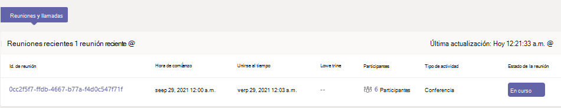
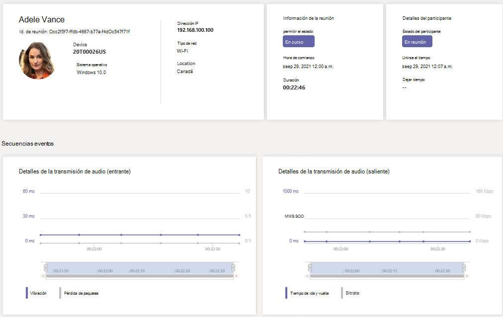

# Usar telemetría en tiempo real para solucionar problemas de mala calidad de la reunión

> [!NOTE]
> Esta característica está actualmente en versión preliminar pública hasta finales de 2021. Después de este tiempo, se requiere el complemento Comunicaciones avanzadas para Microsoft Teams para cada usuario cuya telemetría desea ver en tiempo real. Para más información, consulte [Complemento de Comunicaciones avanzadas para Microsoft Teams](/MicrosoftTeams/teams-add-on-licensing/advanced-communications).

En este artículo se explica cómo usar Real-Time Analytics (RTA) para solucionar problemas de Microsoft Teams calidad de reunión para usuarios individuales. Puede acceder a Real-Time Analytics si tiene uno de los siguientes roles:

- Administrador de Teams
- Teams Especialista en soporte técnico de comunicaciones
- Ingeniero de soporte en comunicaciones de Teams

Para obtener más información sobre Teams de administrador, vea Usar Microsoft Teams [de administrador para administrar Teams](/MicrosoftTeams/using-admin-roles).

Real-Time Analytics permite a los administradores de TI ver las reuniones programadas de sus usuarios importantes y ver audio, vídeo, uso compartido de contenido y problemas relacionados con la red. Como administrador, puede usar esta telemetría para investigar estos problemas durante las reuniones y solucionar problemas en tiempo real.

## ¿Qué Real-Time Analytics?

Hoy en día, la solución de problemas de reunión individual está disponible para Teams administradores a través de [Análisis](use-call-analytics-to-troubleshoot-poor-call-quality.md) de llamadas después de que finalice la reunión. Real-Time Analytics permite a los administradores solucionar problemas de reuniones programadas mientras están en curso.

Real-Time Analytics muestra información detallada sobre Teams reuniones de cada usuario de su cuenta de Office 365, actualizada en tiempo real. Incluye información sobre dispositivos, red, conectividad, audio, vídeo y problemas de uso compartido de contenido, lo que ayudará a los administradores a solucionar problemas de calidad de llamadas de forma más eficaz.

Como administrador Teams, obtiene acceso completo a todos los datos de telemetría en tiempo real para cada usuario. Además, puede asignar roles Azure Active Directory al personal de soporte técnico. Para obtener más información sobre estos roles, vea Conceder permiso al personal [de soporte técnico y de soporte técnico.](set-up-call-analytics.md#give-permission-to-support-and-helpdesk-staff)

## Dónde buscar telemetría de solución de problemas en tiempo real por usuario

Para ver toda la información de la reunión y los datos de un usuario, vaya al [centro de Teams de administración.](https://admin.teams.microsoft.com) En **Usuarios**  >  **Administrar usuarios,** seleccione un usuario y abra la pestaña Reuniones **& llamadas** en la página de perfil del usuario. En **Reuniones recientes,** verá una lista de reuniones a las que ha asistido el usuario en las últimas 24 horas para las que la telemetría en tiempo *real* está disponible, incluidas las reuniones en curso. Si la reunión no está en curso o no tiene datos de telemetría en tiempo real, se mostrará en **Reuniones anteriores.**

Para obtener información adicional sobre los participantes de una reunión que está en curso, incluidas  sus estadísticas de dispositivo, red y audio, busque la reunión en Reuniones recientes y seleccione el vínculo debajo de la columna **Participantes.**

Para ver la telemetría de un usuario determinado para una reunión en curso, incluida la información sobre los detalles del dispositivo, la red, el audio, el vídeo y el uso compartido de contenido, seleccione el Id. de **reunión.**

## Plataformas cliente compatibles con telemetría en tiempo real

- Windows
- macOS
- Linux
- Android
- iOS

## Teams dispositivos compatibles con telemetría en tiempo real

- MTR: Surface Hub
- MTR: Teams pantalla
- MTR: barra de colaboración
- Dispositivos Teléfono IP

## Limitaciones

- La telemetría en tiempo real solo está disponible para las reuniones programadas. Para reuniones ad hoc como Reunirse ahora, RTC, llamadas 1:1 y llamadas grupales, la telemetría en tiempo real no está disponible.
- La telemetría en tiempo real solo está disponible para los presentadores de eventos en directo programados. Actualmente no está disponible para los asistentes al evento en directo.
- Los datos de telemetría en tiempo real están disponibles para una reunión en Reuniones **recientes** durante 24 horas después de que haya finalizado la reunión. Después de 24 horas, no podrá acceder a los datos y la reunión se moverá a **Reuniones anteriores.** Si una reunión dura más de 3 horas, la telemetría en tiempo real solo estará disponible durante las *últimas 3 horas.*
- La telemetría no está disponible en tiempo real al usar versiones anteriores de Teams. Si no hay telemetría disponible, intente actualizar el cliente.
- Si participantes externos o usuarios anónimos se unen a una reunión, su nombre para mostrar se mostrará como no disponible **para** conservar la privacidad entre inquilinos.

## Temas relacionados

[Configurar análisis de llamadas por usuario](set-up-call-analytics.md)

[Use Microsoft Teams de administrador para administrar Teams](/MicrosoftTeams/using-admin-roles).
