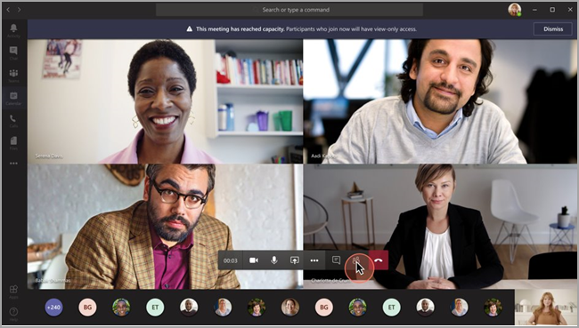
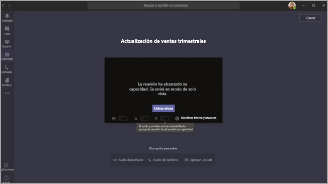

# <a name="teams-view-only-meeting-experience"></a>Experiencia de reunión solo vista de Teams

> [!Note]
> Las transmisiones solo vistas están disponibles en Microsoft 365 E3/E5 y Microsoft 365 A3/A5. Esta característica se habilitará el 1 de marzo de 2021 como desactivado predeterminado. La característica de Microsoft 365 Government Community Cloud (GCC) comenzará a realizarse a finales de marzo de 2021. Government Community Cloud High (GCCH) and Department of Defense (DoD) will roll out at a later date. Debe cambiar la directiva predeterminada después de esa fecha si desea que la característica sea predeterminada. Use PowerShell para habilitar la directiva `Set-CsTeamsMeetingPolicy -Identity Global -StreamingAttendeeMode Enabled` .

> [!Note]
> Si su reunión o seminario web alcanza la capacidad, Teams escalará sin problemas para dar cabida a una experiencia de difusión solo para 10 000 personas. Además, durante este tiempo de mayor trabajo remoto, aproveche las transmisiones de más de 20.000 personas hasta finales de este año.

Microsoft Teams permite que hasta 10 000 asistentes se unan a una reunión de Teams. Una vez que se haya alcanzado la capacidad de la reunión principal, los asistentes adicionales se unirán con una experiencia de solo vista.

Los asistentes que se unan a la reunión primero, hasta la capacidad de la reunión, recibirán toda la experiencia de reunión de Teams. Pueden compartir audio y vídeo, ver vídeos compartidos y participar en el chat de la reunión.

Los asistentes que se unan después de alcanzar la capacidad principal de la reunión tendrán una experiencia de solo vista.

Tenemos soporte móvil completo para Android e iOS para que un asistente se una.

> [!Note]
> El límite actual para el número de personas que pueden chatear y llamar a una reunión es de 300 en WW y 250 en GCC, GCC High y DoD.

La experiencia de solo visualización está deshabilitada de forma predeterminada para cualquier organizador que tenga SKU de E3/E5/A3/A5. No se requiere ninguna configuración o configuración adicional.

## <a name="disable-teams-view-only-experience"></a>Deshabilitar la experiencia de solo vista de Teams

Los administradores pueden deshabilitar la experiencia de solo visualización con PowerShell.

```PowerShell
Set-CsTeamsMeetingPolicy -Identity Global -StreamingAttendeeMode Disabled
```

En el futuro, también será posible que los administradores deshabilite la experiencia de solo vista en el Centro de administración de Teams.

## <a name="impact-to-users"></a>Impacto para los usuarios

La experiencia de un usuario variará en función de varios factores.

Cuando se haya alcanzado la capacidad de la reunión principal, los asistentes no podrán unirse a la reunión si alguna de las siguientes son verdaderas:

- Un administrador ha deshabilitado la experiencia de solo vista de Teams.
- El asistente no tiene permiso para omitir la sala de espera.

Cuando se haya alcanzado la capacidad de la reunión principal, el organizador de la reunión y los presentadores verán una pancarta en la que se les informará de que se ha alcanzado la capacidad de la reunión y de que los nuevos asistentes se unirán a un asistente de solo vista.

  

Cuando se haya alcanzado la capacidad de la reunión principal, se informará a los asistentes de la reunión en la pantalla anterior a la unirse de que se unen en modo de solo vista.

  

Si hay espacio, un usuario siempre se unirá a la reunión principal. Si la reunión principal alcanza la capacidad y uno o varios asistentes abandonan la reunión principal, la reunión principal tiene capacidad disponible. Los asistentes que se unan a la reunión (o vuelvan a unirse) se unirán a la reunión principal hasta que llegue de nuevo a su capacidad. Los asistentes que se encuentran en la experiencia de solo visualización no se promoverán automáticamente a la reunión principal y actualmente no se pueden promover manualmente a la reunión principal.

Si no se han establecido los roles de moderador o asistente, los espacios de la reunión principal se rellenan por primera vez. Una vez que se haya alcanzado la capacidad de la reunión, todos los demás usuarios se unirán con una experiencia de solo vista.

## <a name="impact-to-meeting-presenters"></a>Impacto para los presentadores de la reunión

Entre las limitaciones para los presentadores de reuniones se incluyen:

- No tendrá información sobre el asistente de solo vista. No se admite la detección electrónica para los asistentes solo para la vista.
- Los usuarios no pueden ver los asistentes solo vistas.
- No puede quitar un asistente de solo vista de la reunión.

> [!Note]
> El recuento de asistentes solo reflejará las personas de la reunión y no las personas de la sala de solo vista. Por lo tanto, los presentadores no pueden obtener un recuento exacto de quién está en la experiencia de solo vista.

## <a name="experience-for-view-only-attendees"></a>Experiencia para asistentes solo vistas

La experiencia de solo vista de Teams permite a los asistentes:

- Escuche a los participantes en la reunión principal de Teams.
- Vea la fuente de vídeo del altavoz activo (si el orador activo está compartiendo vídeo).
- Vea el contenido que se comparte con la funcionalidad compartir escritorio.

El asistente de solo vista no podrá experimentar las siguientes opciones en las reuniones:

- Únase a la reunión si el asistente no tiene permiso para omitir la sala de espera en función de las opciones o directivas de la sala de espera establecidas.
- Únase a la sala de solo vista con audioconferencias.
- Únase a la sala de solo vista con el sistema de sala de Microsoft Teams o con los servicios de interoperabilidad de vídeo en la nube (CVI).
- Comparta su audio o vídeo.
- Ver o participar en el chat de la reunión.
- Vea la fuente de vídeo de los participantes de la reunión a menos que el participante sea el orador activo.
- Vea Archivos de PowerPoint que se comparten con la funcionalidad de PowerPoint de uso compartido nativo o recursos compartidos de aplicaciones individuales (aparte del uso compartido de escritorio).

## <a name="view-only-feature-limitations"></a>Limitaciones de características solo vistas

- Los asistentes de solo visualización siempre verán los subtítulos en directo, independientemente de la configuración de los subtítulos en directo para esa reunión. Solo se admiten los subtítulos en inglés en este momento.
- Los asistentes solo para la vista serán compatibles con la tecnología de streaming.
- Los asistentes de solo visualización no se incluirán en el informe de asistencia.
- Los asistentes solo con vista tendrán una única experiencia de vídeo. Pueden ver el orador activo o el contenido que se comparte, pero no ambos.
- Actualmente no se admiten diseños  de **Galería,** Galería **grande** o Modo conjunto para los asistentes que solo pueden ver.  
- Los asistentes solo vistas no tendrán la misma latencia que un asistente normal. <sup>1</sup>

  <sup>1 Los</sup> asistentes solo vistos tendrán un retraso de vídeo y audio de 30 segundos en la reunión.  
