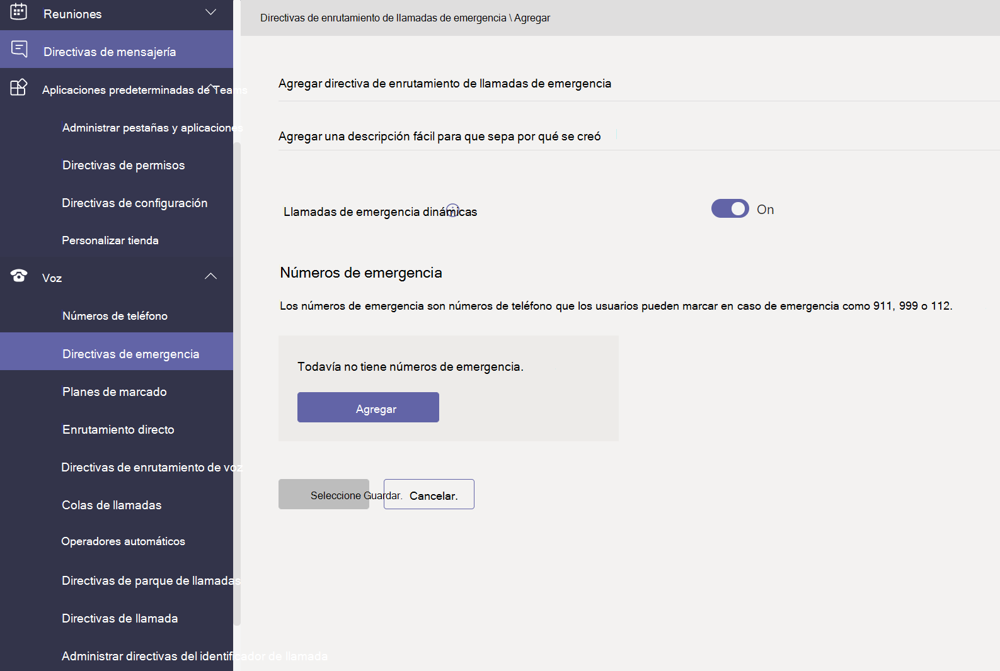
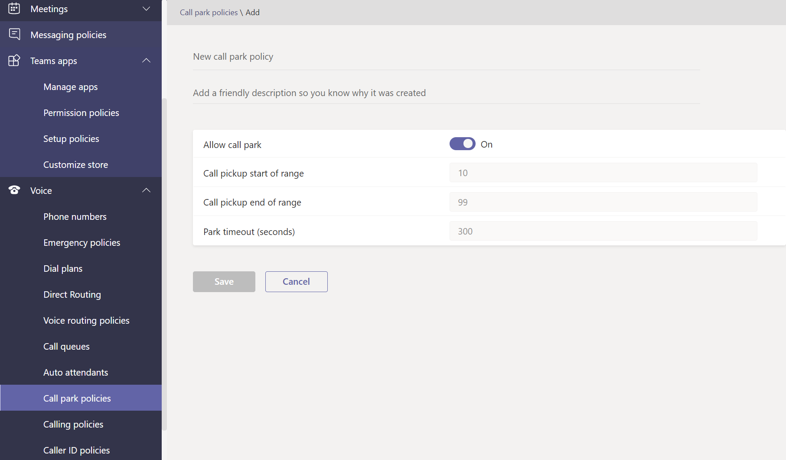

# Administrar directivas de llamadas y llamadas en Microsoft Teams

Las directivas de voz y llamadas se usan para controlar la voz y las llamadas en Microsoft Teams.

## Directivas de llamadas de emergencia

Use directivas [de llamadas de emergencia](manage-emergency-calling-policies.md) para configurar lo que ocurre cuando un usuario de su organización realiza una llamada de emergencia. Estas directivas se administran en el Teams de administración o mediante Windows PowerShell.

## Directivas de enrutamiento de llamadas de emergencia

Si su organización ha implementado **Sistema telefónico** enrutamiento directo, puede usar directivas de enrutamiento de llamadas de emergencia para determinar dónde se enruten las llamadas de emergencia, si los servicios de emergencia mejorados están habilitados y qué números se usan para los servicios de emergencia.  Estas directivas se administran con PowerShell o en el centro Microsoft Teams administración.

## Directivas de identificación de llamadas

[Las directivas de identificación de](caller-id-policies.md) llamadas se usan para cambiar o bloquear el identificador de llamada.

## Directivas de enrutamiento de voz

Una [directiva de enrutamiento de](manage-voice-routing-policies.md) voz es un contenedor para los registros de uso de red telefónica conmutada (RTC). Puede usar estas directivas si su organización ha implementado **Sistema telefónico enrutamiento directo.** Las directivas de enrutamiento de voz se pueden administrar con PowerShell o en el Teams de administración.

## Directivas de llamada

[Las directivas de](teams-calling-policy.md) llamadas controlan qué características de llamadas y reenvío de llamadas están disponibles para los usuarios, incluido si un usuario puede realizar llamadas privadas, enviar llamadas a grupos de llamadas y enrutar llamadas al correo de voz.

## Parque de llamadas y directivas de recuperación

[El parque de llamadas y la recuperación](call-park-and-retrieve.md) permite a los usuarios poner a otros usuarios en espera y permite al mismo usuario o a otra persona continuar la llamada.

## Crear y administrar planes de marcado

[Los planes de marcado](create-and-manage-dial-plans.md) traducen los números de teléfono marcados para la autorización de llamadas y el enrutamiento. Puede crear y administrar planes de marcado a través de PowerShell o en el Microsoft Teams de administración.

## Temas relacionados

* [Administrar directivas de llamadas de emergencia en Microsoft Teams](manage-emergency-calling-policies.md)
* [Administrar directivas de enrutamiento de llamadas de emergencia](manage-emergency-call-routing-policies.md)
* [Administrar directivas del id. de llamada en Microsoft Teams](caller-id-policies.md)
* [Administrar directivas de enrutamiento de voz](manage-voice-routing-policies.md)
* [Directivas de llamadas en Microsoft Teams](teams-calling-policy.md)
* [Estacionamiento y recuperación de llamadas en Microsoft Teams](call-park-and-retrieve.md)
* [Crear y administrar planes de marcado](create-and-manage-dial-plans.md)
* [Administrar Teams con directivas](manage-teams-with-policies.md)
