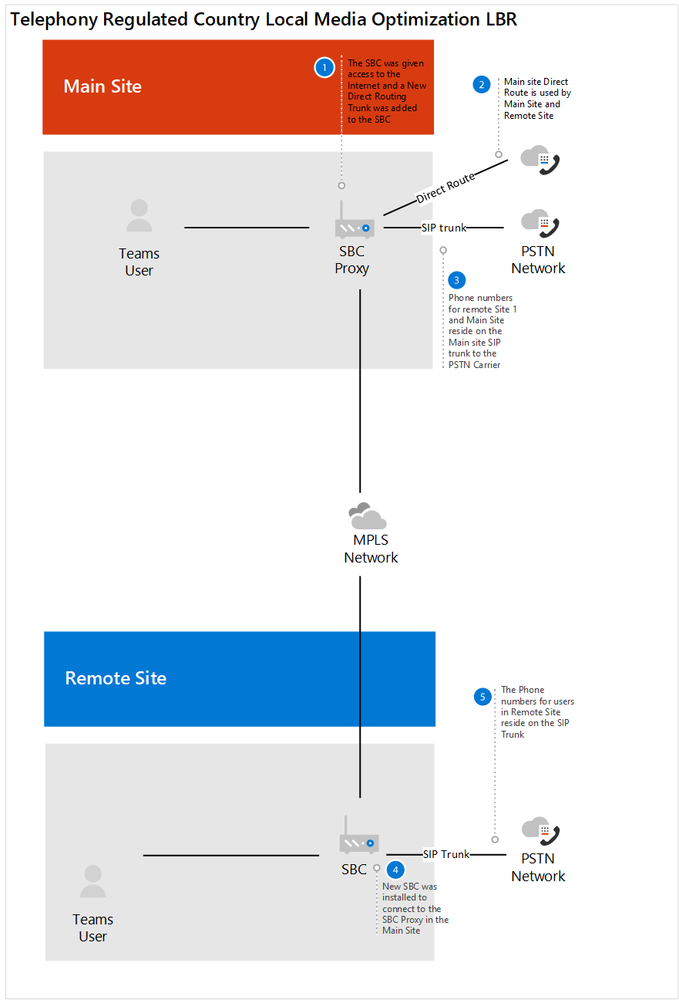

# Caso práctico de Contoso: Location-Based enrutamiento

Location-Based enrutamiento (LBR) es una característica que restringe la omisión de pago en función de la directiva y la ubicación física del usuario en el momento de realizar o recibir una llamada.  

## Información general

Contoso tiene dos oficinas en un país donde es ilegal omitir el proveedor de red telefónica conmutada (RTC) para reducir los costos de llamadas de larga distancia. La oficina principal tiene una conexión a Internet que usa la oficina principal y la segunda oficina. Cada oficina tiene su propio controlador de borde de sesión (SBC) conectado a un operador RTC.  
 
En este país, Contoso tenía LBR configurado para su Skype Empresarial implementación. Para determinar cómo configurar LBR para Teams, Contoso leyó [Planear Location-Based enrutamiento directo](location-based-routing-plan.md). Contoso determinó que Teams y Skype Empresarial siguen los mismos escenarios en los que se puede realizar una llamada, cuando se puede recibir, cuando una llamada RTC se puede transferir a un usuario de Teams y cuando puede transferir otro usuario de Teams a la llamada RTC.  

Por Skype Empresarial, LBR se configuró con el tronco SIP del controlador de borde de sesión (SBC) que se conecta al operador RTC. Para este SBC, Contoso  revisó la lista de SBC certificados y determinó que el SBC implementado está certificado para enrutamiento directo, pero no está certificado para la omisión de medios. Para admitir LBR, el enrutamiento directo debe configurarse en el SBC en el sitio, debe haber una salida de Internet local y el SBC debe configurarse para la omisión de medios. Basándose en esta información, Contoso decidió lo siguiente:

- Para retrasar la habilitación de Teams LBR hasta que el SBC existente esté certificado para la omisión de medios.   

- Contoso decidió usar el sitio principal SBC para la ruta directa para Office 365.  El SBC del sitio principal será el SBC proxy para el sitio remoto.  

- Contoso usó un consultor de terceros con sede en india para ayudar a certificar la configuración de LBR con la compañía de telefonía del país.  

- Para ayudar a los usuarios que trabajan desde fuera de la oficina a realizar llamadas RTC, la empresa emitió teléfonos móviles a sus empleados. 

En los diagramas siguientes se muestran las implementaciones antes y después de un país con normativas de telefonía que requieren Location-Based enrutamiento:

**Implementación original**

**Implementación con enrutamiento directo**

## Configuración: 

Para configurar los componentes de red en Teams, Contoso siguió las instrucciones de Administrar la topología de red para las características [de voz en la nube.](manage-your-network-topology.md) Contoso completó los pasos siguientes para configurar Location-Based enrutamiento: 

- Definir regiones de red: se ha definido una región de red. 

- Definir sitios de red: se han definido dos sitios de red. Un sitio para cada ubicación de oficina de la región.

- Definir subredes de red: cada planta de una ubicación de oficina tiene su propia subred para la red cableada e inalámbrica. Esta configuración dio como resultado 20 subredes para Contoso. 

- Definir direcciones IP de confianza: las direcciones IP externas del SBC se agregaron a la dirección IP de confianza.  

