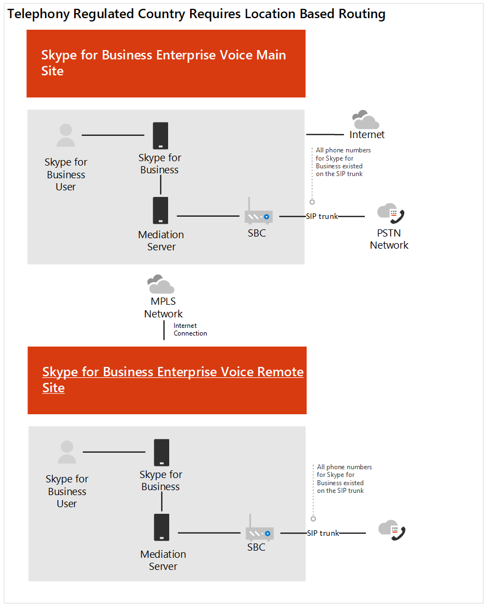

# Caso práctico de Contoso: enrutamiento basado en la ubicaciónContoso case study: Location-Based Routing

El enrutamiento basado en la ubicación (LBR) es una característica que restringe el omisión de peaje según la política y la ubicación física del usuario en el momento de poner o recibir una llamada.Location-Based Routing (LBR) is a feature that restricts toll bypass based on policy and the user's physical location at the time of placing or receiving a call.  

## Información generalOverview

Contoso tiene dos oficinas en un país en el que no se puede eludir el proveedor de la red de telefonía pública conmutada (RTC) para reducir los gastos de llamadas de larga distancia.Contoso has two offices in a country where it is illegal to bypass the Public Switched Telephone Network (PSTN) provider to decrease long-distance calling costs. La oficina principal tiene una conexión a Internet que es utilizada por la oficina principal y por la segunda oficina.The main office has an Internet connection that is used by the main office and by the second office. Cada oficina tiene su propio controlador de borde de sesión (SBC) conectado a una portadora RTC.Each office has their own Session Border Controller (SBC) connected to a PSTN carrier.  
 
En este país, contoso tenía LBR configurado para la implementación de Skype empresarial.In this country, Contoso had LBR configured for their Skype for Business deployment. Para determinar cómo configurar LBR para Teams, plan de Contoso read [: enrutamiento basado en la ubicación para el enrutamiento directo](location-based-routing-plan.md).To determine how to configure LBR for Teams, Contoso read [Plan Location-Based Routing for Direct Routing](location-based-routing-plan.md). Contoso determinó que Teams y Skype empresarial siguen los mismos escenarios en los que se puede hacer una llamada, Cuándo se puede recibir, Cuándo se puede transferir una llamada RTC a un usuario de Teams y cuándo se puede transferir otro usuario de Teams a la llamada RTC.Contoso determined that Teams and Skype for Business follow the same scenarios on when a call can be placed, when it can be received, when a PSTN call can be transferred to a Teams user, and when you can transfer another Teams user to the PSTN call.  

Para Skype empresarial, LBR se configuró con el tronco del SIP del controlador de borde de sesión (SBC) que se conecta a la portadora RTC.For Skype for Business, LBR was configured with the Session Border Controller (SBC) SIP Trunk connecting to the PSTN carrier. Para este SBC, contoso revisó la [lista de SBCS certificado](direct-routing-border-controllers.md) y determinó que el SBC implementado está certificado para enrutamiento directo, pero no está certificado para la omisión de medios.For this SBC, Contoso reviewed the [list of certified SBCs](direct-routing-border-controllers.md) and determined that the SBC deployed is certified for Direct Routing but is not certified for Media Bypass. Para admitir LBR, debe configurarse el enrutamiento directo a la SBC en el sitio, debe haber una salida de Internet local y el SBC debe configurarse para la omisión de medios.To support LBR, Direct Routing needs to be configured to the SBC on-site, there needs to be a local Internet egress, and the SBC needs to be configured for Media Bypass. En función de esta información, contoso decidió lo siguiente:Based on this information, Contoso decided the following:

- Para retrasar la habilitación de Teams LBR hasta que se certifique el SBC existente para la omisión de medios.To delay the enablement of Teams LBR until the existing SBC is certified for Media Bypass.   

- Contoso decidió usar el SBC del sitio principal para la ruta directa a Office 365.Contoso decided to use the main site SBC for the Direct Route to Office 365.  El SBC del sitio principal será el SBC de proxy para el sitio remoto.The main site SBC will be the proxy SBC for the remote site.  

- Contoso usó un consultor de terceros basado en India para ayudarle con la certificación de la configuración de LBR con la empresa de telefonía en el país.Contoso used a third-party consultant based in India to assist with certification of the LBR configuration with the telephony company in country.  

- Para admitir usuarios que trabajan desde fuera de la oficina para realizar llamadas RTC, la empresa emitió el teléfono móvil a sus empleados.To support users working from outside of the office to place PSTN calls, the company issued mobile phone was provided to their employees. 

En los siguientes diagramas se muestran las implementaciones antes y después de un país con normativas de telefonía que requieren enrutamiento basado en la ubicación:The following diagrams show the before and after deployments for a country with telephony regulations that require Location-Based Routing:

**Implementación original****Original deployment**

**Implementación con enrutamiento directo****Deployment with Direct Routing**

## ConfiguraciónConfiguration: 

Para configurar los componentes de red de Teams, contoso siguió las instrucciones de la [topología de red para características de voz en la nube](manage-your-network-topology.md).To configure the network components in Teams, Contoso followed the instructions in [Manage your network topology for cloud voice features](manage-your-network-topology.md). Contoso completó los pasos siguientes para configurar el enrutamiento basado en la ubicación:Contoso completed the below steps to configure Location-Based Routing: 

- Definir regiones de red: se definió una región de red.Define Network regions -  One network region was defined. 

- Definir sitios de red: se definieron dos sitios de red.Define Network sites - Two network sites were defined. Un sitio por cada ubicación de oficina de la región.One site for each office location in the region.

- Definir subredes de la red: cada planta de una ubicación de la oficina tiene su propia subred para la red cableada y la inalámbrica.Define Network subnets - Each floor within an office location has their own subnet for the wired and wireless network. Esta configuración ha dado lugar a 20 subredes para contoso.This configuration resulted in 20 subnets for Contoso. 

- Definir direcciones IP fiables: las direcciones IP de dirección externa de la SBC se agregaron a la dirección IP de confianza.Define trusted IP addresses - The external facing IP addresses for the SBC were added to the trusted IP address.  

