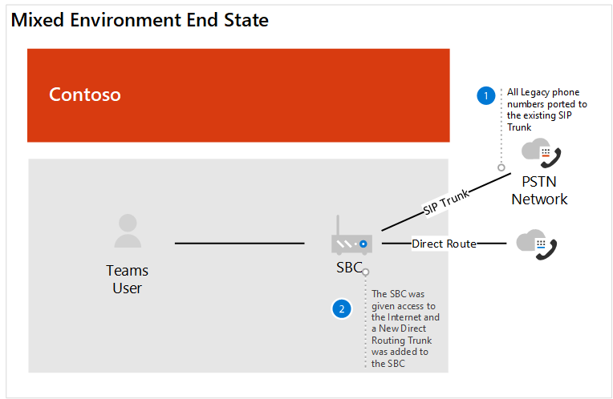

# Caso práctico de Contoso: sistema telefónico

En función de la ubicación geográfica y de otros factores, contoso tenía oficinas con las siguientes soluciones de telefonía:

- Tipo de sitio A: voz de Skype empresarial Enterprise

- Tipo de sitio B: sistemas de telefonía heredados tradicionales

- Tipo de sitio C: una combinación de voz empresarial de Skype empresarial y sistemas de telefonía heredados tradicionales

Para implementar una solución de sistema de Microsoft Phone para toda su organización, contoso tuvo que determinar &mdash; para cada tipo &mdash; de sitio cuáles de las siguientes opciones se usarían con el sistema telefónico para conectarse a la red de telefonía pública conmutada (RTC):

- Sistema telefónico con plan de llamadas 

- Sistema telefónico con su propio operador PSTN mediante enrutamiento directo 

- Combinación de sistema telefónico con plan de llamadas y sistema telefónico con su propio operador PSTN por enrutamiento directo
 
Para determinar la solución adecuada para su organización, contoso usó [soluciones de telefonía de Microsoft](https://docs.microsoft.com/SkypeForBusiness/hybrid/msft-telephony-solutions) y las [llamadas de sesión de encendido 2019 en Microsoft Teams](https://myignite.techcommunity.microsoft.com/sessions/83170?source=sessions).  

## Tipo de sitio A: voz de Skype empresarial Enterprise 

Contoso Skype empresarial Enterprise Voice se configuró como un concentrador y un radio. Había una ubicación central que mantuvo la puerta de enlace RTC en la región que proporcionó la conexión a la RTC para los usuarios de voz de Skype empresarial Enterprise en el país. A menudo, estas oficinas satélite no tenían su propia conexión a Internet. Los números de estos usuarios han residido en el tronco del SIP que se conecta a un SBC existente. 

Para determinar si el SBC ya implementado está certificado para el enrutamiento directo y la omisión de medios, contoso ha activado la [lista de controladores de borde de sesión certificados para enrutamiento directo](direct-routing-border-controllers.md).  

Los hábitos de marcado del usuario han marcado a un usuario en el sistema de telefonía heredado con una extensión, incluso cuando el usuario tiene un cliente de Skype empresarial disponible para el audio de punto a punto. 

Contoso basó su decisión en las siguientes preguntas:

- W. ¿Es necesario conservar la funcionalidad proporcionada por nuestra implementación local? 
  Ninguna. No 

- W. ¿Es necesario interoperar con sistemas PBX de terceros y otros equipos de telefonía? 
  Ninguna. No 

- W. ¿Necesitamos conservar nuestro operador actual de terceros?  A. sí (países regulados) y no 

- W. ¿Necesitamos obtener la rentabilidad de la implementación de SBCs?  A. sí y no  

- W. ¿Están disponibles los planes de llamadas RTC de Microsoft en esta región?  A. sí y no 

En función de las respuestas a sus preguntas, contoso decidió:

- Mueva los usuarios que se encuentren en una región en la que los planes de llamadas RTC estén disponibles para el sistema telefónico con planes de llamadas. 

- Mueva los usuarios que no se encuentren en una región en la que los planes de llamadas RTC estén disponibles, los que se encuentren en un sitio donde todavía se haya cumplido el ROI de la SBCs y los usuarios que hayan residido en un país con la normativa de telefonía en el sistema telefónico con enrutamiento directo. 

En el siguiente diagrama se muestra la implementación inicial de Skype empresarial Enterprise Voice y cómo se migró esta implementación a los planes de llamadas de Microsoft y al enrutamiento directo:

## Tipo de sitio B: sistemas de telefonía heredados tradicionales

Contoso tenía muchas oficinas que aprovechaban sistemas de telefonía heredados. Había un subconjunto de usuarios con un número de teléfono E 1.64, mientras que otros solo tenían una extensión. Estos números residían en el tronco de los TDM para la puerta de enlace RTC. El marcado interno de sitios se configuró aprovechando un código de sitio delante de la extensión para determinar dónde enrutar la llamada. Los hábitos de marcado de los usuarios han marcado por extensión.   

Contoso basó su decisión en las siguientes preguntas:

- W. ¿Es necesario conservar la funcionalidad proporcionada por nuestra implementación local? 
  Ninguna. No 

- W. ¿Es necesario interoperar con sistemas PBX de terceros y otros equipos de telefonía?  A. sí

- W. ¿Necesitamos conservar nuestro operador actual de terceros?  A. no 

- W. ¿Está disponible el plan de llamadas de Microsoft RTC en nuestra región?  A. sí y no 

En función de las respuestas a sus preguntas, contoso decidió: 

- Mueva los usuarios que se encuentren en una región en la que los planes de llamadas RTC estén disponibles para el sistema telefónico con planes de llamadas. 

- Mueva los usuarios que no se encuentren en una región en la que los planes de llamadas RTC estén disponibles para el sistema telefónico con enrutamiento directo. 

- Mantener una conexión RTC a dispositivos analógicos empresariales fundamentales.

Los siguientes diagramas muestran la implementación original del sistema heredado con sitios remotos y la migración a una implementación de enrutamiento directo con optimización local de elementos multimedia:

**Original legacy deployment**  
 Implementación 

**Implementación con enrutamiento directo**

 
## Tipo de sitio C: combinación de Skype empresarial Enterprise Voice y sistemas tradicionales de telefonía heredados

Los números de los usuarios de Skype empresarial empresarial de Contoso residen en el tronco del SIP para el SBC del transportista. Los números de los sistemas de telefonía tradicionales residieron en el tronco de los TDM para la puerta de enlace de RTC.   

Contoso basó su decisión en las siguientes preguntas:

- W. ¿Es necesario conservar la funcionalidad proporcionada por nuestra implementación local? 
  Ninguna. No 

- W. ¿Es necesario interoperar con sistemas PBX de terceros y otros equipos de telefonía?  A. no 

- W. ¿Necesitamos conservar nuestro operador actual de terceros?  A. no 

- W. ¿Necesitamos obtener la rentabilidad de la implementación de SBCs?  A. sí y no  

- W. ¿Está disponible el plan de llamadas RTC de Microsoft en esta región?  A. no 

En función de las respuestas a sus preguntas, contoso decidió lo siguiente: 

- Para los usuarios de telefonía heredados que se habilitarán para el enrutamiento directo, contoso transportó los números del tronco de los TDM al tronco del SIP para el SBC, ya que la SBC está certificada para el enrutamiento directo. 

- Para admitir un subconjunto de usuarios que se mueven a un sistema telefónico y para permitir el enrutamiento continuo a través del sistema heredado, el sistema de telefonía heredado se configuró como el próximo salto a SBC.   

- Además, para alentar el cambio del comportamiento de los usuarios y quitar la dependencia de la llamada de extensión entre sitios y entre sitios, contoso ofreció la orientación de usar Teams para todas las llamadas internas.  

Los siguientes diagramas muestran la implementación original de Skype empresarial Enterprise Voice y del sistema de telefonía heredada y la migración a una implementación mixta con enrutamiento directo:

**Original mixed deployment** 
 Implementación 

**Implementación mixta con enrutamiento directo** 
 

## Planes de llamadas

Para determinar los requisitos de configuración para los planes de llamadas, contoso ha revisado las [decisiones básicas de implementación del plan de llamadas](calling-plan-landing-page.md#core-deployment-decisions). Las decisiones resultantes se hicieron: 

- W. ¿Los usuarios necesitan llamadas internacionales?  A. sí 

- W. ¿Cada uno de mis usuarios tiene un número de teléfono directo?  A. no hoy. Todos los usuarios habilitados recibirán una. 

- W. ¿Quiero enmascarar o deshabilitar la identificación de llamadas?  A. la identificación de llamadas de un usuario se enmascarará al número local de contoso. 

## Enrutamiento directo

El encendido asistido de Contoso para mantenerse al día en las características de Office 365, incluidas las disponibles con el sistema telefónico y el enrutamiento directo. Los arquitectos y el liderazgo técnico usaban las orientaciones proporcionadas durante el encendido 2019 para determinar su dirección.  Sesiones clave que se usaron: 

- [Planear el éxito con el enrutamiento directo de Microsoft Teams](https://myignite.techcommunity.microsoft.com/sessions/80381?source=sessions)

- [Actualizaciones para enrutamiento directo](https://myignite.techcommunity.microsoft.com/sessions/80381?source=sessions)

## Configuración

### Sitios de llamadas

Para obtener licencias y asignar números de teléfono a los usuarios, contoso siguió los pasos de [configurar planes de llamadas](set-up-calling-plans.md). 

Debido al número de usuarios a los que se necesitaba asignar números de teléfono, contoso decidió usar PowerShell para asignar los números de teléfono. Para obtener información sobre cómo asignar números usando PowerShell además de &mdash; otras opciones, &mdash; contoso usó la [información general de Teams PowerShell](teams-powershell-overview.md).  

### Sitios de enrutamiento directo

Para conectar la infraestructura de telefonía local de Contoso con Microsoft Teams, el administrador de Contoso siguió los pasos que se indican en [configurar el enrutamiento directo](direct-routing-configure.md) y revisar el enrutamiento de video [directo en Microsoft Teams](https://www.youtube.com/watch?v=1ASftX_Msb8&index=10&list=PLaSOUojkSiGnKuE30ckcjnDVkMNqDv0Vl) para obtener instrucciones.  Contoso también hace referencia a la documentación de implementación de enrutamiento directo del proveedor de SBC certificado. 

Una vez que se configuró el enrutamiento directo entre el SBC y el sistema telefónico de Microsoft, contoso era necesario para probar la configuración. Para ello, los administradores de Contoso han usado el cliente SIP Tester que se analizó en las [actualizaciones para la sesión de enrutamiento directo en el encendido 2019](https://myignite.techcommunity.microsoft.com/sessions/83178?source=sessions). El script de cliente de prueba SIP y la documentación se descargaron desde el script de PowerShell para probar el enrutamiento directo de las conexiones del controlador de borde de sesión.   

### Optimización local de medios

Contoso vio la oportunidad de aprovechar la optimización local de medios en las distintas regiones de todo el mundo. Los escenarios admitidos para contoso se describen en la [optimización local de medios para el enrutamiento directo](direct-routing-media-optimization.md). La configuración de la optimización de medios locales se completó siguiendo las instrucciones del proveedor de SBC y Microsoft. Los pasos de configuración para la optimización de medios locales son: 

- Configurar los sitios de usuario y SBC 

- Configurar la SBC según la especificación de proveedor de SBC, 

- Agregar direcciones IP de confianza externas a cada sitio usado para la optimización de multimedia local    

- Definir la topología de red 

- Definir la topología de red virtual 

- Determinar el modo: siempre omitir o solo para usuarios locales 

## Consideraciones sobre redes

Contoso tenía varios usuarios que necesitaban trabajar de forma remota durante un período de tiempo prolongado después de que estuvieran habilitados para el sistema telefónico. Los usuarios usaron VPN para obtener acceso a determinadas aplicaciones empresariales. Mientras se encontraba en VPN, los usuarios del sistema telefónico experimentaron una degradación de la calidad de las llamadas. 

Para resolver el problema de calidad, contoso implementó el túnel dividido de VPN, que permitió que su tráfico de Office 365 atravesar Internet mientras la conexión a las aplicaciones internas seguía en la red privada virtual. Para implementar túneles divididos de VPN, contoso siguió las instrucciones de [implementación de túneles divididos de VPN para Office 365](https://docs.microsoft.com/office365/enterprise/office-365-vpn-implement-split-tunnel).  

 

